#  017：损失函数与处理异质性


在本节课中，我们将学习如何为异质性处理效应构建一个稳健的损失函数。一旦我们有了这个损失函数，就能将其用于通用机器学习框架下的处理效应估计。

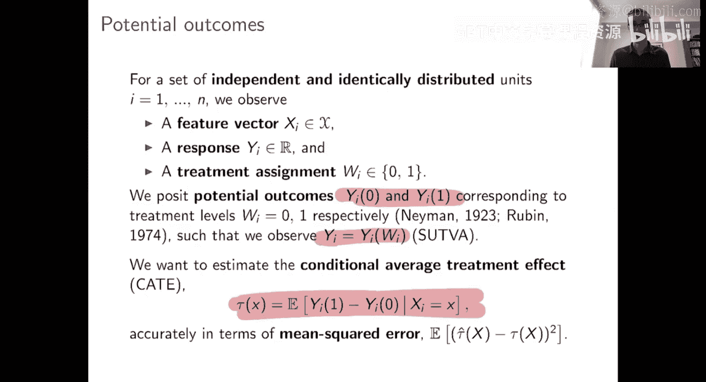

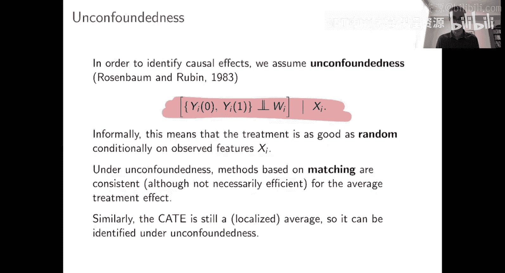

## 统计设定回顾

上一节我们介绍了因果推断的基本框架，本节中我们来看看如何将其与机器学习结合。我们的统计设定与之前保持一致。

我们拥有数据 `(X, Y, W)`，其中 `X` 是特征，`Y` 是结果，`W` 是处理指示变量。结果变量 `Y` 由潜在结果模型生成。我们的目标是估计条件平均处理效应，即在给定特征 `X` 的条件下，潜在结果期望值的差异。

**公式**：`CATE(x) = τ(x) = E[Y(1) - Y(0) | X=x]`

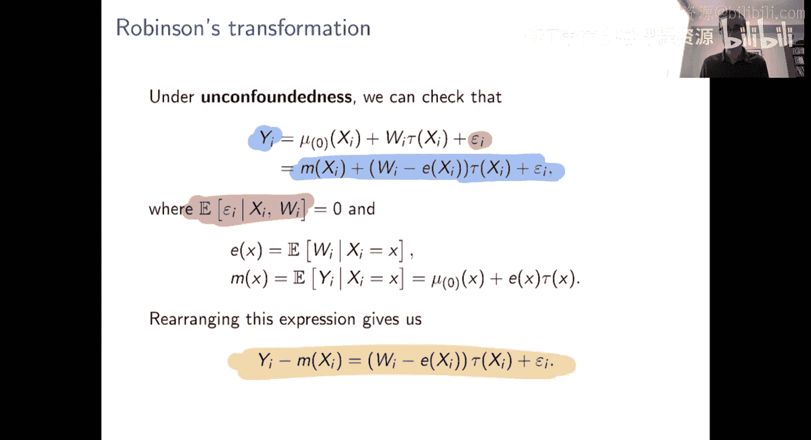

为了进行估计，我们假设无混淆性。这意味着在给定协变量 `X` 的条件下，处理分配如同随机分配。倾向得分，即在给定 `X` 的条件下接受处理的概率，将扮演核心角色。

**公式**：`e(x) = P(W=1 | X=x)`

## 从罗宾逊变换到损失函数

在无混淆性假设下，我们可以将给定 `X` 和 `W` 时 `Y` 的期望值写为基线效应 `μ₀(x)` 加上处理效应 `τ(x)` 与 `W` 的乘积。

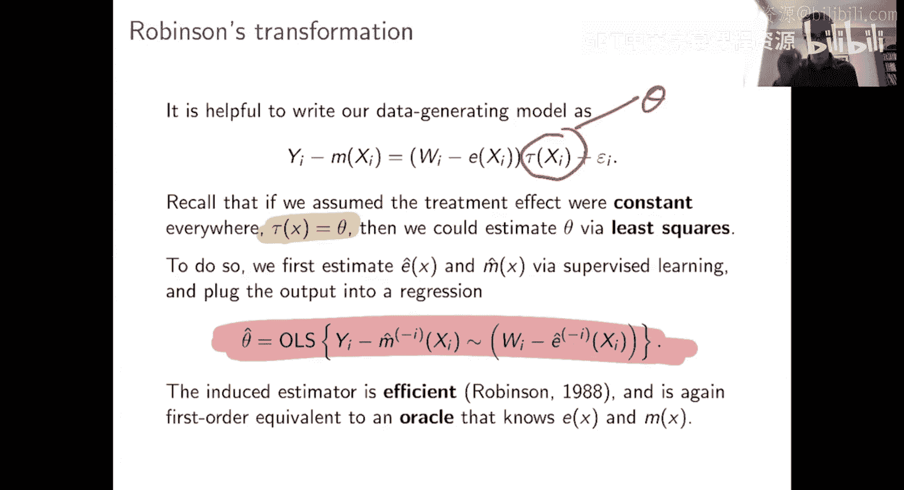

**公式**：`E[Y | X=x, W=w] = μ₀(x) + w * τ(x)`

由于这是一个期望值，我们也可以将其写为 `Yᵢ = μ₀(xᵢ) + wᵢ * τ(xᵢ) + εᵢ`，其中 `εᵢ` 由潜在结果隐式定义，并且满足在给定 `X` 和 `W` 时均值为零的性质。

与估计恒定处理效应时类似，我们希望重新表达这个公式，使其变为 `Yᵢ = M(Xᵢ) + (Wᵢ - e(Xᵢ)) * τ(xᵢ) + 噪声` 的形式。这里 `e(x)` 是倾向得分，`M(x)` 是边际基线效应，即在不了解处理状态的情况下，仅根据 `X` 对 `Y` 的最佳预测。

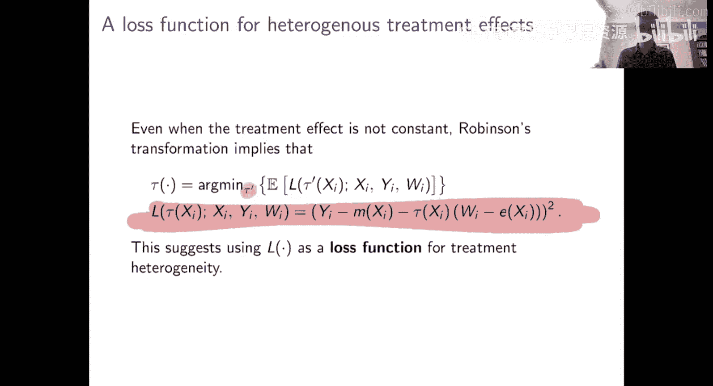

通过这个变换，我们得到了罗宾逊变换：在无混淆性下，`Y - M(x)` 等于 `(W - e(x)) * τ(x)` 加上一个均值为零的噪声。

**公式**：`Y - M(x) = (W - e(x)) * τ(x) + η`, 其中 `E[η | X, W] = 0`

上周我们强调，如果进一步假设 `τ(x) = θ` 对所有单元都是常数，那么我们可以用常数 `θ` 替换 `τ(x)`，并通过将 `Y - M̂` 对 `W - ê` 进行回归来估计这个恒定处理效应参数。这种残差对残差的回归具有良好的稳健性。

本周与上周的区别在于，我们现在不再假设处理效应函数是恒定的，而是允许 `τ(x)` 随 `x` 变化。我们希望更广泛地估计这个 `τ(x)` 函数。

一个有用的观察是：对于每个固定的 `x` 值，如果我们只考虑具有该特定 `x` 值的样本，并将 `y - m(x)` 对 `w - e(x)` 进行回归，那么 `τ(x)` 正是这个回归的系数。这表明，`τ(x)` 实际上是以下二次函数 `L` 的最小化解。

**公式**：`L(τ; x) = E[(Y - M(x) - τ * (W - e(x)))^2 | X=x]`

换句话说，在总体中，对于每个 `x` 值，我们想要的处理效应函数 `τ(x)`，正是最小化上述损失函数 `L` 期望值的那个函数。

## 构建用于异质性处理效应的机器学习估计量

认识到 `τ(x)` 可以表征为某个损失函数的最小化解，这对于估计非常有帮助。它允许我们将处理效应估计问题转化为一个标准的机器学习预测问题，只需使用特定的损失函数。

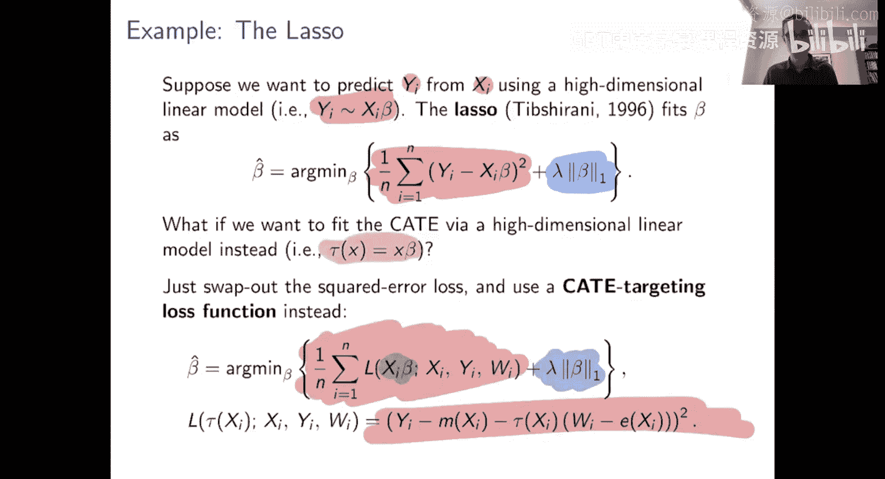

例如，考虑高维线性模型场景。在预测任务中，我们使用 Lasso 来拟合线性模型 `Y = Xβ`，它通过最小化平方损失并加上 `β` 的 L1 范数惩罚来实现稀疏性。

**代码**（标准 Lasso 用于预测）：
```python
# 伪代码
from sklearn.linear_model import Lasso
lasso = Lasso(alpha=λ)
lasso.fit(X, Y) # 最小化 ||Y - Xβ||² + λ||β||₁
```

现在，假设我们仍然处于高维环境，并且喜欢线性模型，但我们希望拟合一个处理效应函数 `τ(x) = Xβ`，其中 `β` 是高维向量。我们该如何拟合这个 `β`？

一旦意识到机器学习本质上是关于以特定方式最小化损失函数，解决方案就变得清晰。任何特定的机器学习算法都结合了一个损失函数和一个最小化该损失函数的算法。对于 Lasso，红色部分是损失函数（平方误差），蓝色部分是使其成为 Lasso 的算法选择（L1 惩罚）。

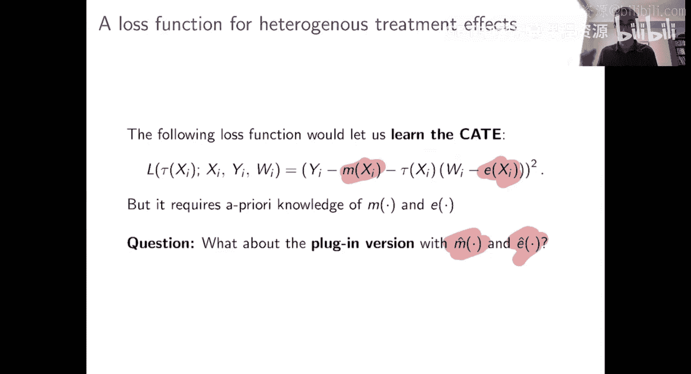

对于处理效应估计，我们想做类似 Lasso 的事情。我们将线性参数化我们的预测：`τ(x) = Xβ`，并对参数 `β` 施加 L1 惩罚。另一方面，对于损失函数，我们将不再使用用于预测的平方误差损失，而是使用从前一幻灯片中描述的、源自罗宾逊变换的损失函数。

**代码**（R-Lasso 用于 CATE 估计）：
```python
# 伪代码：概念步骤
# 1. 首先估计 M̂(x) 和 ê(x)
M_hat = model_M.fit(X, Y).predict(X)
e_hat = model_e.fit(X, W).predict(X)

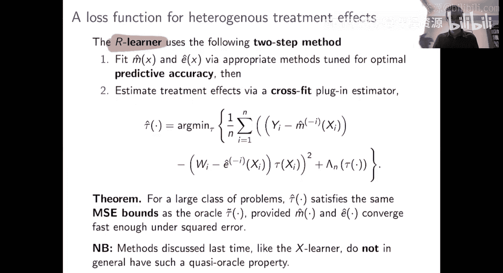


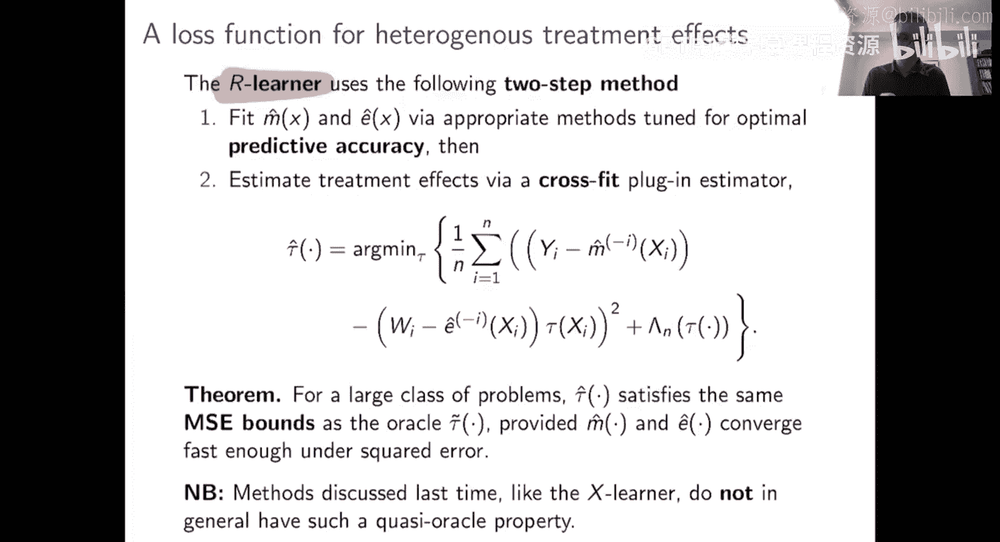

# 2. 构建 R-损失
def r_loss(tau_pred):
    # tau_pred 是 τ(x) 的预测值，例如 X * beta
    residual = (Y - M_hat) - tau_pred * (W - e_hat)
    return np.mean(residual**2)

# 3. 使用带 L1 惩罚的优化器最小化 R-损失
# 例如，使用 Lasso 优化器，但目标函数是 r_loss
```

本质上，我们的主张是：现在问题基本上解决了。你想要一个用于 CATE 的 Lasso 类估计量吗？只需运行 Lasso，但将你的平方误差损失函数替换为这个适用于 CATE 的损失函数即可。

## 处理未知的干扰参数：R-Learner

当然，这里存在一个我们多次见过的细节问题：这个损失函数不仅依赖于数据 `(X, Y, W)` 和我们想要估计的 `τ`，还依赖于 `M` 和 `e` 这些函数。我们并不关心它们，但如果不指定它们，就无法形成损失函数。

如果我们先验地知道 `M` 和 `e`，那么如前所述，直接最小化损失函数即可。但这里我们实际上无法形成损失函数，因为它依赖于这些未知的 `M` 和 `e`。

考虑到本课程的主题，我们应该怎么做已经很清楚了。首先，我们需要通过某种第一步回归来估计 `M̂` 和 `ê`。这就是我们在使用罗宾逊方法估计恒定处理效应、在因果森林中所做的事情，我们现在需要再次这样做。然后问题是：如果 `M̂` 和 `ê` 是从数据中学到的，你还能使用这种损失函数来学习 CATE 吗？

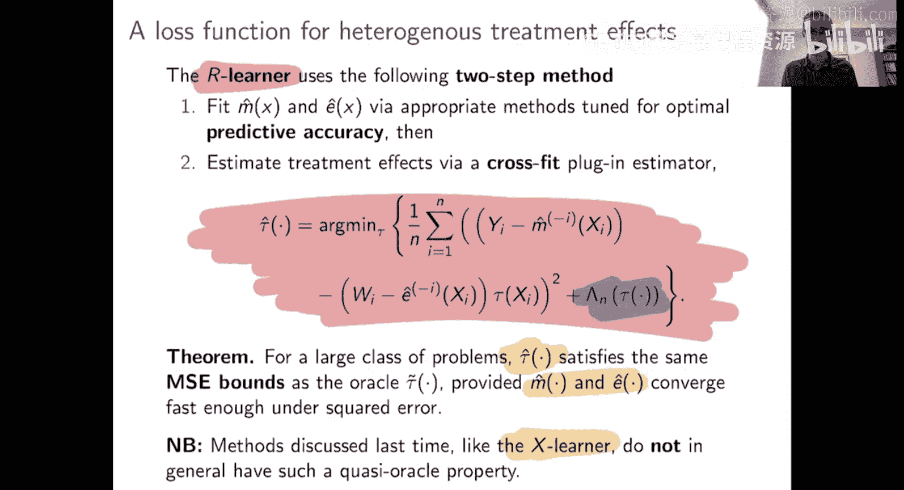

幸运的是，答案是肯定的。这种算法被称为 **R-Learner**，它扩展了用于通用基于机器学习的 CATE 估计的算法策略。R-Learner 包括以下步骤：

1.  首先通过分别从 `X` 学习预测 `Y` 和 `W` 来拟合 `M̂` 和 `ê`。
2.  然后，用交叉拟合得到的 `M̂` 和 `ê` 的插件值形成 R-损失函数。
3.  最后，通过最小化这个带有正则化项的损失函数来拟合 `τ̂`。

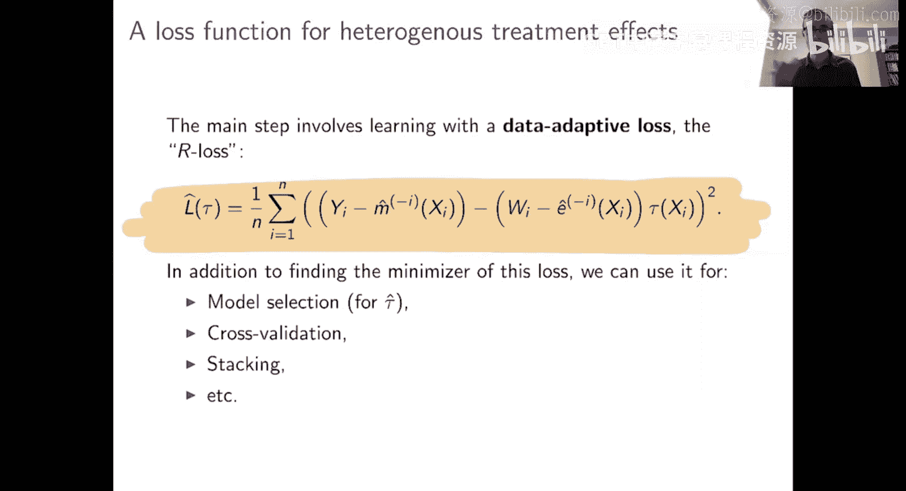

**公式**（R-Learner 目标）：
`τ̂ = argmin_τ { (1/n) Σᵢ [ (Yᵢ - M̂⁽⁻ⁱ⁾(Xᵢ)) - τ(Xᵢ) * (Wᵢ - ê⁽⁻ⁱ⁾(Xᵢ)) ]² + Λₙ(τ) }`
其中 `Λₙ(τ)` 是某种正则化器，`M̂⁽⁻ⁱ⁾` 和 `ê⁽⁻ⁱ⁾` 表示在排除第 `i` 个样本的数据上拟合的估计量（交叉拟合）。

形式化的结论是：只要你能以合理的准确度估计 `M̂` 和 `ê`，那么使用这种损失函数学习 CATE 的保证，就与你将真实的 `M` 和 `e` 代入损失函数所得到的保证一样好。有可能获得 `τ̂` 的保证，使得 `τ̂` 在平方误差损失下的收敛速度比 `M̂` 或 `ê` 快一个数量级。

这是一个很好的性质，我们在恒定处理效应估计器中看到过这个性质，但我们上周讨论的元学习器（S-Learner, T-Learner, X-Learner）通常不具备这个性质，即它们的 CATE 估计收敛速度无法超过其干扰参数估计的收敛速度。

总之，R-Learner 框架声称，你基本上可以通过以下方式完成 CATE 估计世界中大多数想做的事情：首先估计 `M̂` 和 `ê`，然后以此形成你的损失函数，最后使用这个损失函数通用地应用机器学习。

## 实例演示：R-Learner 的应用

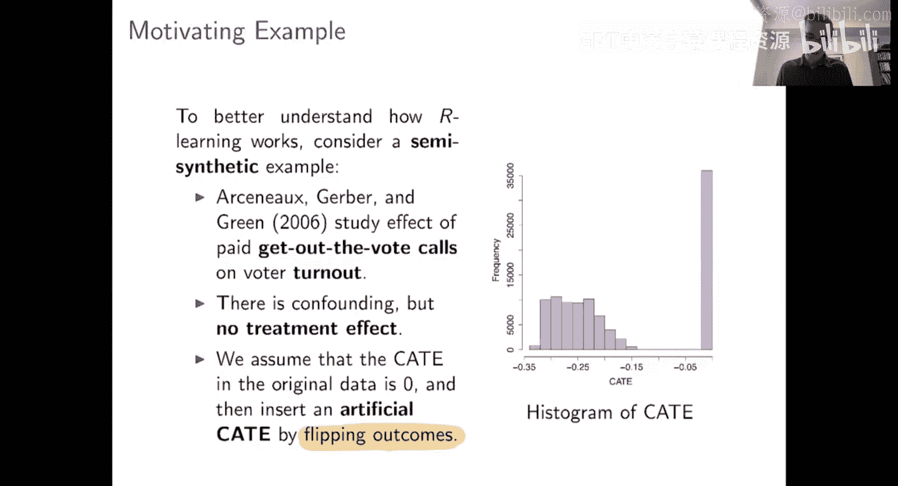

为了更具体地说明，我们来看一个半合成数据的例子。这个例子基于一篇关于“动员投票”电话对投票率影响的论文。我们使用真实数据，但假设真实处理效应为零，然后人工注入一个合成的处理效应。

以下是应用 R-Learner 的步骤：

1.  **第一步：估计干扰参数**
    *   我们需要学习 `M̂` 和 `ê`，即分别从 `X` 预测 `Y` 和 `W`。
    *   我们尝试了 Lasso 和 Boosting 两种方法，并通过交叉验证选择表现更好的那个。在这个例子中，交叉验证显示 Boosting 更准确，因此我们使用 Boosting 得到交叉拟合的 `M̂` 和 `ê`。

2.  **第二步：使用 R-损失拟合 CATE**
    *   我们采用 R-损失目标函数，并尝试使用 Lasso 或 Boosting 来最小化它。
    *   对于 Lasso，我们使用插件后的 `M̂` 和 `ê` 运行 Lasso。
    *   对于 Boosting，我们运行标准的 Boosting，但将平方损失替换为 R-损失。
    *   我们再次基于 R-损失（而非平方损失）进行交叉验证。在这个例子中，交叉验证更偏好 Lasso。

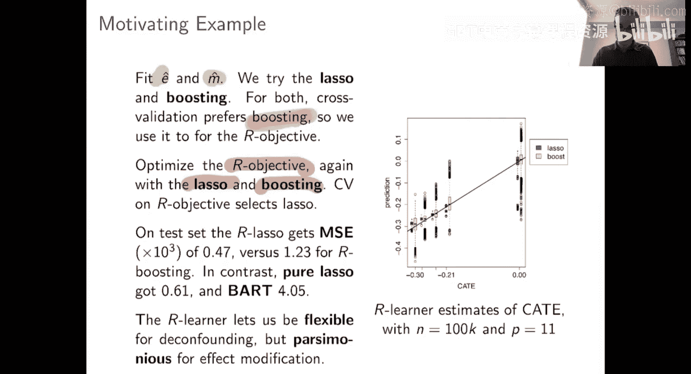

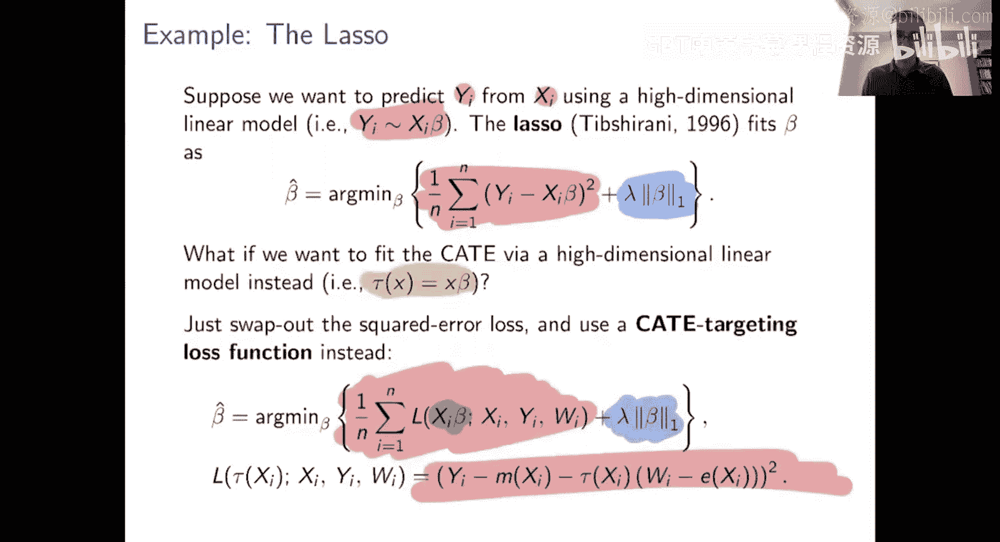

最终，我们得到了一个由 Boosting 拟合的 `M̂` 和 `ê`，以及一个由 Lasso 拟合的、关于 `X` 线性的最终 `τ̂(x)`。由于这是一个半合成例子，我们知道真实的 `τ(x)`，因此可以评估性能。结果表明，通过 R-损失交叉验证不仅帮助我们训练好了 Lasso，还帮助我们正确认识到在此例中 Lasso 比 Boosting 表现更好。

其他方法，如 S-Lasso（一种单阶段 Lasso）或 BART（一种流行的贝叶斯树方法），在这个例子中表现都不如 R-Lasso。

这个例子的要点是，R-Learner 方法非常灵活。一旦使用它，整个工作流程看起来就非常像标准的机器学习流程：根据平方误差损失选择最佳的 `e` 估计器，根据平方误差损失选择最佳的 `M` 估计器，然后根据处理效应损失选择最佳的 `τ` 估计器。

## 扩展应用：模型堆叠

拥有一个专门的损失函数后，你可以用它做很多事情。机器学习中一个流行的想法叫做**堆叠**。

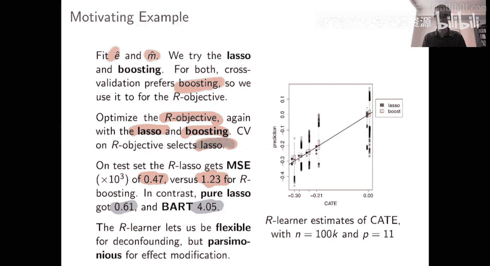

假设你有 K 个不同的 CATE 估计值（例如来自 K 个不同的专家或算法）。你认为所有专家都可能有其合理之处，因此你希望找到一个共识估计，它是所有专家预测的正权重加权平均。

**公式**（堆叠模型）：`τ_stack(x) = α₀ + Σₖ αₖ * τ̂ₖ(x)`, 其中 `αₖ ≥ 0` 且 `Σₖ αₖ = 1`。

问题是如何选择这些权重 `αₖ`。同样，一旦你有了 CATE 的损失函数，该做什么就非常明确了：只需通过最小化 R-损失函数来拟合这些参数 `α`，并加上权重为非负的约束。

**代码**（堆叠优化）：
```python
# 伪代码：概念步骤
# 输入：K个CATE估计量在数据上的预测值 tau_hats (n x K 矩阵)
# 目标：找到最优权重 alpha (K维向量)

def stacked_tau(X, alpha, tau_hats):
    # 计算堆叠后的预测，假设已包含截距项
    return tau_hats @ alpha

# 优化目标：最小化 R-损失
alpha_opt = minimize(
    fun=lambda alpha: r_loss(stacked_tau(X, alpha, tau_hats)),
    constraints={'type': 'ineq', 'fun': lambda alpha: alpha} # 非负约束
)
```

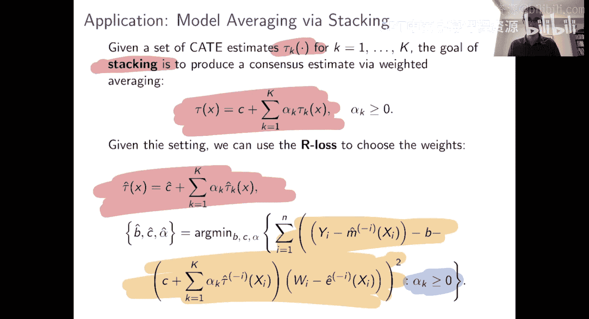

这变成了一个带有正性约束的二次规划问题。虽然求解可能需要凸优化知识，但关键在于，一旦有了这个损失函数，该做什么是直接的，剩下的困难只是常规的机器学习类型困难。

在一个模拟研究中，我们尝试了因果森林和 BART。哪一个更好？结果发现，使用上述方法堆叠因果森林和 BART 得到的估计量（绿色部分），其均方误差比单独使用因果森林或 BART 都要低。

这说明了几个要点：
1.  机器学习本质上是一个以工程为重点的领域，什么方法最好通常是不可预测的。通常最好的做法是经验驱动，尝试多种方法并观察效果。
2.  为了做到经验驱动，你需要一个衡量成功或失败的标准，否则就像盲目飞行。而 R-损失为 CATE 估计的准确性提供了一个这样的度量标准，可以用于多种目的，从模型学习到模型平均。

## 总结

本节课中，我们一起学习了如何为异质性处理效应构建稳健的损失函数。我们从回顾罗宾逊变换开始，展示了条件平均处理效应 `τ(x)` 可以表征为一个特定二次损失函数的最小化解。基于此，我们介绍了 **R-Learner** 框架，该框架通过分步估计干扰参数（倾向得分 `e(x)` 和基线响应 `M(x)`），然后使用一个基于这些估计量的专用损失函数来直接拟合处理效应函数。

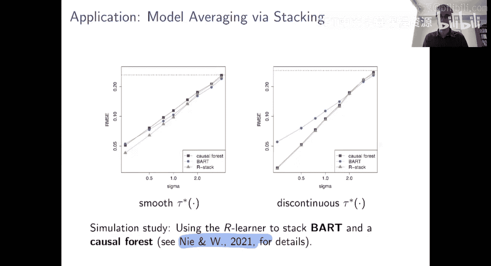

这种方法的美妙之处在于，它将复杂的 CATE 估计问题转化为了一个标准的、带正则化的损失函数最小化问题，从而可以与任何现成的机器学习算法（如 Lasso、Boosting、神经网络等）无缝结合。我们还看到了 R-损失函数在模型选择、交叉验证和模型堆叠等高级任务中的应用，为在实践中进行稳健且数据驱动的因果推断提供了一个强大的工具。