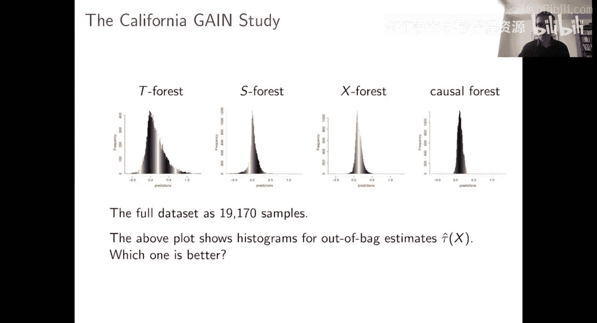
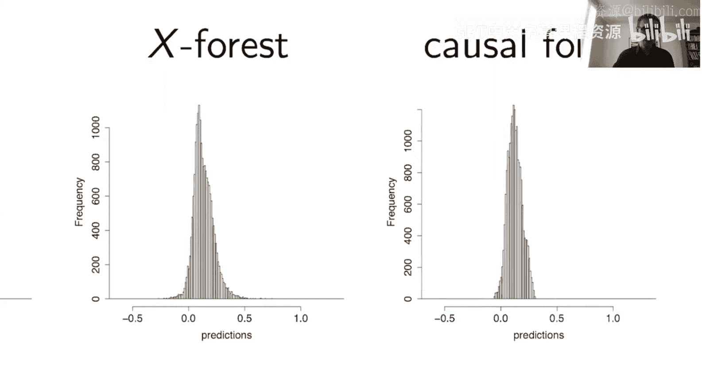
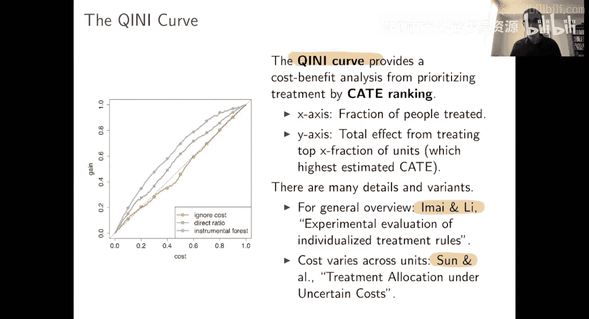

#  018：评估CATE估计的损失函数

在本节课中，我们将学习如何评估和比较不同的条件平均处理效应估计器。我们将探讨在真实数据中，由于无法预先知晓真实的处理效应，如何判断一个估计器是否有效，以及如何在多个估计器中选择更优的一个。

## 数据背景：加州GAIN项目

上一节我们介绍了几种处理效应估计器，本节中我们来看看如何评估它们的表现。为此，我们需要一个数据集。我们将使用加州GAIN项目的数据。

GAIN是一个旨在帮助人们脱离福利、重返工作岗位的职业培训项目。在90年代初，该项目在多个县进行了随机评估。值得注意的是，这项评估被认为是成功的，GAIN项目随后在加州推广。

这个数据集特别之处在于，它并非一个单一的随机试验，而是在四个县分别进行的、设计略有不同的小型随机试验。每个县在如何运行实验方面有相当大的自由度，包括决定谁有资格参与项目，以及分配到处理组和对照组的比例。

以下是该数据集的关键特点：
*   数据来自四个县：阿拉米达、洛杉矶、河滨和圣地亚哥。
*   每个县都进行了随机试验，但试验设计不同。
*   一些县专注于招募新近的福利领取者，而另一些县则专注于更困难的长期领取者。
*   分配比例从50/50到90/10不等。

如果我们忽略县的信息，将所有数据合并，我们就得到了一个观察性研究。虽然每个个体都曾被随机分配，但分配到处理组的概率因县而异。我们希望手头的504个协变量足以解释这种由“县”带来的混淆偏差，使得在给定这些协变量的条件下，无混淆性假设成立。

这个数据集具有代表性，因为它模拟了实践中可能遇到的情况：没有极端的自我选择，但存在基于可观测特征的分配差异。此外，由于我们实际上知道每个县的随机分配概率，我们可以在事后将数据按县分层，对观察性分析得出的结论进行透明的、基于RCT的客观检验。

## 评估不同的CATE估计器

我们的目标是衡量GAIN项目对未来劳动力市场结果的影响。我们尝试了多种基于森林的估计器，包括T森林、S森林、X森林和因果森林。下图展示了这些方法得出的袋外处理效应估计的直方图。

这些直方图看起来各不相同。问题是：哪一个更好？我们如何比较它们？

## 使用R损失进行评估

一个自然的想法是使用我们之前介绍过的R损失。虽然R损失被设计用于学习CATE估计，但它同样可以作为一个评估工具。我们可以用R损失来评估因果森林、X森林等不同算法得出的估计。

以下是评估结果：
*   因果森林的R损失为2.39。
*   X森林的R损失几乎相同。
*   T森林和S森林的损失也基本相同。
*   即使只是对整个数据集拟合一个恒定的处理效应，得到的R损失也几乎相同。

这个结果令人困惑。这些处理效应估计的直方图看起来差异很大，但它们的R损失却几乎相同。这是怎么回事？

为了理解这一点，我们需要分解R损失中的平方项。定义中心化结果 `Y_tilde = Y - m(X)` 和中心化处理 `W_tilde = W - e(X)`。利用公式 `(a - b)^2 = a^2 - 2ab + b^2`，我们可以将R损失分解为三部分：
1.  `mean(Y_tilde^2)`
2.  `-2 * mean(Y_tilde * tau_hat * W_tilde)`
3.  `mean((tau_hat * W_tilde)^2)`

我们发现，第一项 `mean(Y_tilde^2)` 主导了整个损失函数。这一项不涉及 `tau_hat`，因此对于所有估计器都是相同的。这就解释了为什么所有方法的R损失看起来都差不多：损失被一个与 `tau_hat` 无关的、噪声很大的项所主导。

在预测问题中，如果结果变量相对于预测变量噪声很大，通常意味着模型表现很差。但在CATE估计的背景下，R损失天然地会面临这种情况，因为处理效应估计本身就是一个困难的问题，其“伪结果” `Y_tilde` 通常噪声很大。

## 比较R损失差异

既然R损失的绝对值被一个无关项主导，我们可以转而关注两个不同 `tau_hat` 估计的R损失之差。当我们计算差值时，那个占主导地位的公共项 `mean(Y_tilde^2)` 会被抵消掉，剩下的项就能更清晰地反映 `tau_hat` 的差异。

具体做法是，将我们感兴趣的 `tau_hat` 的R损失与一个基线估计的R损失进行比较。一个自然的基线是恒定处理效应估计（即忽略所有异质性）。我们计算 `Delta_R = R_loss(tau_hat) - R_loss(tau_constant)`。

应用此方法后，我们得到了更有意义的结果：
*   T森林和S森林的 `Delta_R` 为正值，意味着它们的表现比恒定效应估计更差。
*   X森林和因果森林的 `Delta_R` 为负值，意味着它们确实发现了有意义的处理效应异质性，表现优于恒定效应估计。
*   对于X森林和因果森林，其 `Delta_R` 的t统计量绝对值大于1.96，在95%水平上显著。
*   X森林的 `Delta_R` 比因果森林更小（负得更多），表明根据R损失，X森林发现了更多的异质性，但两者之间的差异并不显著。

因此，比较R损失差异是一种评估和比较不同CATE估计器的有效方法。

## 其他评估方法

当然，评估CATE的方法不止一种。通常，评估方法最好与你使用CATE估计的**具体目的**相关联。以下简要介绍几种在实践中被证明有用的思路。

### 分组校准检查

一个简单的评估思路是：检查估计器是否成功识别出了处理效应高低不同的人群。具体操作如下：
1.  在训练集上得到 `tau_hat`。
2.  在测试集上，根据预测的 `tau_hat` 将个体分为“高预测效应组”和“低预测效应组”。
3.  分别计算这两组在测试集上的平均处理效应（ATE）。
4.  检查两组的ATE是否存在差异。

如果两组ATE没有显著差异，那么估计器发现异质性的能力就值得怀疑。这是一个相对较低的“门槛”，但一个有效的CATE估计器通常应该能通过这个基本检查。

### 线性校准回归

另一种更精细的校准检查是拟合一个线性模型。在测试集上，我们拟合如下模型：
`tau_true ≈ alpha * mean(tau_hat_train) + beta * (tau_hat_test - mean(tau_hat_train))`
其中 `tau_hat_train` 是在训练集上学习到的CATE预测值。

对这个模型进行估计：
*   如果 `alpha` 和 `beta` 都接近1，说明训练集的预测在测试集上得到了很好的保持。
*   `alpha` 衡量平均效应的校准程度。
*   `beta` 衡量异质性程度的校准程度。如果 `beta` 显著大于1，说明估计器可能欠拟合（低估了异质性）；如果 `beta` 接近0或为负，则说明估计器发现的“异质性”可能是噪音，甚至方向都是错的。
*   对 `beta=0` 的假设检验（P值）可以作为一个整体检验，判断估计器是否发现了任何有意义的异质性。

### 基尼曲线（增益图）

基尼曲线在营销等领域非常流行，它直接与基于CATE的决策（如干预目标排序）相关联。其核心思想是：
*   你使用CATE估计对个体进行排序，优先对预测处理效应最高的人进行干预。
*   在x轴上，绘制被干预个体的累积比例（从0到1，也对应累积成本）。
*   在y轴上，绘制干预这部分人所带来的累积收益（例如，总处理效应）。

这条曲线直观地展示了成本效益分析：随着干预范围的扩大（成本增加），总收益如何变化。一个表现良好的CATE估计器应该能产生一条快速上升的曲线，意味着能够优先锁定收益最高的个体。更复杂的版本还可以考虑个体化的干预成本。

## 总结

本节课中，我们一起学习了如何评估条件平均处理效应估计器。
*   我们首先利用加州GAIN项目的数据构建了一个模拟的观察性研究场景。
*   我们发现，直接比较R损失的绝对值可能会因为一个与 `tau_hat` 无关的噪声项而失效。
*   通过比较R损失与一个基线（如恒定效应估计）的差异，我们可以更有效地评估估计器是否发现了有意义的异质性。
*   此外，我们还介绍了几种其他评估思路：分组校准检查、线性校准回归以及基尼曲线。这些方法通常与CATE估计的具体应用目的紧密结合，能够从不同角度检验估计器的可靠性和实用性。

选择合适的评估方法有助于我们在众多估计器中做出明智的选择，并增强我们对分析结果的信心。