#  019：策略学习 🎯

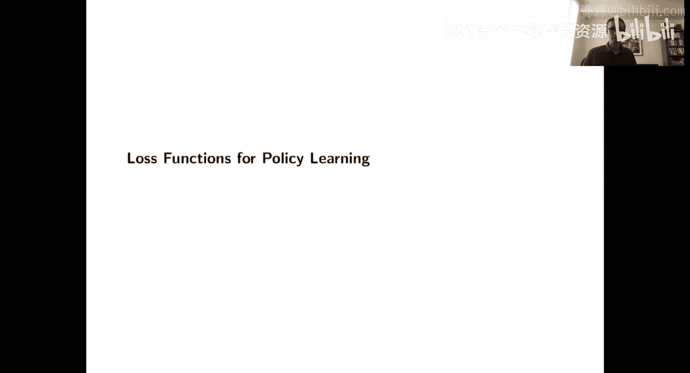

在本节课中，我们将要学习**策略学习**。到目前为止，我们一直在处理一个包含特征 **X**、结果 **Y**、处理 **W** 和潜在结果的数据框架，并致力于估计**条件平均处理效应**。策略学习是在相同框架下的另一个问题，但它不是要求你描述处理效应函数，而是要求你**做出规定性的建议**，即具体推荐哪些人应该接受处理，哪些人不应该。

## 策略学习的定义与目标

上一节我们介绍了条件平均处理效应的估计，本节中我们来看看策略学习的具体定义。

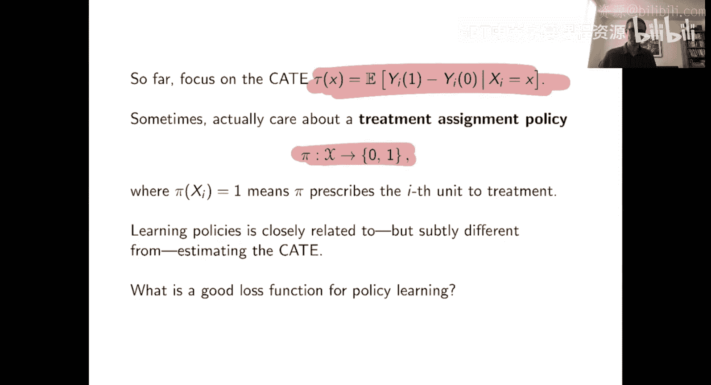

具体来说，一个**处理分配策略 π** 是一个从特征空间 **X** 到推荐值 {0, 1} 的映射。给定你的特征，这个策略会决定是让你接受处理还是进入对照组。策略学习的问题就是利用数据来找到一个好的此类策略。

策略学习问题和CATE估计问题显然密切相关，但也存在一些微妙但至关重要的区别。一个重要的区别在于**最终目标**。CATE估计的目标是准确估计 **τ(x)**。策略学习的目标则是学习一个能实现**高福利**的策略，即当你部署它时，它能为人做出正确的推荐，从而在平均意义上获得高回报。如果你试图进行策略学习，并附带地获得了对 **τ(x)** 的合理准确估计，但这个估计无助于你做出好的决策，那么从策略学习的目标来看，这用处不大。

因此，本讲最后要介绍的是将策略学习问题形式化，并简要说明如何在基于损失的机器学习框架中学习好的策略。

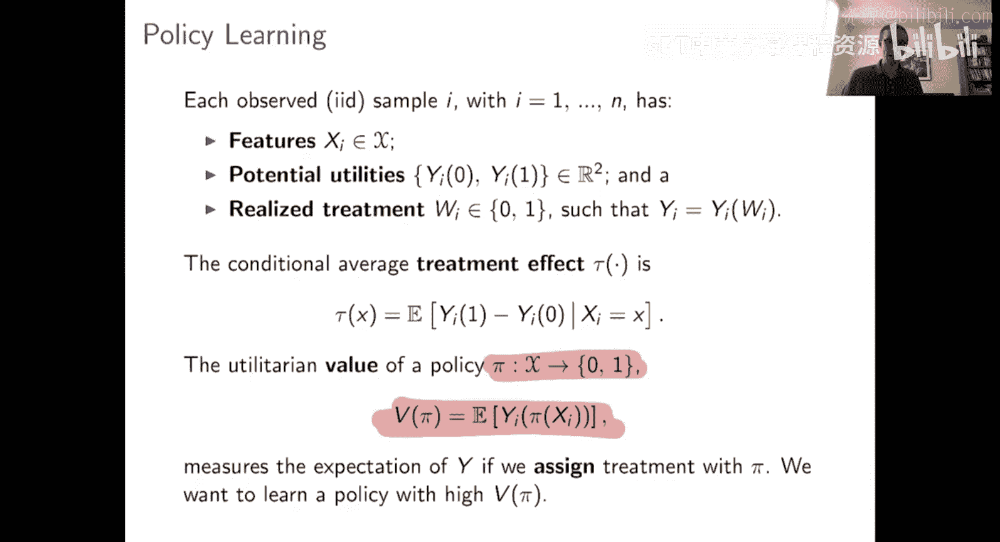

## 策略的价值与最优策略形式

现在，让我们更深入地探讨如何评估一个策略的好坏。

假设条件与往常相同，因此不再赘述。有趣且新颖的是**策略**这个概念，它再次将 **X** 映射到 0 或 1，以及与之相关的**策略价值**概念。

策略的价值回答了这样一个问题：如果我独立同分布地抽取每个人，然后看到你的协变量 **X**，我将你送到处理臂 **π(Xi)**。如果 **π(Xi)** 输出 0，我送你到对照组；如果输出 1，我送你到处理组。那么，策略的价值衡量的是在我根据策略 **π** 分配处理的设计下，或者在等价地，我看到由策略 **π** 选择的潜在结果的情况下，平均结果会是多少。

写出策略的价值非常简单，它就是所选潜在结果的期望值。这个符号包含了很多信息，如果一开始看起来令人困惑，花几分钟思考一下它代表什么会很有帮助。我们假设结果是好的，你希望 **Y** 的值越高越好，因此目标将是找到一个使 **V(π)** 尽可能大的策略 **π**。

为了更直观地理解这个问题，一个有用的方法是注意到你可以将策略价值 **V(π)** 写成两部分：**E[Y_i(0)]**（即从对照组获得的平均结果，或等价于一个将所有人送到对照组的策略的价值），加上第二项 **E[τ(x) * π(x)]**。这第二项本质上说明了由于你将一些人送到处理组，你的策略价值发生了怎样的变化。

这个公式很直观：策略的价值等于什么都不做的价值，加上你的策略所推荐的行为带来的价值。我们立即从中看到，本质上，如果你处理那些具有**较大处理效应**的人，你将从一个策略中获得高效用。否则，如果你只想要可能的最大结果，最优策略 **π** 将处理具有正处理效应的人，而不处理具有负处理效应的人。如果你有处理成本或预算约束，你仍然会发现，在很大的普遍性下，最优的非参数处理设计和策略 **π** 将仅仅基于 **τ(x)** 在某个阈值 **C** 上进行判断。因此，你的最优策略形式为：**π(x) = I(τ(x) > C)**。

## 策略学习与CATE估计的深层区别

乍一看，这种简化可能让人觉得策略学习除了CATE估计之外没什么内容。但越是深入观察，就越会发现其中的奥妙。

第一点是统计上的。确实，在非参数意义上，最优策略是在 **C** 处对 **τ** 进行阈值判断的策略。但这并不意味着用数据做的最优事情就是先学习一个CATE估计量 **τ_hat**，然后让你的策略对 **τ_hat** 进行阈值判断。为什么？到目前为止，我们讨论的估计 **τ(x)** 的方法本质上都是试图在平方误差损失下尽可能准确地估计 **τ(x)**。但实际上，平方误差损失并不一定是策略学习中我们真正关心的目标的正确损失函数。

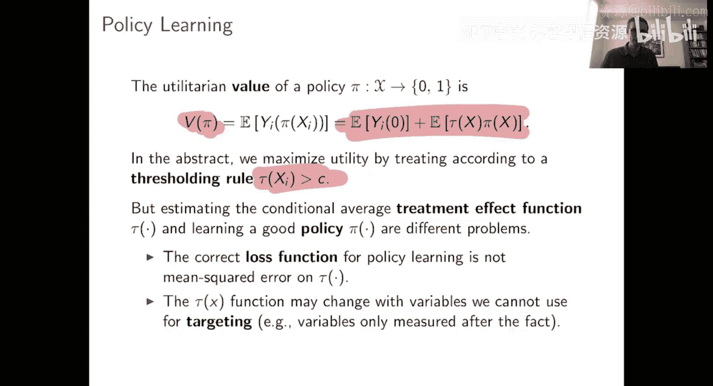

第二点则更实际，但也非常重要。那就是，一旦你从仅仅描述数据转向实际推荐行动，就需要考虑大量以前不存在的新因素。

以下是需要考虑的一些因素：
*   **策略是否可被博弈？** 你的数据中可能观察到某些特征 **X**，但你知道如果你开始将它们用于决策规则，人们就会开始博弈这些特征，从而破坏你的策略，因此你可能不希望使用这些特征。
*   **使用某些变量 **X** 在你的策略中是否合法或符合道德？** 我将回到之前的例子，讨论福利工作计划中优先级排序和资格确定的最优策略。在这个设定中，我们的数据集中有性别信息。**τ(x)** 可能随性别变化，也可能不。当你只是描述数据时，你应该尽可能准确地描述数据。但当涉及到实际推荐项目资格时，你不允许基于性别进行歧视，因此你的策略 **π** 不应该使用性别作为决定谁获得项目访问权的变量。

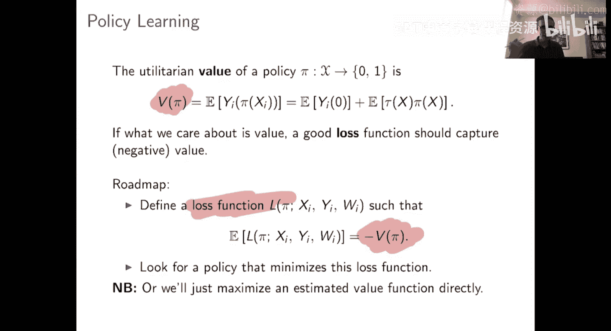

这又是一个不同的维度。这不是一个统计上的考虑，而是一个更实际的考虑，它表明：是的，在非参数意义上，最优策略将是对CATE进行阈值判断的策略。但仅仅对 **τ(x)** 进行阈值判断，考虑到你数据集中的变量 **X**，可能不是一个可行的策略，甚至可能不是一个合法的策略。因此，你希望学习那些满足应用所需约束的策略 **π**。

## 基于损失函数的策略学习方法

那么，我们如何做到这一点呢？鉴于本讲的主题，目标很明确：为策略学习设计一个损失函数，然后使用这个损失函数进行学习。

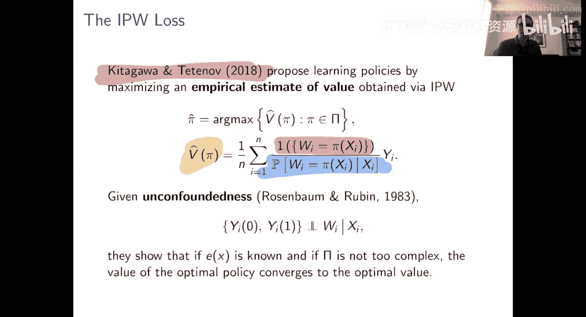

损失函数应该是什么也很清楚。我们想要找到福利最大化的策略，所以我们的损失将是**负福利**。你也可以将机器学习过程视为对估计福利进行最大化，这完全没问题。这就是我们想要做的。而核心问题只是：我们如何设计一个在数据上可行、可以优化和用于学习的损失函数？

当你第一次看到这个问题时，可能会觉得棘手。但实际上有一个非常巧妙的解决方案。

一个非常简单的方法是使用**逆倾向得分加权**来获得策略价值的估计。IPW策略评估的做法是：查看所有样本，对于处理与策略匹配的样本，如果处理不匹配策略，则IPW不考虑它们。然后，它将对所有处理实际匹配你的策略 **π** 的样本的结果取平均。当然，你会缺失一些样本，因此你需要像平均处理效应估计那样纠正抽样偏差，通过逆倾向得分加权来实现。你可以验证，如果倾向得分已知，那么这个IPW价值估计量 **V_hat(π)** 是真实 **V(π)** 的无偏估计。

因此，这是一个合理的价值估计量。然后，机器学习方法可以简单地获取从这个IPW构造中得到的 **V_hat(π)**，并在机器学习意义上通过最大化 **V_hat(π)** 来学习策略。

在某种意义上，你可以直接这样做。但在另一种意义上，有趣的是，这个目标函数实际上与我们之前处理过的目标函数类型有很大不同。之前在预测中，我们处理的是平方误差损失。对于估计CATE，我们处理的是R损失，它本质上是经过修改的、重新中心化的平方误差损失。因此，学习总是归结为沿着某种二次型目标函数下降并进行正则化。而在这里，情况看起来非常不同。

我们是在对策略 **π** 进行优化。策略 **π** 进入这个价值函数的方式是：通过它在所有样本 **i=1...n** 上做出的推荐。我只关心策略 **π** 是否在训练样本上推荐 0 或 1。然后，基于此，如果 **π** 匹配 **Wi**，那么我将 **Wi** 的加权版本纳入我的样本，否则不纳入。我不打算在这里对此多说，但使用这种 0/1 型决策规则进行学习，在算法上与使用平方误差损失型目标进行学习是非常不同的。

解决这个问题实际上与解决一个**加权分类问题**在形式上非常相似。你可以定性地认为，你试图在概念上将人们分类到正确的处理组。虽然这不完全准确，但在优化程序上，它看起来很像。例如，如果你想尝试这个，我们有一个名为 `policytree` 的包，它实际上在树的空间上解决了这个目标。如果你对如何将其简化为分类问题的细节感到好奇，我们在该包的文档中也进行了更多探讨。

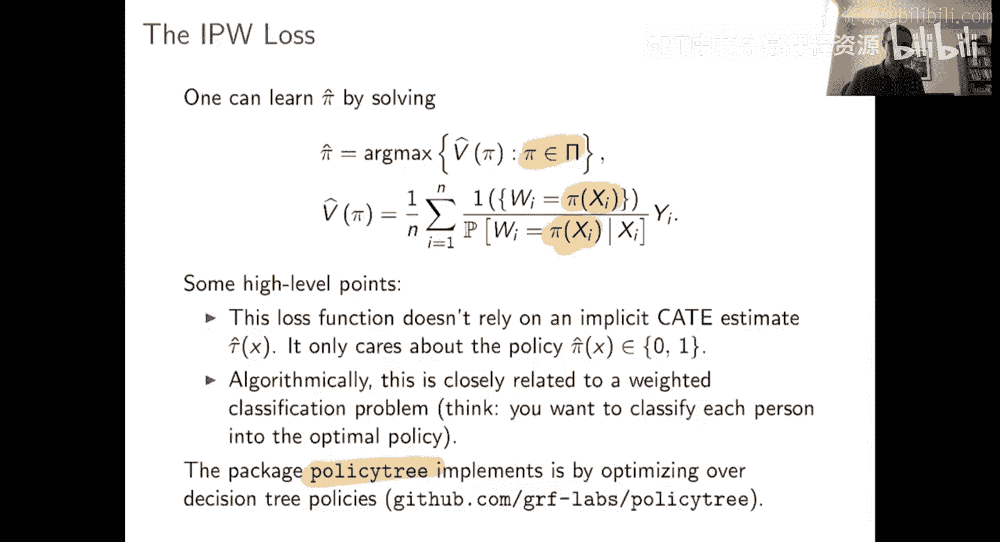

因此，当倾向得分已知时，IPW方法效果很好，它为你提供了一个策略价值的无偏估计，你可以在决策树等空间上进行优化。这为你提供了一种学习策略的好方法。还有什么需要说的吗？到目前为止，在本课程中，我通常不会让你停留在拥有一个在倾向得分已知时运行良好的算法上。在观察性研究中，你可能会担心如果这些倾向得分未知怎么办？你当然可以尝试用估计的倾向得分来运行IPW，但这不会特别稳健。我们还能做其他事情吗？

回想一下上次我们看到IPW是用于平均处理效应估计的，然后我们意识到存在一个双重稳健的替代方案——AIPW。AIPW具有这些很好的稳健性特性，即使倾向得分估计不完美，它也能恢复，这为平均处理效应估计提供了更好的特性。

## 双重稳健策略学习

事实证明，在策略学习中，同样的情况也成立。这里展示的是所谓的**双重稳健得分**。如果你还记得AIPW做了什么，AIPW通过取这些 **γ_hat_i** 的平均值来估计平均处理效应。事实证明，如果你想进行双重稳健的策略学习，你可以构建这些相同的双重稳健得分，然后建立一个类似之前的目标函数。

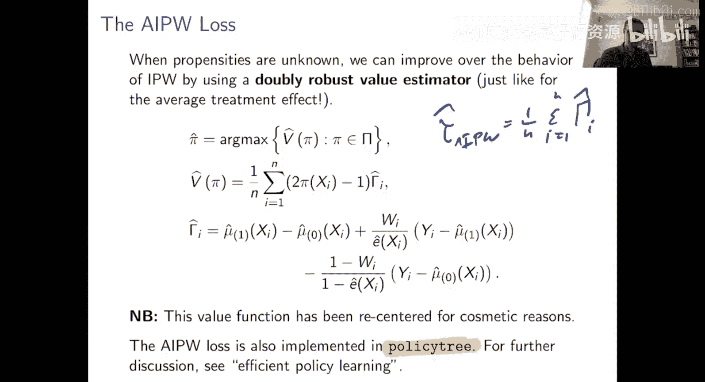

现在，你可以认为这里所做的是：你试图将人们分类到处理组或对照组。这里我将其中心化，所以如果一个人被处理，这个值是+1；如果被送到对照组，则是-1。有了这个福利目标度量，这些双重稳健得分是处理效应的噪声代理。本质上，如果我给你处理，我就获得那个双重稳健得分；如果我送你到对照组，我就支付那个双重稳健得分。一个好的策略通常会在处理效应为正的特征空间区域（即 **γ_hat_i** 平均为正的区域）将人们送到处理组，而在 **γ_hat_i** 通常为负的区域将人们送到对照组。

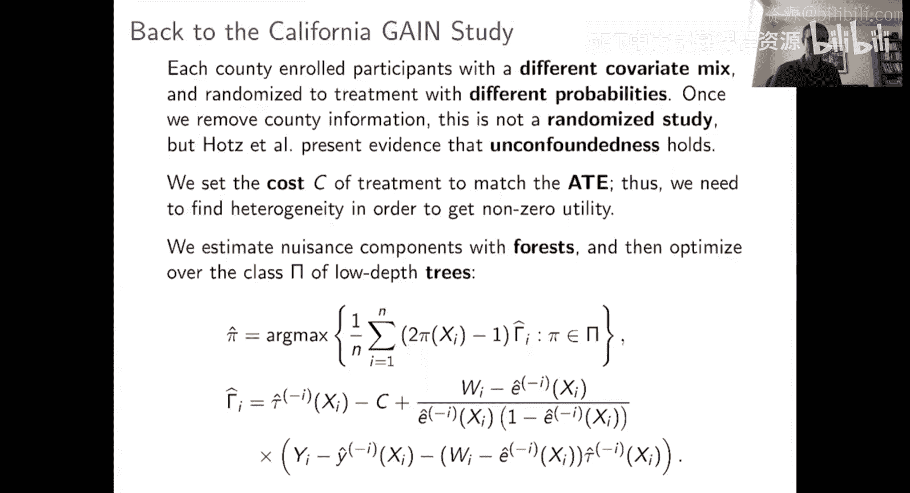

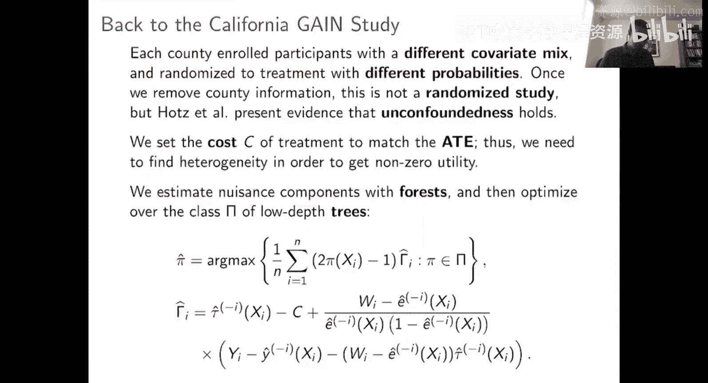

同样，这也已在 `policytree` 包中实现。

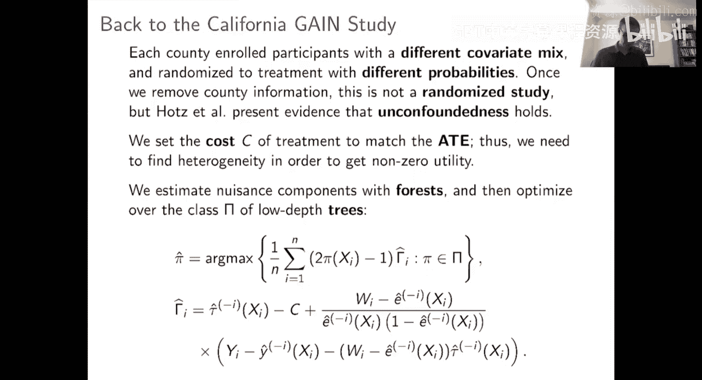

## 实例应用：GAIN研究

为了看到这个方法的实际应用，我将回到之前讨论过的GAIN研究。我们将形成与之前相同的双重稳健得分，然后通过最大化这个目标来学习策略。我们需要以某种方式进行正则化，这里我将通过限制你的决策规则可以是任何深度为 **K** 的树来进行正则化。我将尝试 **K=1** 和 **K=2**。本质上，我将要求我的算法查看所有深度为 **K** 的树的空间，然后看看哪一个能最大化我在这里的估计福利目标。然后我将部署那棵树。

如果我们在这里运行它，那么这就是你得到的输出。大量的数学和非参数统计知识被用于生成这棵树。结果是，在我们之前讨论的GAIN研究中，就福利而言，最佳深度为2的树（或者说，我们声称在福利方面与任何深度为2的树一样好的树）如下所示：

它首先查看：一个人三个月前是否领过工资？如果是，则如果他们高中毕业就处理他们。如果否，则如果他们有孩子就处理他们。

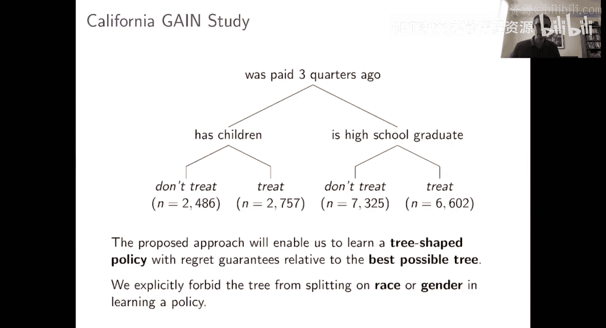

这是一个推荐。其主张是，从功利主义的角度来看，这在将处理分配给那些对处理反应最积极的人方面做得非常好。

如前所述，当你提出政策建议时，当然有些事情是不允许做的。这里我们的数据集中有关于种族和性别的数据。但鉴于不允许且不符合道德基于这些进行歧视，我们只是禁止树在种族或性别上进行分裂。这里还有其他因素在起作用，比如我们查看人们是否有孩子来决定是否处理他们。这是否可以？我认为在某种程度上，这不是由统计学家或计量经济学家来决定的，这取决于利益相关者来看他们是否接受这个决策规则。我喜欢这种在树的空间上进行策略学习的方法的一点是，最终你推荐的策略是一个非常简单的树，希望即使没有数学训练的人也能理解。这样，你就不需要抽象地讨论这棵树在公平性标准下是否是一个可部署的策略，你可以直接去问利益相关者是否喜欢它，然后据此决定。

你可能还会问，这个策略好吗？当然，我们将使用什么标准来评估拟合质量？我们将使用我们的估计福利作为标准。因此，我们将进行某种交叉验证类型的工作，在数据的一部分上尝试学习一个策略，然后在另一部分数据上评估这个策略的平均价值，并在这个损失上评估策略的好坏。在这里，你会看到，就深度为2的树的学习而言，我之前展示的图片在福利指标上的样本外交叉验证类型评估中，相对于其他方法表现良好。这里有两列，左边一列是我在之前讨论过的相同机制下工作，我将小型实验汇集在一起，然后尝试估计倾向得分。这是在估计倾向得分下我们做得如何的评估。右边这里，我“作弊”了，我取回了真实的随机化概率，以便获得客观评估，并实际验证这个策略确实在可测量的程度上优于随机分配。

## 总结与参考资料

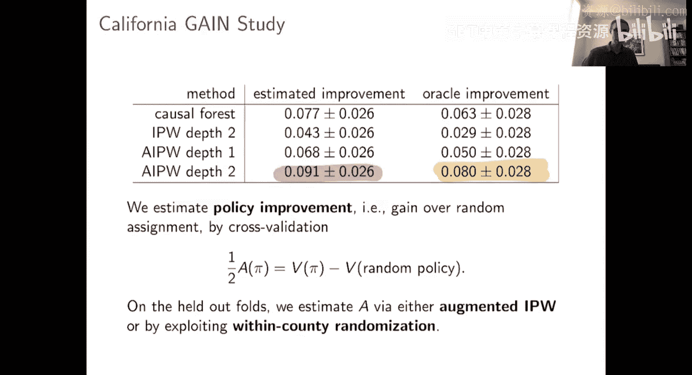

由于本讲已经讨论了很多内容，我在这里讲得非常快。

关于参考资料，对于后半部分，如果你想阅读更多关于策略学习的内容，而不是我在这里给出的粗略介绍，我建议首先从 Hidalgo 和 Tetenov 的这篇论文开始，他们很好地阐述了这个问题，并提出了基于IPW的估计量。然后，在我们的论文中，我们提出了双重稳健的策略学习估计量，并研究了该估计量。如果你想阅读更多关于GAIN应用和策略学习的内容，我们在这里详细讨论了它。

关于本讲前半部分的内容，即用于估计 **τ(x)** 本身的稳健损失函数，今天的介绍最紧密地遵循了这篇即将发表在《Biometrika》上的论文。特别是，我展示的关于堆叠BART和因果森林的例子取自那里。如果你想了解更多，这篇论文概述了R学习者的方法论，并有一些初步的形式结果。但最近，有一对论文更深入地研究了这一点，证明了关于R学习者类型估计量的更一般、更强大的结果。这两篇论文分别由 F.、学生和 Gus 撰写，另一篇由 Kennedy 撰写。同样，如果你对这类东西的理论感兴趣，这两篇是非常好的阅读材料。

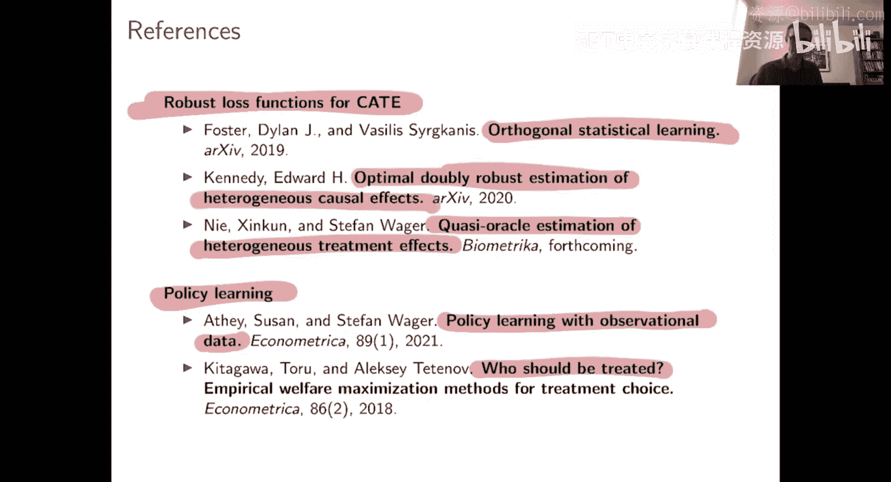

在本节课中，我们一起学习了策略学习的基本概念，理解了它与条件平均处理效应估计在目标上的根本区别，探讨了如何定义和评估策略的价值，并介绍了基于逆倾向得分加权和双重稳健得分的实用学习方法。我们还通过一个实际案例看到了策略学习如何产生可解释的、基于树的决策规则，并讨论了在实际部署时需要考虑的伦理和可行性约束。