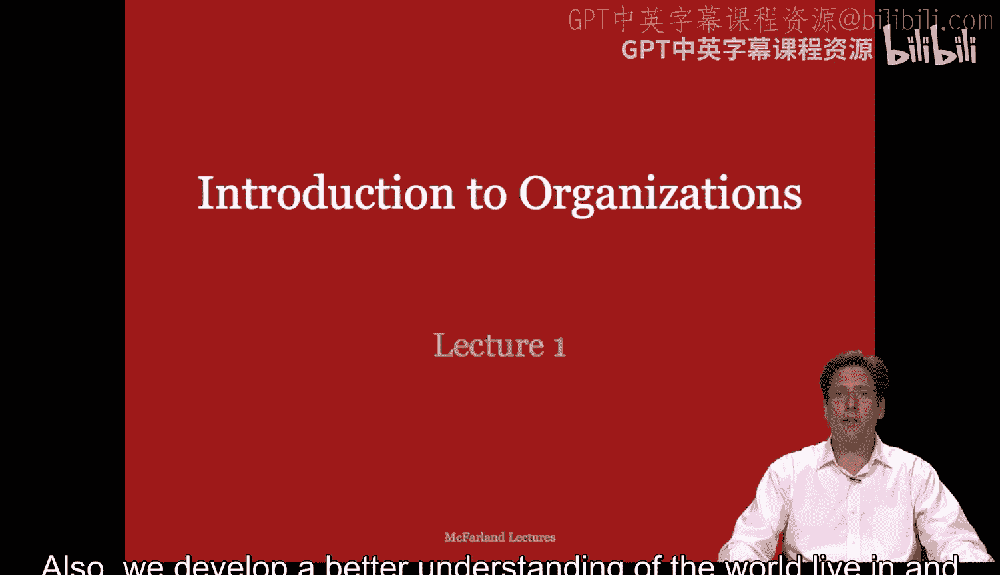
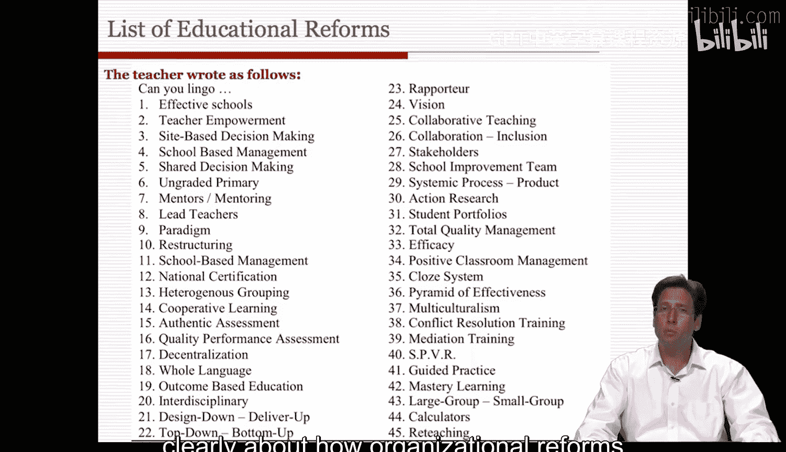

#  001：组织导论 - 第一部分 🏢

在本节课中，我们将要学习组织分析的基础知识。我们将从理解“组织”这一核心概念开始，探讨其普遍性、多样性以及为何研究组织对我们理解和管理社会至关重要。

---

## 什么是组织？

首先，让我们从已有的认知和理解出发。什么是组织？什么又不是组织？

大多数人想到组织时，会联想到医院、学校、企业、商店、公司和工厂。但家庭、各种志愿协会，甚至街头帮派呢？是什么特质让一个群体成为组织，又是什么特质的缺失让它不构成组织？

组织研究领域的重要学者理查德·斯科特给出了一个经典定义。他的著作将在本课程中多次被引用。斯科特将组织定义为：**由个体创造的社会结构，旨在支持对特定目标的协作追求**。

这个定义包含了很多内容，我们可以将其简化理解：**组织是其成员为了完成共同目标或产出特定产品而协调行为的群体**。

基于此，我们重新审视什么是组织，什么不是组织。

以下是符合组织定义的例子及其特征：

*   **公司**：成员协调行为，有共享目标（如盈利、增长），产出产品或服务。
*   **学校**：成员（师生员工）协调行为，有共享目标（教育），产出（教育服务、毕业生）。
*   **家庭**：成员协调行为，有共享目标（如养育子女、维持生计），产出（如家庭幸福、子女成长）。
*   **志愿协会**：成员协调行为，有共享目标（如环保、慈善），产出（活动、社会影响）。

以下是不符合组织定义的例子及其原因：

*   **随机人群**：没有规则、目标，行为没有固定模式，群体边界模糊。
*   **孤立个体**：不存在协作与协调。

还有一些**模棱两可的案例**，它们可能缺少定义中的某些特征：

*   **街头帮派**：目标可能不清晰或多样，成员流动性大，边界模糊。
*   **朋友圈**：通常没有明确的规则和正式目标。
*   **社会运动**：参与者流动，目标宽泛，组织结构松散。

---

## 组织的普遍性与重要性

现在我们对组织有了初步概念，可以开始反思组织的普遍性和重要性。

组织完成了社会所需的大部分功能：
*   从学校的**社会化**到监狱、心理健康机构的**再社会化**。
*   从**税收征收、公共行政、保护与军事**，到**商品的生产与分销、服务提供、文化保存、通讯乃至娱乐**。

组织是我们追求和实现许多集体目标的手段。试想，如果没有专注于这些工作的组织，**灾难救援或学校教育**还可能实现吗？

组织如此普遍，已成为现代社会的媒介。我们很难想象生活在其之外。我们生活在一个由正式组织及其规则、结构、目标和工具性努力所构成的世界里。

组织也是**集体行动者或社会实体**，它们采取行动、使用资源、拥有财产并签订合同。在法律文件中，我们常看到以组织名义列出的条款，这赋予了组织某种“物”的地位。

---

## 组织的多样性

组织无处不在，且形态各异。

以下是组织多样性的几个维度：

*   **规模**：有些组织非常庞大（如IBM），有些则很小（如在地下室运作的青年志愿组织，甚至只有两三个人的初创公司）。
*   **所属部门**：有些出现在私营部门，有些在公共或非营利部门，还有些是志愿协会（如工会、家长教师协会、宗教团体）。
*   **社会结构**：
    *   有些是**层级制**的（如军队、足球队）。
    *   有些是**中央集权的独裁式管理**（如20世纪20-30年代亨利·福特和安德鲁·卡内基管理公司的方式）。
    *   有些是**扁平化管理结构**（如拥有许多项目和团队的咨询公司）。
    *   有些则是**横向分化**为许多不同部门和相对自治的单位（如大学的各个系）。
*   **环境背景**：
    *   **时代背景**：例如，联邦政府今天的运作环境与1790年时截然不同；经济衰退期与繁荣期也大相径庭。
    *   **区域与文化差异**：例如，欧洲迪士尼的运作方式就与加州迪士尼乐园不同。

环境背景的核心观点是：**同一个组织在不同的时间、文化甚至参与者构成下，不会产生相同的效果**。

---

## 组织的变革与改革挑战

组织无处不在，对社会运转至关重要，且形态多样。在过去的50年里，组织也发生了巨大变化，从而改变了世界社会。例如，在发达国家，制造业已让位于服务业，女性已成为劳动力的半壁江山，分包合同日益增长等等。

关键在于，我们生活的组织世界正在我们眼前发生变化。通过本课程，你将更好地理解组织的复杂性，以及将组织导向期望方向的困难。

有时，协调和契约会失效，需要重新谈判。例如，学校未能达到我们的期望，需要重组；军队可能存在性别偏见，需要改变；政府监管未能防止腐败。

参与者经常提出并实施改革以试图改变组织。然而，许多改革在实施前就失败了，而那些得以实施的改革，最终结果也常常与计划大相径庭。许多改革被直接拒绝，或者被大幅修改以适应本地环境。如果你曾担任管理者，可能已经明白我的意思。

我的许多研究聚焦于像学校和大学这样的教育组织，因此我目睹了许多试图改变教育本质的改革。其中许多都失败了。事实上，失败如此常见，以至于一位老师曾给我一份清单，列出了过去20年里在他学校零散实施的45项失败的学校改革。

这些改革常常针对组织的某些特定特征进行改变。例如：
*   有些关注**社会结构**（如第8项“首席教师”，试图在教师角色的扁平层级中插入一个额外层级）。
*   有些提出服务于特定目标的**技术或流程**（如第13项“异质分组”，强调学生积极参与和平等目标）。
*   还有些试图管理**外部环境的压力**（如第12和27项）。

大多数改革是在一所学校开发测试，然后打包应用到许多其他环境中。不幸的是，本地环境往往与原始测试地不同，因此改革目标可能不被本地管理者重视，或者目标变革可能破坏组织内其他有价值的任务和使命。此外，大多数学校和学区内部已有的治理结构，会受到外部变革计划的威胁，因为这些计划会扰乱其既定的协调模式。

简而言之，**每一项改革都强调某些特定的规则、参与者和目标，从而取代其他方面或将注意力转移到他处，这就会产生问题**。

---

本节课中，我们一起学习了组织的基本定义，认识了组织的普遍性、重要性及其惊人的多样性。我们还初步探讨了组织变革的复杂性以及改革常常面临的挑战。理解这些基础概念，是后续深入分析组织如何运作、为何如此运作以及如何有效管理或改变它们的第一步。