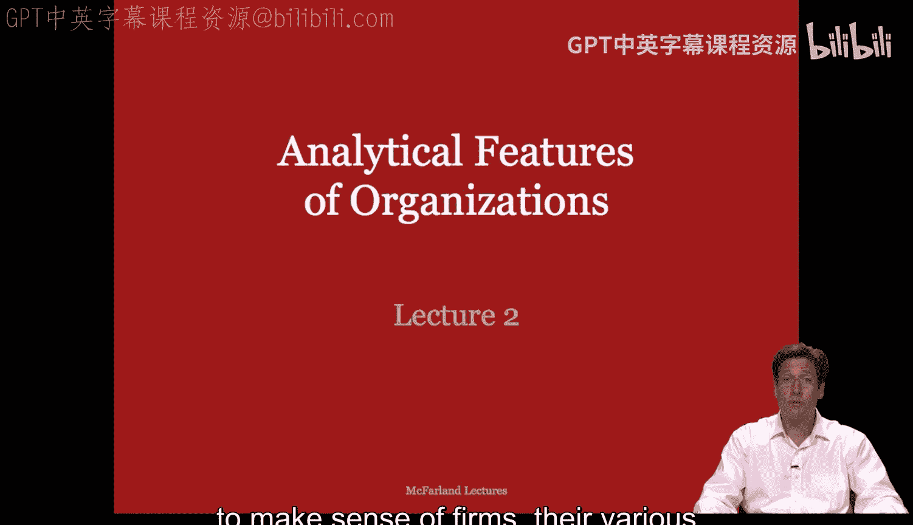
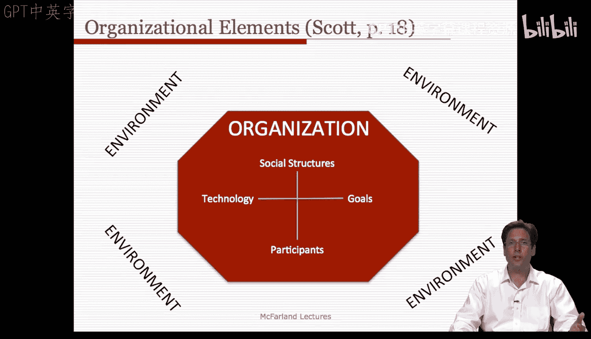
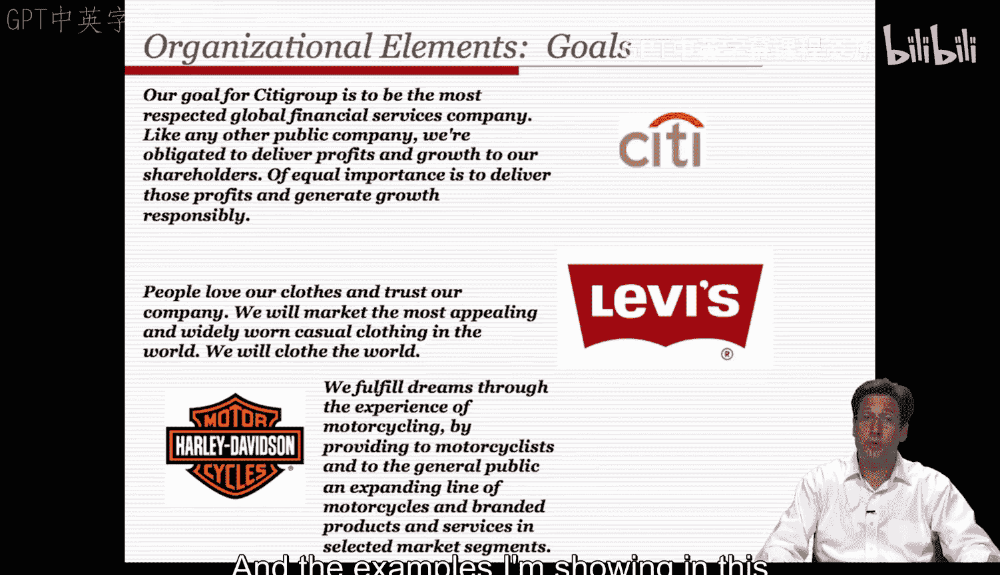
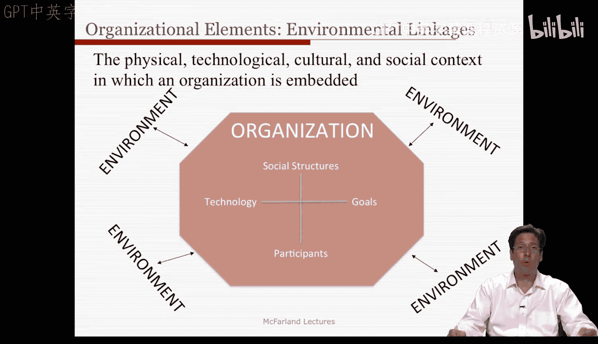
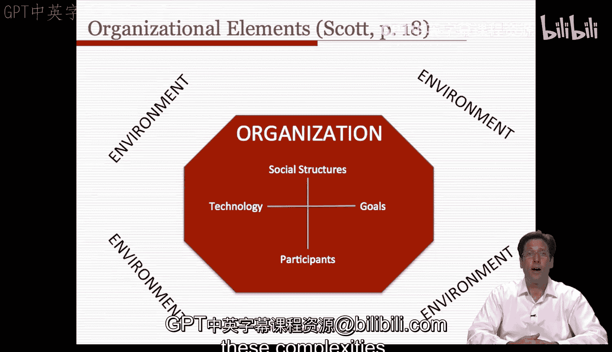

#  003：组织的分析特征（第一部分）📊

在本节课中，我们将学习组织的核心分析特征。这些特征为我们提供了一套术语和概念框架，帮助我们理解各类公司、其不同形态以及它们面临的主要问题。

组织是复杂的实体，因此在讨论它们时，拥有一个概念空间或一组需要关注的核心要素会很有帮助。这需要我们暂时抛开个人经验和具体公司的细节，进行一定程度的抽象思考。

理查德·斯科特在其著作中回顾了组织研究的历史，并为我们确定了一套有限的组织要素以供思考和关注。在下图中，一个组织被描绘为拥有边界，并置身于更广阔的环境中。每个组织都包含特定的要素：一组社会行动者或参与者、一个他们相互关联的社会结构、一个目标或使命，以及一套将输入转化为期望输出的技术或任务。

接下来，我们将逐一探讨组织的这些要素。

## 参与者 👥

首先，我们来看组织的参与者。他们是公司的社会行动者，包括员工和利益相关者。参与者是向组织做出贡献并从中获益的社会行动者。

以学校为例，这些社会行动者是成人和儿童。他们通常承担着特定的角色，例如行政人员（如学监和校长），也可以是教师、学生或职员。职员的范围很广，从管理员到辅导员、护士、食堂工作人员，甚至行政助理。学校还以各种方式与家长和政治人物相关联。

参与者也可以是组织层面的行动者，例如某个领域内的公司。回想一下，我们曾指出组织通常是合同和法律文件中列出的实体。在许多情况下，它们被视为单一的行动者。在科技行业，公司之间常有各种关系，如合作伙伴关系，甚至共享董事会成员。它们以这种方式相互影响彼此的事务。

## 社会结构 🏛️

其次，我们来看组织的社会结构。这指的是那些调节并确立参与者之间通常关系模式的特征。因此，社会结构关注的是组织内参与者之间持续存在的关系。

这些社会结构的形式可以多种多样。有些组织结构图是高度垂直的，包含许多层级；有些是水平的，包含许多不同的部门；还有一些是矩阵形式，既有层级和部门，又有可能跨越它们的项目，就像一个分层的组织结构。

它们在正式程度上也有所不同。正式的组织结构包含明确规定和划分的社会职位，而非正式结构则产生于我们未计划的、但在组织中持续存在的关系。例如，在学校里，正式结构可能反映了我们上面简要提到的规定规则，如校长、副校长、系主任、教师、学生、辅导员等，所有角色都有其关系义务。学校内的非正式结构可能是参与者之间实际产生的建议关系和友谊关系。例如，有些教师可能很受欢迎，成为权威的中心，尽管他们缺乏这样的正式职位。学生也是如此，有些人可能拥有不当的权威和影响力，甚至可能影响课程的教学方式。

社会结构不仅仅是重复的行为模式。它们也是包含规范性原则和认知信念的文化系统。事实上，社会结构的这些文化方面常常指导着行为模式。例如，教室里的成年人通常遵循关于教师或管理者应如何与他人互动的规范和理念。也就是说，我们对角色表现的优劣有某种感觉，而组织倾向于奖励那些最符合理想的表现。

社会结构甚至可以更深层次地反映文化认知信念和理解。例如，我们很难想象没有教师和学生的学校，这种信念不同于我们对这些角色表现方式优劣的感觉。每个学校都必须有这些角色的信念是根深蒂固的。这种信念可能会引发特定的教学行为规范，比如传统或进步的教学规范。反过来，这可能会部分地塑造像学校这样的组织中观察到的行为模式。

但这并不一定完美实现。其他社会结构也在起作用，比如性别角色、阶级差异、同伴文化等，它们可能会模糊规定形式的行为协调的清晰表象。

那么，是什么原则和信念塑造了这些结构，从而使人们的行为遵循它们呢？是正式组织结构图中的权威和控制原则，还是非正式组织中的任务适应原则？这并不明确。

## 目标 🎯

第三，组织拥有目标。这些目标是参与者试图通过执行任务活动来实现的期望结果。

例如，对于学校教育而言，目标包括对青少年进行技术和道德的社会化、发展青少年的成就技能或认知技能，以及将他们培养成好公民。

如果我们关注像斯坦福大学这样的大学教职员工，我们会看到目标的历史性变化：早期完全是关于学生培养，成为精英机构后是关于研究成果，而现在则是关于资源获取，无论是通过捐赠和捐赠基金还是拨款。甚至还有社区服务的功能，或者这所大学试图进行与社会问题以及城镇关系相关的研究和学术生产。因此，许多组织都有多重目标，并且它们之间可能发生冲突。例如，在追求成就的过程中，可能会发现对平等的努力减少了。因此，根据哪些目标被确立和强调，角色和目标可能会发生冲突。

如果我们看具体的使命宣言，可以看到它们与我们刚才提到的一些目标有模糊的联系。以下是几个公司使命宣言的例子，它们模糊地提到了组织的总体目标。本幻灯片中展示的例子是花旗银行、李维斯和摩托车公司哈雷戴维森的。

但组织在其目标集中程度或多面性程度上也有所不同。它们在目标清晰或模糊的程度上也有所不同。例如，让我们看看我工作的两所学校：商学院和教育学院。商学院有一个非常简洁的使命宣言，而教育学院则有一个更长、更多面的使命宣言。

## 技术 ⚙️

第四，组织拥有技术。“技术”常常是一个令人困惑的术语，但我们指的是组织完成工作或将输入转化为输出的手段。因此，技术这个概念与“任务”的概念是同义的。我们称之为“任务技术”，因为通常是机器和生产线来完成这些任务。计算机或功能磁共振成像机器通常是技术，它将输入转化为输出，因此我们有时使用“技术”一词来代替“任务”，但作为学生，你们应该将它们视为同义词。

当我们思考技术时，我们认为被处理的对象各不相同，从制造设备的物质输入，到被处理或教育的人，甚至是被协调成为更有知识、更积极的公民的人。因此，在学校里，技术可以是教案、课程、科目，甚至是计算机的技术界面。

## 环境 🌍

最后是环境，即组织所嵌入的物理、技术、文化和社会背景。

学校面临什么样的环境？学校通常依赖州和市政府获取资源和资金，它们依赖当地大学培养的受过训练的工人和教师，它们依赖所在社区提供客户和学生群体等等。许多组织都以这种方式嵌入环境中，不仅仅是学校，但这是一个我们都能理解的例子。

环境在文化上可能有所不同，例如欧洲迪士尼最初并不成功，因为美国版的迪士尼乐园不能简单地原封不动地搬到欧洲而不做任何改变。环境在技术上也可能有所不同，例如在硅谷设立办公室，那里的一切都连接了互联网和视频会议，相比之下，我父母家还在研究如何使用CD播放器。物理环境也很重要，试想一下，你的公司位于寒冷地区与炎热沙漠地区这样基本的事情。由于这些独特的物理环境，会产生非常不同的压力。

组织的所有内部特征都可能与环境中的要素产生联系。让我们依次来看。

首先，考虑参与者与环境的联系。学校参与者的边界有多大的渗透性？它是一个像寄宿学校或修道院那样的“全控机构”，每个人都与外界隔离在那栋建筑里，还是像一个松散的走读校园那样开放？

其次，技术与环境的联系。没有组织能开发其所有的任务和技术，它们会借鉴。此外，它们还必须适应更大的职业结构和专业的规范和压力。学校的大部分课程是来自教科书出版商、大学教师还是其他学校的从业者？

目标与环境的联系也存在。我们赋予目标的社会价值在不同社区中有所不同。在一些社区，学生的安全可能比学业成就更有价值。在我们当地，对自杀的担忧很重要，这是一个高成就的环境，学生们承受着很大的压力，因此这是一个与成就不同的关注点。在其他学校，可能是一个机会平等的问题，不平等是该学区面临的最大问题。通常，许多相同的目标都会出现，但它们在不同环境或背景下的显著性各不相同。

社会结构与环境也有联系。大多数学校在角色方面看起来相似，但不同社区对如何履行这些角色持有不同的信念和规范。精英学校可能担心压力和进步的教学模式，而处境困难的学校可能认为最好的教师是那些达到标准的教师。在一些移民社区，理想可能是死记硬背和传统的教学模式，考试成绩是最大的指标。

因此，我们拥有所有这些要素，它们倾向于以各种关系相互关联，就像一个相互依赖的系统。我们拥有这些要素的系统，并且这些要素以各种方式与环境相关联。

当我们观察现实世界的案例时，这些抽象的要素很少是清晰或简单的特征。事实上，模糊性更接近现实。例如，学校常常被描述为拥有不确定的技术或任务，用于实现青少年的道德和技术社会化。我们有课程或课程标签，但远不清楚特定的任务和课程是否会导致某些期望的结果，以及哪些比其他的更有效。此外，我们还有实现所述目标的模糊指标。成就测试或公民测试，它们是有偏见的还是准确的？关于我们的指标是否甚至能反映或准确衡量这些结果，存在很多争论。

此外，参与者可以属于多个组织。因此，问题就变成了哪个组织对他们影响最大。孩子们一天中的大部分时间都在学校度过，因此与其他组织相比，这是一个更封闭的环境。尽管如此，他们带来了来自其他地方的各种包袱和经验，比如来自家庭，这可能会影响他们在学校的行为。

因此，组织的现实比我们提供的简单理论和分析框架要复杂和模糊一些，但它们成为我们可以在此基础上详细阐述和讨论这些复杂性的基础。

## 总结 📝

在本节课中，我们一起学习了组织的五个核心分析特征：**参与者**、**社会结构**、**目标**、**技术**和**环境**。我们了解到，这些要素相互关联，并与外部环境互动，共同构成了组织的复杂系统。虽然现实中的组织往往比理论模型更加模糊和复杂，但这些分析特征为我们提供了一个理解和讨论组织现象的基本框架和共同语言。在接下来的课程中，我们将继续运用这些概念来深入分析组织的各种形式和问题。