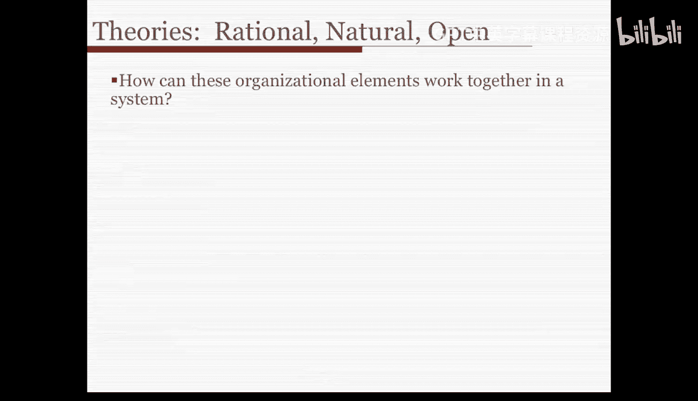
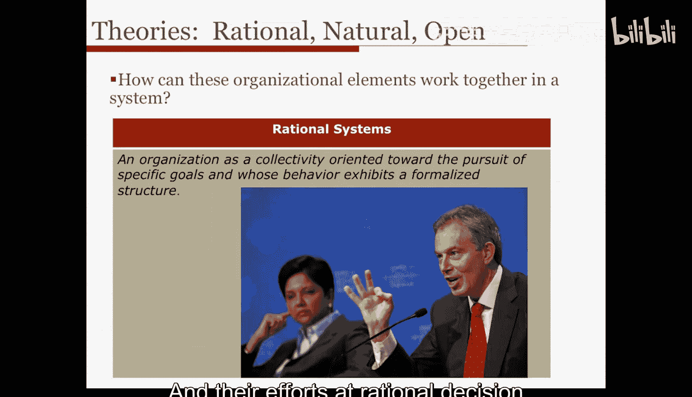
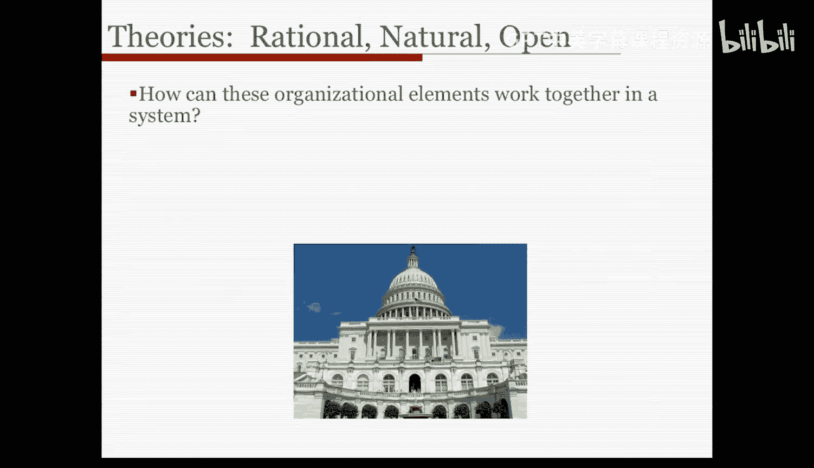
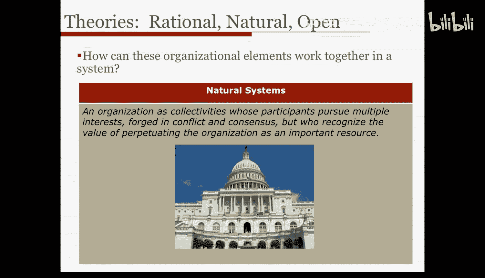
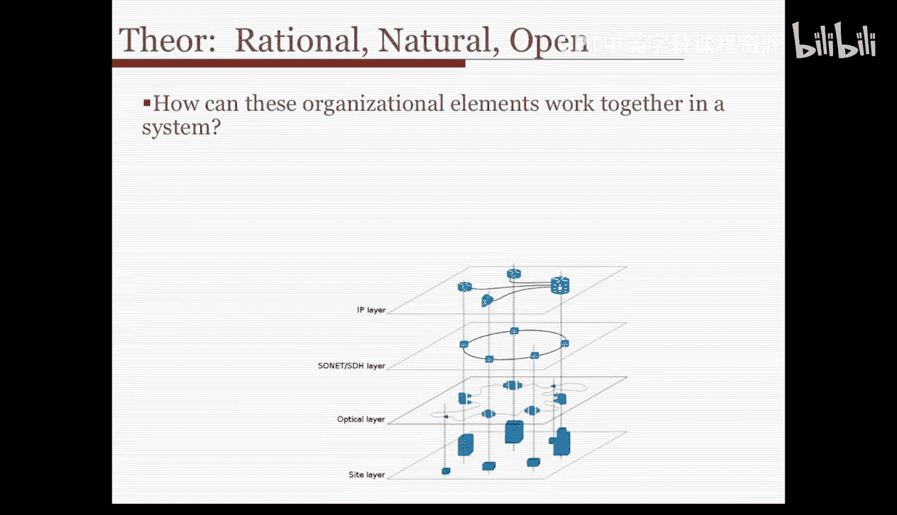
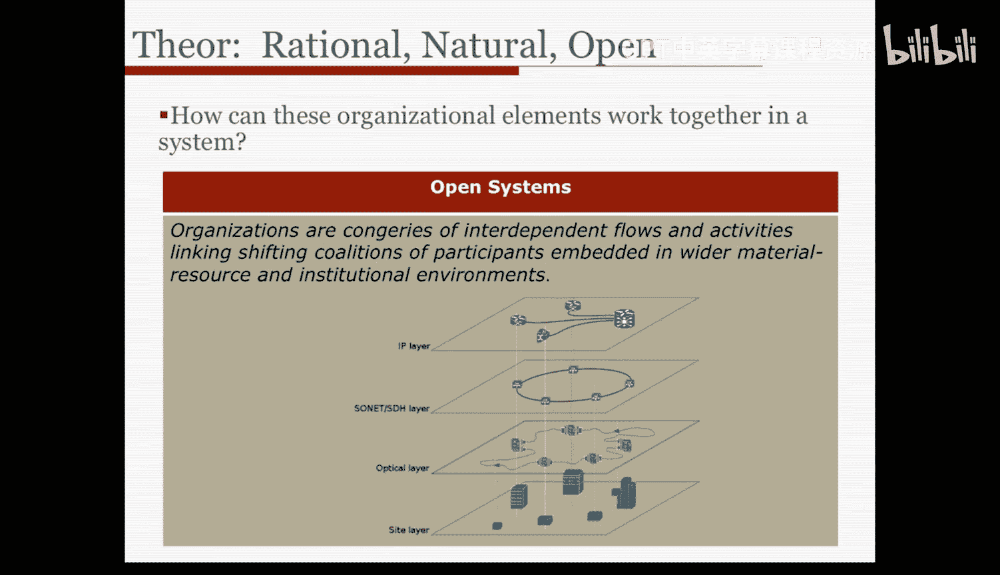
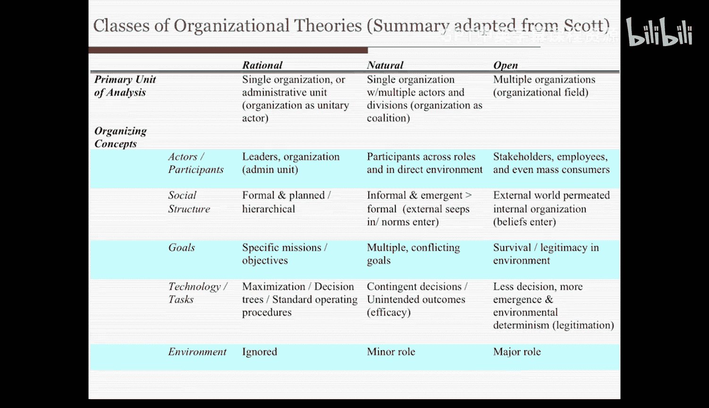

#  004：组织的分析特征 - 第二部分

## 📚 概述
在本节课中，我们将学习理查德·斯科特对组织理论的经典分类。我们将探讨三种主要的理论视角：理性系统、自然系统和开放系统，并了解它们如何以不同的方式看待和解释组织的核心构成要素。

---

## 🔍 三种组织理论视角
上一节我们介绍了组织的五个核心分析特征。本节中，我们来看看这些特征如何在不同理论视角下被组合与解释。理查德·斯科特对组织研究的综述不仅识别了这些组织要素，还描述了不同时代的理论如何侧重于某些要素，并以特定模式描述它们之间的相互关系。他识别出了三类组织理论。

### 1. 理性系统视角
理性系统理论是最早的一类理论，它将组织视为一个**理性系统**。这类理论将组织描述为一个**追求特定目标的集体**，其行为展现出**正式化的结构**。这些理论倾向于关注组织的行政单位及其为优化和解决问题所做的理性决策努力。

### 2. 自然系统视角
随后的一类组织理论将组织描述为**自然系统**。这类理论将组织视为一个**参与者追求多重利益的集体**，这些利益在冲突与共识中形成。然而，参与者认识到维持组织作为一个重要资源的价值，因此他们希望组织能够**生存**下去。

作为自然系统，组织是非计划性的，它拥有涌现的关系和联盟。例如，在参与者之间发展起来的**非正式关系结构**，比正式的结构、角色期望和指导原则更能引导行为。因此，正式的组织结构图不如在其间涌现的非正式组织重要。这类理论将组织视为一个**自适应的有机体**，而非一个理性管理的单元。

### 3. 开放系统视角
最近，组织理论家开始将组织描述为**开放系统**。在这里，组织是**相互依赖的流程和活动的集合**，连接着不断变化的参与者联盟，并嵌入更广泛的物质资源和制度环境中。这类理论比任何其他组织特征都更关注**环境**。

因此，视角的转变是从理性行动者视角下的理性行政单位，到关注组织内部非正式涌现过程和不一致偏好的自然系统，再到关注更广泛环境如何影响组织本身并将其作为主要关切的开放系统。

---

## 📊 三种视角的对比分析
现在，让我们回顾一下所涵盖的内容，并通过一个表格来系统比较这三种视角。

以下是三种系统视角——理性、自然和开放系统——在多个维度上的对比：

**1. 主要分析单位**
*   **理性系统**：单一组织，通常聚焦于其行政单位或“大脑”，并将组织视为一个**单一行动者**。
*   **自然系统**：同样是单一组织，但包含**多个行动者和部门**，组织更像一个**联盟或松散的联邦**，而非单一行动者。
*   **开放系统**：分析单位转向**组织场域**，涉及**多个组织**。

**2. 行动者与参与者**
*   **理性系统**：关注组织的**领导者或行政单位**。
*   **自然系统**：关注**跨角色的参与者**以及组织**直接环境**中的人员。
*   **开放系统**：关注**利益相关者、员工乃至更广泛社会中的大众消费者**。

**3. 社会结构**
*   **理性系统**：社会结构是**正式且计划好的**，是一种**层级制**的组织形式。
*   **自然系统**：社会结构更倾向于**非正式且涌现的**系统，并且比正式计划的结构更重要，外部规范也会渗透进来。
*   **开放系统**：外部世界渗透到组织内部，来自外部的**信念、资源依赖**等开始极大地影响组织与其他组织的关系及其在环境中的生存方式。

**4. 目标**
*   **理性系统**：目标是**具体的使命或目的**。
*   **自然系统**：目标**不明确，是多重且相互冲突的**。
*   **开放系统**：目标是在环境中**生存并获得合法性**。

**5. 技术与任务**
*   **理性系统**：努力**最大化决策**，运用决策树，识别标准操作程序等。
*   **自然系统**：任务是**权变决策**或产生非预期结果的决策，**效能**是关注点。
*   **开放系统**：任务或技术较少关乎决策，更多关乎**环境决定论和来自环境的合法性**，环境决定了你的组织是否符合该类组织应有的概念（例如，学校应该是什么样子），从而决定你能否生存并获得资源。

**6. 环境**
*   **理性系统**：环境几乎被**完全忽略**。
*   **自然系统**：环境扮演**次要角色**，但确实存在。
*   **开放系统**：环境几乎是**一切的关键**，是驱动组织行为的**关键变量**。

---

## 🤔 理论视角的演变与共存
我们拥有理性、自然和开放这三种理论，它们是我们分析特征如何关联和组合的通用框架。

一种观点认为，这些理论反映了它们所处时代的组织形态。理性系统是早期的理论，对应于泰勒主义时代，人们试图规划一切，让管理者找到最有效的决策树来设计工作场所。后来，在现代主义时期，我们更多地使用自然系统视角。而今天，在全球经济中，我们采用开放系统视角，组织高度依赖环境生存。这或许是一种历史性的转变。

但另一种观点认为，组织理论是随着我们对公司和社会群体的理解加深而扩展了其关注点。所有这些特征可能一直存在于组织之中，只是其显著性可能有所变化。**直至今日，理性、自然和开放系统的特性在许多组织中依然并存。**

---

## ✅ 总结
本节课中，我们一起学习了理查德·斯科特提出的三种组织理论视角：**理性系统、自然系统和开放系统**。我们系统地比较了它们在分析单位、参与者、社会结构、目标、技术与任务以及环境这六个核心维度上的不同观点。理解这些视角有助于我们更全面、更深入地分析任何复杂的组织现象。