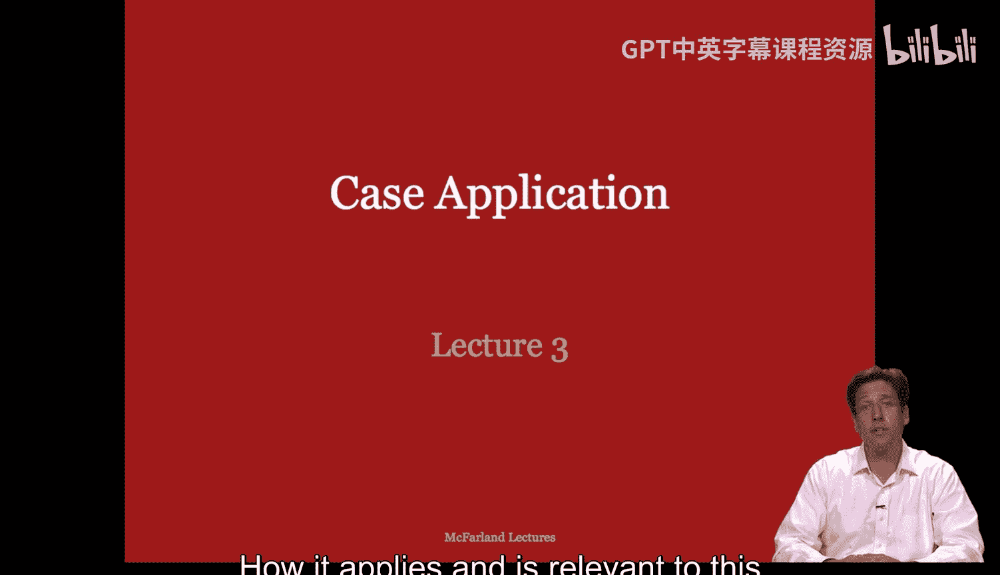
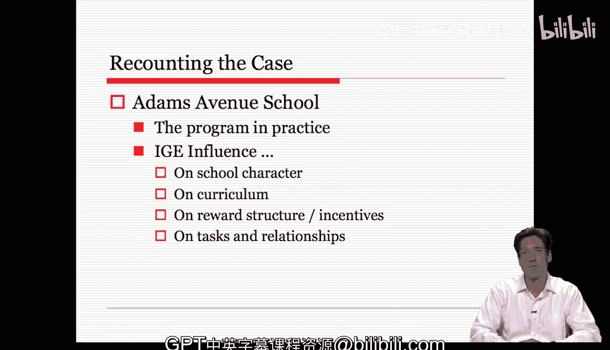

#  005：案例应用 - 第一部分 🏫

在本节课中，我们将学习如何运用组织分析的核心元素来解读一个真实案例。我们将以亚当斯大道学校（Adams Avenue School）的改革为例，识别并理解其中涉及的组织参与者、社会结构、目标、技术和环境等要素。

上一节我们回顾了组织分析的核心框架，本节中我们来看看如何将这些理论工具应用于一个具体的学校改革案例。

## 核心元素回顾 📚

在开始分析案例之前，让我们快速回顾一下组织分析的五个核心元素。

1.  **参与者**：组织的参与者为组织做出贡献，并从组织中获取利益。
2.  **社会结构**：指组织参与者之间持续存在的关系。它可以从表层（如正式规则）延伸到深层（如指导关系的价值观和原则）。
3.  **目标**：参与者试图通过执行任务活动来实现的期望结果。
4.  **技术/任务**：组织为完成工作、将输入转化为输出所采用的手段或方法。
5.  **环境**：组织所处的物理位置、技术环境、文化背景以及其他组织构成的社会背景。

## 亚当斯大道学校案例背景 📖

现在，让我们来了解亚当斯大道学校这个案例。这是一个关于创建一所新型磁石中学的故事，旨在通过新课程服务学业困难的学生群体。

以下是该案例的关键发展脉络：

*   **前身**：亚当斯大道学校的前身是威廉姆斯初级中学的一个七年级附属校区，旨在缓解主校区的纪律和学业成绩低下问题。它由缺乏资历的年轻教师自愿组成。
*   **转型契机**：当学区计划推行磁石学校项目（提供不同课程供家庭选择）时，这个附属校区被选为新建磁石学校——亚当斯大道学校的理想地点。
*   **领导与计划**：原附属校区负责人迈克尔斯女士被任命为新校校长。教职工决定采用一种名为“个性化指导教育”的课程体系，旨在帮助学业落后的学生。
*   **课程技术**：“个性化指导教育”是一种允许学生按自己的进度学习、通过完成个性化任务来掌握材料的课程方法。其核心是：
    *   `学习目标 + 前后测`：为每个年级的每个科目设定具体学习目标，并在教学前后进行测试以监控进度。
    *   `技能分组教学`：根据学生已有的知识水平（前测结果）进行分组，并从其知识断点开始教学。这些技能小组是流动的，可根据新目标重组。
*   **初期挑战**：教职工接受的培训是针对小学生的，并不完全适合初中生，且初期缺乏合适材料，导致准备不足。
*   **学校结构**：学校保持了“小学校”布局，分为三个约100人的小学院。每个学院有共同规划时间，并通过教学改进委员会实现教师与校长的双向沟通。
*   **学校氛围**：到第三年，学校运行顺畅。教师专注于教学和学生关系，而非单纯谈论课程技术。师生、家校关系总体积极和谐。
*   **学生构成**：初期吸引了高学历家庭（主要为天才班），后来也逐渐吸引了普通工薪阶层家庭，最终学生群体反映了周边社区的构成。班级内部按技能分组，但整体保持异质性。
*   **纪律管理**：纪律问题大多通过非正式方式处理（如黄牌警告），正式处罚（停学）很少，这有助于强化积极的师生关系。
*   **课程实施差异**：教师对“个性化指导教育”的遵循程度不一：
    *   **放松型**：简化流程，如按估计而非测试成绩绘制进度图。
    *   **抵制型**：认为其学科不适合该模式，拒绝完全遵守。
    *   但即使是不完全遵循的教师，也受到了该课程哲学的影响，更关注技能发展和学生个体进度。

## 技术如何塑造组织 🔧

接下来，我们重点分析案例中“个性化指导教育”这项**技术**如何深刻地塑造了学校的**社会结构**和其他方面。

以下是“个性化指导教育”带来的主要影响：

*   **改变了传统组织结构**：该课程淡化了传统的年级区分，使教学更加个性化。这消除了学生在低年级水平学习的污名，也让高水平学生能超越年级限制学习。核心是关注每个学生的进步，而非起点。
*   **影响了奖励结构与激励**：学校的成绩报告卡强调**努力程度**和**在学科中的工作水平**，而非绝对的技能等级。这可以类比为组织中的薪酬体系（`成绩 = 对工作的回报`）。一个非常努力但技能水平只有五年级的学生可能获得“优秀”（A），而一个不努力的八年级水平六年级学生可能只得“不及格”（E）。荣誉榜基于努力程度而非技能水平，这**提升**了低成就学生的社会声望和学术合法性，同时**降低**了高成就学生所获的奖励，部分教师因此担心后者未被充分激励。
*   **重塑了任务结构与师生关系**：所有教学都在技能小组内进行，学生独立工作。这意味着没有公开的表演或比较，成绩更多是私人成就，减少了公开尴尬的机会。教师以小组形式授课，然后进行个别指导。这有助于建立师生信任，减少冲突。
*   **营造了共同体氛围并促进了种族融合**：该课程的实施催生了一种共同的、社群式的精神，并在学校参与者之间建立了更密集的积极关系。它通过淡化初始的技能差异，帮助建立了跨种族的联系。

## 总结与启示 💡

本节课中，我们一起学习了如何运用组织分析框架来解构亚当斯大道学校的案例。

通过这个案例，我们看到：
1.  一项新的教育**技术**（“个性化指导教育”）被引入组织。
2.  这项技术不仅旨在实现提升学生成绩的**目标**，还深刻地改变了组织的**社会结构**（如奖励制度、师生关系、种族互动）。
3.  这些改变是在特定的**环境**（学区改革、社区构成）中，由**参与者**（校长、教师、学生、家长）以不同方式推动和适应的结果。

这个案例生动地展示了组织元素之间的相互关联性。即使是一个并非为组织分析而写的案例，我们也能从中识别出这些核心元素，并理解它们如何相互作用，共同构成了一个组织变革的独特叙事。这说明了组织理论在阐明具体组织现象时的应用价值和相关性。