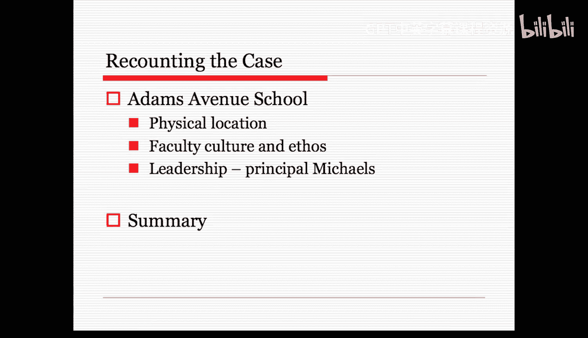
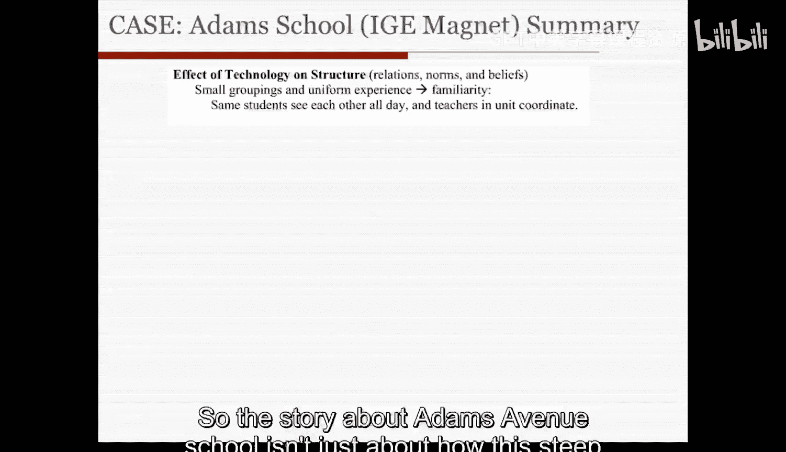
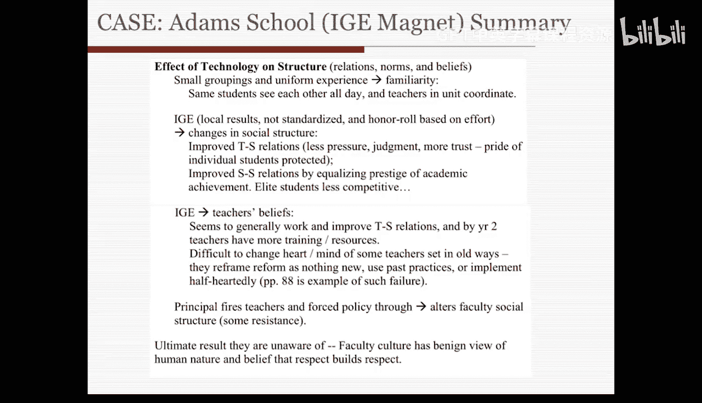
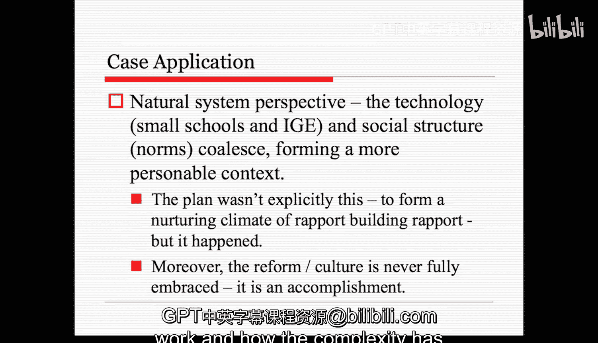

#  006：案例应用 - 第二部分

在本节课中，我们将继续学习斯坦福大学《组织分析》课程中的案例研究，深入探讨亚当斯大道学校的组织特征。我们将应用课程中的理论框架，分析学校如何通过其文化、社会结构和技术安排，共同塑造了一个独特的教育环境。

---

## 物理空间与环境 🏫

上一节我们介绍了学校的背景，本节中我们来看看学校的物理空间如何影响其组织运作。

玛丽·梅茨也讨论了物理空间。她提到学校位于市中心区域，这便于组织实地考察，方便前往商业区、博物馆等地。学校建筑规模较小，实际上缺乏足够的体育馆空间，供暖系统也不总是可靠。尽管如此，学校并不希望搬迁到另一栋建筑。玛丽·梅茨认为，这种物理环境使每个人都处于共享空间中，并营造出更为温暖的氛围。

所有教师都报告说，学校的小规模以及被划分为三个单元或小型学校的结构，使教师能够了解每个学生，并彼此之间建立健康融洽的关系。

---

## 学校文化与深层社会结构 🧠

接下来，我们将探讨学校的文化、精神特质或深层社会结构。

玛丽·梅茨对学校文化和精神特质，即深层社会结构，进行了大量讨论。

教职员工将与学生及彼此之间的良好关系本身视为目的，并认为这对学习有帮助。在某种程度上，这种文化、这套原则成为了新目标或共同使命的基础。

除了少数例外，教师普遍认为所有学生本质上是好的。他们将相互间的融洽关系视为常态。教师不会过度认同学生，他们与学生建立了牢固、坚实的专业关系，这种关系也带有一定的个人色彩。

许多教职员工通过感受和实践各种活动，帮助重建和传承这种文化，使其得以更新。这通过几种方式发生：

以下是文化传承的具体方式：
*   在团队会议和教师休息室的谈话中，教师倾向于在谈话中插入积极的评论。如果谈话转向负面方向，他们会将其重新引导到积极的方向。
*   新入职的教师通过这些经历被社会化，因此文化得以传承。
*   即使是非正式的领导，也会以尊重的方式“制裁”那些对学生持负面看法的新教师，引导他们转向尊重和帮助学生建立自信，而不是贬低他们。

话虽如此，文化并非完全统一，也存在例外。梅茨提到，有五名教师曾愤怒地面对学生。这些教师倾向于不使用小组教学，而是采用全班教学和背诵的方式。此外，学生们知道他们是谁，并以消极的方式回应他们。

尽管如此，梅茨很快指出，这些教师相对而言是消极的，但与其他学校或环境中的传统学校教师相比，其消极程度并不明显。她的观点是，学校文化是一种脆弱的建构，需要不断被再生产，远非确定无疑。

---

## 管理者与领导者的影响 👩‍🏫

现在，我们来看看组织的领导者——校长的影响。

玛丽·梅茨也花了一些时间讨论管理者，即组织的领导者，以及校长的影响。

校长迈克尔夫人通过间接和非正式的方式影响了人际关系的基调。但同时，她也通过直接和非正式的方式控制着“个别指导教育”课程及其教学。一方面，文化在某种程度上是一个自然系统，她通过非正式的、自然形成的关系和努力来管理它；而实际的课程本身，她则更多地通过直接和理性系统的手段来管理。

与学生建立积极关系是一项官方原则，但校长通过多种方式鼓励这一点。她使用间接手段来实现这一目标。在她的演讲中，她重视培养学生的自信心。她希望进行相对性评估，而不是依赖客观的、统一的考试成绩。她希望教师组织实地考察。她鼓励民族自豪感，并参与了许多相关团体。

她还尽可能地寻求融合。她公开赞赏领导课外活动的教师，并特意为他们提供这些活动所需的机构资源。

简而言之，校长与教职员工及学生的关系反映了学校文化。不清楚是谁影响了谁，但它们肯定是相互强化的。

---

## 围绕“个别指导教育”的冲突与实施 🔧

然而，校长与教职员工在“个别指导教育”项目上的关系则是另一回事。

“个别指导教育”项目是由学区强制推行的，教职员工感到他们没有选择或讨论的余地，并产生了一定程度的抵触。迈克尔夫人诉诸正式的层级权威来实施这个项目。在头两年的教职员工会议上，她提醒教师必须实施“个别指导教育”，否则他们就得去其他学校或学区找工作。第一年结束时，她甚至要求三名教师调职。这引发了很多冲突。最终，两人被说服离开，第三人提起了申诉（这意味着他们诉诸法庭来解决谁对谁错的问题）。

教职员工感到不安，部分原因是他们认为非自愿调职不太公平，而且许多人在第一年不知道如何实施“个别指导教育”，因此觉得这可能不是那些教师个人的错。

无论如何，到了第三年，教师们对“个别指导教育”项目更加适应，抵触情绪减少，校长也转而采用更多的积极强化手段，减少了对官方权力的使用。

---

## 教师的抵抗与组织的多元性 ⚖️

最后要讨论的一点是教师的抵抗。

少数教师批评校长依赖层级权威形式来强行推行“个别指导教育”项目。少数派的愤怒被大多数教师所认识，但并未扩散开来。

我们在很多方面看到一种自然系统，其中一些教师持有与主流文化不同的抵抗观点。因此，在这个组织中，我们甚至可能存在着模糊的目标或多种不同的视角。它作为一个联盟被维系在一起，管理者或校长试图通过各种手段来引导它，无论是通过非正式关系的自然系统，还是通过正式的组织结构图。

---

## 案例总结与理论应用 📊

在总结亚当斯大道学校的案例时，我们将开始应用课程中的概念或理论框架。

首先，在思考一个案例时，要记住考虑作者描绘的主要故事线是什么。在这个案例中，玛丽·梅茨的主要故事线是描述一种主导的推论模式，即在这个组织中某些事情是如何发生的。具体来说，她认为一项技术被强加于这个组织，而社会结构使得这类技术得以实施。这就是她的大致故事线。

如果我们观察实际的参与者和行动者，我们会看到：
*   种族异质的学生群体，少数族裔学生和贫困学生更多，他们的准备程度略低于城市其他地区的学生。
*   领导者是迈克尔校长。
*   教师相对年轻且经验不足。
*   教师工会对这个“个别指导教育”项目既有支持也有反对。
*   中央行政部门控制资金。
*   甚至有激进的家长希望资优学生表现出色，也有更多反映社区构成的本地家长。

如果我们看目标，我们有一个总体目标，即处理纪律和成绩问题、应对过度拥挤、创造一种新的体验来解决许多学校教育的目标。

这里的社会结构包含各种要素：
以下是社会结构的具体要素：
*   **教师与校长关系**：大多是积极的，校长提供反馈和支持。但也存在一些冲突案例，例如第一年有教师被排挤，一些教师对“个别指导教育”的压力表示抵制和抱怨，但总体上冲突不多，关系相当融洽。
*   **教师间关系**：也是融洽的。在教师休息室有频繁的互动。他们有一个教学改进委员会。存在一种关注学生关系并与之建立积极关系的规范。
*   **师生互动**：友好。学生和教师之间似乎存在着巨大的融洽关系和积极的相互期望与信念。教师有一种更深层的信念结构，即认为孩子们都有优点。这并不是说所有教师都成功，有些教师在这种关系建立中挣扎。
*   **生生关系**：也很积极。学生之间的关系也相当积极，并且在很大程度上是去种族隔离的。

部分论点是，所有这些显现出来的关系，都是积极组织文化的结果，人们推动着这些关于如何相处的规范、价值观和原则。

这个组织的技术和任务是多重的：
以下是技术与任务的具体内容：
*   它是一个多单元处理组织。学校被划分为几个小型学校，有三组各四名教师专注于大约100名学生。
*   另一个部分是特定的课程——“个别指导教育”。它有特定的离散目标，对表现进行个别化评估。它根据学生的技能而非年龄进行分组。课程的评分和课堂组织都与传统方式非常不同，因为它是“个别指导”的。学生自己指导教育如何进行，他们可以决定自己的进度。目标是让他们在自己的基础上不断进步。
*   校长也评估教师的进展。因此，我们有一种技术或任务，使校长能够调整教师的投入和产出。

到目前为止，主要的故事线是：学校内部存在这种文化和精神特质，创造了这些积极的关係，这些关系似乎与正在实施的任务和技术是共存的，或者至少是一致的。这就是梅茨对整个故事的大致叙述。

环境本身也对这个整体叙述产生影响：
以下是环境因素的影响：
*   第一年有这些直言不讳的家长。
*   到第三年，社区中更典型的家长增多。
*   精英阶层开始因某种原因离开该学区。
*   学区对校长有各种要求，有新闻稿、法庭案件。
*   有一个规模小且拥挤的资优项目。
*   学校本身的物理环境也促成了我们所观察到的那种亲密、个性化体验的关联。

---

## 技术与结构的相互塑造 🔄

关于亚当斯大道学校的故事，不仅仅是关于深层文化如何导致积极关系，进而促进技术实施的故事。它也是一个关于技术本身——课程以及学校组织处理学生和社会化学生的实际方式——如何塑造社会结构的故事。

这个“个别指导教育”项目为这些积极关系、规范和信念的出现设定了条件。例如：
以下是技术塑造结构的具体例子：
*   小型学校中学生的小组划分，使他们拥有相同的教师组，并在班级间流动，这使他们彼此熟悉并拥有统一的体验。同样的学生整天见面，教师作为一个单元进行协调。
*   “个别指导教育”没有全球或客观的标准，它有非标准化的本地化结果。荣誉榜不是基于像成绩测试那样的成就，而是基于努力和这类课程规则。
*   技术的规则，以及人们必须如何工作、如何被评判的方式，导致了社会结构的变化。它实际上促进了师生关系的改善，因为它降低了成绩压力和评判，带来了更多的信任和自豪感，保护了学生的自尊。
*   此外，通过平衡学术成就的声望，改善了生生关系。精英学生的竞争性降低，成绩较低的学生表现稍好。
*   “个别指导教育”课程也影响了教师的信念。它似乎总体上是有效的，并改善了师生关系。
*   到了第二年，教师得到了更多培训和资源，因此实际培训教师的努力、他们接触这门课程的经历，使他们能更好地实施它。

很难改变一些固守旧方式的教师的心态。他们会将任何改革重新定义为“没什么新意”，并会沿用过去的做法，或者半心半意地实施这些新事物。

因此，校长解雇教师和强行推行政策的努力，改变了教职员工的社会结构，导致这种积极的校长-教职员工关系有所下降。起初存在一些抵制，但最终的结果是，他们并未意识到的是：这种教职员工文化——其对人性本善的看法以及“尊重孕育尊重”的信念——部分是由“个别指导教育”以及所有课程和技术的努力所生成的。反过来，通过多种强化和再生产它的自然实践所实现的社会结构的实际实施，又对课程本身产生了积极的反馈，使其得以实施。这就是亚当斯大道学校的大致故事。

---

## 总结与理论视角回顾 📝

本节课中我们一起学习了亚当斯大道学校案例的深入分析。

总而言之，亚当斯大道学校的案例应用实际上是一种自然系统的视角。小型学校和“个别指导教育”的技术，与重视学生的规范和社会结构，融合在一起，形成了一个更具人情味的背景。这就是这个组织及其改革的故事。

计划本身并非明确要形成一个培养融洽关系、进而建立更多融洽关系的培育性氛围，但它发生了。这就是为什么它在某种程度上是一个自然系统的描述，因为它具有自然形成的过程。此外，改革或文化从未被完全接受，它对每个人来说并不统一，因此它不符合理性系统。它更像一个自然系统，因为它是一种成就，有时存在一定程度的模糊性，并且似乎需要时刻被完全再生产。

它也不是一个开放系统的视角，因为环境本身以及所有其他组织与它们的相互依赖关系在这个描述中并不极其相关。

因此，从我们的第一个案例中，我们看到了各种组织要素在起作用。此外，我们还对自然系统的视角进行了一些阐释。请注意，这并不是作者最初的意图，但我们可以应用这些概念和理论来进一步阐述这一组织现象的深度和意义，从而更好地理解变化为何以这种方式发生，并提出某种更深层次的解释，帮助我们理解这些组织如何运作，以及其复杂性如何具有某种内在逻辑。