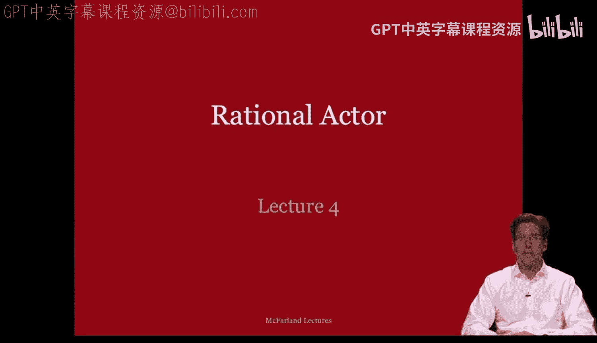
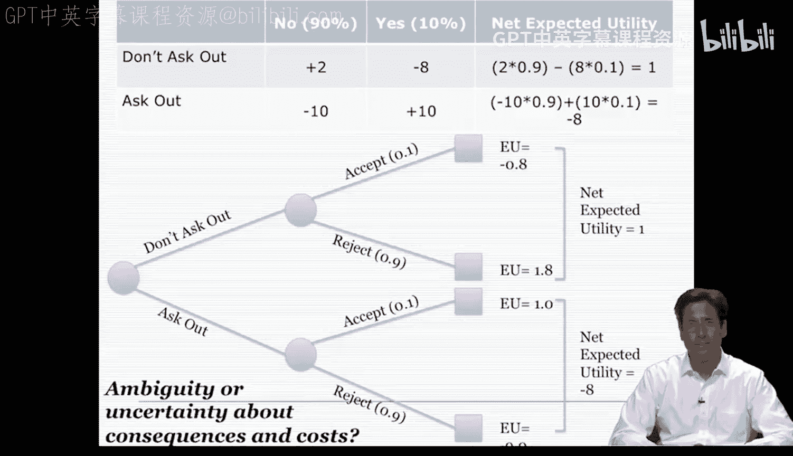

#  012：理性行动者模型 - 第一部分 🧠



在本节课中，我们将学习组织中的决策制定，并重点介绍理性行动者模型。我们将探讨决策的逻辑、核心概念，并通过简单例子理解理性选择的过程。

---

## 概述

本周的课程将围绕组织决策展开。我们将讨论两种主要的决策逻辑：**结果逻辑**和**适当性逻辑**。本节课重点介绍前者，即理性行动者模型。该模型假设决策者会评估各种选项的后果，并根据其偏好和目标做出选择。

---

## 决策的两种逻辑

上一节我们概述了课程内容，本节中我们来看看组织决策的两种基本逻辑。根据詹姆斯·G·马奇的研究，决策逻辑主要分为两类。

*   **结果逻辑**：也称为理性选择理论。决策者关注选择及其工具性努力，评估不同行动的后果。
*   **适当性逻辑**：决策者关注规则遵循和解释性活动，行为由价值理性或责任感驱动。

这两种行为都是有意图的。前者涉及**手段理性行动**，后者则涉及**价值理性**或责任驱动行为。价值理性认为，我们常常出于对规则、原则或特定身份的责任感而做出决策，而不计成本或对其关注不足。

---

## 理性行动者模型

理性行动者模型本质上遵循结果逻辑。对于一个理性的决策过程，通常包含以下四个核心方面。

以下是理性决策过程的四个关键步骤：

1.  **明确备选方案**：决策者需要问：“我有哪些可用的选项？”
2.  **评估后果**：决策者需要问：“如果我选择每个选项，会发生什么？”
3.  **排序偏好**：决策者需要根据价值高低，对目标和目的进行排序或权衡。
4.  **应用决策规则**：决策者需要根据各选项对偏好或目标产生的后果，运用规则选择方案。

格雷厄姆·艾利森将此称为**推理模式**。通常讨论的两种决策规则反映了对理性行动者的不同理解。

以下是两种常见的理性行动者类型：

*   **完全理性者**：传统上被批评者称为“经济人”。这类个体以偏好和目标清晰、一致为典型特征，是理性行动者的理想形式。
*   **有限理性者**：这类个体以认知模糊、不确定、信息不完整以及偏好和目标不一致为典型特征，更接近我们现实生活中所知的真实的人。

---

## 简单示例：是否带伞 🌂

为了理解差异，让我们从一个简单的理性选择例子开始。假设在加利福尼亚州的雨季，某一天下雨的概率是40%。我们需要决定是否带伞。

我们为每种情景赋予价值（从-10到10）：
*   **不带伞，没下雨**：+6 （开心不用带伞）
*   **不带伞，下雨了**：-10 （整天湿透很糟糕）
*   **带伞，没下雨**：-5 （携带不便有些麻烦）
*   **带伞，下雨了**：+8 （准备充分保持干燥）

我们需要计算每个选项的**期望效用**。决策树如下：

```
                 [40% 雨] --> 不带伞：-10
                /
不带伞 [60% 晴] --> 不带伞：+6
                \
                 [带伞决策]
                 /
带伞 [40% 雨] --> 带伞：+8
                \
                 [60% 晴] --> 带伞：-5
```

计算过程：
*   **不带伞的期望效用** = (0.6 * 6) + (0.4 * -10) = 3.6 + (-4) = **-0.4**
*   **带伞的期望效用** = (0.6 * -5) + (0.4 * 8) = (-3) + 3.2 = **0.2**

比较两者，**带伞的期望效用（0.2）高于不带伞（-0.4）**。因此，根据我对每种结果成本与回报的偏好，带伞是更好的选择。

---

## 复杂示例：是否邀请约会 💑

现在，让我们看一个更有趣的约会决策例子。假设你在考虑是否邀请某人外出，对方很有吸引力，但同意的概率只有10%。

同样，我们为每种情景赋予价值：
*   **不邀请，对方会拒绝**：+2 （避免了尴尬）
*   **不邀请，对方本会同意**：-8 （错过了机会）
*   **邀请，对方拒绝**：-10 （感到非常尴尬和糟糕）
*   **邀请，对方同意**：+10 （非常满意）

计算期望效用：
*   **不邀请的期望效用** = (0.9 * 2) + (0.1 * -8) = 1.8 + (-0.8) = **1.0**
*   **邀请的期望效用** = (0.9 * -10) + (0.1 * 10) = (-9) + 1 = **-8.0**

在这个例子中，**不邀请的期望效用（1.0）远高于邀请（-8.0）**。因此，考虑到被拒绝的风险和可能带来的负面感受，理性选择可能是避免邀请。

---

## 模型的局限性与现实应用

以上两个例子展示了个人在日常决策中可能使用的简单决策树。你可以将这种思路扩展到组织及其决策类型。例如，一家公司如果采取X行动，竞争对手或客户可能会有一定概率做出某种反应。

稍后我将以古巴导弹危机为例，讨论组织决策。在那个案例中，存在明确的选择、潜在的后果以及与每个结果相关的价值判断，这将使我们更接近现实世界或组织案例。

然而，这里显然存在大量模糊性。报告可能不准确，而且我几乎没有确凿证据来判断某人是否可能接受邀请。**迄今为止，理性行动者模型是一个理想化的模型，它假设决策者具有超强的能力**。

现实中，我们大多数人都是**有限理性者**。我们对自己的偏好和目标不清晰，对后果的信息模糊，对他人行为的概率判断也不明确。这引出了我们下一个关于模糊性的问题。

---

## 总结



本节课中，我们一起学习了组织决策的基础，重点探讨了**理性行动者模型**。我们了解了**结果逻辑**的四个步骤：明确选项、评估后果、排序偏好和应用决策规则。通过“是否带伞”和“是否邀请约会”两个例子，我们实践了**期望效用**的计算，并看到了理性选择如何在实际中运作。最后，我们认识到该模型是理想化的，现实中决策者常受信息不完整和偏好模糊的限制，即表现为**有限理性**。