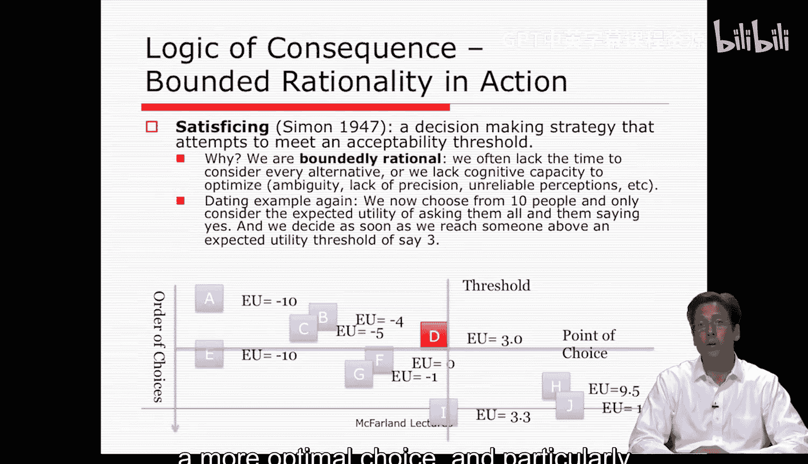
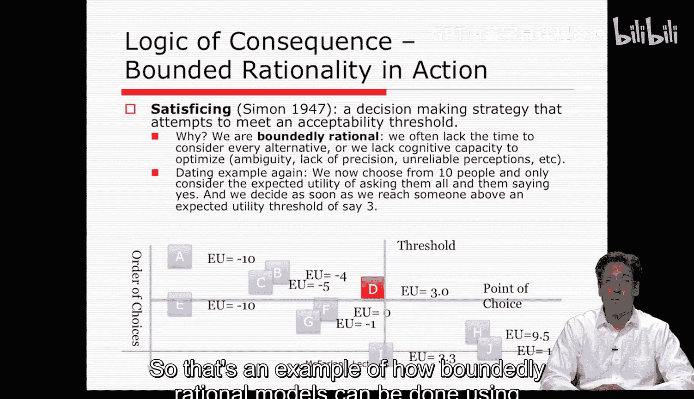
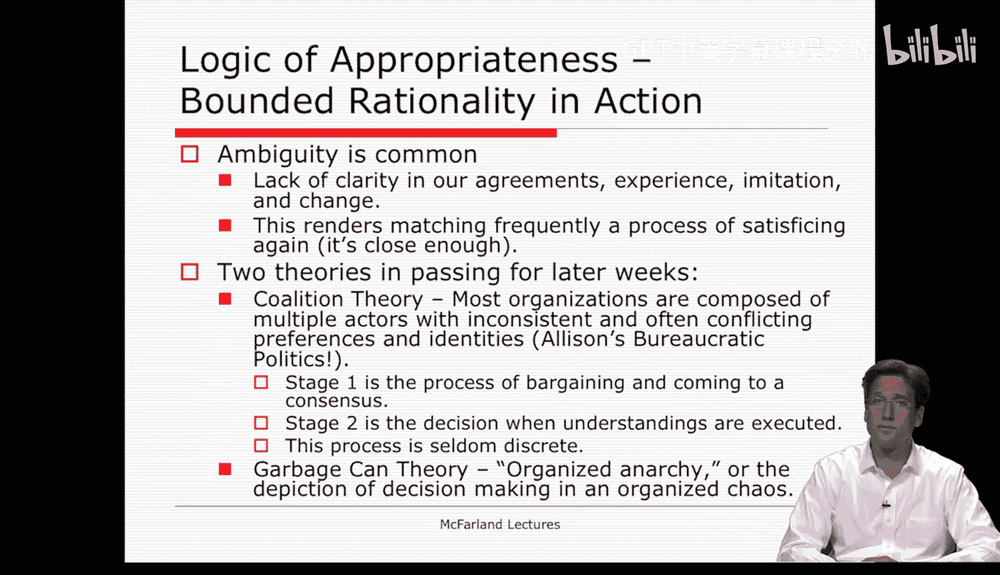

#  013：理性行动者模型 - 第二部分 🧠

在本节课中，我们将要学习理性行动者模型的另一种形式——有限理性模型，并探讨决策的另一种逻辑：适当性逻辑。我们将了解人们在实际中如何做出“满意即可”的决策，以及组织中的规则遵循行为。

---

## 有限理性模型是怎样的？

上一节我们介绍了完全理性模型，本节中我们来看看当理性受到限制时，决策过程会如何变化。

在有限理性模型中，行动者对后果和成本并不确定。此外，偏好的排序也不那么清晰。赫伯特·西蒙提出了“满意即可”理论作为一种潜在的替代方案，它可能更准确地描述了我们作为有限理性的人通常如何做决策。

我们不会计算所有备选方案，而是从最接近我们的一个方案开始。例如，我们不会每天都计算同样的方程式，也不会逐一考虑所有可能的约会对象。我们会设定一个阈值或遵循某种决策习惯，并坚持下去。

因此，我们可能会说选择“足够好”，并在顺序搜索选项的过程中在某个点停止。但如果未达到我们的阈值，我们会转向列表中的下一个选项，选择下一个最接近的。搜索是由未能达成目标所驱动的，并会持续探索备选方案，直到找到一个足够好的方案来满足它。

---

### 一个“满意即可”的决策示例

以下是使用“满意即可”逻辑进行有限理性决策的一个例子。让我们再次以约会为例。

假设我们必须从10个不同的人中选择，并考虑邀请他们所有人且他们都说“是”的期望效用。我们设定一个期望效用阈值，例如3。一旦我们遇到某个人的期望效用达到或超过3，我们就做出选择。

在下图中，我们可以看到这个阈值用垂直线标出。我们从A开始顺序查看，A的分数最低，B和C也不够好。当我们到达D时，它达到了阈值（3），足够好了，于是我们停止搜索。这就是一个“满意即可”的决策。

当然，因为我们没有遍历所有选项，所以没有实现决策最优化。如图所示，如果我们选择了底部的H或J，可能会获得更高的效用和更优的选择，尤其是期望效用最高的J。

---

## 决策的第二种逻辑：适当性逻辑

到目前为止，我们讨论的都是后果逻辑或理性行动者模型。但吉姆·马奇提出了第二类决策模型，他称之为**适当性逻辑**。

在组织中，大多数时候人们遵循规则，即使这样做显然不符合他们的个人利益。例如，士兵在战争中服从命令走向死亡，我们很难从中看到任何个人效用。这显然是遵循某种责任或规则的形式。

然而，组织内的许多行为似乎都遵循这种逻辑。在组织中，我们完成指定任务、执行例行程序、遵守专业标准和规范、执行标准操作程序，这些都是我们在组织中职能的一部分。当组织面临问题或议题时，它通常变成寻找应遵循的适当规则的问题，而不是根据后果来评估备选方案。

规则遵循是将情境与身份相匹配。让我们花点时间更详细地思考一下这涉及什么。

---

### 规则遵循决策的三个要素

规则遵循和适当性逻辑决策主要涉及三个因素：

1.  **决策被归类到与规则和身份相关的类别中。** 我们会问：这是什么类型的问题？通常由谁处理？过去是如何处理的？
2.  **决策者拥有在特定情境中被唤起的正式身份和规则。** 通常由谁处理这类事情？谁是处理这个问题的合适人选？
3.  **决策者将规则与他们认为在其角色分类情境中适当的内容相匹配。** 也就是说，他们将规则和身份与情境类型相匹配，他们会说“这是一个应由Y类人员管理的X类情境”。

这与格雷厄姆·艾利森在其案例中谈到的匹配推理模式类似，类似于他描述的组织过程模型，当然并不完全相同，但很相似。你在阅读时会看到这些相似之处。

---

### 适当性逻辑在组织中的体现

当有人遵循传统、直觉、文化规范、建议、既有规则和标准操作程序时，我们就能注意到适当性逻辑在组织决策中的应用。我们甚至在启发式方法中也能看到它们。它们无处不在。

这显然是第二类决策，它同样具有意图性，但较少关注后果，而更关注为情境匹配规则和身份。

---

## 两种逻辑的对比与复杂性

通过规则进行决策与通过计算进行决策一样存在模糊性。在这里，模糊性或不清晰之处不在于后果和偏好，而在于我们的共识和经验。你我的体验可能不同，我们的共识也可能并非双方所想。

此外，这里的决策过程更少是有意识的。匹配是某种程度上有意和理性的，但通常是在潜意识中完成的，我们常常将其视为理所当然。在许多情况下，我们不会反思其预期行动。

这引出了意义建构的问题，即决策是否真的更少关乎后果，而更多关乎创造意义。这里我们提到了解释性方法和组织文化，即人们遵循信念，而非手段和理性计算。

使用适当性逻辑进行决策的主要产物，可能不是决策结果，而是实际的决策过程本身——它确立了个体及其社会意义。因此可以说，解释组织动态的决策过程理论表明，它们并非出于改善后果的原因而产生，而是为了参与一个有意义的进程并驾驭它。

---

### 多行动者带来的复杂性

吉姆·马奇还指出，当考虑到大多数组织由多个行动者组成，且这些行动者具有不一致且常常冲突的偏好和身份时，这两种逻辑会变得更加复杂。

此时，联盟理论开始发挥作用，谈判和讨价还价过程也是如此。个体间的这种互动类似于你将在古巴导弹危机案例中读到的艾利森的官僚政治模型。马奇认为，这存在一个两阶段的决策过程：

1.  第一阶段是讨价还价和达成共识的过程。
2.  第二阶段是决策以及人们共享的理解最终被执行。

不幸的是，这两个阶段很少是离散的。存在许多复合的决策时刻，共识可能增强、减弱甚至瓦解，即使在人们最终决定行动时也是如此。决策系统的设定与实施常常交织在一起。因此，联盟的世界不是精确和正式的世界，而是非正式、松散的理解和期望的世界。

---

## 时间顺序与有组织的无政府状态

最后，马奇在提及时间顺序时，引用了**有组织的无政府状态理论**或**垃圾桶理论**，它描绘了在流动形式或有组织的混乱中的决策。这是我们将在课程第四周涵盖的内容。今天我只是顺带提及这些关于联盟和有组织无政府状态的独特理论，但请注意它们，因为我们将在未来两周再次讨论。

---

本节课中我们一起学习了有限理性模型下的“满意即可”决策逻辑，并深入探讨了与后果逻辑并行的另一种重要决策范式——适当性逻辑。我们了解到，组织中的决策不仅关乎计算后果，也常常关乎匹配身份、遵循规则和建构意义。同时，多行动者间的互动和复杂的时间顺序为决策过程增添了更多层次，引出了联盟理论和有组织的无政府状态等更深入的议题。