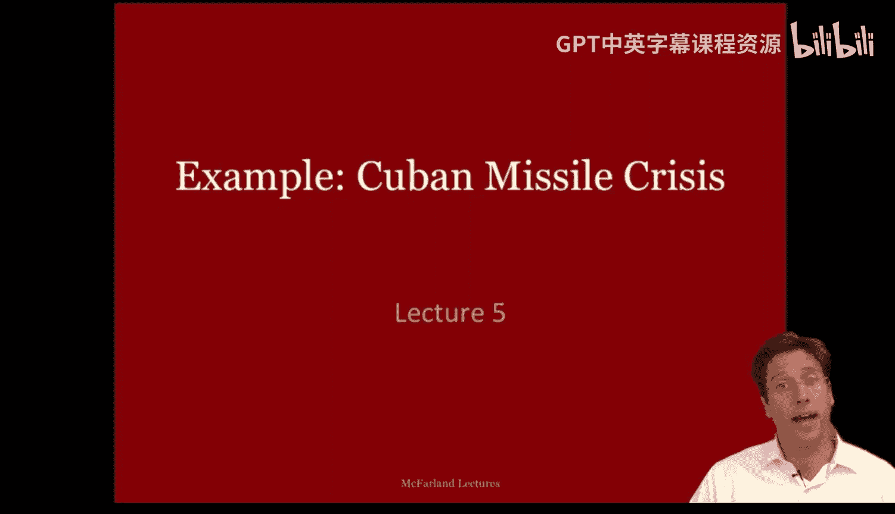
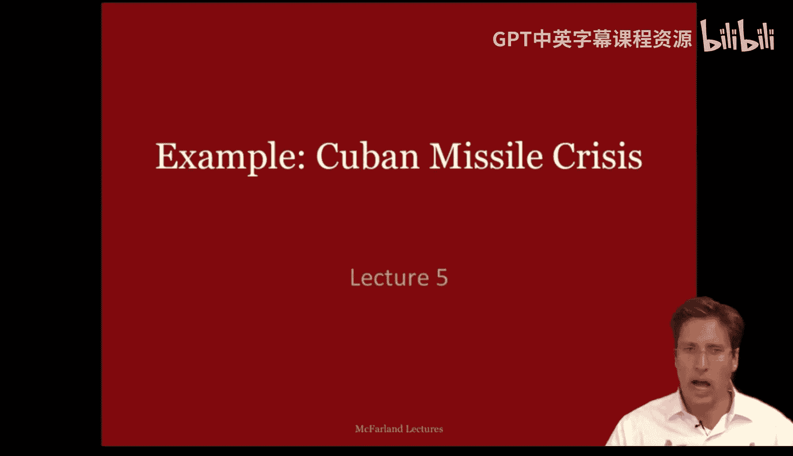
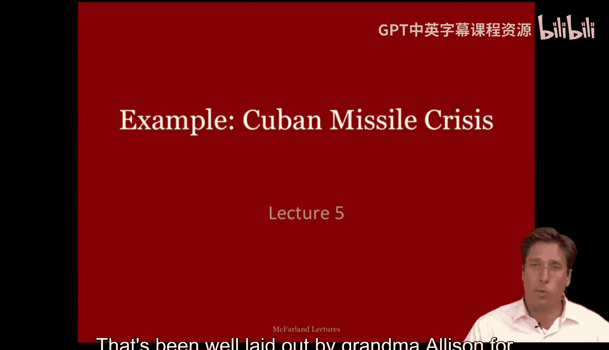
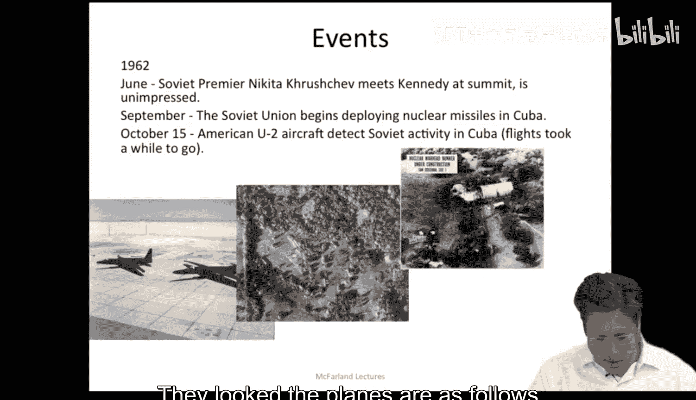
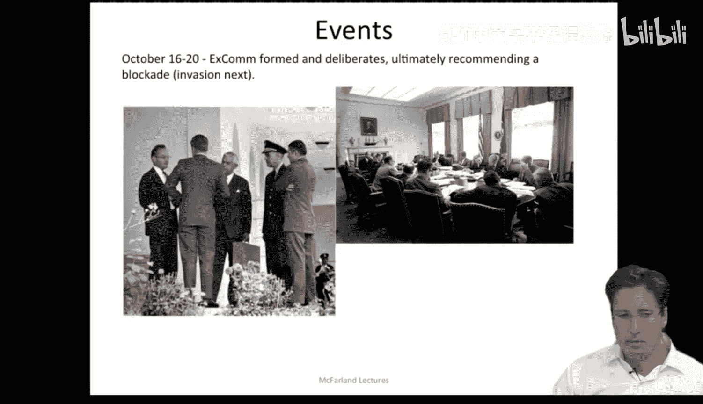
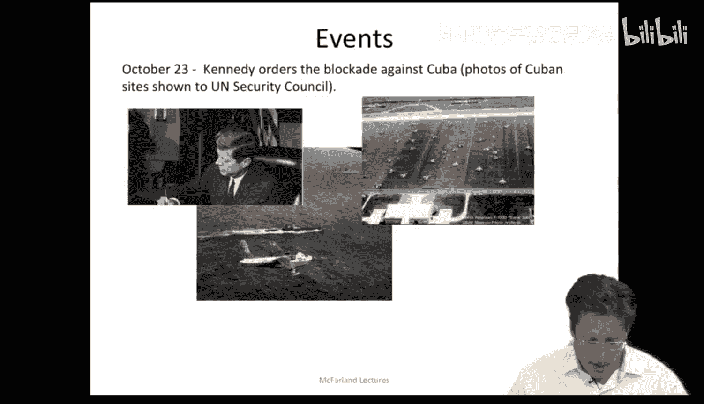
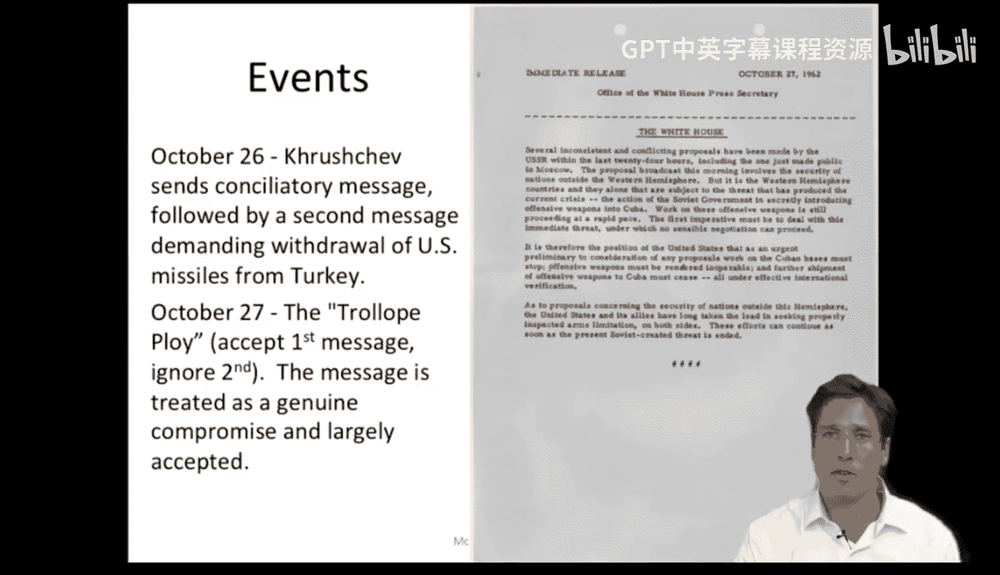

#  014：古巴导弹危机 - 第一部分 🚀

在本节课中，我们将学习如何运用组织理论分析真实世界的危机事件。我们将以格雷厄姆·艾利森对古巴导弹危机的研究为例，探讨在高压决策环境下，组织是如何运作和应对的。

上一节我们介绍了马奇的逻辑以及文化、联盟和无序决策环境等概念。本节中，我们来看看艾利森如何运用这些框架分析古巴导弹危机。

## 为何选择古巴导弹危机？🤔

古巴导弹危机是一个典型的政策决策环境，但它具备许多适用于非营利组织和政府机构的优良分析特质。事实上，危机管理是许多组织的常见挑战。在许多情况下，政策和决策的利害关系极为重大。

以下是几个例子：
*   在美国，旨在提升教育水平的“不让一个孩子掉队”大规模政策，就给学校带来了资金危机。
*   组织内部的骚扰与申诉指控。
*   组织内部的自杀与死亡事件。

在这些情况下，组织该如何应对？我们如何描述事件经过与人们的反应？人们是否遵循了某种合理的程序？我们如何才能在这些情况下成功管理？古巴导弹危机为我们提供了一个绝佳的分析范例。

## 危机背景与重要性 ⚠️

格雷厄姆·艾利森为我们清晰地剖析了这一案例，使我们得以展开讨论。古巴导弹危机是一个重大事件，它可以说是人类最接近第三次世界大战的时刻，当时可能造成超过一亿人的死亡。事实上，时任美国总统约翰·肯尼迪曾估计，在那次事件中失败的可能性高达三分之一甚至二分之一。这对大多数人来说都过于惊险。

正因如此，分析家们希望了解国家政府及其组织如何驾驭危机。他们希望更好地理解如何预防未来的灾难，并可能更有效地管理此类危机。

## 古巴导弹危机事件回顾 📜

让我简要回顾一下古巴导弹危机，以防有人不熟悉它。我们将要讨论的事件发生在1962年，它导致美国进入了有史以来最高的战备状态，而苏联战地指挥官也已准备好使用战术核武器保卫古巴，如果其遭到入侵的话。幸运的是，战争得以避免。

一些背景信息或许对你有帮助：1962年时，苏联导弹只能覆盖欧洲，而美国导弹可以覆盖整个苏联，因此当时美国处于优势地位。在一次峰会上与肯尼迪会面后，苏联领导人尼基塔·赫鲁晓夫认为肯尼迪作为政治家的能力有限，并认为自己可能在某种对抗中占据上风。

因此，在1962年4月，赫鲁晓夫开始考虑在古巴部署中程导弹，以威慑美国对苏联的潜在攻击，并服务于其缓和紧张局势的利益。另一方面，古巴的菲德尔·卡斯特罗则担心美国会再次发动攻击（此前1961年猪湾入侵已失败）。卡斯特罗批准了赫鲁晓夫在岛上部署导弹的计划，并将其视为阻止美国入侵古巴的威慑力量。于是，双方在某种程度上同意推进此事。

1962年夏，苏联开始秘密在古巴建设导弹和设施。美国的危机始于1962年10月15日左右，当时美国U-2侦察机拍摄到苏联在古巴正在建设的导弹，侦察照片类似屏幕上展示的这样。当肯尼迪总统获悉这些设施后，他召集了所谓的“执行委员会”，这是一个由约15名最重要的顾问组成的团体。

以下是执行委员会的关键成员：
*   罗伯特·肯尼迪：司法部长
*   迪安·腊斯克：美国国务卿
*   乔治·鲍尔：副国务卿
*   约翰·麦康：中央情报局局长
*   麦乔治·邦迪：国家安全顾问
*   罗伯特·麦克纳马拉：国防部长（在会议中是一个非常强势的重要人物）
*   卢埃林·汤普森：无任所大使，前美国驻苏联大使，委员会中唯一的俄罗斯问题专家

执行委员会召开了数日会议（七天），肯尼迪决定在会议期间对古巴实施海上封锁。

10月22日，肯尼迪向公众宣布发现了导弹设施，并决定封锁该岛。这里展示的是他写给赫鲁晓夫的信，表达了他对事态发展的不满。

10月23日，肯尼迪下令实际执行对古巴的封锁。他还宣布，任何从古巴发射的核导弹都将被视为苏联对美国的攻击，并要求苏联从古巴撤走所有进攻性武器。如图所示，你可以看到封锁令、肯尼迪签署该命令，以及为防止反击或对美国及佛罗里达州的某种攻击导致炸弹一次性摧毁所有飞机，而分散停放在跑道上的飞机。

10月23日，赫鲁晓夫致信肯尼迪，称封锁构成了侵略行为，将人类推向世界核导弹战争的深渊。

10月24日，苏联船只掉头远离封锁线，用迪安·腊斯克的话说，双方是“眼对眼”的较量。10月25日，封锁线被进一步推向公海，因为肯尼迪及其海军指挥官担心失误，以及登船检查任何可能引发核战争的船只。因此，当时局势非常紧张。肯尼迪在25日将军事戒备状态提升至二级防御状态。

10月26日，执行委员会收到赫鲁晓夫的一封信，提议如果美国能保证不入侵古巴，苏联将撤走导弹和人员。

10月27日，一架U-2飞机在古巴上空被击落，执行委员会收到赫鲁晓夫的第二封信，要求以撤走美国在土耳其的导弹作为交换，撤走苏联在古巴的导弹。此时，“特罗洛普策略”被采用，即美国回应第一封信，接受其条件，双方基本就此达成一致。因此，这是一种有趣的策略和妥协交易，试图在局势中获取优势。

10月28日，当赫鲁晓夫公开宣布将拆除设施并将导弹运回苏联时，紧张局势有所缓解。他表示相信美国不会入侵古巴。随后进行了进一步谈判以落实10月28日的协议，在此期间，美国秘密撤走了在土耳其的导弹。这里展示的照片记录了实际观察和记录导弹撤走的过程。

本节课中，我们一起学习了古巴导弹危机的基本背景、关键事件时间线以及决策核心团队。通过这个案例，我们看到了在极高风险和组织压力下，决策过程的复杂性与动态性。下一节，我们将深入探讨艾利森用以分析此危机的三个经典模型。