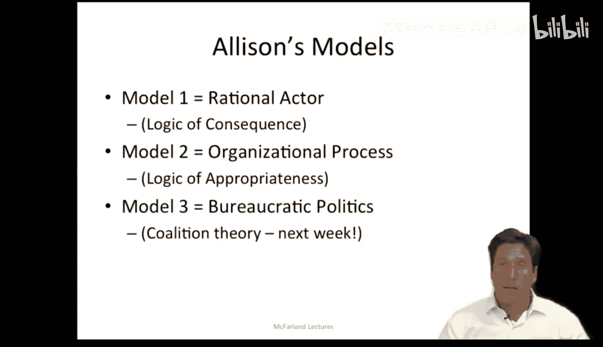
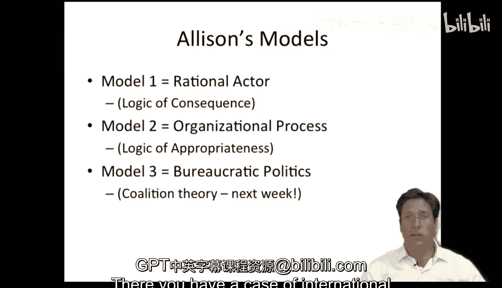
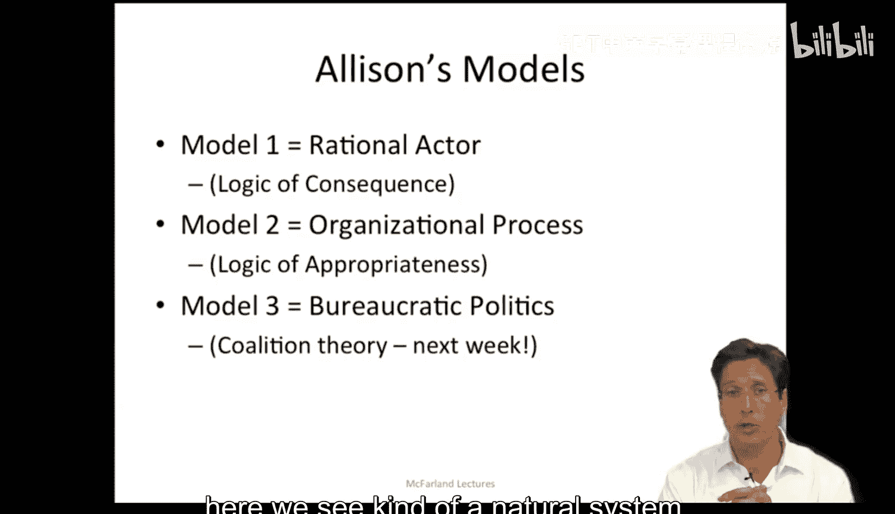
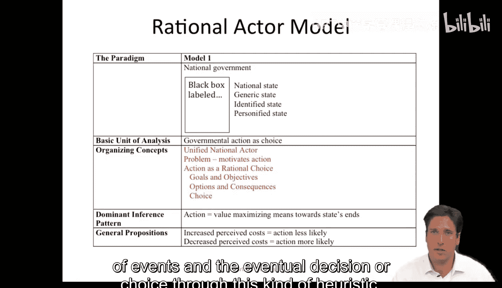
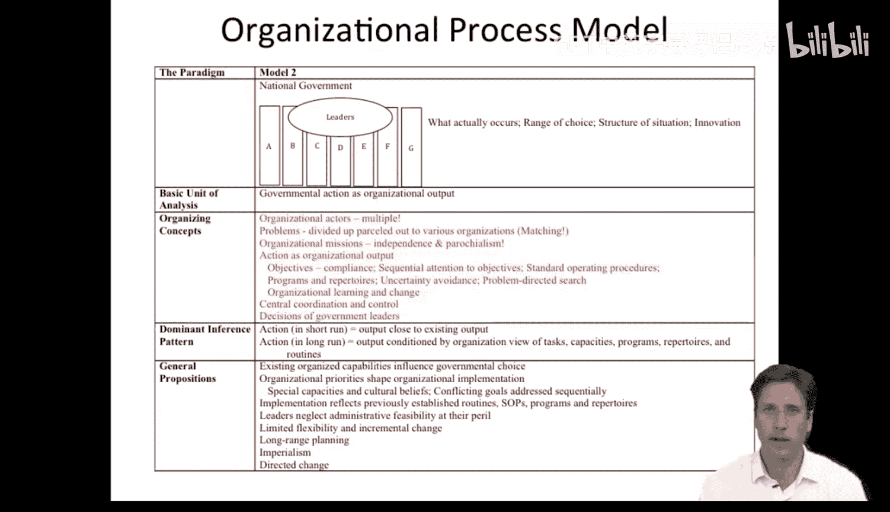
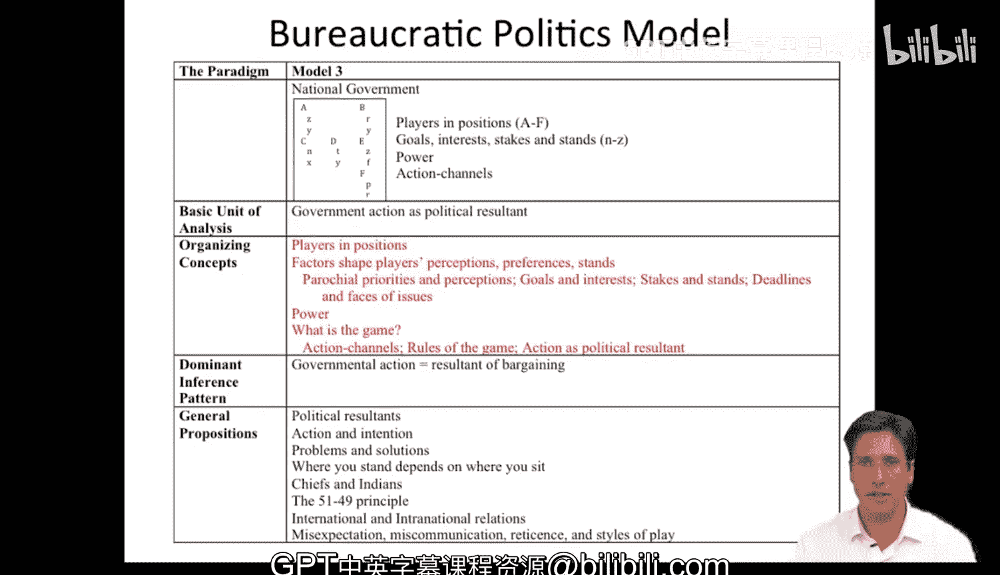

#  015：古巴导弹危机案例（第二部分）📚

在本节课中，我们将学习如何运用三种不同的理论模型来分析古巴导弹危机这一国际争端。通过对比理性行为者模型、组织过程模型和官僚政治模型，我们可以从多个视角深入理解危机中的决策过程与行动逻辑。

---

## 理性行为者模型：基于后果逻辑的分析🔍

上一节我们介绍了古巴导弹危机的背景。本节中，我们来看看第一种分析模型——理性行为者模型。该模型假设每个行动背后都有明确的目的或目标，我们据此重构行动，认为行为者是具有意图的。

以下是理性行为者模型的基本组织概念：

*   **行动者**：被视为统一的整体（如国家）。
*   **问题**：引发行动的动机。
*   **行动**：被视为理性选择。

根据艾利森的分析，我们可以将美国在危机中的行动选择分解如下。其核心目标是**国家安全**，需要评估各种选项及其后果。

以下是美国当时考虑的主要选项及其潜在后果：

1.  **无所作为**：代价是苏联可能绕过早期预警系统，逆转美国的权力优势，并导致美国在欧洲信誉扫地。
2.  **外交回应**：代价是联合国安理会可能因苏联拥有一票否决权而无法通过决议，且导弹已部署，时间紧迫。
3.  **接触卡斯特罗**：代价是导弹实际由苏联控制，卡斯特罗的影响力有限。
4.  **入侵古巴**：代价是苏联可能以入侵柏林作为报复，或可能发动核打击。
5.  **空袭**：代价是由于导弹分散在全岛，摧毁所有核武器的概率仅为90%，且极可能招致报复，需要大规模打击，风险极高。
6.  **封锁（海上隔离）**：代价是苏联可能对柏林实施反封锁；好处是能争取时间，让赫鲁晓夫思考核战争的可能性，且在加勒比海的 naval engagement 对美国有利。

如果绘制所有这些选项的决策树并寻求**价值最大化**，结果显示封锁是最优解。原因在于，即使“末日决战”（核战争）发生的概率极低，但其代价过高，理性行为者也不会选择它。通过这种启发式方法，理性行为者模型为我们解读事件序列和最终决策提供了一种视角。

---

## 组织过程模型：基于适当性逻辑的分析🏛️

理性行为者模型关注统一的国家目标与后果计算。然而，现实中的决策往往由多个组织共同执行。本节我们将探讨组织过程模型，它基于**适当性逻辑**，强调组织会按照其既定身份和标准操作程序来应对问题。

在此模型中，行动者并非单一实体，而是由松散联盟的组织构成的**星座**。问题不会被整体处理，而是被**分解并分配**给各个组织。组织是有限的问题解决者，它们依靠经验和已发展起来的能力行事。

以下是组织过程模型的核心要素：

*   **组织目标**：可视为定义可接受绩效的约束条件。
*   **标准操作程序**：组织反复训练和遵循的既定惯例。
*   **项目**：由标准操作程序组成的集群。
*   **不确定性规避**：组织倾向于忽略细节，通过系统化接触和常规化手段处理信息，这可能导致信息失真。
*   **问题导向的搜索**：由组织惯例引导，具有局部聚焦性。
*   **协调与控制**：协调不同组织执行各自标准操作程序是一大挑战。
*   **高层管理者的角色**：根据此模型，他们仅仅是**调用**不同组织及其标准操作程序。

这些术语可能有些抽象，让我们通过具体例子来理解。

例如，关于发现导弹的报告花了很长时间才送达总统。信息淹没在大量不准确情报中，传递过程漫长，因为人们遵循了组织内的标准操作程序。具体时间线是：9月12日首次发现迹象，9月19日信息提示导弹存在，10月4日认为导弹确实存在。随后，空军与中央情报局就由谁执行飞越侦察发生管辖权争议，加上飞机机械故障延误，直到10月14日的飞行才最终确认导弹存在并报告总统——整整**浪费了一个月**。

另一个例子是，执行委员会（Excom）的成员在会议中充当各自组织的代表发表意见。例如，空军代表主张空袭，海军代表主张封锁。但空军无法保证100%成功（仅90%），而海军在执行封锁时，按照其训练惯例将封锁线设在距古巴500英里处，而非总统命令的180英里处，即使在总统发怒后也难以立即更改。简而言之，海军遵循了其**标准操作程序**。

因此，在此类事件中，相当一部分行为是由组织按其常规行事所引导的。

---

## 官僚政治模型：权力博弈与联盟动态⚖️

组织过程模型揭示了组织惯例的影响，但决策核心还涉及人与人之间的博弈。本节我们来看第三种模型——官僚政治模型。它将政府视为由多个行动者组成的集合，各自有不同的问题和目标。

该模型提出以下关键问题：
*   选择与结果是随时间展开的**讨价还价游戏**的产物吗？
*   **权力与技巧**是否发挥了作用？
*   是否存在**妥协**？
*   当时进行着哪些**不同或重叠的游戏**？
*   在这些事件中，谁是领导者、追随者、参谋人员和临时参与者？

在古巴导弹危机中，存在**多个参与者**，他们拥有不同的认知、优先事项，并关注不同的问题。例如，空军和陆军对原子弹的看法截然不同：空军视其为积极工具，而陆军可能因其需要承担后续地面行动而视其为消极因素。所有这些参与者都为这个“拼图”贡献了一块，并随时间推移被组合成不同的安排和结果。

官僚政治模型的一个关键特征是**杠杆点**、**个性**以及为达成政治结果而形成的**各种利益联盟**。人们如何谈判、提出主张、阻挠或推动主张，决定了这些临时协议如何产生并最终迫使决策形成。

为了具体说明，让我们看看主要行动者及其立场：
*   **肯尼迪总统**：他的弱点是1961年猪湾入侵的惨败。他有**局部利益**——希望连任，不能再在古巴问题上显得软弱或失败。
*   **军方**：希望一雪猪湾之耻并取得成功。

由此，在事件进程中形成了两种主要的**联盟**：一个围绕“封锁”决策形成，另一个围绕“空袭”决策形成。当国务卿指出可能导致“末日决战”时，总统、其弟罗伯特·肯尼迪、国防部长麦克纳马拉等人支持封锁，形成了一个集团。相反，参谋长联席会议成员等六人则主张空袭。后一个联盟因无法保证成功、存在报复风险以及肯尼迪担心重演珍珠港事件（也是一种局部关切）而瓦解。

因此，官僚政治模型假设存在多种观点，它们在不同阵营中结盟，这些阵营相互博弈，最终产生了我们所看到的结果。

---

## 总结与回顾🎯

本节课中，我们一起学习了运用三种理论模型分析古巴导弹危机：
1.  **理性行为者模型**：将国家视为统一实体，通过**后果逻辑**和**价值最大化**来解释选择封锁的决策。
2.  **组织过程模型**：将行动视为多个组织遵循**适当性逻辑**和**标准操作程序**的输出，解释了信息延误和执行偏差等现象。
3.  **官僚政治模型**：将决策视为不同利益方**权力博弈**和**临时联盟**的结果，揭示了肯尼迪个人政治考量与军方不同派系斗争对最终决策的影响。

通过将不同理论应用于同一现象，我们得以从多重视角获得更深入的理解，这对于政策专家和危机参与者都具有重要的启示意义。