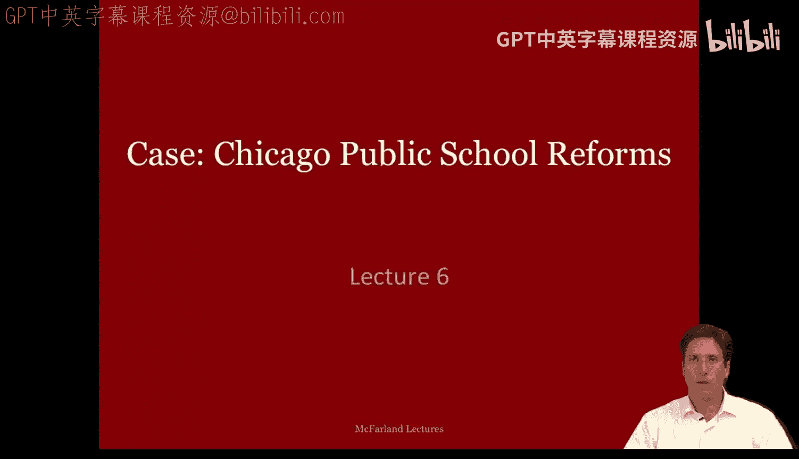
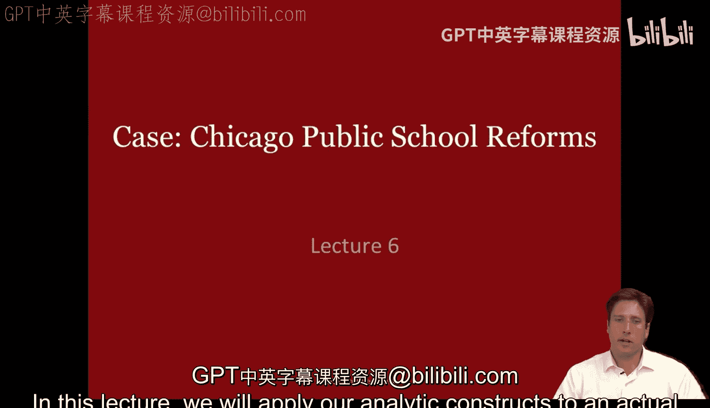
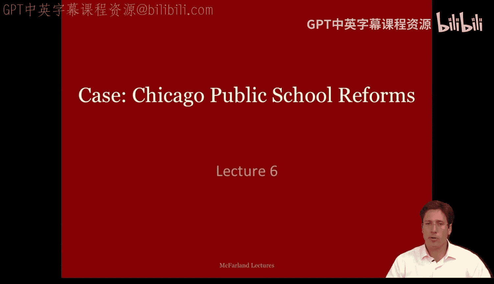
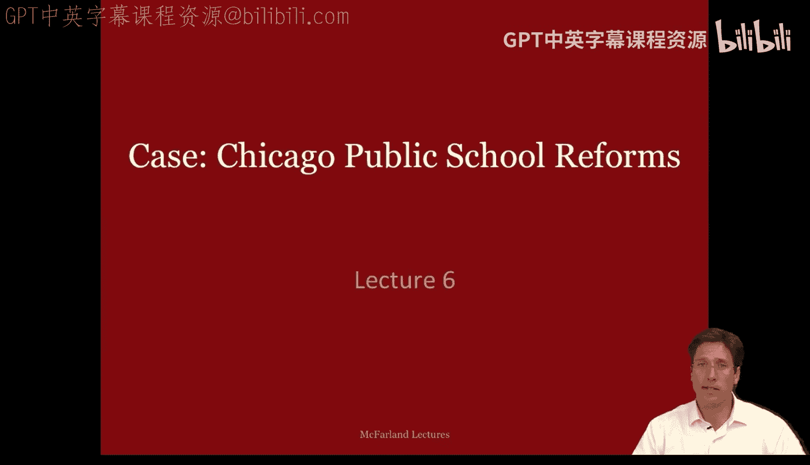
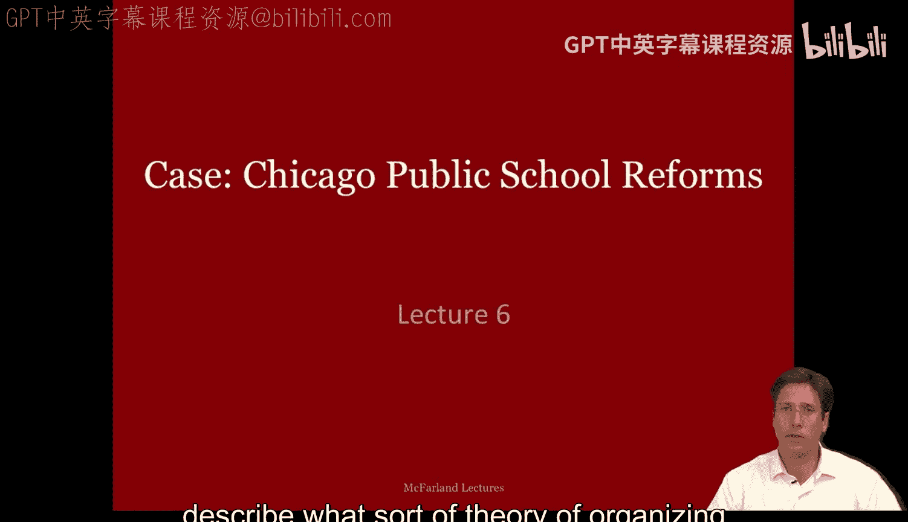
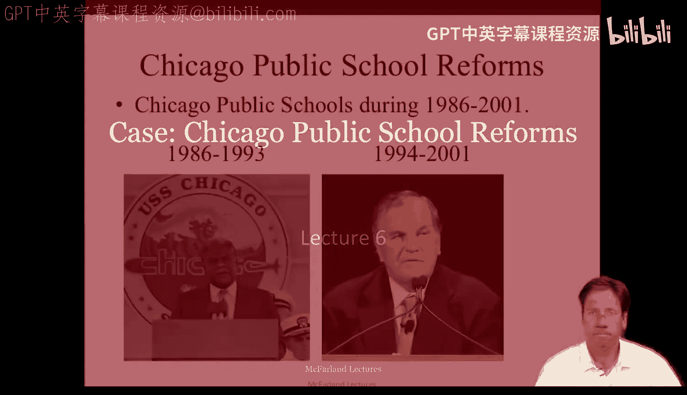
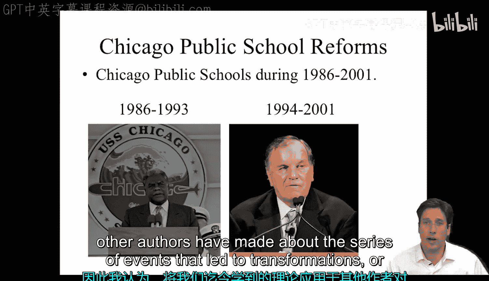
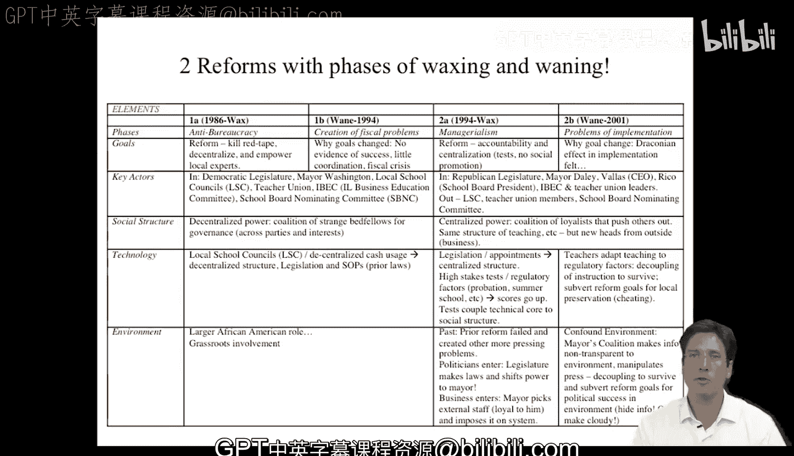

#  017：芝加哥公立学校改革 - 第一部分 🏫

在本节课中，我们将把之前学到的分析框架应用到一个真实的组织改革案例中。我们将通过回顾芝加哥公立学校在1986年至2001年间的改革历程，来识别并理解其中的组织要素及其相互作用。

---

## 课程概述与案例背景

上一节我们介绍了组织分析的核心要素。本节中，我们来看看如何将这些要素应用于一个具体的案例。

我将要讨论的案例，关注的是1986年至2001年间的芝加哥公立学校。它跨越了两位不同的市长任期：早期的华盛顿市长和后来的戴利市长。随着这两次改革的进行，情况发生了转变。

我认为，将我们目前所学的理论应用到其他作者对导致芝加哥公立学校转型的一系列事件的阐述中，你会获得深刻的见解。我所依据的案例材料是多萝西·希普斯和安东尼·布莱克的阅读材料，它们基本上涵盖了整个时期。

正如你将看到的，这两次改革努力经历了一个兴衰周期。在每个时期的开始，联盟、团体或组织会兴起并试图实施改革，而在实施过程中，你会看到这种势头逐渐减弱，进入一个各种问题涌现并导致转变的新时代。

发生的基本变化是：最初的努力是反官僚主义，随后转向建立管理主义或问责制。这两个阶段被提出作为解决芝加哥学校低成就问题的不同手段。

该案例涉及关键的利益相关者和团体、他们的利益与关系，以及他们的反应。两份阅读材料都详细阐述了这些特征，使我们能够在一定程度上看到，我们的不同模型或理论如何被应用或帮助我们理解所发生的事情。

因此，这是一个尝试应用我们分析框架和理论的绝佳案例。

---

## 第一阶段：华盛顿市长时期（反官僚主义）

让我们从华盛顿市长执政的第一阶段开始。

这里我制作了一个简表，列出了案例中描述的两个兴衰时期的关键组织要素。

第一阶段的核心是关于反官僚主义。所谈论的目标是：**消除繁文缛节、下放权力、赋能本地专家**。在这一改革阶段的后期，出现了其他问题，例如财政问题。实际上，人们开始质疑这些消除繁文缛节和赋能本地专家的改革是否真的有效。因此，改革势头减弱的原因是：人们逐渐意识到几乎没有成功的证据，缺乏协调，以及一场财政危机促使人们努力寻求更高效的做事方式。

以下是此阶段的关键要素：

**关键行动者**
*   民主派立法机构
*   华盛顿市长（关键人物）
*   地方学校委员会（是实现权力下放和本地专家赋能的关键渠道）
*   教师工会（在芝加哥是一支强大的力量）
*   伊利诺伊州商业教育委员会（一个长期存在的商业领袖委员会，希望教育系统能为该地区的企业培养可用人才）
*   学校董事会提名委员会（负责提名校长等）

**社会结构**
这个时期的社会结构是**权力下放**的。治理联盟跨越了党派和利益，发生在地方层面的选区等地。这是芝加哥一个权力下放的时期。

**技术/任务**
为实现目标所采用的技术或任务是**治理或组织改革**。具体形式是地方学校委员会，并将资金使用权下放给这些委员会。那个时期引用的法规和标准操作程序也属于此类。

**环境**
这个时期的环境特点是：作为非裔美国人的华盛顿市长，**赋予了社区中的非裔美国人权力**，并且学校有**基层参与**。在这方面，这被认为是芝加哥的一次复兴。

---

## 第二阶段：戴利市长时期（问责制与集权）

在第二阶段，戴利市长在1994年至2001年期间执政。在经历了财政危机、效率低下以及缺乏学业进步证据等问题后，呈现出的总体形式是**推动问责制和集权**。他们不想仅仅为了让学生感觉良好而进行社会性升级，他们需要证据。因此，这一旨在创造改革新阶段的努力，转向了**管理主义或集权**，即商业领袖和组织管理专家介入，试图以不同的方向引导公立学校系统。当然，在这个时期的末期，改革本身也遇到了问题。基层的基本反应是：实施产生了**严苛的效果**，教师和学校以适应新规定的方式，在某种程度上**违背了“无社会性升级”和“通过测试”等目标的精神**。

以下是此阶段的关键要素：

**关键行动者**
这个阶段的关键行动者发生了变化。立法机构不再是民主派，而是**共和党**。市长现在是**戴利市长**（继承了他也曾任市长的父亲的遗产）。现在有一位**首席执行官**，他们将学校权力集中到瓦拉斯（首席执行官）和里科（学校董事会主席）之下。伊利诺伊州商业教育委员会仍然存在，教师工会领导人也仍在。因此，一些参与者在权力和影响力方面发生了变化，部分原因是立法机构决定将权力交给戴利，而戴利指派了一位首席执行官来管理学区。这是一个远比地方学校委员会时期更加**集权**的结构，这导致某些参与者变得比以前更重要。当然，出局的是地方学校委员会，教师工会某种程度上也出局了，学校董事会提名委员会也是如此，他们的权力被削弱或绕过。

**社会结构**
如前所述，社会结构是**权力集中**。你有一个忠于这项事业的联盟，它将其他人排除在外。教学的基本结构仍然相同，教师从事教学工作，教育工作者负责实施，但现在**由具有商业培训背景的商业人士接管了行政管理**。论点是，这种可以引入教育系统的管理主义将改善它。

**技术/任务**
改变这种治理结构的技术或任务是**立法和任命**。州立法机构控制预算，并将预算权交给市长，并通过任命等方式让他负责。这是一种强加于系统的集权结构，旨在产生这种效果。因此，出现的情况是：高风险测试、监管因素（如对未达标学生进行留校察看、要求他们上暑期学校等）。当然，测试分数上升了，但测试也更多地与教学挂钩，教师开始“为考而教”。因此，出现了一些反应。这被认为是**将教育机构与领导层的努力重新耦合**，这些努力向下渗透到教学或指导的技术核心。

当然，在改革后期，教师适应了这些监管因素，并开始**颠覆改革目标**，以保护自己、他们的职业生涯、工作，甚至学生的自尊等。因此，你会看到教师在考试中作弊，看到学生反复参加考试，分数当然会提高。因此，关于系统是否适应了改革以便能够展示成功（即使是表面上的，甚至可能不真实），存在各种问题。

**环境**
我们可以将环境要素视为：过去有一次失败的改革，所以这是一次纠正的努力，以及紧迫的财政问题。因此，政治家介入处理这场危机，立法机构制定法律并将权力转移给市长。当然，商业界也介入，因为市长挑选外部人员，他们忠于他，他将这种行政单位强加于系统之上。

然而，随着时间的推移，在改革势头的减弱阶段，环境使事情变得复杂。市长的联盟**使信息对环境不透明**。他们声称成功，尽管有各种相反的证据。他们操纵媒体报道好消息，掩盖坏消息。这种**脱钩**是为了管理环境以求生存，即使在某些情况下并不真实，也是为了颠覆改革目标以获取政治成功（例如为了连任）。因此，他们在某些情况下使信息模糊，在其他不太有利的情况下则隐藏信息。

---

## 总结与模式分析

我们有了这样一个关于改革在两个时期兴起、衰落以及领导层转变的有趣叙述。

然而，如果我们思考一下，总体变化实际上是一种转变。这是一个示意图：左边（或我的右边）是一个**分权结构**（带有小星星的那个），右边是一个**集权结构**，它聚焦于特定的个人，每个人都向他汇报。这是许多组织改革努力中的典型现象：当出现危机或问题时，会努力**集中力量**；而当需要争取基层、社会、社区或环境中的团体合作时，则会**下放权力**以建立认同感。因此，这两种不同的努力真正揭示了实现改革的不同管理策略和努力。

当然，如果我们将所有这些阶段合并到一个表格中，这对像我这样的人，可能对你们中的许多人，都很有用。这是一个相当密集的表格，但它包含了叙述、行动者、目标、社会结构、技术和环境的所有特征。作为一名分析者，看到所有这些要素排列在一起是很有用的。

在本节课中，我们一起学习了如何将组织要素分析框架应用于芝加哥公立学校改革的实际案例。我们回顾了从华盛顿市长时期的反官僚主义、权力下放，到戴利市长时期的问责制与集权这两个主要阶段的转变。我们识别了每个阶段的关键行动者、社会结构、技术任务和环境因素，并看到了改革如何经历兴衰周期，以及不同管理策略（集权 vs. 分权）如何被用于应对危机和争取支持。这个案例生动地展示了组织理论在理解复杂现实变革中的应用价值。