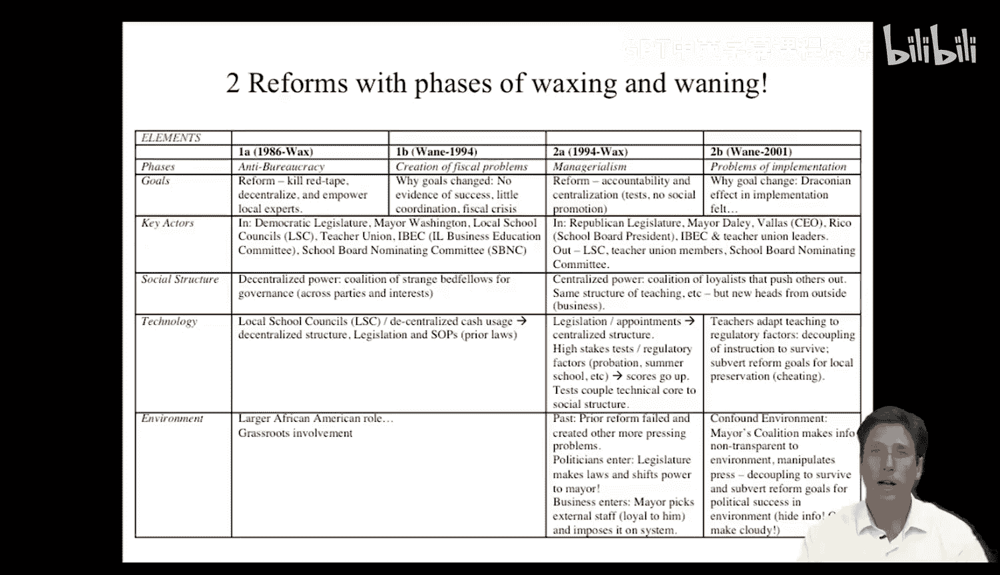
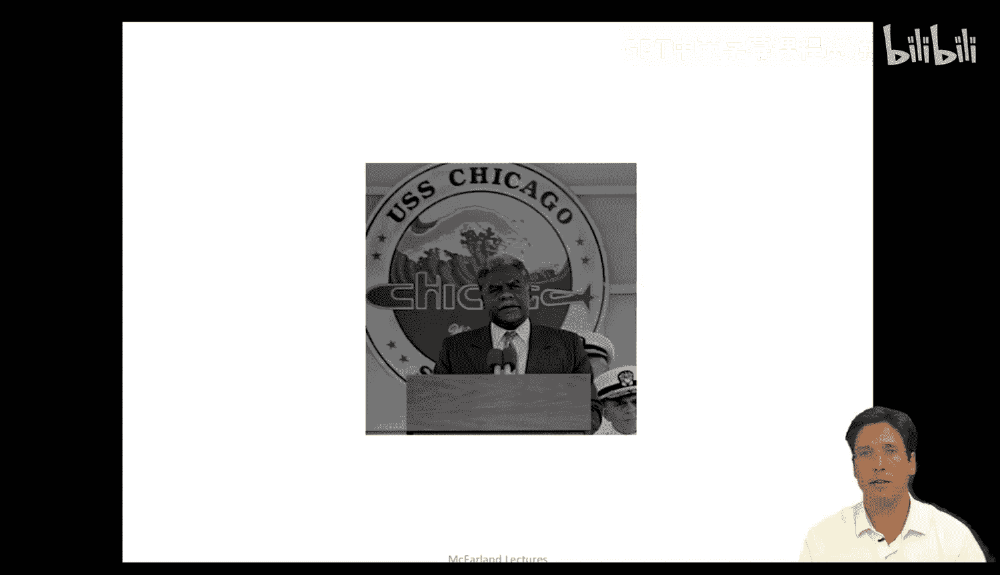
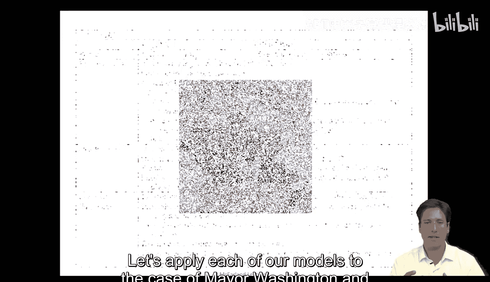
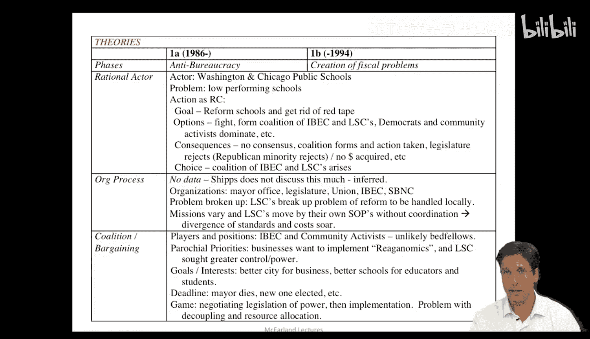
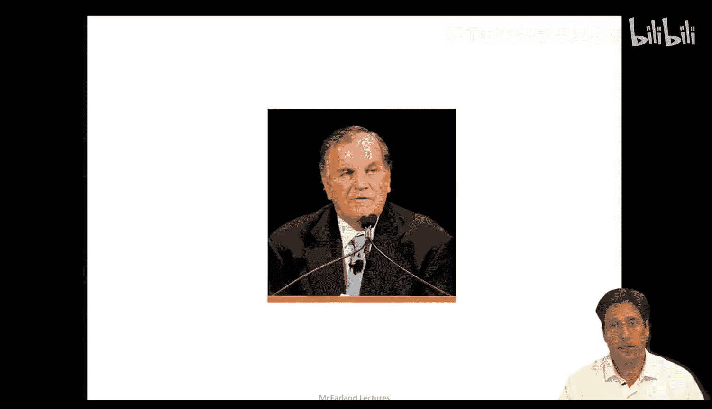
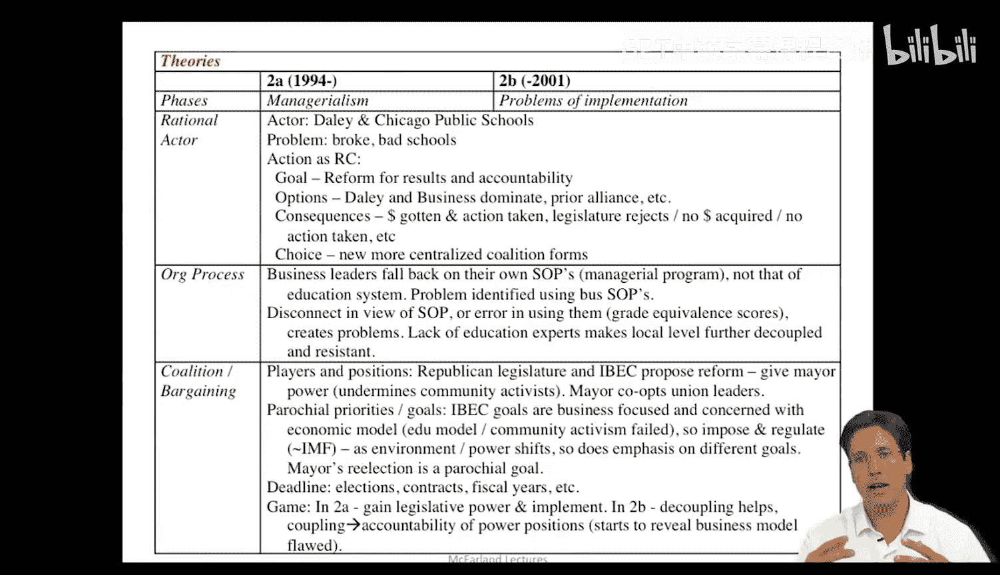
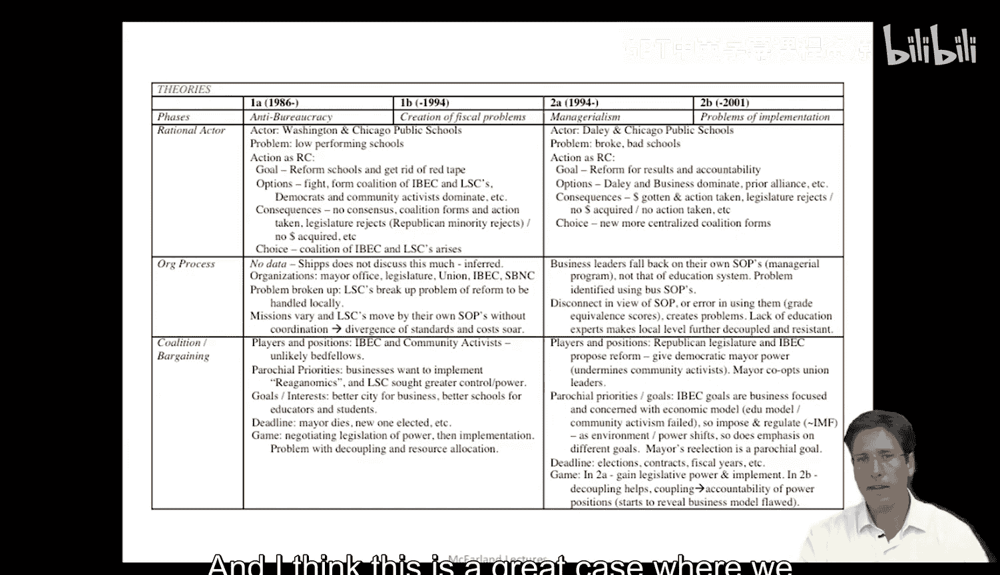
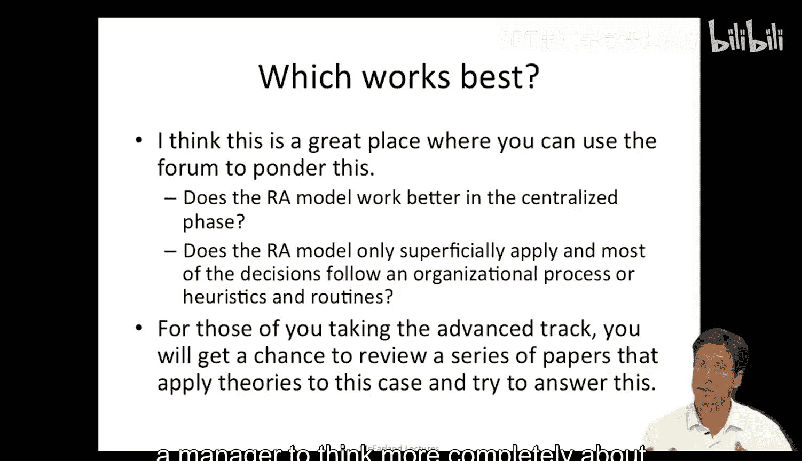

#  018：芝加哥公立学校改革 - 第二部分

在本节课中，我们将运用之前介绍的组织分析模型，对芝加哥公立学校改革的两个关键时期进行深入分析。我们将分别考察华盛顿市长时期和戴利市长时期的改革，并应用理性行为者模型、组织过程模型以及联盟与谈判模型来解读其中的决策与动态。

---

## 🗺️ 案例背景与组织要素回顾

上一节我们梳理了芝加哥公立学校改革案例中的关键组织要素。现在，让我们开始进行分析。首先，我们从华盛顿市长的第一个改革时期开始。

我们将把每一个分析模型应用到华盛顿市长的改革案例中。

---

## ⚙️ 华盛顿市长时期的模型应用

华盛顿市长的改革努力是集中化的。如果我们应用**理性行为者模型**，分析将聚焦于特定行为者，如华盛顿市长和芝加哥公立学校系统。

*   **核心问题**：学校表现不佳。
*   **目标**：改革学校，清除阻碍成绩提升和学校参与的繁文缛节（官僚作风）。
*   **可选方案**：
    *   不同利益集团（如立法机构与企业）为资源分配相互争斗。
    *   伊利诺伊州商业与教育联盟（IBEC）与地方学校理事会（LSCs）形成联盟。
    *   执政的民主党人与社区活动家形成联盟以主导局面。
*   **方案后果**：
    *   若集团间争斗，则无法达成共识，对各方均不利。
    *   若形成联盟（如IBEC与LSCs），可能更合理，但存在触怒当权立法机构等风险。
    *   若不与共和党少数派合作，可能无法获得资金拨款。
*   **模型洞察**：理性选择模型有助于解释为何IBEC与地方学校理事会会形成联盟。这种基层商业与社区的合作，作为一种反官僚的本地化努力，可能是避免共识破裂或单一集团独裁的最可行选择。

如果我们应用**组织过程模型**，情况则有所不同。案例细节未充分讨论标准操作程序，因此我们需要进行一些推断。

*   **涉及组织**：市长办公室、立法机构、工会、IBEC、学校董事会等。
*   **问题分解**：表现不佳的学校或低效的官僚作风问题被分解。地方学校理事会（LSCs）在本地层面处理和改革问题。
*   **模型洞察**：当问题被分散化并在本地协调时，每个区域会形成自己的处理方式，导致标准不一、成本上升，且跨区域协调变得困难。这种模式虽符合本地情境，但不一定构成高效解决方案。

接下来，应用**联盟与谈判模型**会提供另一个视角。

*   **参与者与立场**：IBEC（商业利益）与社区活动家（本地社区利益）本是看似不太可能的盟友，但他们围绕重塑芝加哥、创造更好学校和商业环境的共同利益形成了联盟。
*   **局部优先事项**：商业领袖希望推行“里根经济学”（减少政府干预），而地方学校理事会则寻求对其社区学校的更大控制权。两者优先事项相似但各有侧重。
*   **目标与利益**：共同目标是建设更利于商业的城市，为教育者、学生和家庭提供更好的学校。
*   **截止期限**：华盛顿市长的意外去世导致新选举，引发了权力格局和对问题认知的转变。
*   **博弈类型**：此期间存在多种博弈，如权力立法谈判、地方学校理事会的预算权实施等。权力分享的立法博弈可能有所准备，但对实施效果及联盟有效性的评估则准备不足。

---

## 🔄 过渡到戴利市长时期

华盛顿市长去世后，戴利当选市长，同时伊利诺伊州立法机构转为共和党控制，芝加哥还面临财政危机。这标志着改革进入以**管理主义**为核心的第二阶段。

---

## 📊 戴利市长时期的模型应用

在戴利时期，芝加哥公立学校系统更加**集权化**。应用**理性行为者模型**分析如下：

*   **核心问题**：学校资金匮乏，尽管有分权结构，但表现仍不佳。
*   **目标**：以结果和问责制为导向进行改革，提升学校质量。
*   **可选方案**：
    *   与商业领袖合作并主导改革。
    *   依赖之前地方学校理事会等的联盟。
*   **方案后果**：
    *   选择与商业领袖合作，可能获得资金并采取行动。
    *   若依赖旧联盟，立法机构可能拒绝其想法，导致无资金、无行动。
*   **模型洞察**：戴利显然需要做出不同的联盟或决策。选择与商业领袖建立更集权的联盟，推行比地方学校理事会更高效、更具管理性的问责制，是显而易见的选择。

应用**组织过程模型**，我们会看到不同的情况：

*   **组织惯例冲突**：商业领袖退回到自己熟悉的标准操作程序（即企业管理方法），并将其强加于教育系统。教育工作者不理解这些商业操作程序，而管理层顶端缺乏教育专家，导致理解脱节和惯例不匹配。
*   **模型洞察**：从组织角度看，这一时期不同组织（或来自不同领导者的组织惯例）之间的不匹配，有助于解释改革中出现的问题。

最后，**联盟与谈判模型**也凸显了某些关键点：

*   **参与者与权力变化**：共和党立法机构与IBEC提出改革并形成利益联盟，市长被赋予权力参与其中。这完全边缘化了社区活动家。
*   **动态的局部优先事项**：IBEC的目标是商业和经济模型，他们认为教育模型和社区行动已失败。但随着环境和权力结构变化（如选举），对不同目标的侧重也会动态变化。领导者的局部利益会随时间推移而凸显。
*   **截止期限的影响**：不同的选举、合同续签、财政年度预算周期等，对关系和利益产生阶段性的重大影响。
*   **博弈类型**：
    *   **初期**：博弈在于获取权力。立法机构希望通过改革集中权力，通过向市长提供资金来使其负责。
    *   **后期**：“脱钩”策略变得有用。当结果不符合问责模型时，相关方开始隐藏问题，试图通过媒体互动隐瞒信息，以维护自身利益（如市长寻求连任）。

---

## 📈 模型比较与总结

如果我们将模型并列比较，可以看出它们在不同时期如何提供各自的叙事。

那么，哪个模型最有效？这是一个值得深思的问题。芝加哥公立学校改革是一个绝佳的案例，让我们可以思考：

*   理性行为者模型在戴利时期的集权阶段是否更适用？
*   还是说理性行为者模型只是表面适用，大多数决策实际上遵循的是基于启发式和惯例的组织过程模型？

在本课程的高级部分，你将有机会审阅一系列将理论应用于此案例的论文，并看到作者们如何尝试回答这个问题。与其由我给出标准答案，不如留给大家去探讨。

尝试将这些理论应用到实际案例中，寻找支持某一理论的证据，或者论证这些理论可能在不同阶段、不同情况下起作用，甚至彼此互补，从而能更丰富地理解芝加哥公立学校改革如何兴起与衰落。这些视角也能帮助你作为一名管理者，更全面地思考问题，并为最好和最坏的情况做好计划。

---

**本节课总结**：我们一起运用了理性行为者、组织过程、联盟与谈判三种模型，分析了芝加哥公立学校改革在两个不同市长任期内（华盛顿的分散化、反官僚时期与戴利的集权化、管理主义时期）的动态。我们看到，每种模型都提供了独特的视角，解释了不同行为者的动机、组织惯例的冲突以及政治联盟的博弈。理解这些模型如何互补或适用于不同情境，是进行深入组织分析的关键。