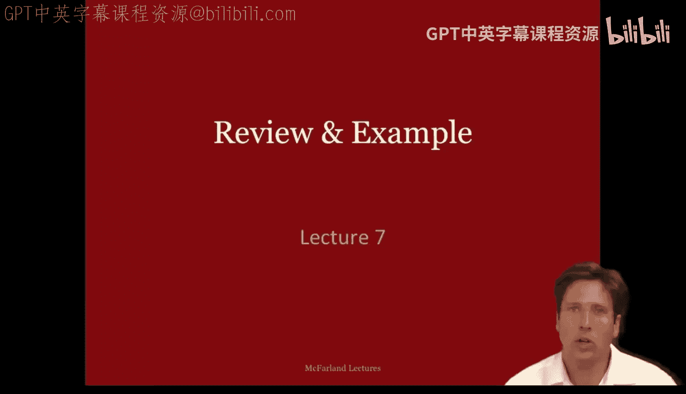
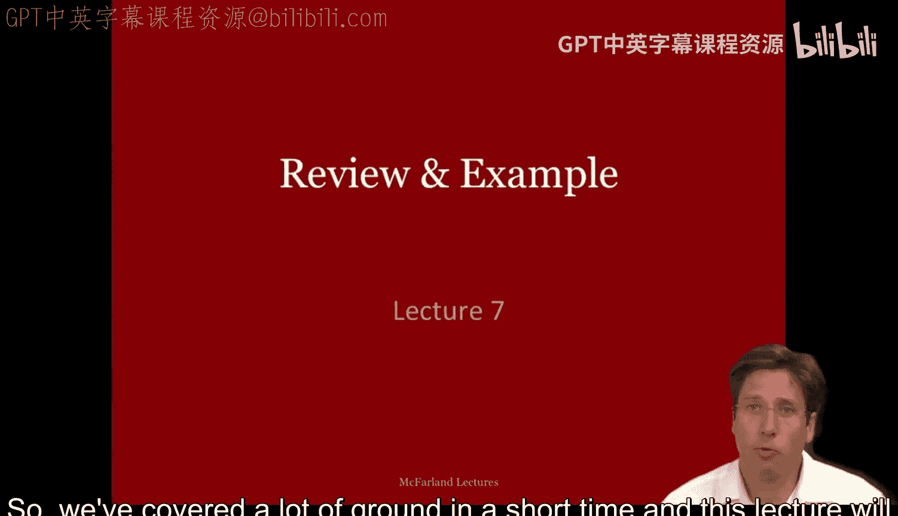
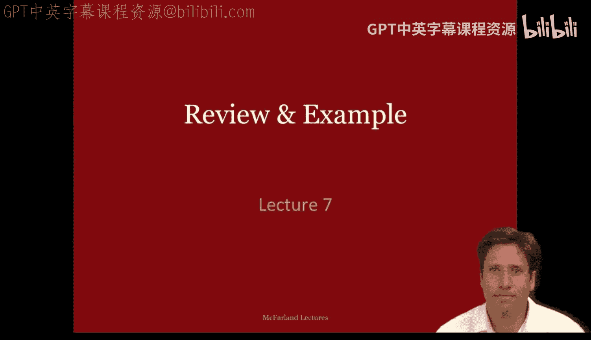
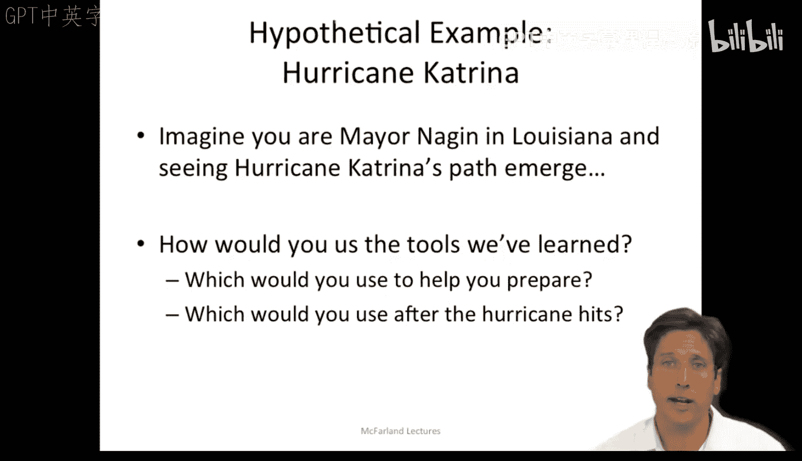

#  023：回顾与案例应用第一部分 🌀

在本节课中，我们将回顾已学习的三种组织分析理论，并通过一个具体案例——2005年袭击新奥尔良的卡特里娜飓风——来探讨如何应用这些理论。我们将分析每种理论所隐含的管理策略，并思考如何将它们作为工具来应对现实世界中的复杂危机。

---

在短时间内，我们已经学习了许多内容。本节课将简要回顾迄今为止所学的理论，并通过一个新案例来应用它们。

到目前为止，本课程涵盖了三种理论：**理性行动者模型**、**组织过程模型**和**官僚政治模型**。我们已经将这些理论应用于多个案例，例如亚当斯大道学校、古巴导弹危机以及20世纪90年代芝加哥公立学校的改革努力。

将这些理论并列比较，我们可以看出它们之间的异同。旁边的表格总结了这些内容，其中大部分是对前两节课的回顾。在此，我不打算重复所有细节，但希望提醒大家注意这份讲义。在本课程中，你会反复看到类似的总结表格。最终，希望你能拥有一份涵盖所有九种理论的对比总结表，作为你工作和思考的快速参考。

为了本次讲座的目的，我想重点说明每种理论都暗示了特定的管理策略。

表格底部的第一列展示了作为理性行动者你会采取的行动。你需要**考虑各种备选方案及其后果**。你会希望**提高所接收信息的质量**，以便根据你对每个选项的预期后果做出明智的决策。

现在，作为组织过程的管理者，你需要知道**涉及哪些组织**，以及它们**有哪些现成的标准操作程序**。然后，你需要将问题的各个部分分配给最适合处理它们的组织。因此，你的工作是**将问题与有能力解决它们的组织相匹配**。

作为官僚政治的管理者，你更像一个谈判者。你需要**识别关键参与者**，**了解他们的利益、筹码和弱点**，以便成功地与他们谈判并获得他们的支持。你将**利用关系和结盟来为自己创造优势**。

因此，每种理论都暗示了一种不同类型的管理策略。带着这个思路，让我们考虑一个新的案例，并将其作为一个思想实验，来尝试这些管理风格。

每当我们考虑一个新的例子，都希望能更具体地理解如何将理论应用于现实世界的案例。在本节课中，我想以2005年袭击新奥尔良市的**卡特里娜飓风**为例。

卡特里娜飓风是美国损失最惨重的自然灾害，估计造成了810亿美元的损失，超过1800人死亡。新奥尔良80%的地区被洪水淹没。事后，人们对设计和建造了失效堤坝系统的美国陆军工程兵团提起了诉讼，并对联邦、州和地方政府的应对措施进行了调查。这导致了联邦紧急事务管理局局长迈克尔·布朗和新奥尔良警察局局长埃迪·康帕斯的辞职。一些机构表现出色并受到表彰，例如美国海岸警卫队和国家飓风中心。

我知道这是一个已经发生的事件，网上已有大量相关报道。我也知道我们拥有后见之明。但是，要获取足够反映领导者或分析人员对其直接参与的组织所拥有的深度知识的案例材料，通常是很困难的。我们从在线资料中收集到的关于卡特里娜的信息，开始接近我认为相关参与者或专家可能拥有的水平，但重点不在于追求完美，而在于教学目的。我希望大家习惯于将理论作为观察案例的透镜。

让我们进行角色扮演。想象你是市长纳金。学习了这门课程后，你可能会希望在你的工具箱里装入尽可能多的理论技巧。人民的生命危在旦夕，你希望尽可能做好工作。那么，你会使用哪种理论来帮助你为即将到来的飓风危机做准备？飓风袭击后，你又会使用哪种理论来帮助你管理局势？这些都是作为管理者在面对此类危机时，需要思考的准备工作问题。

---

本节课中，我们一起回顾了理性行动者、组织过程和官僚政治三种理论模型，并探讨了它们各自所暗示的管理策略。通过卡特里娜飓风的案例，我们初步尝试了如何将这些理论作为分析工具，来审视复杂的现实危机，并思考管理者在不同情境下可能采取的不同行动路径。这为我们后续更深入地应用理论分析实际问题奠定了基础。