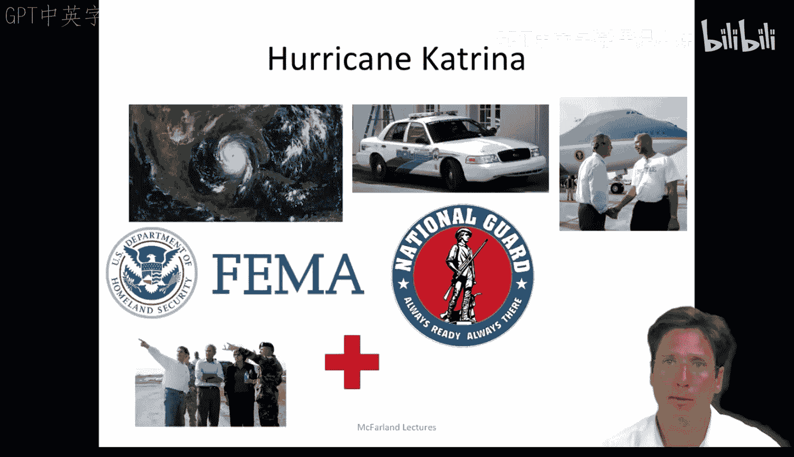
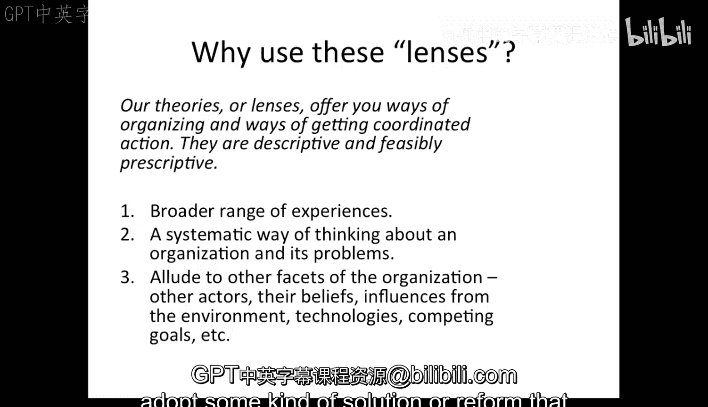

#  024：回顾与案例 - 第二部分 🌀

在本节课中，我们将通过一个具体的案例——卡特里娜飓风应对——来回顾并应用之前学过的组织理论。我们将看到理性行动者模型、组织过程模型和政府政治模型如何帮助我们分析复杂的现实问题，并探讨学习这些理论对管理者和分析师的实用价值。

---

## 理性行动者视角

上一节我们回顾了组织分析的核心模型，本节中我们来看看如何将它们应用于一个真实案例。首先，我们从理性行动者模型的视角来分析。

作为一个理性行动者，我会考虑面临的问题以及与之相关的目标。例如，风暴即将来临，可能会淹没城市，并引发我们只能部分解决的问题。我们有以下几种处理此问题的选择。

以下是可选的行动方案：
*   什么都不做。
*   加固堤坝。
*   在风暴前组织疏散（需考虑时间是否充足）。
*   在风暴后进行疏散。
*   在整个过程中提供服务与保护，并在事后进行排水和重建。

同时，我也会考虑所有其他相关的行动者。这包括联邦应急管理局、州长、各政府机构、陆军工程兵团、红十字会、警察、消防部门、国民警卫队等。

作为一个理性行动者，我会假设我的员工和其他人与我目标一致。如果我能向他们阐明洪水灾害和应对不力所带来的代价或后果（例如，任何伤亡都是不可接受的），并通过比较不同选项的后果或不采取建议行动的后果，指明如何以最小的生命代价达成目标，我应该能够促使所有人以最优方式动员和响应。

---

## 组织过程视角

然而，我们知道人们并非总有相同的目标，也并非总被后果所驱动。一些行动者和组织可能认为堤坝能守住，另一些则认为10人甚至100人的伤亡无需做出响应。在另一个极端，他们可能被洪水灾害完全压倒，以至于我们无法基于工具性理由促使他们行动。例如，国民警卫队自身可能也被洪水所困。

因此，我们必须诉诸身份期望、职责观念等，来促使这些组织行动者启动各自的标准操作程序。

从组织过程的角度来看，我们需要开始划分问题，以便将具有经验和标准操作程序的相应组织分配到每个部分。城市有疏散计划等，我们可以启动并协调。我们知道警察和消防部门会在那里提供协助。

但如果他们不堪重负，其执行标准操作程序的能力还能保持吗？这是一个好问题。如果他们的家园和家人也被洪水淹没呢？他们会优先考虑自己的家庭身份吗？因此，为警察和消防人员的家庭制定保护计划以及进行应对最坏情况的演练，可能也是一个非常好的主意。

此外，我们可能知道，某些标准操作程序在一些社区比在另一些社区更有效。例如，在贫困社区可能更难实施这类程序，我们可以在需要的地方分配更多资源，比如在那些更贫困的社区。

---

## 政府政治视角

即便如此，我们知道无论如何都可能被灾害压垮。因此，我们需要向其他能够协调更广泛参与者和相关标准操作程序的组织行动者求助，例如州长布兰科、联邦应急管理局局长和总统。

我们请求他们启动其管辖范围内的标准操作程序。我们甚至可以通过理性行动者模型和成本分析来解释我们的理由。我们希望获得国民警卫队的支持，用直升机疏散剩余市民、运送必要物资并维持秩序。我们还需要请求陆军工程兵团做好准备，在洪水发生后用设备修复任何堤坝。

但我们都知道这可能行不通。行动者和组织有其狭隘的利益。因此，如果被淹，国民警卫队将有自身的问题；陆军工程兵团不想因堤坝缺陷而受指责；联邦应急管理局不想显得无能或专制；而州长不希望她的权威被外部组织绕过。

因此，我们可以与他们讨价还价，但我们用什么来讨价还价呢？我们公开声称他们工作不当或懈怠，甚至指控他们玩忽职守或抱有偏见，这类威胁和指责或许能促使那些政府职位上的人采取行动。

简而言之，我们的每一种理论都为你提供了组织的方式和促成协调行动的方法。它们是描述性的，并且如果你愿意，也可以具有规范性和可行性。

---

## 理论应用的价值

当然，所有这些都是一种简化的描述。但希望它能促使你更多地思考如何将理论应用于案例。欢迎你们许多人更详细地思考这个案例，以及我们的理论如何适用。网上有大量关于卡特里娜飓风的信息，这是一个非常值得分析的案例，尤其是考虑到未来几年将有更多飓风袭击美国墨西哥湾沿岸和东海岸。对于地震、龙卷风、海啸等灾害也是如此。通过对案例的仔细研究和对组织理论的应用，我们很可能改善对这些反复出现的问题的管理。

这一切引出了一个根本问题：如果你是一名管理者或分析师，为什么要学习并应用这些理论？我认为至少有三个巨大的好处。

想象一下，你被邀请到一个组织帮助他们解决问题。你在组织理论方面的训练为你提供了一些有用的技能。

以下是理论训练带来的三项核心技能：
1.  **更广泛的经验参考**：你拥有的经验范围超出了你亲身经历的。你了解其他历史、其他例子、不同于你个人经历的公司和案例。
2.  **系统性的思维方式**：你拥有系统思考组织及其问题的方法。很可能的情况是，雇主将你请到办公室并解释他们的问题。例如，他们可能会说：“我们的员工在彼此关系上出了问题，似乎有一位经理真的在试图离间所有人。”你会听到并理解这是一个与社会结构相关的问题，并且公司目前对此的解释是冲突是故意的或由特定行动者驱动的。你可能不想使用我们所有的学术术语来向他们解释，但你可以认识到，这是一个他们从组织某些特定方面看待、并应用了一种解释逻辑的问题。通过将其反馈给他们，你帮助他们更好地理解他们所看到和思考的事物，以一种他们可能未曾考虑过的方式进行转述。
3.  **多角度分析能力**：作为受过本课程训练的分析师，你能够暗示组织的其他方面。因此，你不会只从一个角度看问题，而是从多个角度看问题。其他行动者、他们的信念、环境的影响、技术、相互竞争的目标等等。你也可以提供另一种形式的解释。例如，行动者只是遵循标准操作程序，而冲突源于组织不同单位发出的程序之间存在矛盾。通过这种方式，你帮助客户以不同的方式看待事物，并且很可能是一种更有用的方式。

你们中大多数将成为分析师的人将在非营利组织和政府组织中工作。几乎没有任何组织会希望一个外人进来告诉他们该做什么。即使他们这样做了，实施也很可能失败。他们会希望你帮助他们弄清楚正在发生什么，以便他们可以自己提出解决方案。你可以协助这个过程，通过将他们置于决策过程的核心行动者位置，他们更有可能采纳某种解决方案或改革，从而至少解决他们的一部分问题。

---

本节课中，我们一起学习了如何将理性行动者、组织过程和政府政治模型应用于卡特里娜飓风应对的案例。我们看到，每个模型都提供了独特的分析视角和潜在的干预思路。更重要的是，我们探讨了掌握这些组织理论对实践者的巨大价值：它赋予我们超越个人经验的参考框架、系统分析问题的能力以及从多角度提出建设性见解的技能，从而更有效地帮助组织理解和解决其面临的复杂挑战。