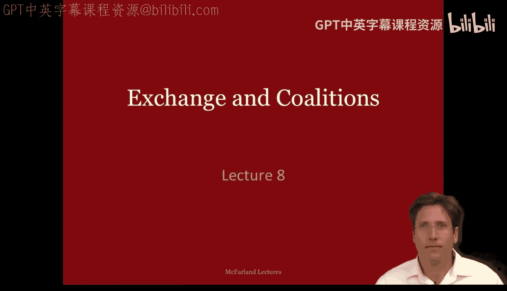
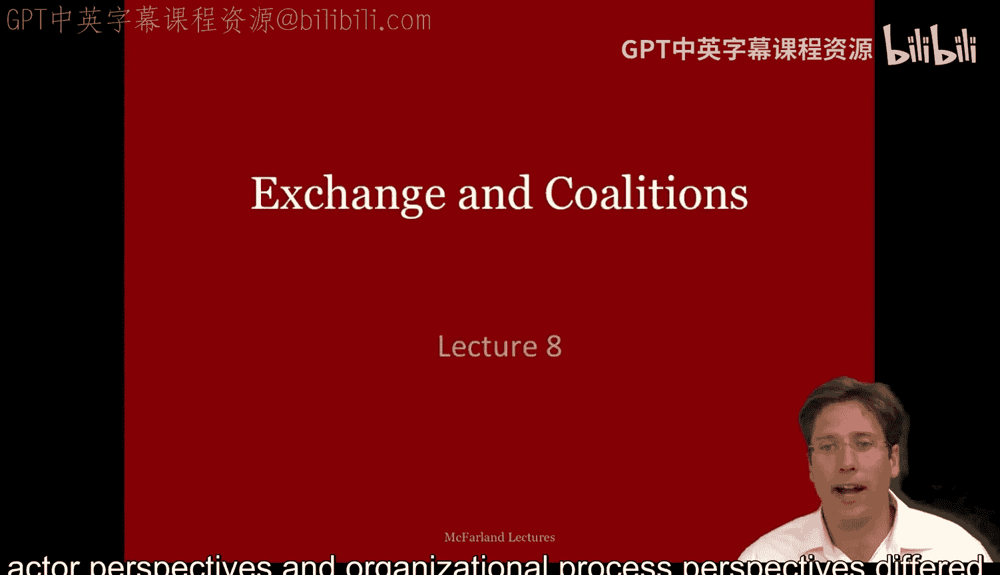
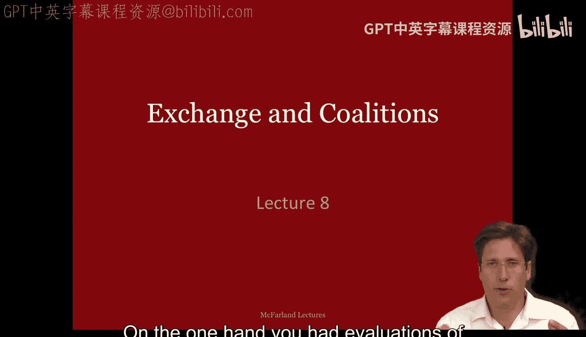
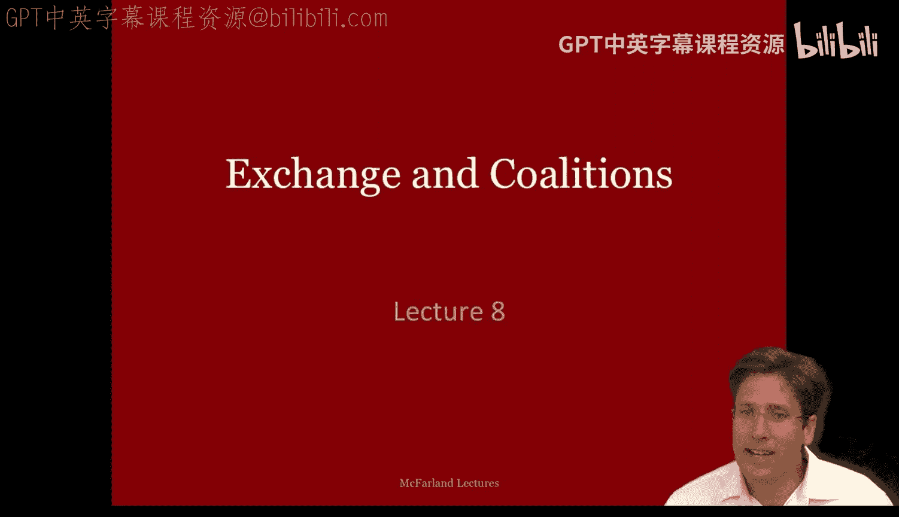
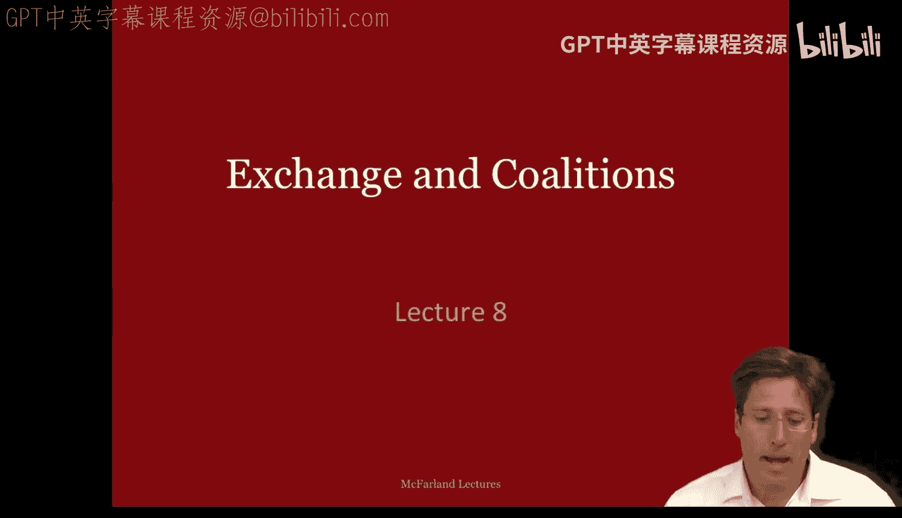
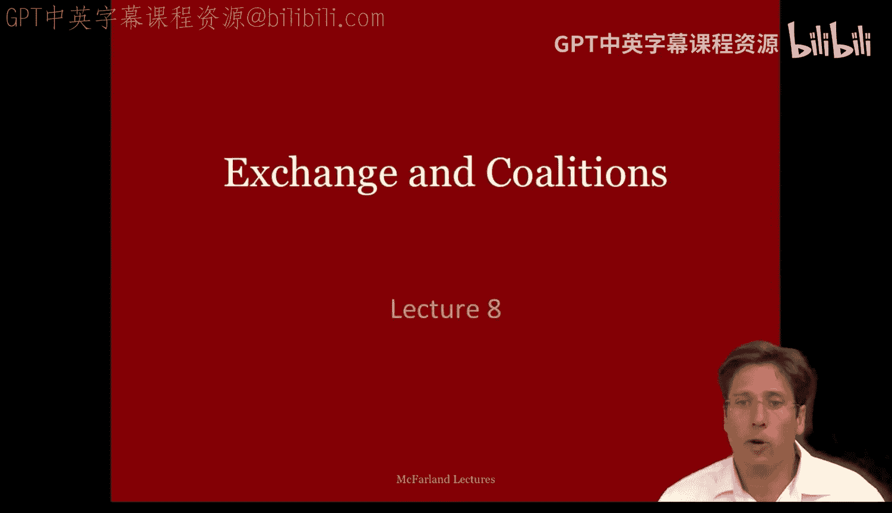
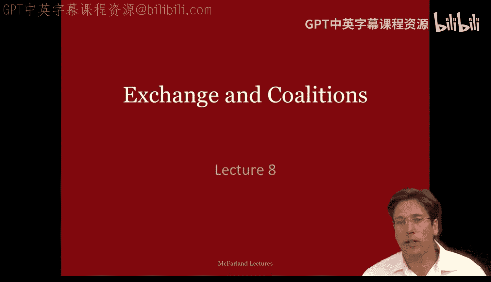
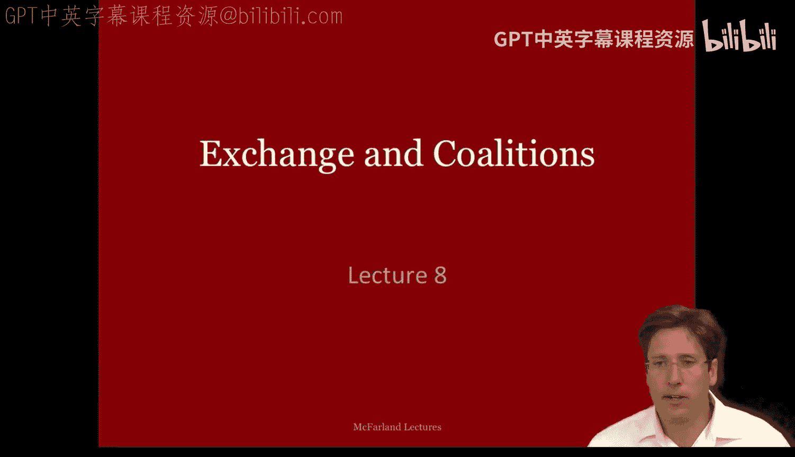
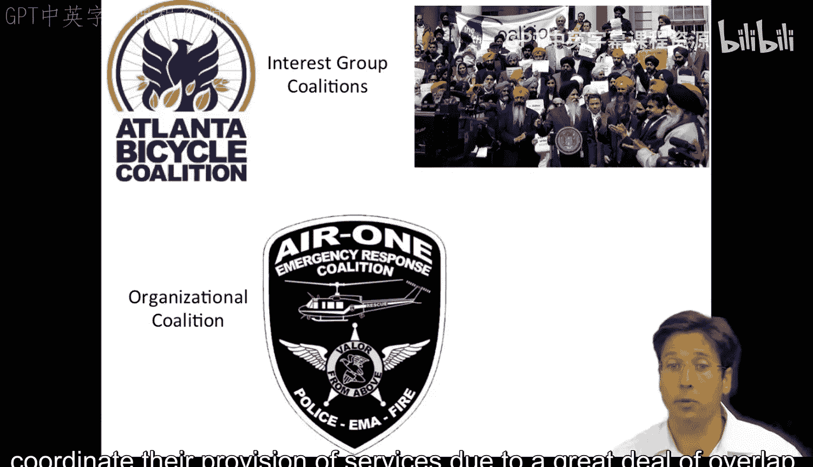
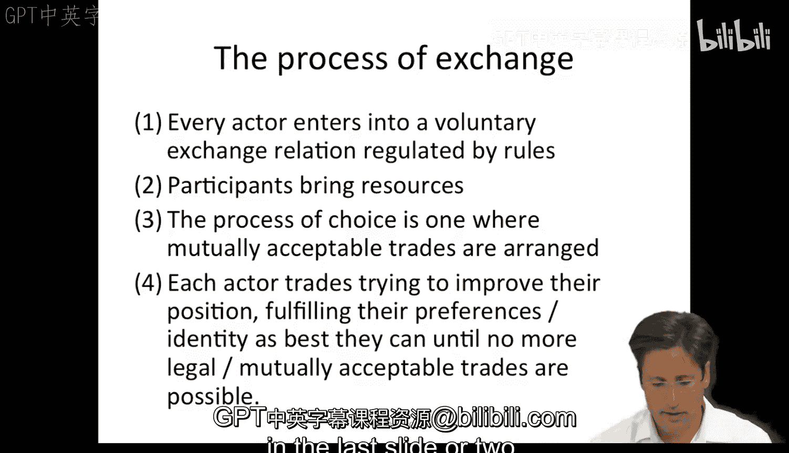

#  025：交换与联盟 - 第一部分

在本节课中，我们将深入学习官僚政治模型，并聚焦于其核心过程——交换与联盟形成。我们将探讨联盟的定义、实例以及交换模型如何作为理解组织内权力动态和决策过程的关键框架。

## 课程概述

在课程的第二周，我们了解了理性行动者视角与组织过程视角之间的差异。这些理论很好地对应了吉姆·马奇提出的“结果逻辑”决策与“适当性逻辑”决策。然而，对于官僚政治模型，大家的理解可能还不够清晰。本次讲座将更详细地阐述这个模型，重点介绍交换与联盟形成的核心过程。

## 联盟的重要性与理论背景

在组织中，你经常会遇到利益联盟。你会意识到，如果不建立并管理一个联盟，集体行动和组织改革将无法实现。因此，这是第三周的理论课，主题是联盟形成。

到目前为止，我们已经学习了三种理论，每种都有其局限性。例如，理性行动者观点假设人们有共同的目标，但这很少见。此外，许多人并非由其行动的后果所驱动。这引导我们转向组织过程或规则遵循的观点。但这个视角未能考虑到边缘组织如何发挥作用，以及许多被提出和执行的惯例背后都有狭隘的利益考量。政治和变化是存在的，而规则遵循过于静态和路径依赖，无法捕捉这一点。

因此，我们有了官僚政治模型。在这里，我们看到更具体的政治因素驱动着决策联盟。但上次我们并未深入探讨利益如何协商以及集体决策如何达成。所以本周，我们将更专注于这第三个也是最后一个理论。我们将花大量时间阐述和解释如何管理联盟，聚焦于联盟动态及其核心的交换与谈判过程。

## 什么是联盟？实例解析

让我们从一些简单的例子开始，什么是联盟？

最常见的例子是政治和国际联盟。例如，在智利，有许多政党，如我旁边图表中的圆圈所示。一些政党发现彼此有共同利益，通过合作能获得好处，因此它们会形成政治联盟，比如“变革联盟”（图中所有蓝色圆圈），或“民主政党联盟”（除了紫色和白色之外的大部分政党）。

另一个例子可能是新西兰基督教政党的这种分散状态，这里的联盟最终会形成一个临时的统一政党联盟，但持续时间不长。这表明在许多组织情境中，联盟可能更具临时性。

其他联盟可能基于利益集团，各种团体甚至不同的宗教派别围绕共同关心的问题联合起来。甚至还有组织联盟，不同的机构和组织由于服务范围有大量重叠而协调其服务提供。

## 理论中的联盟：从马奇到艾利森

在课程的第二周，我们已经阅读了一些关于联盟的讨论。詹姆斯·马奇和格雷厄姆·艾利森都以各种方式讨论过它们。在大多数情况下，联盟是由相互不一致的决策者领导或组织的社会系统；在这里，很难将决策者视为一个统一的团队；相反，我们看到的是一种权力斗争或脆弱的联盟，它描述了决策过程。

回顾艾利森的理论表格和官僚政治模型的纲要，我们会看到有多个处于不同位置的参与者；有各种因素塑造了他们的偏好和立场，例如，他们特定的利益或与他们相关的利害关系、他们所在位置的目标，以及迫使他们做出决定的截止日期。每个参与者都拥有某些资源或权力（人们想要的东西），以及根据规则进行的内部交换或讨价还价游戏。决策或组织行动是这些参与者之间讨价还价的结果。

另一方面，吉姆·马奇以一种很好的方式描述了联盟，补充了艾利森的官僚政治模型以及你们本周阅读的凯文·休拉的联盟概念。然而，他的重点更多地放在联盟的核心组织过程上，即创造和维持联盟的过程。吉姆·马奇认为，学者们将联盟决策或联盟形成描述为遵循两种主要过程之一。

## 联盟形成的两种过程：力量模型与交换模型

第一种过程，我想作为背景介绍，并非你们真正需要学习的内容，它有时被称为权力斗争，有时被分析或操作化为一个简单的**力量模型**。

**力量模型**是我们上周为个人所做的期望效用计算的延伸，但这次我们有多个具有不同偏好或对结果赋予不同价值的参与者，他们在决策中被赋予不同的权重。为了计算决策，联盟在力量模型中只是简单地将期望效用相加，给更重要或更有权力的参与者的效用赋予更大的权重，因此它有点像是这种总和计算的形式。

以我们带伞上课或约会的例子为例，如果我们为群体中的每个人计算期望效用，然后根据我们彼此之间的相对权力对我们的分数进行加权，再把所有人的分数加起来，我们就应该得到集体决策，对吗？

这个程序的问题在于，权力被描绘成一种可以实际测量的稳定个人特质。但许多学术理论家认为，权力并非真正的个人特质。例如，想想三元关系或依赖性的等级概念：只有当我的好朋友在场支持我时，我才强大；当他们在不同的情境下不在场时，我就处于较弱的状态。此外，这个模型也是同义反复的：当人们得到他们想要的东西时，权力被视为解释他们为何得到它的原因。而且，权力可以指代个人获得的许多不同事物，因此很难将其衡量为一个所有人都认同的单一构念。所以，仅仅将我们纯粹的理性行动者模型扩展到人群的“力量”想法效果并不太好。

研究权力斗争的更好方式是通过**交换模型**，至少这是吉姆·马奇在他本周的阅读材料中所主张的。在这里，集体选择是通过自愿交换（即交易和讨价还价）产生的。这是艾利森官僚政治模型以及凯文和休拉的激励理论（或者你我称之为联盟描述）的核心组织过程。

## 交换模型的核心要素

交换过程相对简单。以下是其核心要素：

每个参与者都进入一个受规则调节的自愿交换关系。这本质上是艾利森官僚政治模型中的“游戏规则”。

参与者将资源带到谈判桌上，即他们带来金钱、财产、信息、技能、接触他人的途径、权利、知识等。这类似于艾利森的权力概念。请注意，斯科特将这些控制权或对资源的控制描述为存在于组织内的各种角色和职位中，例如所有权、管理权（如资本）、专业知识、桥梁角色以及外部行为者（如监管机构）的规则制定。

选择的过程是安排相互可接受的交易的过程。同样，这里是通过讨价还价达成的相互可接受的交易，你们来回交换直到找到一个商定的交换关系。

最后，每个参与者都试图通过交易来改善自己的处境，尽可能满足自己的偏好或身份认同，直到没有更多合法或相互可接受的交易可能为止。理论上，在学术模型中我们假设没有时间限制，但在现实中，正如休拉和艾利森所写，参与者确实经常面临时间限制，你也可以在你的模型中加上这一点。

这里描述的交换过程是官僚政治模型以及更广泛的联盟形成的核心，这就是为什么我们想在最后几张幻灯片上花点时间讨论它。

## 总结

本节课中，我们一起学习了官僚政治模型的核心——交换与联盟形成。我们探讨了联盟的定义和实例，回顾了相关理论背景，并重点区分了联盟形成的两种主要过程：力量模型和交换模型。我们详细阐述了交换模型的核心要素，包括自愿交换关系、参与者带来的资源、相互可接受的交易过程以及通过交易改善自身处境的目标。理解这个过程是分析组织内政治动态和推动集体行动的关键。