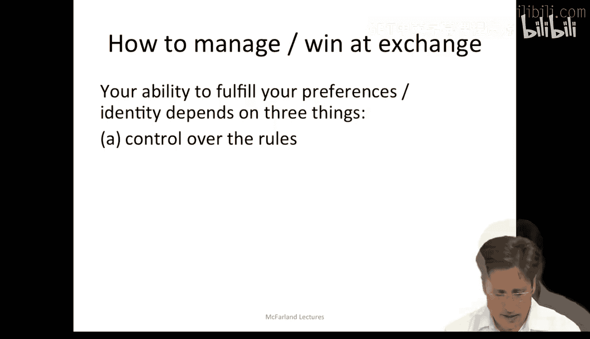
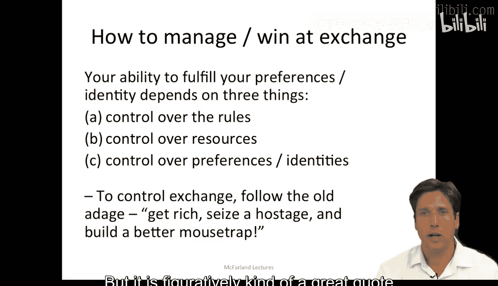
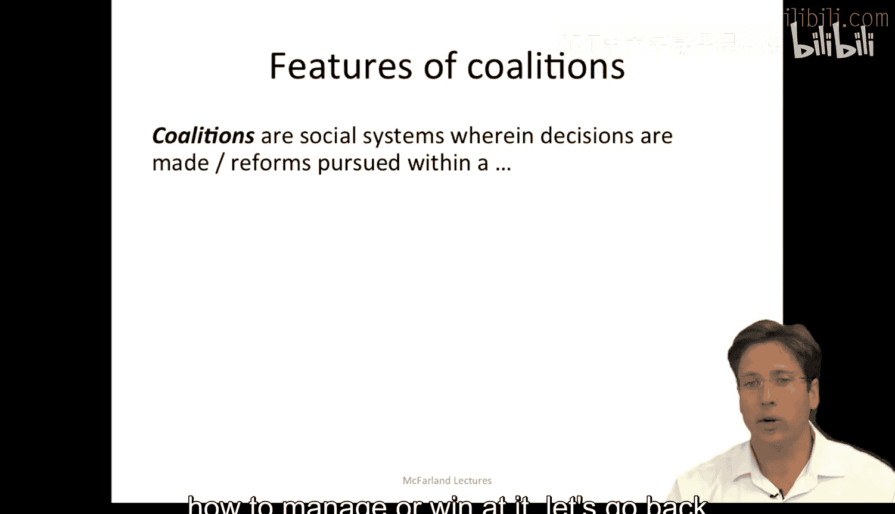
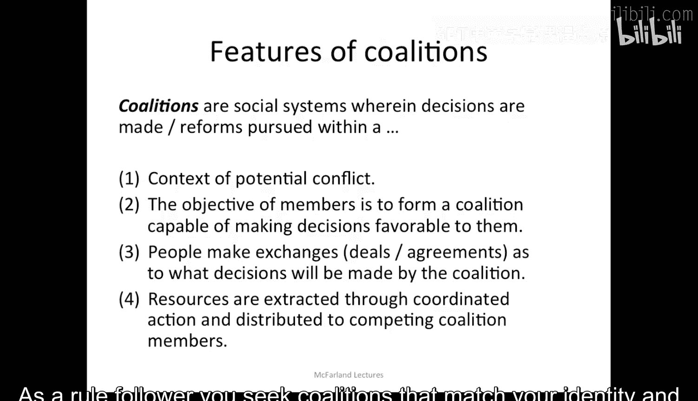
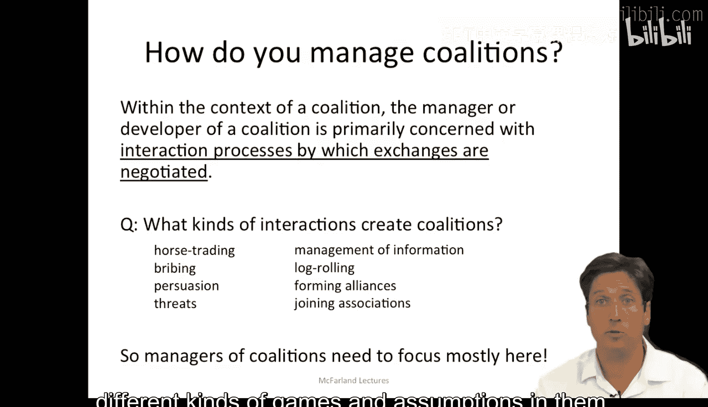
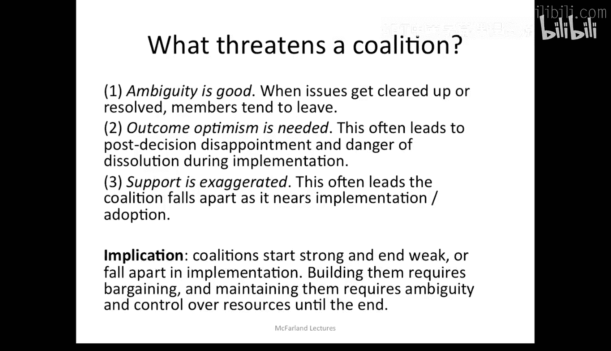
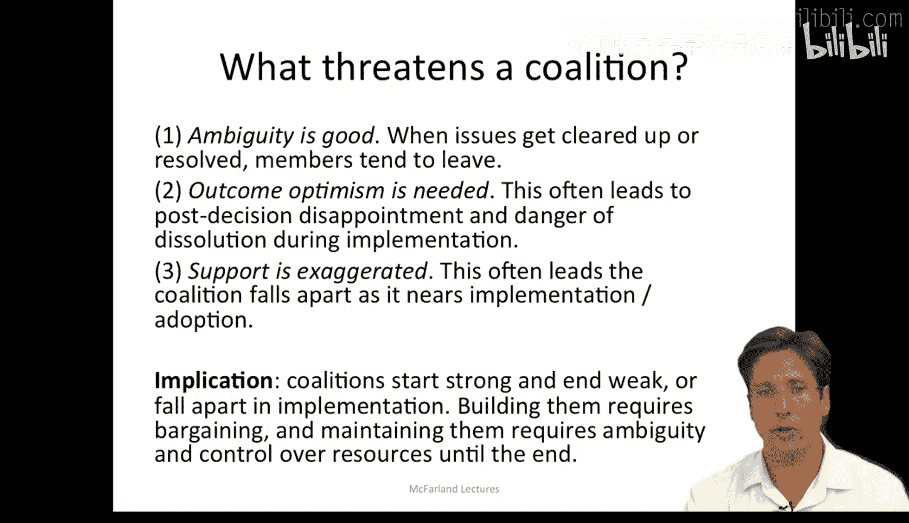

#  026：交换与联盟 - 第二部分 🎯

在本节课中，我们将要学习如何作为参与者来管理和赢得交换游戏，并深入探讨联盟是如何通过交换过程形成的。我们将了解控制交换的关键要素，以及管理者在构建和维护联盟时所使用的各种策略和行为。

***

## 如何管理与赢得交换游戏

作为交换的参与者，你实现自身偏好和身份认同的能力取决于几个因素。

以下是影响交换结果的几个关键方面：

*   **控制规则的能力**：即你能否制定游戏的规则。例如，你是否能书写法律，或定义交换的边界与游戏规则？罗伯特·卡洛的著作《权力掮客》中描述的罗伯特·摩西就是一个绝佳的例子。作为一名非民选的官僚，他最终控制了纽约市的交通建设预算，甚至能左右政客。他通过将自己写入巴士相关的立法规则中做到了这一点，并借此选举或提拔新官员，重塑了整个纽约的城市景观。这就是控制规则的典范。

*   **控制资源的能力**：你需要考虑是否拥有**所有人都需要的资源**。反之，其他公司或组织是否拥有你所依赖的资源？这会形成一种**权力依赖关系**，你可能需要为获取那项关键资源付出远高于其价值的交换代价。如果对方对你有这种杠杆优势，你将处于不利地位。

*   **控制偏好或身份的能力**：你的目标是转变他人的偏好，让他们需求你所提供的物品。你可以让他人的偏好和身份认同与你核心资源的提供变得密不可分。这类似于为你拥有的资源创造需求，并控制某种身份认同及其含义。

因此，人们试图控制交换时遵循的箴言是：**获取丰富资源**、**掌握关键筹码（挟持人质）**、**定义游戏规则**以及**打造更优方案（建造更好的捕鼠器）**。这形象地概括了管理交换关系的核心理念。

***

上一节我们介绍了管理交换的几个关键要素，本节中我们来看看联盟是如何运作的。

请记住，**交换仍然是联盟形成的生成过程**，这一点没有改变。我们现在要讨论的是在多重交换或更大群体背景下的更广泛情境。

以下是关于联盟的几个核心要点：

*   **联盟的本质**：联盟是一种社会系统，决策的制定和改革的推进都发生在潜在冲突的背景下。这意味着联盟包含了**偏好和身份并不总是一致**的行动者，它们相互并存，因此需要讨价还价。

*   **成员的目标**：成员的目标是形成一个能够做出**有利于其自身局部利益**的决策的联盟。由于联盟内部存在不一致性，以及其他松散成员拥有不同利益，这显然很困难。

*   **形成的基础**：因此，人们必须就联盟将做出何种决策进行交换、交易和达成协议。这遵循我们上述描述的**交换核心过程**。

*   **资源的分配**：资源通过这种协调行动被提取，并分配给相互竞争的联盟成员。这就是成员加入联盟所获得的回报。霍拉引用的资源包括战略激励、信息和象征性利益（我们将在下一讲详细讨论）。

那么，谁将加入联盟？战利品如何分配？这可以遵循**结果逻辑**（在此情境下有时是首要的）和**适当性逻辑**。作为一个工具性行动者，你会加入**最小获胜联盟**以获取最大回报；而作为一个规则遵循者，你会寻求与你的身份及你所遵守的标准相匹配的联盟。

***

如果我们回顾官僚政治模型，会发现我这里所描述的所有特征在那里也有粗略的关联。只是在本讲中，我试图将联盟的描述更深入地**锚定在讨价还价和交换的过程**中。

在前面的幻灯片中，我描述了一些我们用于控制交换的手段，这些可以延伸到联盟管理中。然而，大多数联盟需要更广泛的谈判和协商。

因此，管理者会使用各种各样的策略。联盟管理者主要关注**协商交换的互动过程**。

那么，具体是哪些互动或交换形式创造了联盟呢？以下是多种形式，范围包括：

*   **政治交易**：直接的利益互换。
*   **贿赂**：提供不正当好处以换取支持。
*   **说服**：通过论据影响他人。
*   **威胁**：施加压力或暗示负面后果。
*   **信息管理**：控制他人能看到或不能看到的信息。
*   **滚木立法**：互相支持彼此不十分关心的议题以换取对方对自己核心议题的支持。
*   **形成同盟/加入协会**：建立更正式或非正式的联合关系。

联盟管理者真正主要关注的就是这些行为。以“滚木立法”为例，这是一种特殊的交换：我可能是某个教师团体的一员，有时出现一些我并不十分关心的议题，我基本上会同意它们，因为其他人更关心这些议题；反之，我也期望他们在我真正关心而他们可能不太关心的议题上支持我。这被称为“滚木立法”，是一种**默许的交换**。当你违反这一点时，人们可能会突然对他们原本不在乎的事情大做文章，这可能导致信任问题、缺乏共识以及各种麻烦。但这里的重点是，要管理一个联盟，你需要思考一系列具有不同分配方式、不同游戏规则和假设的交换逻辑。

***

因此，联盟是通过交换、各种争执和讨价还价而达成的动态成果。正因如此，它们常常受到威胁。

以下是可能威胁联盟的一些因素：

*   **模糊性的作用**：吉姆·马奇在其关于联盟的论述中指出，**当议题变得清晰或得到解决时，成员倾向于离开**。因此，清晰或决议并不总是有利于联盟的生存。
*   **结果乐观主义的必要性**：在为一个联盟进行讨价还价时，你常常需要**高估协调行动的积极后果**。这往往导致在联盟改革实际实施后，出现**失望和解体的危险**。
*   **支持度的夸大**：成员常常夸大他们的支持。因此，随着联盟采纳并实施各项措施，它开始分崩离析。所有这些松散联合的个体发现，一旦最初的联盟形成，他们就不再关心了。

因此，联盟有一种奇特的动态：它们开始时似乎非常强大并充满希望，但在实施过程中往往会变得软弱或解体。

***

所以，构建联盟需要大量的讨价还价、争执、政治交易和滚木立法等交换努力。而一旦你建立或达成了联盟，你需要通过**保持模糊性**以及**控制资源和依赖关系**来在实施过程中维持它们。这是一个漫长的过程，充满了复杂性和沿途的考验与磨难。

***

本节课中，我们一起学习了如何通过控制规则、资源和偏好来管理与赢得交换游戏。我们深入探讨了联盟作为通过交换形成的动态系统，其成员具有混合的偏好，目标是为自身利益做出有利决策。我们还了解了管理者用于构建和维护联盟的各种互动策略（如政治交易、说服、滚木立法等），以及威胁联盟稳定的因素（如模糊性消失、过度乐观和支持度夸大）。理解这些过程对于在组织环境中有效运作至关重要。