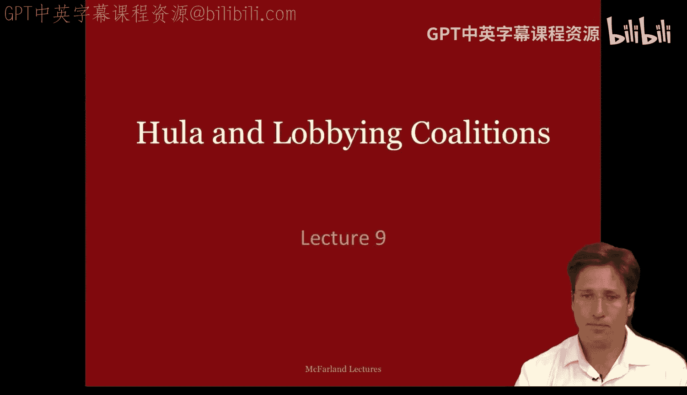
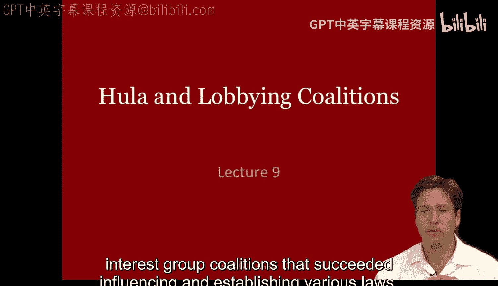
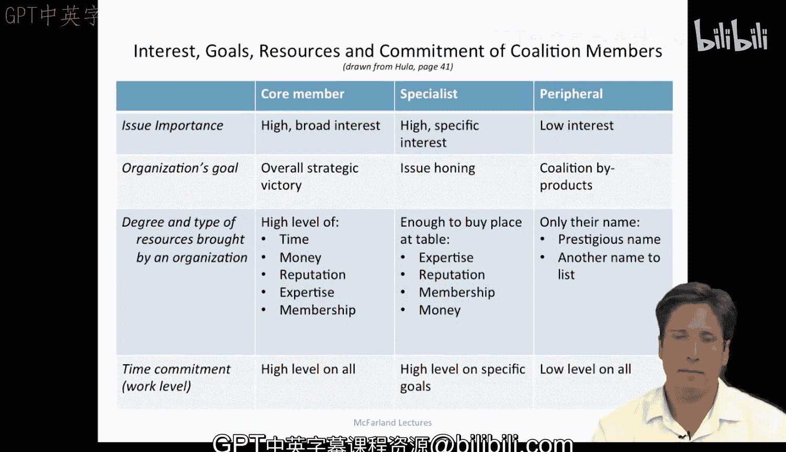

#  027：呼啦圈与游说联盟 - 第一部分 🎯

在本节课中，我们将更深入地探讨凯文·胡拉关于利益集团联盟及其在美国国会游说努力的著作。我们将了解联盟如何形成、成员为何加入，以及不同成员在联盟中扮演的角色。

---

## 为什么研究游说？🤔

上一讲我们讨论了交换模型，本节中我们来看看它在政治游说领域的应用。游说活动并不局限于单一组织内部，但对于那些希望成为领导者和社会改革者的人来说，它至关重要。在美国或任何民主国家，大多数社会改革都需要立法决策，而这很大程度上始于游说和利益集团联盟，它们成功地影响并确立了各种法律。

---

## 联盟的交换模型 💱

在凯文·胡拉的书中，他使用了一种交换模型，这与我们上一讲讨论的内容以及理查德·埃默森的社会交换理论概念非常相似。在这种交换模型中，参与者为了某种利益而进行交换。对于游说者而言，“搭便车”问题不如在其他模型中那么突出，因为游说者通常已经决定以某种形式参与某项事业，他们本身就是活动家。因此，核心问题更多在于选择参与的程度和类型，而非是否参与。

在这个背景下，联盟的“经纪人”会设计激励措施，促使人们以不同的程度和方式参与，从而有效地实现他们的利益。

---

## 为何加入联盟？🤝

了解了基本模型后，我们自然要问：人们为什么要加入联盟？让我们通过胡拉的著作更仔细地审视这个问题。

胡拉给出了多个团体愿意加入组织或联盟的原因：

*   **共同目标与合法性**：团体受益于能够引用一个明确的、他们与他人共同认可的政策或目标。通过将自身较为狭隘的利益目标纳入一个更广泛的“保护伞”目标之下，他们可以在追求更大目标的同时，部分实现自己的特定诉求。这既保护了他们的局部利益，又使其行动在一个更合法、更广泛的目标下进行。
*   **早期参与以塑造议程**：通过尽早加入联盟，组织可以影响联盟的议程和平台。大多数问题在联盟形成初期就已得到解决，并且为先前已解决的利害冲突树立了先例。
*   **信息作为选择性收益**：信息是成员资格的一种选择性收益。成员希望了解任何对其感知利益构成的未来威胁，这对于人员较少的小型团体尤其有价值。加入联盟有助于他们进入处理新问题的决策委员会，并了解国会山的最新法案动态。
*   **象征性收益**：将某事视为重要议题与实际使其成为重要议题是不同的。许多组织认为某事重要并加入以示支持，但可能没有资源投入核心活动。宣称参与某项相关事务看起来不错，可以强化组织存在的理由，满足更关心公司事务的高层，并在事情进展顺利时邀功。

---

## 成员承诺度的差异 📊

现在我们知道了成员加入联盟的原因，接下来可以探讨为什么成员的承诺度会有所不同。

一个特定团体对联盟激励措施的反应，强烈影响着它最终将在联盟结构中扮演的角色。理解一个团体是出于战略原因还是选择性收益加入联盟，有助于判断它将成为核心成员、专家型成员，还是边缘的“跟随者”成员。

需要记住，边缘团体并非“搭便车”，因为所有团体都已进入一种交易关系，其他参与者也已认可这种交换的合法性。因此，我们可以将联盟想象成三个同心圆，代表不同的承诺层级和在谈判中的不同角色。

以下是凯文·胡拉描述的成员类型及其兴趣水平、目标、资源和承诺：

*   **核心成员**：将议题视为至关重要，并对其相关的广泛问题感兴趣。他们的目标是取得该议题上的整体战略胜利。他们为联盟投入高水平的时间、金钱、声誉、专业知识和成员力量，其承诺度超过任何其他成员。
*   **专家/参与者**：关心自己的特定目标，并试图将议题引向该方向。他们通常带来足够的资源以在谈判桌上获得一席之地，常以特定议题上的专业知识作为政治资本。只要涉及特定议题，他们就会保持参与。
*   **跟随者（边缘成员）**：兴趣最小，目标是获取联盟的副产品。他们提供的资源很少，但愿意让他人使用自己的名号。

这种联盟模型几乎呈现出一种霍布斯式的观点：只有最核心、最强大的行动者向联盟投入最多，而其他力量较弱的行动者则投入少得多。核心参与者关心法案能否通过，参与者想要法案中的一个段落，而边缘团体则只想要一张用于其通讯稿的图片。每个游说者都定义了自己的核心利益，并形成一种共生关系以维持联盟的团结。

有趣的是，在我自己关于斯坦福大学及其他高校学术院系和研究中心的研究中，我也看到了许多类似的区别。大型跨学科研究中心似乎有核心成员，他们致力于解决一个广泛目标及其中的具体问题，并倾其所有投入其中。但在建设中心时，他们需要吸引其他支持者，其中许多人像“参与者”一样只有特定兴趣，他们执行一个依赖中心内部分教员专业知识的具体研究项目。因此他们加入，贡献自己的名望、声誉甚至相关议题上的专业知识，但他们并不参加所有活动，也不努力去打造更大的研究社群。然后是“跟随者”或附属成员，他们与中心关系不大，也不怎么依赖它，但他们有相关项目。中心邀请他们成为附属成员并使用其名号，有时这会为他们带来少量研究经费、文章被收录在网站上或某种认可。但这些成员很少出席活动或为推广该社群做太多事。尽管如此，他们营造出一种更大规模、更受尊敬的集体努力的印象。在组建新的学术院系时，也会出现类似的有趣过程，甚至更为明显，因为需要实现各种目标和利益来资助教职岗位和发展学生项目。因此，我们可以在各种组织形态中看到这种联盟的形成，它们在初期都带有某种利益集团基础的社会运动性质。

---

## 总结 📝

本节课中，我们一起学习了凯文·胡拉关于游说联盟的理论。我们了解到联盟基于交换模型形成，成员因共同目标、议程塑造权、信息收益和象征性利益而加入。根据投入资源和承诺度的不同，成员被分为核心成员、专家/参与者和边缘跟随者，他们在联盟中扮演着截然不同的角色，共同构成一个共生的利益整体。这种分析框架不仅适用于政治游说，也能帮助我们理解学术机构等其他组织中的联盟动态。