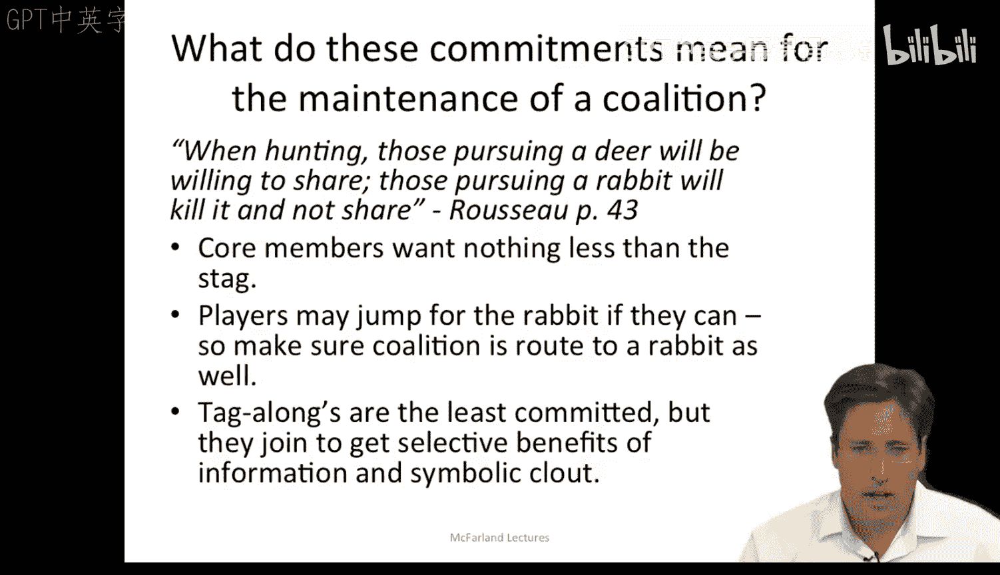
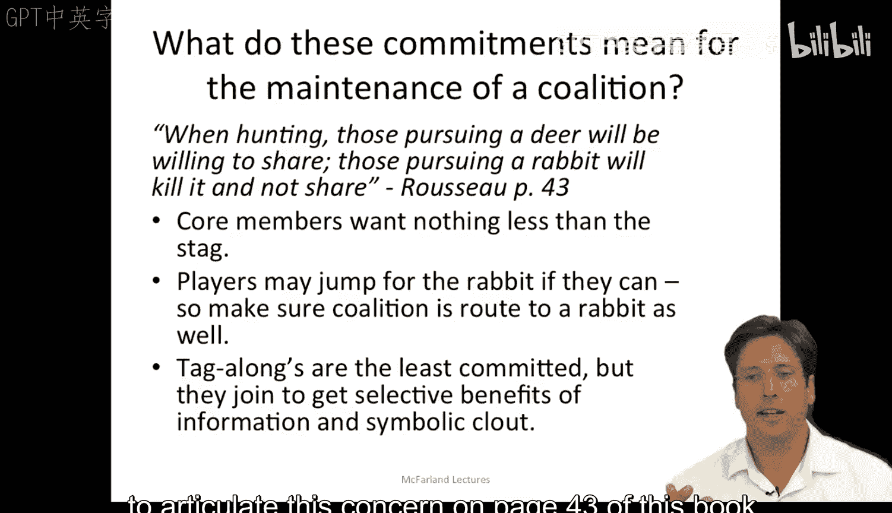
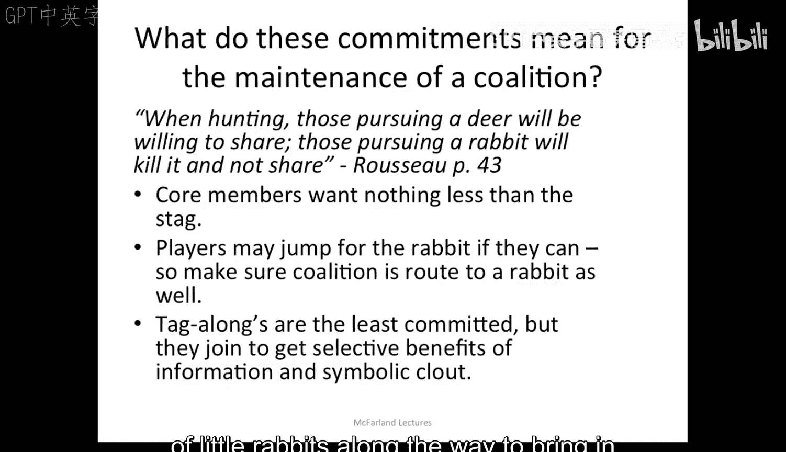
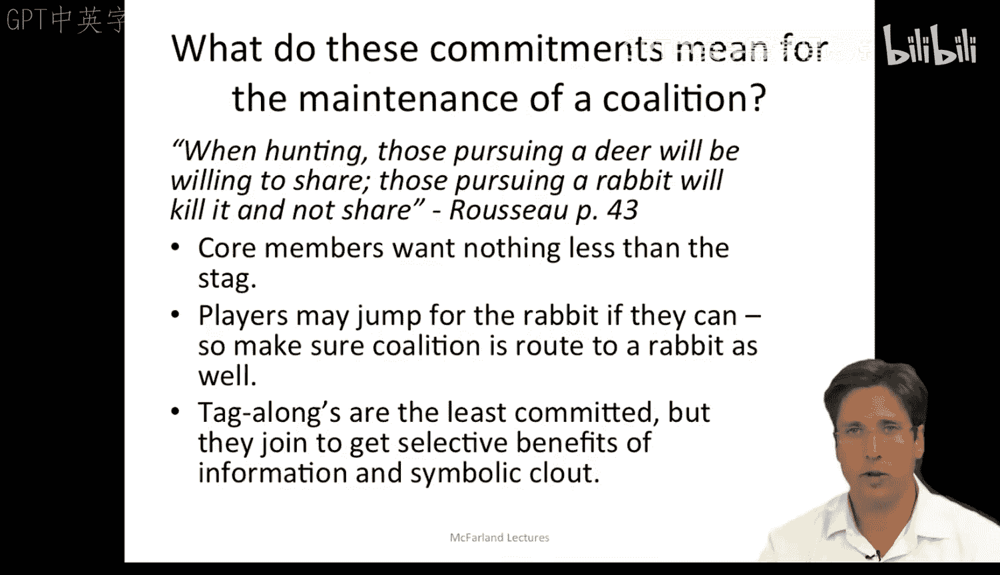
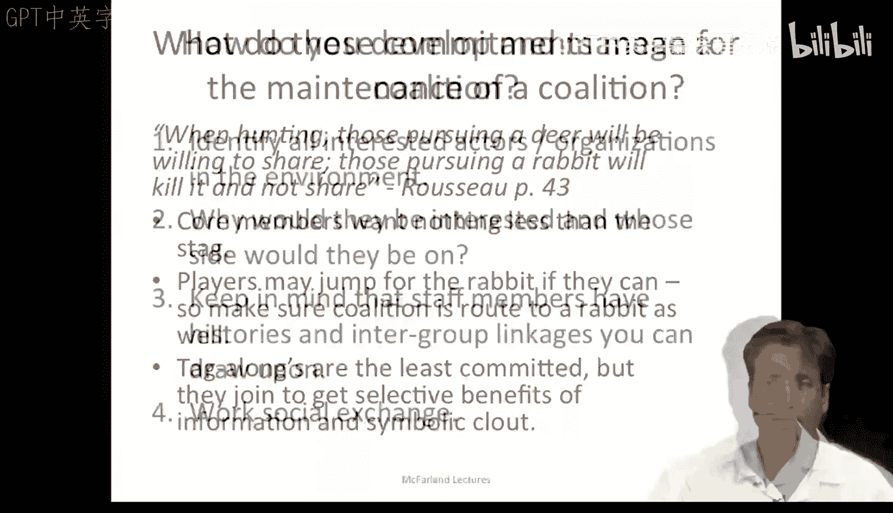
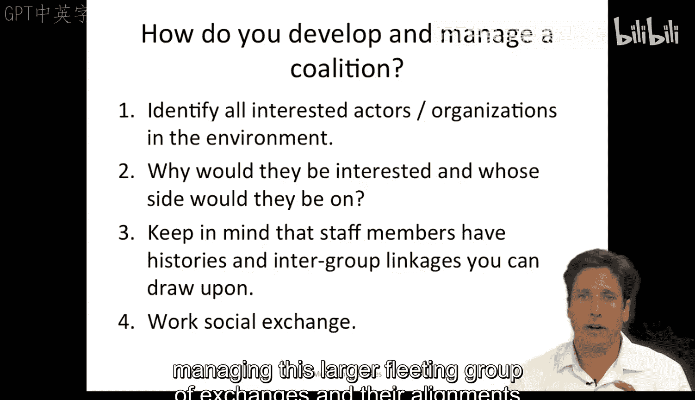
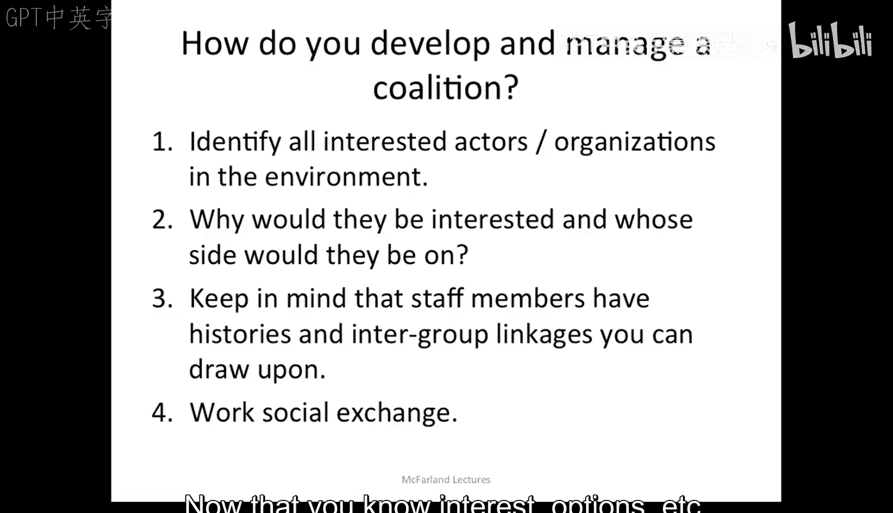
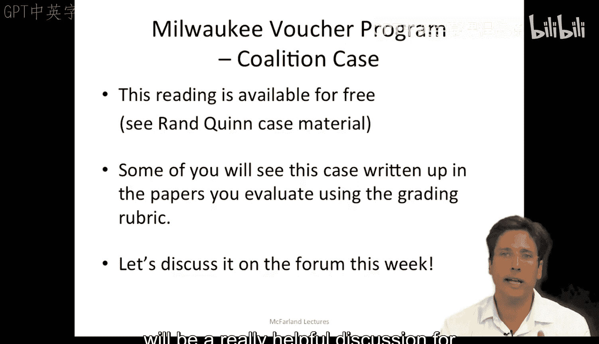

#  028：呼啦圈与游说联盟 - 第二部分

## 概述
在本节课中，我们将要学习联盟维持与管理的关键策略。我们将探讨联盟成员的不同承诺水平，以及管理者如何通过识别“兔子”目标来维持成员参与。最后，我们将学习如何系统地发展和运作一个联盟。

---

## 联盟承诺的意义
上一节我们介绍了联盟的构成，本节中我们来看看不同成员的承诺对联盟维持意味着什么。

呼啦在其著作第43页引用了一段卢梭的名言来阐述这个关切：“追捕鹿的人愿意分享，而追捕兔子的人则不会分享。”这巧妙地暗指了联盟中的核心成员（追捕鹿的人）与普通参与者（追捕兔子的人）。核心成员的目标是“鹿”，而普通参与者则可能为了一只“兔子”就跳走。

因此，联盟管理者需要确保，实现“捕鹿”这个宏大目标的路途上，沿途有各种“小兔子”来吸引并维持普通参与者的承诺。例如，当我运作一个关注重大议题的大型研究项目时，我会鼓励项目中的方法论专家、计算机科学家或其他领域的专家，将部分成果投稿至会议论文集或方法学期刊。我们更大的研究问题并非方法论本身，但许多专家希望在新课题上的合作能帮助他们在此过程中创新自己的方法。因此，我在运作这些项目时，会指出沿途的“兔子”，以便他们能从中获得成果，从而维持他们的承诺。

---

## 承诺差异与潜在风险
这种承诺的差异也可以从更马基雅维利主义的角度来看待。对手可以针对承诺度较低的个体，将他们从联盟中分化出去。例如，我可以向你展示替代性法案，将你的特定议题（如一项修正案）吸纳进去，从而将你从当前联盟中拉走。

当然，“搭便车者”是承诺度最低的群体。他们不会为联盟投入太多精力，他们加入是为了获取信息、象征性影响力等选择性利益。他们是森林中的第三类群体，有点像为了“啤酒和陪伴”而加入的折扣猎人。

联盟成员可以有不同的目标，对联盟有不同的兴趣和承诺水平。这种不对称性在不同层面是被允许的，因为存在不同的交换关系。领导者必须能够接纳搭便车者，并区分出愿意坚持到底的真正参与者与那些见到第一只“兔子”就会跳走消失的人。

搭便车者带来的危险在于，他们最终可能感到被背叛或被利用，从而引发反抗。例如，1994年加州关于非法移民的187号提案的通过过程，虽然当时建立了信任，但试图拉拢搭便车者的做法最终导致了一种被背叛的感觉。

---

## 如何发展与运作联盟
鉴于以上所有因素，你应如何发展和管理一个联盟呢？本周我们讨论了管理交换，现在的关切是向外拓展，并以某种符合你利益的一致形式，来管理这个更大、更不稳定的交换群体及其联盟关系。

以下是运作联盟的步骤：

首先，作为联盟管理者，你需要思考和识别环境中所有相关的行动者和组织。考虑相关议题，谁会对这个议题感兴趣。

其次，问自己他们为何会感兴趣，以及他们会站在哪一边（是友是敌）。请记住，朋友的朋友是朋友，敌人的敌人也可能成为你的朋友。你希望动员的是支持，而非反对。你可能还需要考虑对反对意见的可能回应，例如，针对他们的专家和搭便车者，以此方式削弱反对派的支持。

第三，请记住，组织成员拥有可资利用的群体间联系历史。这些联系可以作为协调的有效渠道。例如，前雇主可能比前雇员是更好的联系（向上联系优于向下联系）。有些人甚至同时属于多个联盟，也可以利用他们来获取信息、历史背景和丰富的情境。他们能高效地识别潜在的伙伴和对手，而既有关系可以作为行动和信息收集的节点。拥有更多联系，你就不必发展持久的联盟，因为你总能接触到新成员及其资源。在教育等领域，联系较少，因此更依赖发展网络。尽管如此，基本规则是立即利用关系及其当前的影响力，因为组织中的承诺是短暂、夸张且模糊的，你的时间窗口很短。

最后，正如前一讲所阐明的，要进行交换、讨价还价和谈判。既然你了解了各方的利益、选项等，你就可以开始进行政治交易、互投赞成票，通过谈判将联盟运作成你需要的样子。

---

## 理论应用与案例讨论
现在你对组织中的联盟观点有了一些概览，我们可以开始将其应用到各种案例中。呼啦的阅读材料在应用于国会游说实例方面非常出色，但我们本课程也提供了一些我们自己的案例。

例如，密尔沃基教育券计划。课程提供的关于该计划的案例阅读材料是简短的快速阅读材料，并且可以免费获取。此外，一些同学会在同伴互评培训中阅读到对密尔沃基教育券计划的分析，你们会看到实际应用联盟理论来分析该案例的论文。

因此，我认为最好将关于密尔沃基教育券计划的讨论引导到更大的论坛中进行。如果能听到学生们分享他们认为联盟与交换观点在何处最为显著，在何处可能不适用，那将非常有价值。同样，如果人们思考驱动密尔沃基教育券计划的联盟在民主党重新掌控立法机构等情况下如何可能转向相反方向，也将是很有意义的讨论：自由派团体能否形成支持穷人的联盟？或者这只是自由派改革被商业和私人利益收编的偏见观点？联盟在实施过程中是否总是会右倾？有哪些例子表明情况并非如此？思考这个联盟发展的其他可能性、不同轨迹，或其他类似案例，对于本周我们在线论坛的使用将是一次非常有帮助的讨论。

---

## 总结
本节课中我们一起学习了联盟维持的核心挑战，即管理成员间不同的承诺水平。我们了解了通过设定阶段性目标（“兔子”）来维持参与者动力的策略，并识别了“搭便车者”可能带来的风险。最后，我们系统地探讨了发展和管理一个有效联盟的四步法：识别相关方、分析其立场、利用现有网络联系、以及进行有效的谈判与交换。这些工具将帮助你更好地理解和运作组织内外的复杂联盟关系。