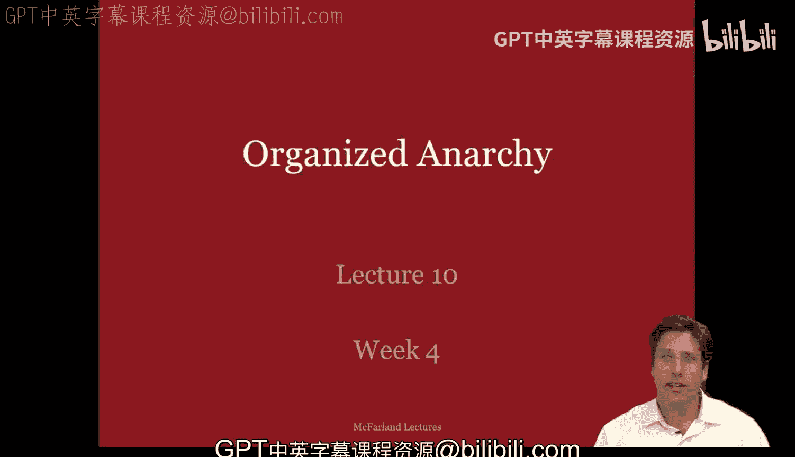
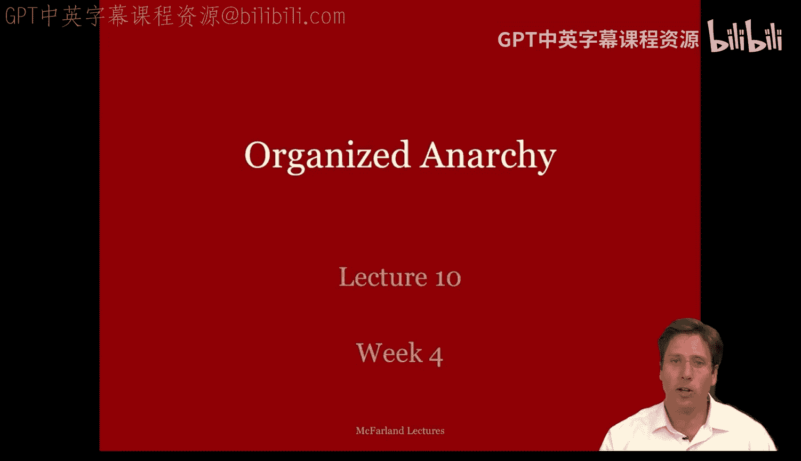
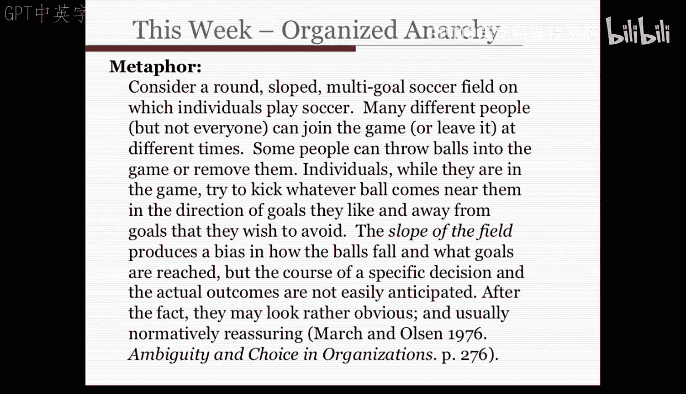

#  034：组织化无序与决策模型 🗑️

在本节课中，我们将要学习组织决策中的一个重要概念：组织化无序，也被称为“垃圾桶模型”。我们将探讨在复杂、动态的组织环境中，决策是如何实际发生的，这与传统的有序决策理论有很大不同。

上一节我们介绍了联盟理论，本节中我们来看看组织决策中更为混沌和动态的一面。

## 组织化无序的基本特征

组织化无序描述了决策过程中的混乱与复杂性。在实际决策场景中，许多事情同时发生：技术任务不确定且难以理解，参与者的偏好和身份不断变化且不明确。问题、解决方案、决策机会、想法、情境和人员混杂在一起，使得对它们的解读充满不确定性，彼此间的联系也模糊不清。

## 垃圾桶模型的核心概念

为了理解这种混沌，我们依赖科恩、马奇和奥尔森提出的“垃圾桶模型”。该模型以相对简单的方式描述了组织化无序。

从组织化无序的视角看，一个组织是**一系列选择机会**的集合（例如各种会议）。**问题**在寻找可以讨论它们的决策情境或会议，而**解决方案**则在寻找可以附着的问题。同时，**决策参与者**不断寻找可以参与的工作。

可以将一个决策机会或会议视为一个“垃圾桶”，参与者将不断产生的各类问题和解决方案“倾倒”其中。在垃圾桶内，问题、解决方案和参与者这些“流”相互碰撞。在特定的时间点，面临某些截止期限时，就会产生某种决策，这个过程更像是**创造意义**，而非产生明确的结果。

以下是该模型的核心要素：
*   **选择机会**：决策发生的场合，如会议。
*   **问题**：参与者关心并希望解决的议题。
*   **解决方案**：参与者拥有的、待“推销”的答案或想法。
*   **参与者**：流入和流出决策过程的个人。

## 一个生动的比喻：倾斜的多球门足球场

为了更好地理解，我们可以参考詹姆斯·马奇提出的一个精彩比喻：

想象一个**圆形、倾斜、拥有多个球门的足球场**。许多不同的人（但非所有人）在场上踢球，他们可以随时加入或离开比赛。有些人可以向场内扔进新球或拿走球。场上的人会试图踢开任何靠近他们的球，**踢向他们喜欢的球门，并远离他们希望避免的球门**。场地的倾斜度会影响球的滚动方向和最终进入哪个球门。然而，**任何特定决策的过程和实际结果都难以事先预测**，尽管事后看来可能显而易见。

这个比喻捕捉了组织决策的动态性、偶然性以及参与者、问题和解决方案之间流动的、非线性的互动关系。

## 回顾密尔沃基案例中的决策动态

现在，让我们回顾密尔沃基教育券案例中学生模拟谈判的过程，看看其中如何体现了组织化无序的特征。

在模拟谈判中，学生小组的体验远远超出了联盟与交换理论所描述的范围。他们的讨论具有更混乱、更动态的特性，产生的决策更符合组织化无序模型。

以下是谈判过程中观察到的几个关键动态，它们体现了组织化无序：
*   **身份与平台模糊**：一些小组难以确定其立场和身份。例如，密尔沃基低收入家长的具体诉求在案例中并不明确。
*   **解决方案的流动性**：一些小组提出的解决方案在谈判过程中发生变化。例如，有的小组最初提议普遍教育券，最终却转而推动定向教育券。
*   **问题与解决方案的动态匹配**：问题和解决方案并非成对出现。解决方案会与多个问题在不同地方进行匹配，这种连接是通过谈判建立的。每个小组都试图论证自己的方案如何能解决其他小组的问题。
*   **时间动态的影响**：决策过程受时间因素强烈影响。例如，有学生中途离开，其推动特定问题或方案的声音便消失了；有些小组因谈判超时而被催促达成交易；有些小组在看到更好的联盟出现后，甚至会推翻之前的协议。
*   **顺序效应**：许多学生感到，小组间两两谈判的顺序极大地影响了哪些交易会出现、被采纳或被放弃。

本节课中我们一起学习了组织决策中的“组织化无序”概念及其核心模型——“垃圾桶模型”。我们了解到，在复杂的现实组织中，决策往往不是一个理性、有序的过程，而是问题、解决方案、参与者和选择机会四种“流”在时间压力下偶然碰撞的结果。决策的意义常在事后建构，而非事先规划。通过密尔沃基案例的回顾和生动的足球场比喻，我们更直观地理解了这一动态、混沌的决策现实。