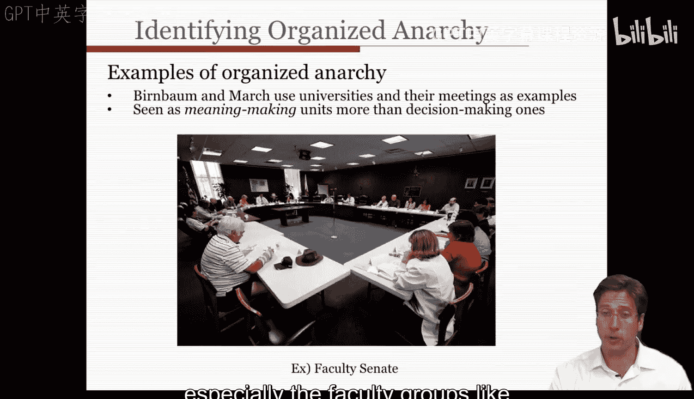
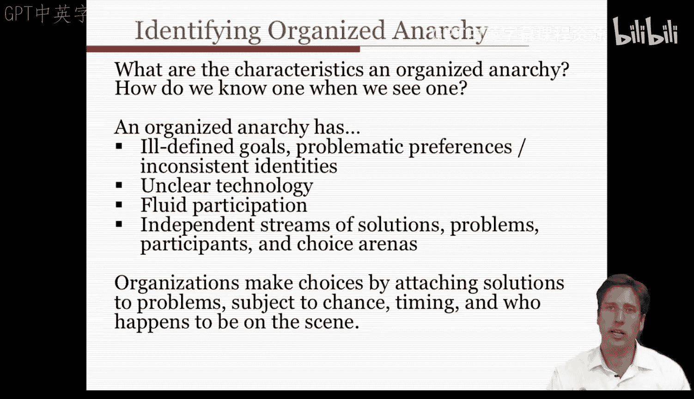
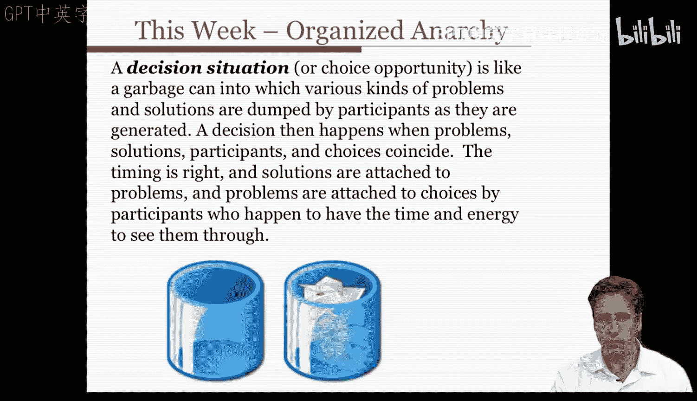
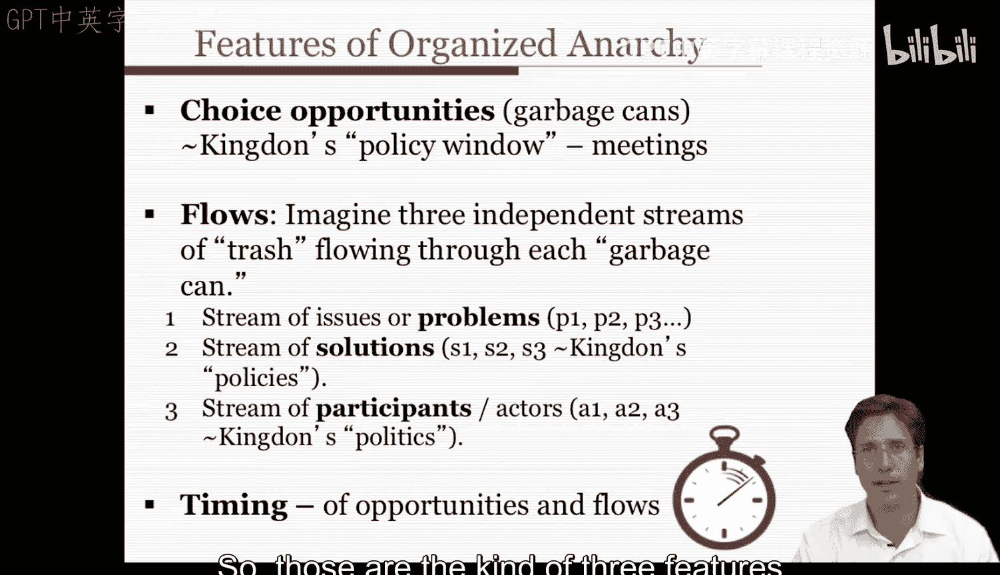
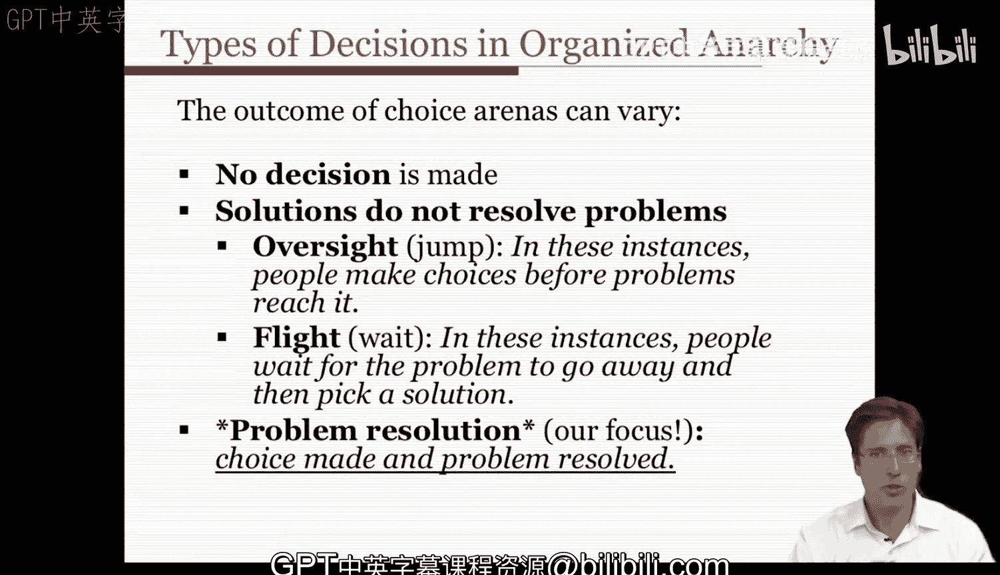

#  035：组织化无序 - 第二部分 🗑️

在本节课中，我们将要学习组织化无序理论的核心模型——“垃圾桶模型”。我们将探讨该模型如何描述组织中的决策过程，并分析其特征、构成要素以及可能的结果。

---

## 垃圾桶模型概述

上一节我们介绍了组织化无序的概念，本节中我们来看看描述其运作方式的核心理论——垃圾桶模型。罗伯特·本鲍姆运用垃圾桶理论来描述美国学院和大学。他将大学视为一个典型的组织化无序系统，尤其是像院系和学术评议会这样的教师团体。他认为这些团体并非决策制定组织，而是意义建构组织。在他的论文第439页，他指出：组织化无序需要一些结构和过程，这些结构和过程能象征性地强化其宣称的价值观，为个人提供主张和确认其地位的机会，并让人们明白在众多争夺他们注意力的诉求中应该回应哪些。它们需要一种方式，鼓励无关的问题和参与者寻求其他表达途径，以便决策者能够完成他们的工作。它们还应该能够让人们保持忙碌、娱乐他们、提供多样化的体验、让他们远离街头，并为讲故事和社交提供借口。这个观点也源自韦克的《组织的社会心理学》一书第264页。

因此，我们理解到，组织化无序内部是意义建构的语境，而非结果发生器。这是组织化无序一个有趣的方面：我们在组织内部需要这些语境，以便我们感觉有理由和身份存在于那里，并处理各种关切，其中许多关切对某些群体来说可能并不一定具有决定性或重要性。这就是我们从组织化无序及其出现场所（如会议或教师会议等场合）中获得的视角。

---

## 组织化无序的特征

现在我们对组织化无序可能存在的地方及其一般形态有了一些认识，我们可以提出一些问题：组织化无序有哪些特征？我们如何识别它？我们可以将组织化无序定义为具有某些特征。具体来说，人们在谈论组织化无序时通常提到以下几点：

以下是组织化无序的四个核心特征：

1.  **目标模糊不清**：在这些语境中，目标不明确，偏好存在问题且不一致，存在多种身份认同。因此，我们不确定在这些语境中什么样的问题才是重要的。许多问题都存在，并且被人们提出。
2.  **技术不明确**：每个提出的解决方案或替代方案的结果不明确。我们不知道如何解决问题。我们提出的许多解决方案缺乏完整的证据。
3.  **参与流动性强**：人员来去频繁。在这个选择舞台或决策舞台上，参与者的构成存在更替。
4.  **要素流独立**：解决方案流、问题流、参与者流和选择舞台本身不断更替，并且准独立地存在。

这些就是组织化无序语境的特征。在其中，组织通过将解决方案与问题联系起来做出选择，这取决于机会、时机以及恰好在场并有精力和意愿推动它们的人。

---

## 垃圾桶模型的构成要素

请注意，我在几个地方提到了“选择舞台”或“选择机会”，我指的是一个决策情境。这个理论使用“垃圾桶”作为隐喻。它就像一个垃圾桶，参与者将各种问题和解决方案产生后倾倒进去。当问题、解决方案、参与者和选择机会恰好重合、时机成熟，并且参与者有时间和精力将解决方案与问题、问题与选择联系起来时，决策就发生了。

简而言之，垃圾桶理论是关于附着于某个选择的意义的社会建构。

让我们更仔细地审视垃圾桶理论中的各个具体要素。

以下是垃圾桶模型的四个核心构成要素：

1.  **选择机会（垃圾桶）**：组织化无序包含我们称之为“选择机会”或约翰·金登所称的“政策窗口”的东西。这些实际上就是会议，但也可以是做出决策或这些问题汇聚的团体。它们基本上是做出选择成为可能的地方。这些选择机会或政策窗口通常被称为“垃圾桶”，而一个选择的意义源于垃圾桶内的“垃圾”是如何组织的，即问题、解决方案和参与者的混合方式。

2.  **要素流**：存在不同的“流”。想象有三个持续的垃圾流流经每个垃圾桶。垃圾桶内部一片混乱，但当这些流交汇连接时，我们根据更大的流动及其汇合来推导秩序或识别一个选择。每个流相对独立地流动：
    *   **问题流**：问题在公众舆论中产生，例如教育危机、校园枪击和考试、国际考试报告。
    *   **解决方案流**：解决方案不断由学者们提出，甚至在问题尚未被认识到时就被审查，例如品格教育或异质分组课堂作业。
    *   **参与者流**：参与者因其他原因来来去去，例如学校董事会更替、教师因任期、离职或离开职业而变动。

3.  **参与者流（政治流）**：金登称此流为“政治流”，它决定了政府舞台上参与者的存在。政治决定了哪些参与者会出现，哪些利益得到代表。即使某个议题对你有益，你也可能因为政治顾虑而放弃。

4.  **时机的重要性**：选择机会常常并不存在，没有意义，无法触及，等等，因为正确的要素流汇合尚未发生。这就是为什么把握正确时机如此重要。

---

## 决策的可能结果

现在，选择舞台的结果可能各不相同。

以下是决策可能产生的三种结果：

1.  **未做出决策**：在许多情况下，没有做出任何决策。你可以召开会议，但没有人就问题或解决方案达成一致。一个又一个想法被提出又被推翻。很多会议都是这种情况，我们都经历过。

2.  **解决方案未解决问题**：在其他情况下，被采纳的解决方案并没有真正解决问题。这可能以两种方式出现：
    *   **疏忽**：有时选择机会到来，但没有问题与之关联，所有问题都与其他选择舞台关联。在这种情况下，人们甚至在某个议题或问题触及或到达那个会议之前就做出选择并选定解决方案。
    *   **回避**：问题一度与选择机会关联，但超出了关注它们的决策者的精力。因此，原始问题可能会转移到另一个选择舞台（如另一个会议或部门）。在这些情况下，人们等待问题自行消失，以便做出解决方案或选择方案。例如，人们会搁置一项决定或将其交给一个小组委员会。在这两种情况下，问题都没有与解决方案关联。

3.  **问题得到解决**：当然，作为组织化无序中的意义管理者，我们最感兴趣的情况是问题实际得到解决。这些情况是：问题在选择机会或意义建构场合被提出，参加该会议的决策者投入足够的精力和能力来满足问题的需求，此时做出选择，问题实际得到解决。

---

本节课中我们一起学习了组织化无序的核心分析工具——垃圾桶模型。我们探讨了该模型如何通过**问题流、解决方案流、参与者流**和**选择机会（垃圾桶）** 等要素，描述组织在目标模糊、技术不明确和参与流动的背景下如何做出决策。决策的结果可能是**未做出决定**、**解决方案未解决问题**，或者理想情况下**问题得到解决**。理解这个模型有助于我们认识现实组织中看似混乱的决策过程背后的逻辑。