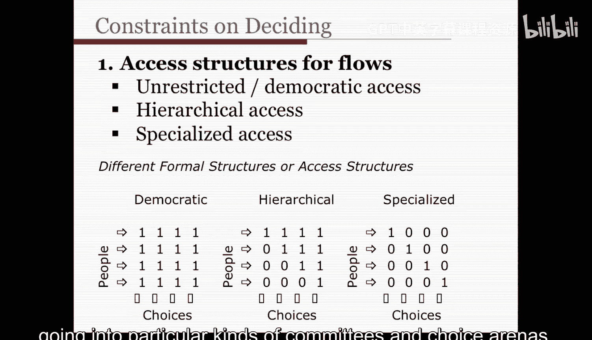
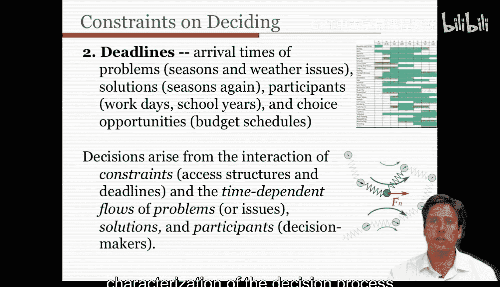
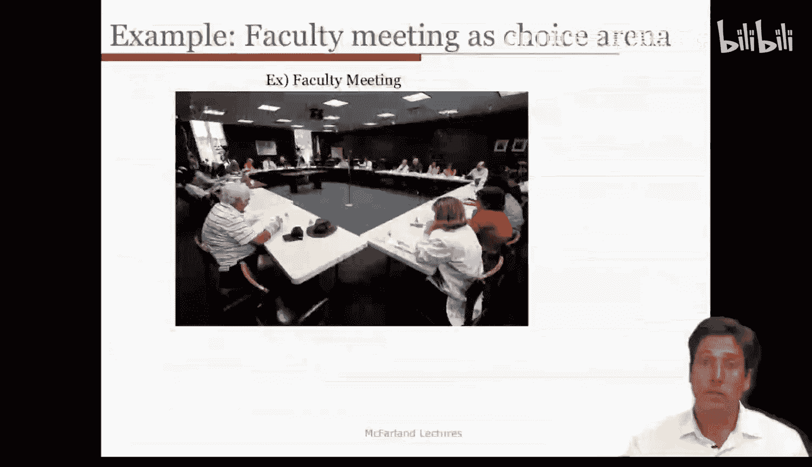
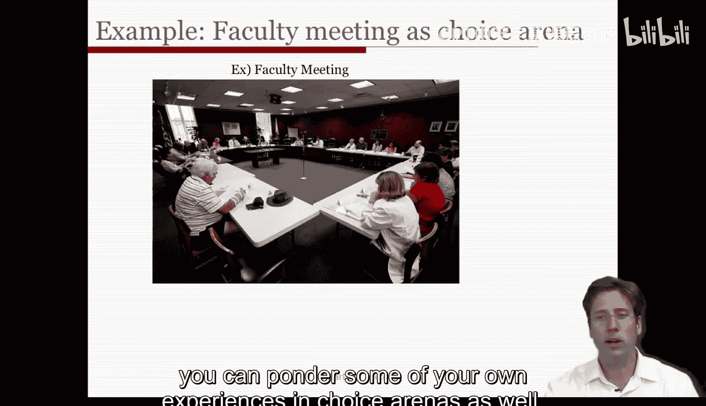
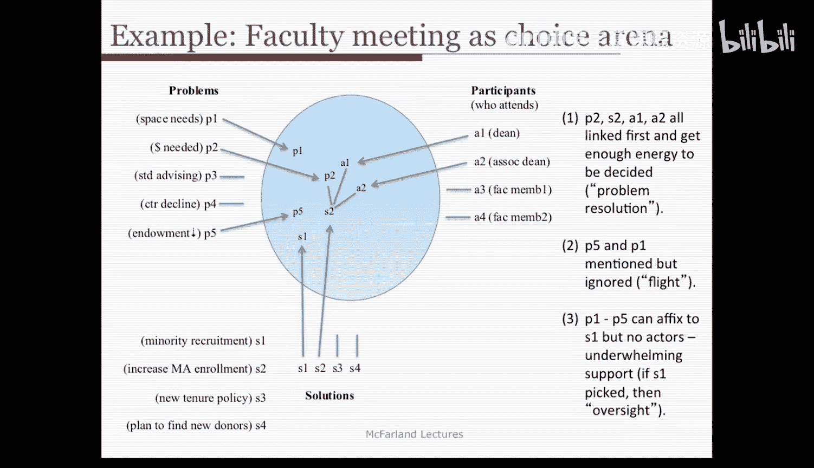
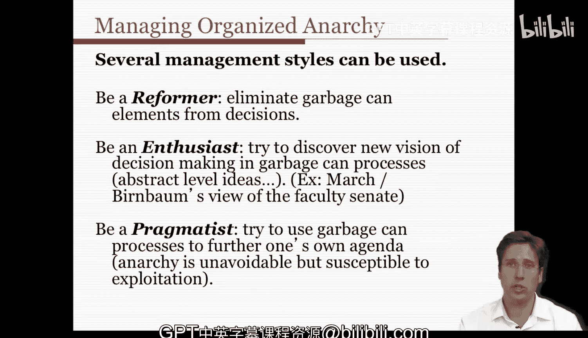

#  036：组织化无序 - 第三部分 🗑️

在本节课中，我们将深入探讨“组织化无序”模型，特别是其核心的“垃圾桶”决策过程。我们将学习影响决策流的约束条件，并通过一个具体的例子来理解这些概念如何在实际的组织会议中运作。最后，我们将探讨管理者如何应对这种动态的、看似混乱的决策环境。

---

上一节我们介绍了组织化无序的基本概念，本节中我们来看看影响“垃圾桶”决策过程的几个关键约束条件。

每个垃圾桶，或者说每个选择机会或会议，都有不同的准入规则。具体而言，每个选择场域都有一个**准入结构**或某种社会边界，它影响着哪些人、问题或解决方案可以进入。

以下是三种主要的准入结构：

*   **松散结构**：允许不受限制的访问。所有问题、解决方案和人员都可以进入。这能创造更多活力，但也允许问题、解决方案和参与者相互干扰，从而增加冲突和解决问题的时间，导致更大的无序性。这类似于左下角的民主结构，每个人都能进入每个选择场域。
*   **层级结构**：重要的参与者、问题和解决方案被赋予优先访问权。例如，重大决策可能在执行会议上进行，而不重要的问题则由普通员工和小组委员会处理。这对应图中的中间结构，某些人可以访问所有选择场域，而其他人则不能。
*   **专业结构**：当专业问题和解决方案可以进入特定会议时发生。例如，在我所在的学校，学生在学校打印机上打印论文产生的费用问题，可能会提交给学校的技术委员会；期刊费用问题可能在图书馆委员会提出。因此，某些专家可以进入与其专长相匹配的选择场域，工程师会被拉进这些技术委员会。右下角的图表显示了这种结构，专家进入特定类型的委员会和选择场域。

影响进入选择场域的另一个约束是**截止期限**。截止期限界定了时间边界，决定了决策场域何时开启以及各种流何时进入。这里可能存在多种约束：

*   问题到达时间的约束，例如季节性流感问题。
*   解决方案到达时间的约束，例如我们经常运行的五年计划。
*   参与者到达时间的约束，例如工作日、学年、任期周期决定了人员流动。
*   选择机会或会议本身的约束，例如预算日程安排。

所有这些因素共同构成了组织化无序中的决策特征。决策产生于约束条件（这些准入结构和截止期限）与因变量流（问题、解决方案和参与者）之间的相互作用。因此，我们看到了多种特征的汇合，以及对决策过程更动态的描述，这更接近组织许多选择场域中决策的现实情况。

---

在短时间内介绍了大量概念后，让我们再次以教师会议为例，梳理一下我提到的特征，看看它们具体是什么样子。

我认为这个例子能让你更具体地理解这些概念的含义，以及如何在各种组织决策案例中观察和应用它们。或者更确切地说，在这个案例中，决策甚至可能没有做出，但人们会达成更深层次的相互理解，了解彼此的立场、关心的问题以及热衷的解决方案。

以下是一个复杂的图表，让我尝试解构你所看到的内容。让我们从可能流入学术环境的一些问题开始：

*   **P1**：空间使用问题。教师会议（蓝色圆圈，即选择场域）中，斯坦福大学的人员超出了可容纳的范围，这个问题可能会被提出。
*   **P2**：需要额外资金或资源，以及学校是否有足够的拨款来良好运作。
*   **P3**：学生指导问题，例如一个难以毕业的麻烦学生。
*   **P4**：研究中心人员流失。
*   **P5**：对大学捐赠基金在经济衰退中损失了三分之一价值的担忧，以及这可能如何影响特定教师。

所有这些潜在问题都在环境中盘旋，但哪些能进入会议则各不相同。蓝色圆圈再次代表会议场域，假设这是一个准入结构为层级制的执行委员会，因此只有院长和副院长可以进入。最后，我们还有各种解决方案：

*   **S1**：关于少数族裔招聘的解决方案。
*   **S2**：增加硕士生招生人数的计划。
*   **S3**：新的终身教职政策。
*   **S4**：为学校寻找新捐赠者的想法。

并非所有方案都会进入选择场域，会议议程可能有特定的顺序和特定的时间框架（比如一小时），从而对选择施加了截止期限。

让我们来分析一下：
*   **P1** 似乎没有取得任何进展，它被提出但未在解决方案进入前做出决定，这是**决策逃避**。
*   **P2** 则与解决方案 S1、参与者 A1、A2 相关联，它们获得了足够的能量从而被决定，这是**问题解决型决策**。
*   **P5** 与 P2 相关联，但在讨论 P2 时，参与者们从未认为捐赠基金下降的问题能通过增加招生来解决。教师们同意资源不足的问题可以通过增加硕士生招生、从而增加学费收入来解决。这就是发生的决策类型。
*   **P5** 最终与解决方案无关，因此是另一个**决策逃避**。
*   **P3** 和 **P4** 在会议结束前甚至没有被提出，截止期限影响了讨论。
*   P1 到 P5 本可以附着在第一个关于少数族裔招聘的解决方案上，但它没有得到任何支持或相关性。如果它在没有与问题连接的情况下被选中，那么我们称之为**疏忽决策**。

希望通过这个例子，你能对各个流如何碰撞或进入垃圾桶，以及它们的排序和截止期限如何产生影响有所了解。在这个案例中，空间需求问题没有结果，但关于资金和学校运作的担忧是院长们认为值得在那天讨论的。他们认为某些解决方案（如增加硕士招生）比其他方案更相关，并据此做出了选择，而其他方案则没有进展。特定的解决方案可能被提出，但并未被视为与正在讨论的问题相关，最终，正如我所说，时间耗尽，场域关闭。

---

在了解了具体案例和应用概念之后，我们面临一个问题：如何管理组织化无序？如何管理这种流动性、这种动态性？我们该如何应对？

针对垃圾桶或组织化无序，可以出现几种类型的反应：

以下是几种可能的管理策略：

*   **改革者**：许多个人和管理者试图成为改革者。他们尽一切努力消除决策中的混乱元素，从而创造更大的系统性、秩序和控制。这在许多公司中很常见，也是戴利和瓦斯特在芝加哥学校案例中所做的：他们集中化、合理化、固定了各种流和访问权限等，以消除那些混乱的动态元素。
*   **热衷者**：你可以走向相反的方向，尝试在垃圾桶过程中发现决策的新愿景。这类似于马奇和奥尔森主张人们在教师评议会等选择场域中应该做的。在这里，管理者需要认识到，正在进行的计划在很大程度上是象征性的。它是一种互动的借口，一种意义建构的方式，是让人们感到归属感并了解彼此观点和身份的方式。会议更多是为了意义建构和获取观察，而不是做出重大决策。此外，热衷者管理者可以将时间排序视为组织注意力的一种方式，顺序可以表明哪些问题更值得集体讨论。热衷者还会关注问题和解决方案的流动，并将其视为一个匹配市场，动员能量和连接，识别谁在场、何时时间与能量充足，然后推动议题，这就是热衷者应对此类情境的方式。最后，热衷者会看到灵活执行、不协调行动和混乱的优势。有时不做出决定是可以的，可以将选择场域转变为意义建构的空间。这就是热衷者对这类组织化无序的看法。
*   **务实者**：当然还有中间路线，你可以成为务实者，利用垃圾桶过程来推进你的议程。这里的理念是，组织化无序容易被利用。因此，作为管理者，你可以安排解决方案的到达时间，知道注意力是稀缺的。你可以设置会议议程并安排议题顺序，把你希望讨论的放在前面，把你知道大家已经同意需要通过但你不希望详细讨论的放在最后，然后匆忙做出决定，以便快速完成。务实者可以做的另一件事是敏锐察觉参与者兴趣和参与度的变化，保持机会主义。当某些人不在选择场域时，推动你关心但他们如果在场会反对的议题和解决方案。第三，如果流相互纠缠，如果你的解决方案附着了其他问题，而反对者又在场，那么就放弃这些倡议，转向其他议题。如果出现的议程不符合你的利益，就使系统过载以保护你的利益，提出其他问题和解决方案，减慢进程并使其复杂化，以此方式使事情失去动力。你还可以提供其他选择机会、其他会议，以吸引决策者和问题离开你感兴趣的选择，这样，你就为你关心的问题腾出了时间。我的意思是，你可以创建小组委员会，将事情搁置到其他地方处理。

因此，你有多种选择来应对组织化无序的情况。理解这些场域如何运作为你提供了不同的杠杆去尝试，希望这里提到的相关策略能让你对如何“取胜”有所了解。

---

本节课中我们一起学习了组织化无序模型的深入应用。我们探讨了影响决策流的准入结构和截止期限，并通过一个教师会议的详细案例，看到了问题、解决方案和参与者如何在实际的“垃圾桶”中相互作用。最后，我们分析了管理者面对这种动态环境时可以采取的三种策略：改革者、热衷者和务实者。

我希望你觉得组织化无序模型有用。我发现它特别有帮助，因为它使选择的病态在理论上具有一致性。现实中的选择场域常常是混乱的，而这个理论拥抱了这种混乱和动态性，并为我们提供了一种理解它们的框架。我发现垃圾桶理论很有用，特别有助于解释各种会议，其中存在着选择生态，问题和解决方案被流动地讨论。它适用于政策/政府世界、研发团体、危机管理情境，以及大多数试图处理问题的分布式、去中心化社会系统，如大学院系、教师评议会、合伙人会议等。因此，尽管它似乎讨论了很多关于动态性、模糊性和意义建构的内容，但我认为这实际上是一个相当相关的理论，对你作为分析者和管理者都具有相当大的适用性和相关性。

