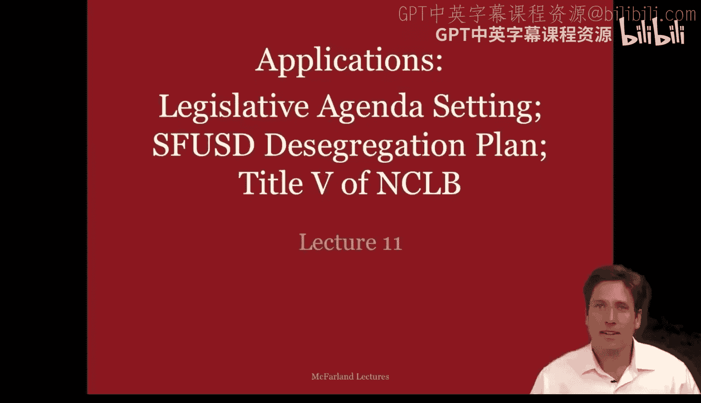
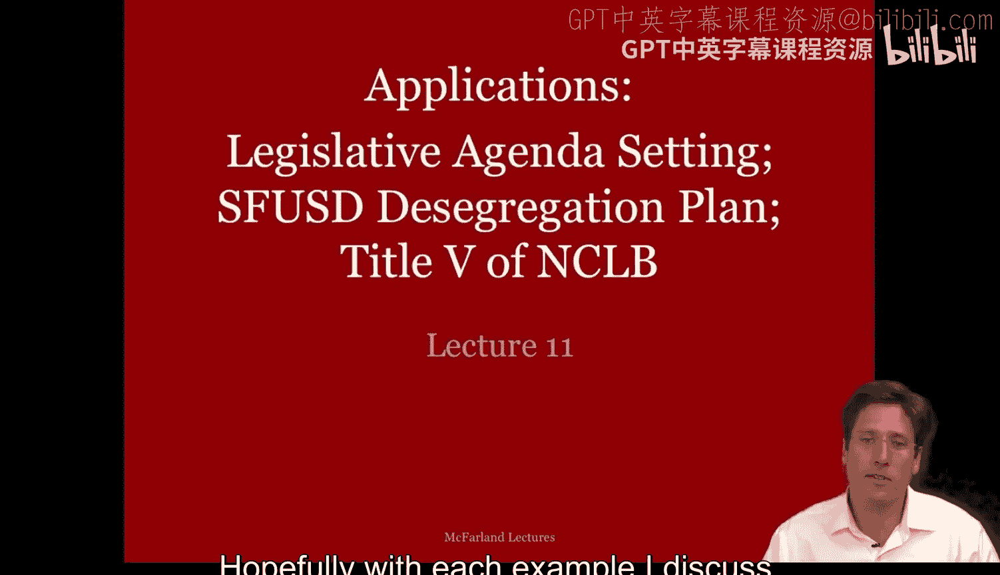
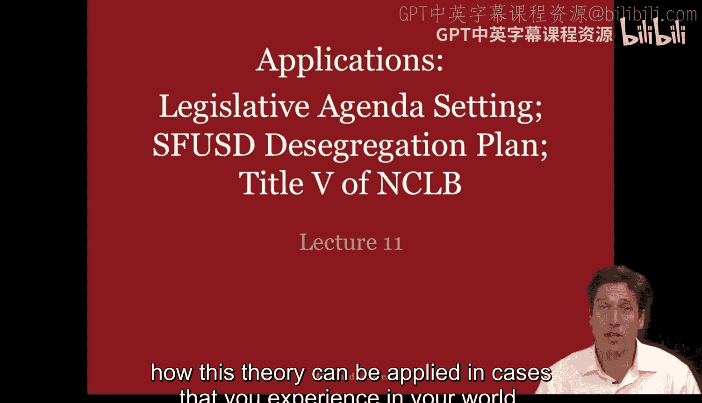
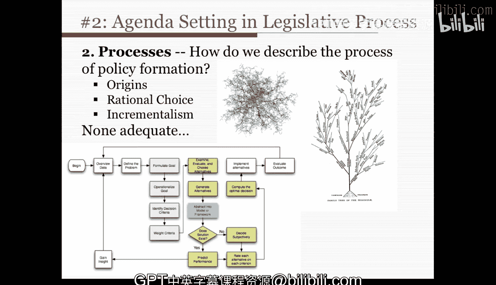

#  037：应用案例 - 第一部分

在本节课中，我们将学习如何将“组织化无政府状态”与“垃圾桶模型”理论应用于现实案例。我们将通过三个具体实例，来理解这些理论如何帮助我们分析复杂的决策过程。

上一节我们介绍了垃圾桶模型的基本框架，本节中我们来看看它在不同情境下的具体应用。

## 🏫 案例一：旧金山联合学区的废除种族隔离计划

这个案例由史蒂芬·韦纳研究，讲述了20世纪70年代旧金山联合学区试图废除学校种族隔离的过程。

### 背景概述
20世纪60年代，旧金山联合学区经历了白人家庭迁离的现象。同时，废除种族隔离的法律案件从美国南部蔓延至全国。在此期间，全国有色人种协进会警告该学区，其学校种族隔离问题过于严重。学区最初制定了一个废除种族隔离计划，但因涉及跨城校车接送可能引发管理难题和民众反对，该计划在委员会中被否决。随后，一个公民委员会成立，但只针对10多所小学中的2所制定了计划。

1970年，全国有色人种协进会提起诉讼，要求将学区内全部102所小学纳入废除种族隔离计划。一位联邦法官在最高法院裁决前不愿做出判决，认为学区在两所学校上的努力显示了诚意，因此建议学区自行制定计划。学区任命了一名工作人员和三个力量较弱的委员会。1971年，美国最高法院裁定，旧金山联合学区必须在两个月内制定出废除所有小学种族隔离的计划。

### 垃圾桶模型分析
为什么垃圾桶理论适用于理解这个相对“无决策”的过程？我们可以从以下几个要素进行分析：

*   **目标模糊**：什么是“废除种族隔离”并不明确。问题和偏好都不清晰。
*   **方法模糊**：如何实现废除种族隔离目标不明确，也没有达成目标的明确衡量标准。
*   **解决方案模糊**：不清楚具体有哪些解决方案和技术可用。
*   **时间紧迫**：存在严格的截止日期。
*   **参与者流动**：参与者不断变化，法官更替，委员会成立又解散，诉讼威胁在特定时间点创造了“选择机会”。

以下是该案例中垃圾桶模型各要素的具体表现：

**问题流**
核心问题是废除小学的种族隔离。参与者最初不确定“融合”应该是什么样子，最终采纳了一个严格的标准：每所学校的种族构成必须与学区平均水平相差不超过15%。其他相关问题也不断进入“选择场”，例如：
*   保持学校综合体和社区学校的完整性。
*   双语教育问题。
*   白人家庭对校车接送的反感及由此导致的白人迁离问题。
*   社会经济层面的融合问题。
*   中学（高中）的种族隔离问题。

同时，其他问题也在发生，但并未在公民咨询委员会等核心“选择场”中得到充分讨论，例如：教师和学生因预算问题抵制破败的学校、拉丁裔组织就双语教育提起诉讼、合同纠纷引发的财务问题以及教师罢工。

**参与者流**
涉及多种参与者，但只有部分进入了关于废除种族隔离的“选择场”。例如：
*   社区利益团体。
*   不了解当地居民关切的联邦外部顾问。
*   公民咨询委员会（会议时间在工作日，导致只有白人中层阶级女性有时间和机会参加，在职男性和少数族裔无法参与）。
*   旧金山联合学区的顾问和管理人员，他们被教师罢工等其他问题（问题7-10）牵扯了精力。
*   在职的少数族裔和男性，因时间冲突无法参与会议。

**解决方案流**
在关于废除种族隔离的会议中，提出了多种解决方案（韦纳提到了24种），但只有两种与讨论的核心问题紧密相关，并引发了激烈讨论：
1.  **三星计划**：由技术官僚（外部顾问）制定的三区域计划，但未考虑白人迁离和保留社区学校的关切。
2.  **马蹄铁计划**：一个七区域计划，在废除种族隔离方面不那么激进，但因其**同时满足了保留社区学校和处理种族隔离问题**，并且获得了当地居民的大力支持，最终胜出。

未被考虑的简单方案是跨城校车接送。

### 决策过程图解
通过图解可以更清晰地看到决策如何形成：
*   某些参与者（如学区顾问）被其他问题（罢工、抵制）拉走，未能进入核心选择场。
*   另一些参与者（在职人员）因时间冲突无法进入。
*   在选择场内，公民咨询委员会主要由白人中层阶级女性组成，她们的关注点和精力集中在 **P1（社区学校完整性）** 和 **P3（校车导致白人迁离）** 上。她们认为 **S2（马蹄铁计划）** 既能部分满足废除种族隔离令，又能维护社区学校。
*   相比之下，联邦顾问（虚线连接）认为 **S1（三星计划）** 是解决废除种族隔离令的最佳方案，但其他参与者不认为它与保留社区学校的问题相关，因此该方案被削弱。

这个案例表明，**决策结果是不同“流”（问题、参与者、解决方案）在特定时间点交汇和连接的结果**。如果参与者不同、被关注的问题不同、或者解决方案以不同的能量与其他问题连接，结果可能会完全不同。这正是垃圾桶模型的核心观点。

---

上一节我们分析了教育领域的案例，接下来我们看看约翰·金登如何将这一理论应用于更广阔的政策制定领域。

## 📜 案例二：约翰·金登的政策议程设定分析

约翰·金登在其著作中很好地总结了组织化无政府状态的主要原则，并将其应用于分析1976-1980年吉米·卡特总统任期内的美国医疗和交通政策。

金登提出了一个根本性问题：**为什么某些议题能进入政府议程，而其他议题则不能？** 他的研究发现，政策提议并不一定是针对特定事件而制定的。相反，在任何给定时间，都存在大量“准备就绪”的政策提案，它们等待着最佳时机被提出。一个想法的“时机成熟”是通过组织化无政府状态的过程实现的。

### 政策形成过程的几种观点
金登首先回顾了学者们描述政策形成的几种不同模型：

1.  **起源观**：关注政策和想法的来源。它假设政策始于某处，然后逐渐传播开来。理解其起源就能理解其发展。
2.  **理性选择观**：这是一个总结该理论的示意图。该观点认为，决策过程是**定义目标 -> 确定备选方案 -> 选择最优方案**。政策的采纳基于对其后果的预测，其形成和存在是理性选择的过程。
3.  **渐进主义观**：新政策并非从零开始，而是在现有政策基础上建立的，变化发生在边缘。今天的政策是先前政策的适应和调整。

金登认为，这些描述各有价值，但都不如垃圾桶理论那样完整地描述政策形成过程。他认为这些观点相对不足，而组织化无政府状态理论（至少对于立法过程中的议程设定而言）是一个更完整的替代框架。

### 联邦议程设定即组织化无政府状态
金登将联邦议程设定视为一个组织化无政府状态过程。首先需要识别参与者：

**政府内部参与者：**
*   **国会**：包括参议院和众议院，以及国会工作人员。他们有两年和六年的选举周期，人员有一定流动性。
*   **总统**：包括其内阁、工作人员和政治任命官员。总统对议程设置有较大发言权，但对具体政策方案的控制力较弱，各种其他立法可以不断被提出。总统任期四年，即使连任，其团队也有一定流动性。
*   **公务员**：拥有长期任职经验和专业知识的官僚，流动性较低，是从事立法政策工作的技术官僚。

**政府外部参与者：**
*   游说者、劳工组织、专业协会、公共利益倡导组织。
*   学者和研究人员。
*   媒体。
*   选民、选民群体和公众。

所有这些参与者和行动者都能以不同的方式和流动性影响立法过程。

---

本节课中我们一起学习了如何将组织化无政府状态和垃圾桶模型应用于实际案例分析。我们首先剖析了旧金山学区废除种族隔离这一复杂决策过程，看到了问题、参与者和解决方案三股“流”如何交织并最终导向一个特定结果。接着，我们介绍了约翰·金登将这一理论框架提升到国家政策议程设定层面的分析，理解了政策“机会之窗”如何在这种看似混乱的系统中打开。这些案例表明，许多重要的组织决策并非完全理性规划的产物，而是特定情境下多种因素偶然连接的结果。掌握这一视角，有助于我们作为分析者或管理者，更深刻地理解身边的组织现象。