#  038：应用案例 - 第二部分

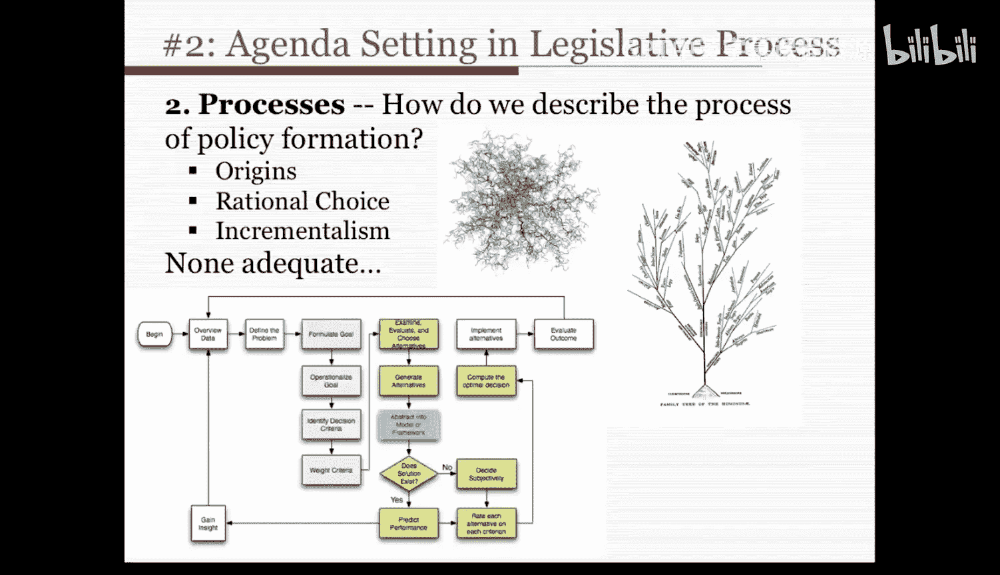

## 📖 课程概述
在本节课中，我们将学习如何运用“有组织的无政府状态”模型和“垃圾桶理论”来分析一个具体的政策制定案例。我们将以美国《不让一个孩子掉队法案》中的“第五编”为例，详细拆解其议程设置和立法过程，帮助你理解这些理论在现实世界中的应用。

---

## 🔍 回顾：有组织的无政府状态
上一节我们介绍了金登如何将垃圾桶理论应用于议程设置。他认为，有组织的无政府状态视角能更完整地理解议程设置和立法过程。

现在，让我们退一步思考：联邦政府的议程设置过程是否真的像一个有组织的无政府状态？它是否符合我们在之前讲座中设定的标准？

以下是判断一个系统是否为有组织的无政府状态的三个核心标准：

1.  **偏好模糊或不一致**：金登认为是的。行动常在明确偏好前就已采取，参与者在立法提案的偏好和优先级上存在分歧。
2.  **技术不清晰**：政府解决问题的方式非常不明确。例如，如何消除学校种族隔离、缩小学业差距、解决儿童贫困等问题，并没有像生产零件那样清晰明确的方案，政策处方的后果也不清晰。
3.  **参与流动性强**：人员流动频繁。参与者的重要性与其职位描述并不匹配，行政部门常参与立法过程，政府外的参与者也不断进出决策过程，因此参与渠道是流动的。

联邦政府似乎符合马奇、奥尔森和科恩所定义的有组织的无政府状态。因此，金登对垃圾桶理论的改编，将议程设置概念化为三个独立的“流”：**问题流**、**政策（解决方案）流**和**政治（参与者）流**。它们在几个关键节点汇聚，正是这个过程设定了立法议程。

金登认为这些流是相对独立的：问题在新闻和立法者关注中时隐时现；政策方案被制定出来，可能搁置数年；政治参与者来来去去；而决策机会（即“垃圾桶”或选择场）在不同时间出现。

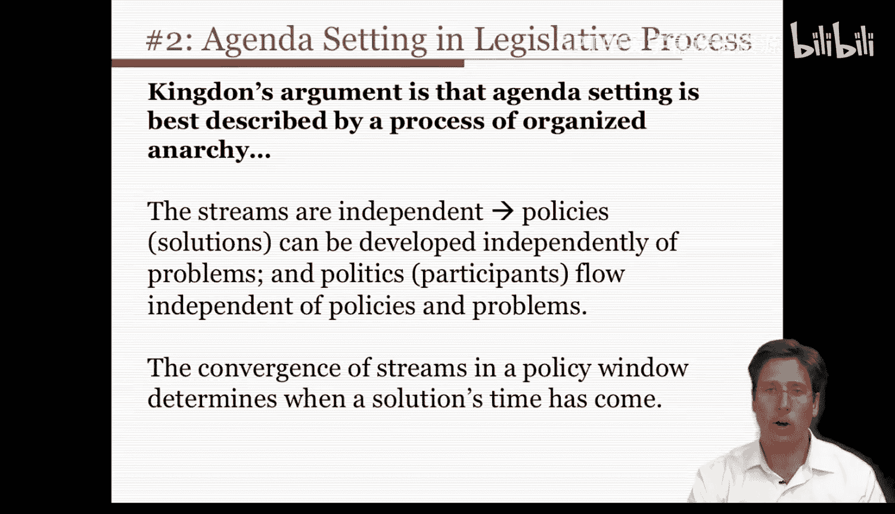

根据金登的观点，这个议程设置的案例显然符合有组织的无政府状态模型。我想重申一个关键点：**这些流的独立性**。政策解决方案的制定，不一定是为了回应某个实际问题；政治流也不一定依赖于已识别的问题。

正如金登在第88页所说：“倡导者们制定他们的提案，然后等待问题的出现，以便将他们的解决方案与之挂钩，或者等待政治流中的发展，使他们的提案更有可能被采纳。”

因此，只有当**政策窗口**打开时，这三个流必须汇聚。也就是说，只有在条件合适时，一个问题才能进入政策议程。

---

## 📚 案例引入：应用垃圾桶理论
你们大多数人都读过约翰·金登的著作，因此我不再重复他将理论应用于特定议程设置实例的细节。相反，我想将垃圾桶理论应用到一个你们可能不熟悉的新案例中。这样我可以提供多个例子，让你们看到该理论如何在不同实例中应用，而不仅仅是一个。

此外，我想让你们知道，当你们为一些选择高级课程的同学进行同伴评估时，你们会看到该理论被应用于密尔沃基教育券计划。这样，你们将拥有另一个案例和应用场景。

在本讲座中，我的最后一个例子将涉及一项近期的政策决策，即《不让一个孩子掉队法案》的**第五编**——“促进知情的家长选择和创新计划”。

简要来说，《不让一个孩子掉队法案》是1965年《初等和中等教育法》在2001年重新授权后的名称。该法案最初是约翰逊总统“向贫困宣战”的一部分，其首要重点是改善经济困难学生的教育。随着时间的推移，《初等和中等教育法》扩展到包括双语教育、原住民社区教育、矫正机构教育、磁石学校、外语项目等。自1964年以来，该法案已被多次重新授权，通常周期为四到六年。我们讨论的这个版本由布什总统签署，名为《2001年不让一个孩子掉队法案》，于2002年1月8日成为法律。

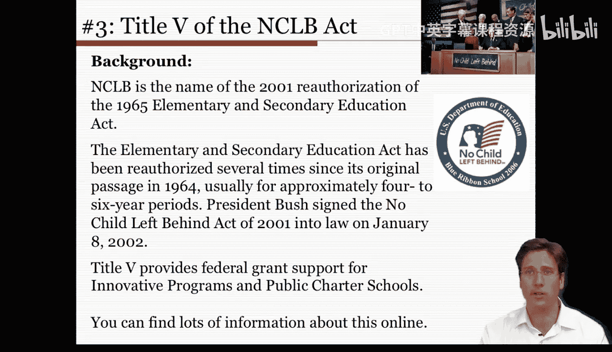

第五编为创新计划和公立特许学校提供联邦拨款支持，并增加了一项新的激励计划，以帮助特许学校满足其设施需求。该部分还包括一项规定，为那些连续两年未达到法案设定的“年度适当进步”或改进标准的学生，提供交通和其他支持，使他们能够转学到特许学校或其他公立学校。这是一项影响美国教育体系深远的广泛立法。

---

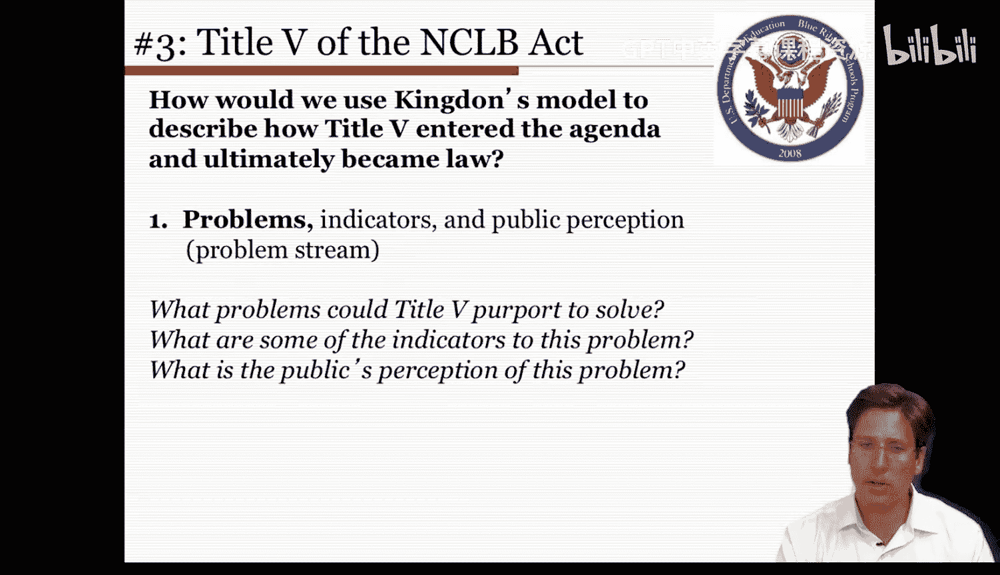

## 🧩 分析框架：三流模型的应用
那么，我们如何使用金登的模型来描述第五编是如何进入议程并最终成为法律的？

首先，我们要审视**问题流**。在任何特定时间，一系列问题可能凸显出来并引起政府的关注。这通常不是因为政治压力，而是因为一些系统性指标声称证明了问题的存在。也就是说，问题不一定是真正的问题，它们只需要在部分公众心中被认为是问题即可。

因此，我们必须问：第五编声称要解决什么问题？这个问题有哪些指标？公众对这个问题的看法是什么？

---

### 问题流分析
让我们依次考虑这些问题并尝试回答。

**第一，第五编声称能解决什么问题？**

以下是可能的问题清单：
*   学校持续失败且无改进迹象。
*   公立学校缺乏创新，而人们认为特许学校是创新的孵化器。
*   公立学校因缺乏竞争而改进压力不足。
*   低收入儿童机会不平等，这些家庭因负担不起私立学校而选择更少，特许学校可能被视为免费的公立择校选择。
*   特许学校支持者声称他们从州政府获得的人均经费比例失调，这也是一个关切点。

在大多数情况下，我们可能会同意这些问题确实存在。但我想让你们理解，**你是否认为它是真的并不重要，重要的是有一部分人群或行动者坚信这些问题存在并为之投入精力**。

**第二，这些问题有哪些指标？**

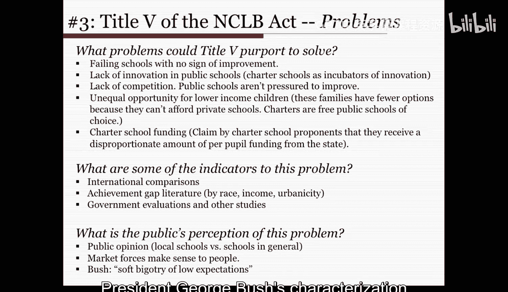

以下是相关指标的清单：
*   国际比较和测试指标：从国家间教育水平和学业成就的比较评估来看，美国在某些方面正在落后。
*   关于学业成就差距的研究文献：指出在种族、收入、城乡或城郊比较中存在差异。
*   政府评估和其他研究：也显示了学校教育中的诸多问题。所有这些都表明问题存在的指标超出了个人意见。

**第三，公众对这个问题的看法是什么？**

当时环境中流传着多种公众看法：
*   普遍认为学校在失败：媒体信息的不断轰炸使人们感觉这可能是真的，尽管他们认为自己当地的学校可能比一般学校稍好一些。
*   大多数美国人对市场力量持积极看法：认为选择是可取的，并可能带来改进。
*   当时存在一种由领导人和知名媒体人物传播的言论：例如，乔治·布什总统提出的“低期望的软性偏见”存在于学校中，因此我们需要解决这个问题。

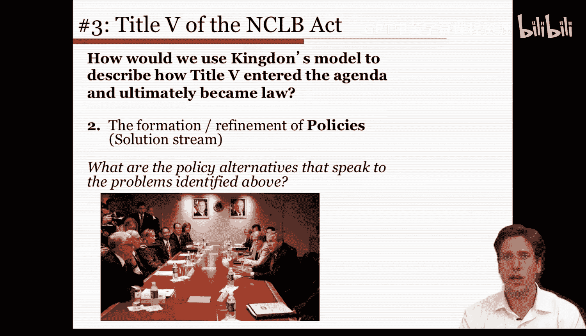

---

### 政策流分析
与《不让一个孩子掉队法案》相对应的问题流在环境中存在的同时，也存在一个**解决方案流**。在这个环境中，提出了各种替代方案和政策，它们可能是相互竞争的替代品。

在政府内部，专家们（包括立法者、工作人员、倡导团体、研究人员和学者）都专注于制定政策提案。正如金登在第117页所说：“想法被提出，法案被引入，演讲被发表，提案被起草，然后根据反应进行修改并再次提出。”因此，在政策世界中，不断有各种针对上述问题的替代解决方案和政策计划被提出。

让我们更仔细地看看这一点。**有哪些政策替代方案可以解决上面识别的问题？**

以下是可能的政策替代方案清单：
*   **教育券**：学生从州政府获得一定金额，可用于支付另一所学校的费用。
*   **促进特许学校**：类似于教育券，提供一定程度的择校权，但仍是公立学校。而教育券甚至可用于私立学校。
*   **公立学校改进**：但如何改进？这里存在技术不清晰的问题。可以专注于改进教学（如教师培训、专业发展、新课程），也可以优化学校结构（如能力分组、缩小班级规模、延长学时），或者建立问责制（如评估年度适当进步、进行年度测试并实施奖惩——这实际上是《不让一个孩子掉队法案》采纳的一种），或者增加资金投入，又或者忽视问题并推卸责任（认为这不是联邦政府的职责，是州政府、学区、学校或教师的过错）。

所有这些都可行的替代方案。在金登的模型中，你需要记住：**政策不一定跟随问题**。这些政策替代方案在许多情况下是独立于我们已识别的问题而制定的。

事实上，《不让一个孩子掉队法案》的大部分内容，包括问责条款，是在比尔·克林顿总统任期内制定的。当时，我所在学院的一位前研究生院教育系成员迈克·史密斯院长担任教育部副部长，他并非共和党人。因此，尽管政治层面存在人员更替等差异，但政策本身早已存在，只是在不同的时间段、由不同的行动者重新采纳。

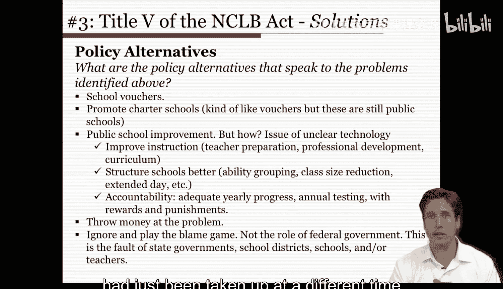

---

### 政治流分析
我们将有组织的无政府状态模型应用于《不让一个孩子掉队法案》时，要看的第三个特征是**政治或参与者流**。

在这里，政治流对应于科恩、马奇和奥尔森所说的决策者流或参与者流。即使一个政策方案与某个问题挂钩，通过也并非必然。党派关切、政策制定者的意识形态分布、利益集团游说等政治因素，都可能阻碍任何提案，无论它与政策问题多么契合。

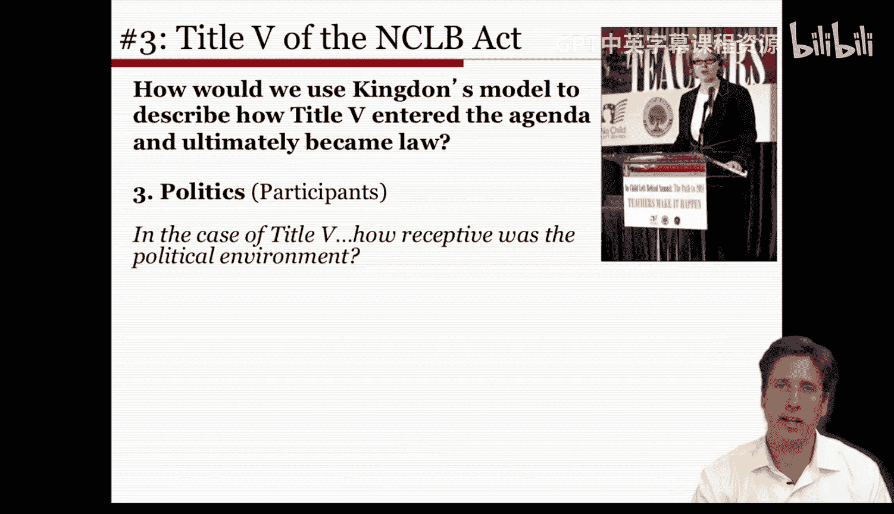

因此，我们必须考虑涉及的参与者和行动者，以及引导他们进入该政策领域的政治因素。

在第五编（即《初等和中等教育法》重新授权）的案例中，该法案于1994年签署，原定于1999年到期。国会和克林顿政府于1999年开始重新授权工作，但在2000年的两次尝试均告失败。

教育是候选人乔治·布什竞选纲领的核心组成部分。布什上任后，其首批行动之一就是向国会提交其教育提案的广泛纲要。他誓言“不让一个孩子掉队”，这在修辞上很难反驳。最终版本的法案几乎没有受到国会批评，实际上在参议院以87比10、在众议院以381比41的票数通过，甚至得到了包括乔治·米勒、芭芭拉·李和泰德·肯尼迪参议员在内的最自由派成员的支持，因此获得了极大的两党支持。

如果你回忆一下我们上面讨论的解决方案或政策替代方案，教育券是一种选择。尽管《不让一个孩子掉队法案》的原始版本包含针对私立学校的教育券提案，但为了争取民主党支持以通过法案，这一提议被放弃了。换句话说，**政治环境接受了最终通过的《不让一个孩子掉队法案》条款，但在比尔·克林顿总统时期则未被接受**。

自那时起，出现了一些批评，主要围绕资金问题，但公众仍然支持该法案的总体措施。因此，当合适的政治参与者到位时，时机就成熟了，即使该法案在早前时期就以非常相似的形式存在过。

---

### 政策窗口分析
有组织的无政府状态模型的最后一个特征在这里也适用，它关乎**政策窗口**。

政策窗口涉及最后期限和我们讨论过的三流汇聚。我们已经讨论了问题流、政策替代方案流和政治流，但这些流必须在政策窗口打开时汇聚，立法才能推进。

可以这样理解：美国国家航空航天局有一个发射窗口，即火箭必须在此时间段内发射，才能进入正确轨道并避开云层和风暴等。如果错过了那个发射窗口，NASA必须等待下一个，并且他们会动员一系列流程来协调并实现那次发射。在金登的模型下也是如此，政策窗口只在特定时间打开，并非无限期存在。

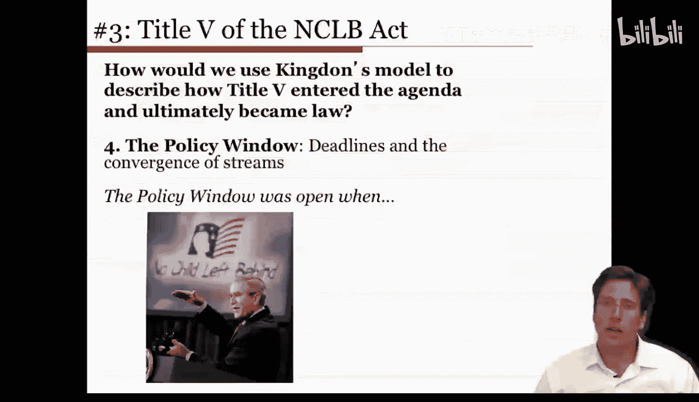

**最后期限**限制了问题和替代方案得以实施的时间。例如，决策通常必须在立法会议结束前做出。未能做到这一点意味着整个过程必须在下一届会议开始时重新开始。此外，立法机构是由决策者组成的系统，决策者可能因选举而更换。一组有利的决策者可能消失，在下一任期开始时被一组新的、可能不太愿意支持第五编条款的决策者所取代。

在第五编的案例中，当存在多种政治行动者时，政策窗口是打开的。例如，当时共和党在国会占多数，并且有一位共和党总统。在克林顿执政末期，虽然有一位民主党总统，但国会是共和党控制的，两者并不一致。此外，在2001年布什执政时期，公众普遍对公立教育感到失望，特许学校运动开始显现出良好势头，该法案的支持者策略性地使用了语言（甚至法案名称“不让一个孩子掉队”就体现了这一点），州问责法律（如加州和德州）也取得了成功。但大多数时候，该法案的政策窗口是关闭的，因此这确实是一个短暂的窗口。所有行动者都能达成一致，将他们的支持和精力投入到这项法案上，并将其与低学业成就和成就差距等具体问题挂钩。

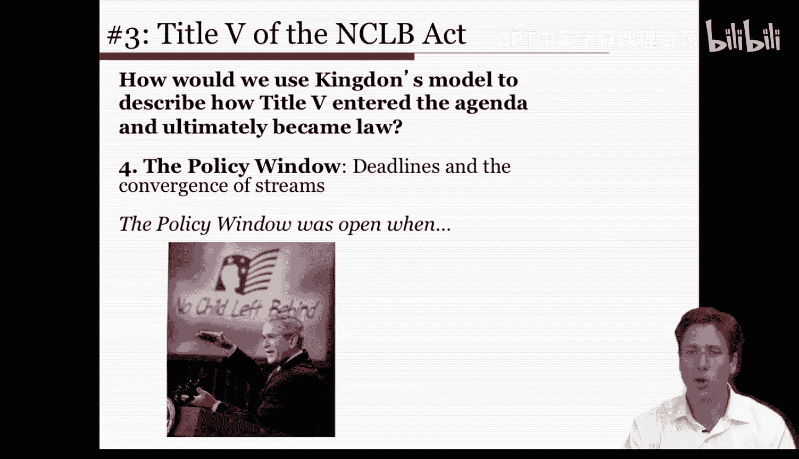

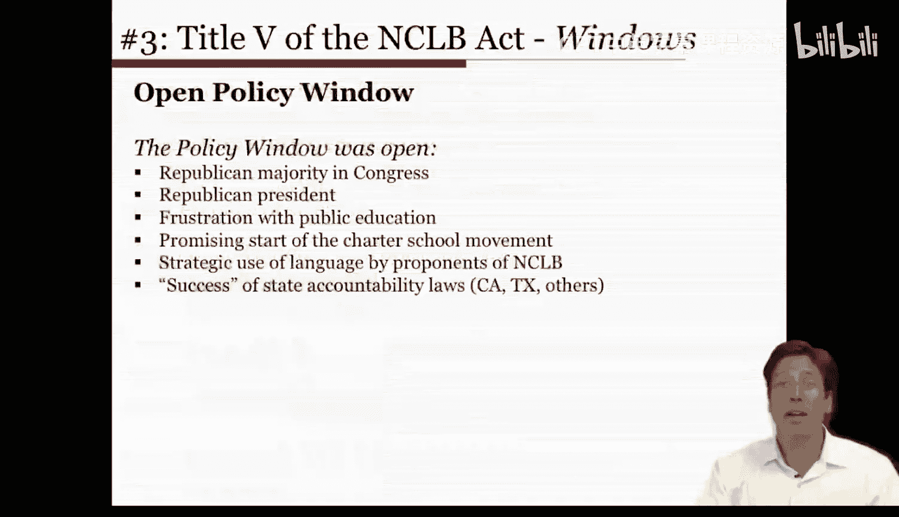

---

## 📊 总结与整合
最后，如果我们将金登模型的四个特征放在一起，可以看到如下总结（尽管信息密集，但可能有助于你理解）。

| 特征 | 在《不让一个孩子掉队法案》第五编中的应用 |
| :--- | :--- |
| **问题流** | 公众对教育失败、缺乏创新、竞争不足、机会不平等的认知；国际测试比较、成就差距研究、政府报告等指标。 |
| **政策流** | 早已存在的多种解决方案：教育券、特许学校、问责制（年度测试与奖惩）、增加资金、教学改进等。这些方案独立于当时的问题被开发。 |
| **政治流** | 共和党总统与国会多数；两党广泛支持（甚至包括自由派）；为争取支持放弃了最具争议的私立学校教育券条款。政治环境在布什时期接受，在克林顿时期则否。 |
| **政策窗口** | 短暂的汇聚时机：公众对教育不满、特许学校兴起、政治力量对齐、法案重新授权期限临近。窗口打开时，三流得以耦合。 |

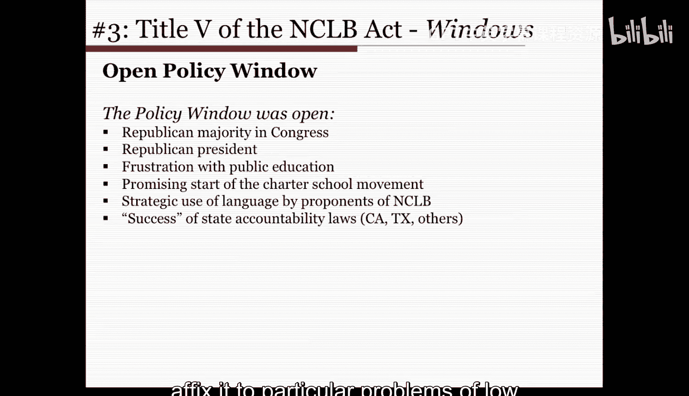

希望通过对这些具体政策及其与垃圾桶理论关联性的总结，能帮助你理解它们如何构成有组织的无政府状态，以及可能如何更好地管理它们——无论你是作为爱好者，还是作为处理自身事务的务实者。

---

## 🎯 本节课总结
在本节课中，我们一起学习了如何运用“有组织的无政府状态”和“垃圾桶理论”分析真实的政策制定过程。我们以《不让一个孩子掉队法案》第五编为例，详细剖析了**问题流**、**政策流**、**政治流**以及关键的**政策窗口**如何相互作用，最终促使一项法案成为法律。关键要点在于理解：政策制定并非线性的问题-解决方案过程，而是多种独立因素在特定时机下的复杂耦合。