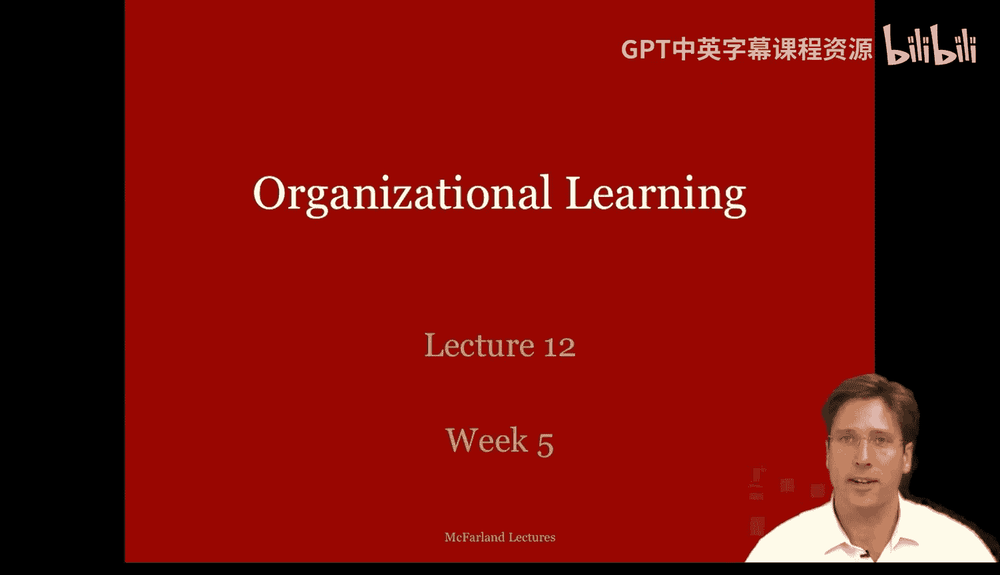
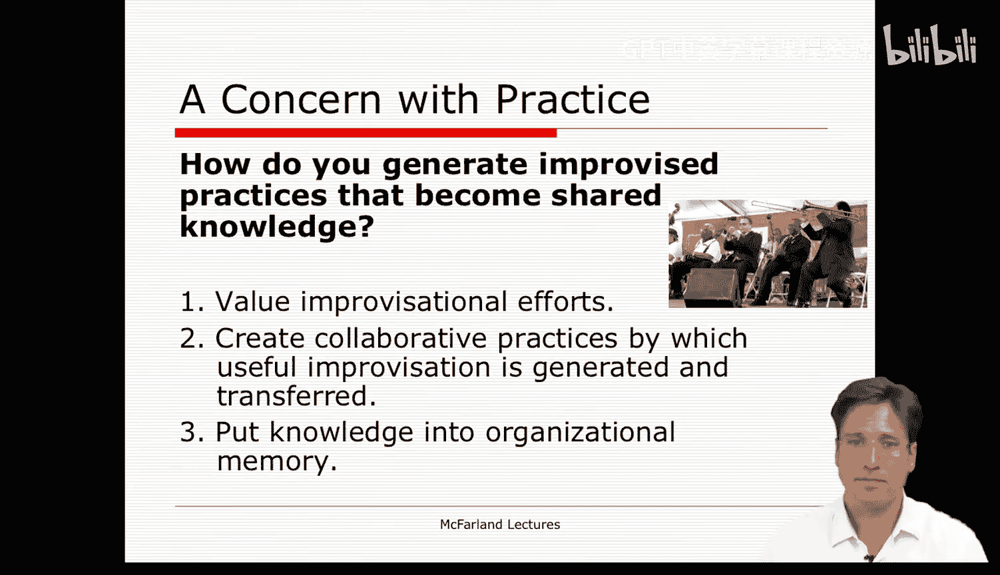

#  042：组织学习 - 第一部分 🧠

在本节课中，我们将要学习组织学习的理论及其内涵。我们将探讨组织如何从经验中学习，以及这种学习如何通过结构、人员、技术和文化来体现和传递。

---

在开始之前，让我们简要回顾一下“组织化无政府状态”理论，通过重述一个课堂练习来理解其运作。

作为对“组织化无政府状态”的总结性体验，我每年都会尝试在课堂上为学生创造一个“垃圾桶决策”情境。我会召集学生开会，讨论课程及其评分政策。我甚至告诉他们，如果他们能就一种新的课程形式和评分程序达成一致，并能说服我这将改善他们的学习体验，我就会采纳。我是认真的，如果他们达成一致，我真的会采纳他们提出的实际修改。

为了帮助这个过程，我让他们识别各种问题，从而创建了一个“问题流”。他们识别的问题包括：阅读材料太多、讲课内容进行得太快、没有足够时间进行个人项目、没有足够时间进行小组项目和讨论等等。

然后，我让学生们列出他们希望在课程中看到的政策变化，从而也创建了一个“解决方案流”。他们常常要求允许重写论文、给每个人的成绩加10分（很聪明）、将我的讲义发布到网上，甚至与全班分享优秀论文。但很多时候，这两个流之间几乎没有联系，问题和解决方案并不相关。例如，前两个解决方案（为获得更好成绩而重写论文和给每人加10分）似乎并没有解决他们之前列出的任何问题。最后一个方案（发布优秀论文）解决了什么问题？只有发布讲义这个方案实际上解决了他们列出的“讲课太快”这个问题。

接下来，我们讨论每个解决方案。很快我们就看到能量附着在某些方案上，但在讨论中，随着人们识别出该方案可能带来的新问题，能量就消散了。例如，如果按曲线评分，给每人加10分的政策会怎样？有人甚至可能注意到，如果每个人都得A，就会产生另一个问题：如果每个人都得A，我如何为希望申请博士项目或找工作的学生写推荐信？他们之间如何区分？

其他解决方案也是如此：如果我给学生讲义，是否意味着他们会停止阅读？如果我给他们优秀论文，他们是否只会模仿格式而缺乏创造性？如果我允许小组项目和小组评分，可能不公平，因为有些人比其他人做得更多，而且同样，如果采用小组评分，我如何写推荐信？因此，每个解决方案都会带来新的问题，使其可行性降低。事实上，这常常是组织化无政府状态中出现的讨论类型，也是人们试图阻止群体采纳特定解决方案时使用的策略。

在许多方面，这就是为什么我的课程在评分政策和形式上从未真正发生过剧烈变化的原因。不仅是学生，还有我，都会对每个提出的解决方案提出新问题。而且，我们只有20分钟来做这个决定，所以我们从未讨论过所有解决方案，只有最直言不讳的学生的关切被表达出来。解决方案的模糊性、它们与新问题的联系以及时间的缺乏，所有这些因素共同作用，使得雄心勃勃的改革似乎变得次要，最终只形成“修正案”。简单的解决方案最终也可能显得相当复杂。最终，班级倾向于只同意一些微小的改变，例如学生可以修改一次论文、可以做个人项目，以及讲义在课后发布。

所以最终，你们大多数人都亲身经历了组织化无政府状态，只是当时没有意识到。当你下次参加会议，和一群平级的人在一起时，环顾四周，观察过程如何展开，并记住你在组织分析中学到的教训。你们中的许多人现在有能力、有知识去操纵、更充分地体验那种环境，并将其引导到你希望的方向。

---

当然，本讲座的主题不是组织化无政府状态，而是组织学习。在本讲座中，我们探讨什么是组织学习视角。

从最广义上讲，组织学习视角关注的是适应和从经验中学习。但组织是如何学习的呢？

基本上，组织通过将历史推论**编码**到组织结构、人员、技术和文化中来学习。这些东西指导着行为。因此，组织有效地反思什么做得好或不好，然后将这些知识编码到其组织要素中。通过这种方式，组织记住了经验。最佳实践成为规则、惯例和角色；伟大实践成为技术或课程的一部分；伟大实践成为信念和规范的一部分。这些引导组织中的个体记住并传递这些知识。

多年来在教授组织学习时，人们常常将其视为个体学习。需要强调的是，它确实发生在组织层面。毫无疑问，个体和团队学习与组织学习的概念相关，但试图编码经验并将其传递给员工，以期不断提高绩效的，是公司这个组织。

在我的讨论中，我借鉴了许多学者的著作，从约翰·西利·布朗到保罗·杜吉德，再到吉姆·马奇、琳达·阿吉里斯、露西·萨奇曼，甚至朱利安·奥尔等。我只是想提供一个你可以理解并应用于你所参与的组织环境的一般框架。特别是，我要求你们阅读布朗和杜吉德关于实践与学习的文章。

在那篇文章中，布朗和杜吉德将组织学习与组织过程模型进行了对比。如果你还记得，这暗指艾利森的组织过程模型，该模型将组织视为遵循惯例和标准操作程序。

现在，布朗和杜吉德描述了惯例或标准操作程序的两个特征，并想对它们进行对比。一方面，有**明示规则**，就像计算机程序中的指南。这是组织过程模型中的规则概念，它是一种脚本。另一方面，规则是**实践行为**，理解和知识的核心存在于标准操作程序的这些实践行为中。

因此，根据布朗和杜吉德的观点，组织过程管理者会让公司精简其标准操作程序，专注于核心任务，然后将其明确阐述清楚。他们会移除冗余的、相互冲突的以及无意义的程序。无意义规则的一个好例子是美国所谓的“蓝色法律”，这些是多年前制定的法律，虽然已无人真正执行，但仍保留在法律文本中。例如，堪萨斯州有一条法律说周日不能吃蛇，康涅狄格州有一条说周日不能吃泡菜，马萨诸塞州规定牛不应该在波士顿公地吃草。

我旁边是1911年加拿大安大略省周日法律的例子，它只是让你了解规则以及规则何时会过时。

相比之下，组织学习视角也同意标准操作程序很重要，但它关注这些程序的**实践**，并认为正是通过这些实践，它们才具有意义、相关性和效果。反之，正是由于缺乏实践，才使得惯例变得无关紧要并被遗忘，它们不再是知识。事实上，许多组织程序甚至无法在书中查到，即使能在书中找到，仅仅阅读它们也不会带来理解和知识。找到正确的程序很难，甚至可能不存在；而良好地执行它则更难，因为每个新情况都与之前不同。你必须不断调整规则和程序以适应变化的情况和实际工作经验。没有实践和经验，你就没有关于工作的真正知识。

让我们以自卫套路为例。它们作为套路被学习，但在对练中实践，并与其他套路结合使用。也就是说，它们不仅仅是书本上读到的，而是在学生成为专家格斗者之前，经过实践和应用。因此，组织学习不同于组织过程方法，它认为**体验式学习**、**边做边学**，而不是“学习关于某事的知识”，是使复杂组织运作的核心手段。

可以说，对于采购、运输、仓储和账单等简单任务，这种学习可能不太重要，因为这些操作有明确定义的流程和可衡量的输入输出。但体验式学习对于管理和研发至关重要，因为那里的生活不那么顺序化和线性化，输入和输出不明确。在那里，理解、解释和解读是争论的焦点，并且受到高度重视。要掌握这一点，需要审视惯例和工作流程中的实际活动和实践。

因此，实践是通向理解、共享知识和专业技能的途径。布朗和杜吉德以施乐复印机维修专家的计算机帮助热线为例来说明这一点，其中很多内容借鉴了朱利安·奥尔和露西·萨奇曼的研究。他们讨论的研究路线是，机器手册通常无法告诉你需要知道的东西，无论你如何编纂，就是不够。你可以为施乐复印机可能出现的每个问题写出程序，但要求人们阅读这些手册作为成为维修专家的手段，仍然效率极低且非常痛苦。相反，大量的专业理解来自实践，即自己动手进行维修和工作。

举个例子，想想医生如何通过住院医师经历学习，律师通过实习学习，教师通过教学实习学习，应急人员通过模拟学习。希望你们中的许多人也能通过应用在本课程中学习。

---

工作实践有几个区别于你在教科书中读到的明示规则的特征，了解这些特征很重要。

以下是这些特征：

1.  **实践是协作性的**：实践需要协作，并产生不可分割的成果。例如，在施乐复印机的案例中，它涉及与客户交谈、与机器互动并修复它们，以产生期望的输出。
2.  **实践通过故事被分享和理解**：当人们执行一项活动时，他们会形成一种叙述或故事，理解发生了什么以及为什么。在许多情况下，这些就像形式化的表述，我们通过表格、图形、模型等来呈现论点。像这样的故事很容易被不同的人记住、传递和获取。它们不仅传递具体信息，还传递因果关系和过程的原则。因此，这种实践和理解的知识与我们的记忆有特殊的联系。
3.  **实践包含通过使用进行的即兴创作和适应**：组织学习的一个核心方面是个体适应和学习在特定情况下应用规则。当我们这样做时，我们即兴发挥，通过这种方式，我们可以将世界的具体细节与组织的一般图式联系起来。它不仅仅是某种编纂的抽象事物，而是我们在具体情境中适应过的东西。即使组织不承认这种即兴创作的过程，它也会持续发生。例如，施乐公司的维修代表学习了一些解决问题的技巧和窍门。教师和学生也是如此，他们根据情况调整课程，在不同的语境下以不同的方式讲同一个笑话。基本上，为了完成工作，存在着无数微小的、实际上的“颠覆”形式。

---

如果成功的实践和知识涉及即兴创作，那么我们如何在组织内鼓励其发生和传递？也就是说，我们如何设计一个会学习的组织？

你可以做很多事情，我仅列举几项。

以下是几种方法：

1.  **重视即兴创作的努力**：如果一个组织忽视或贬低即兴创作和规则适应，那么这些适应无论如何都会发生，并成为对正式组织的一种抵抗形式。不要惩罚即兴创作，而是要寻找惯例与其即兴执行之间的脱节。这种情况发生在哪里？标准操作程序说一套，人员做另一套的地方，你应该关注那里并修订那些惯例，将即兴创作视为改进的手段。
2.  **创造协作实践，以产生和传递有用的即兴创作**：你应该接纳即兴实践，并建立一种机制来发现哪些实践效果好，然后尝试将其传递给他人。例如，在施乐公司的案例中，他们有一个帮助台，接听客户关于机器问题的电话。他们没有要求员工在手册中查找每个问题，而是让专家和新手坐在同一个帮助台旁。这样，他们就有了相邻的座位和电话号码，能够互相提问，获取专家的经验法则和隐性知识、默会理解，并进行传递。这些内容并不在手册中。对这种成功即兴创作的重视和学习，使得组织记忆能够通过参与者不断改进和传递，知识实际上被编码在参与者身上。
3.  **将成功的适应和知识纳入组织记忆**：那么，你如何保留在协作中产生的知识？如何传递关于某事如何运作良好的知识？即兴知识具有非正式性、寿命短的特点，会很快从记忆中消退。然后人们效率低下，一次又一次地重新发明解决方案。因此，建立一种传递和记住这些知识的机制非常重要，以避免重复劳动。什么样的社会组织鼓励即兴创作和知识的产生与理解，并确保其被分享和存储？一个支持协作、建立横向联系并提供讨论工作实践机会的组织。一个开发实践者数据库的组织，通过这种方式，它认可并重视实践知识的创造，并帮助成员使用它，从而无需一次又一次地重新发现。同样，施乐公司通过将新手和专家安排在一起构建帮助台，有助于将知识传递给新员工。此外，你可以想象，在当今的技术世界，我们可以使用邮件列表，生成实践者知识库，使其成为可访问的数据库。你可以在 Quora.com 上找到这样的例子，在那里你可以发布任何问题并获得技术和实用的解决方案；对于教育工作者，你可以在 Curriki.org 上看到类似的例子，人们在那里发布课程教案并获得反馈和评价。因此，有方法可以为实践者知识创造记忆。如果你能在你的公司中开发出这样的方法，你就创造了更强大的组织实践记忆。

---

在本节课中，我们一起学习了组织学习的核心概念。我们了解到，组织学习不仅仅是个人学习的总和，而是通过将经验编码到结构、人员、技术和文化中来实现的。我们区分了明示规则与实践行为，认识到真正的理解和知识来自于“边做边学”的体验式过程。实践具有协作性、通过故事分享、并需要即兴适应。最后，我们探讨了如何通过重视即兴创作、促进协作实践以及建立组织记忆系统，来设计一个能够持续学习和改进的组织。