#  043：组织学习（第二部分）📚

在本节课中，我们将继续探讨组织学习的相关话题。我们将学习如何通过**学习曲线**来衡量组织的学习效果，了解组织如何**遗忘与记忆**知识，并认识**实践社群**在促进学习中的关键作用。

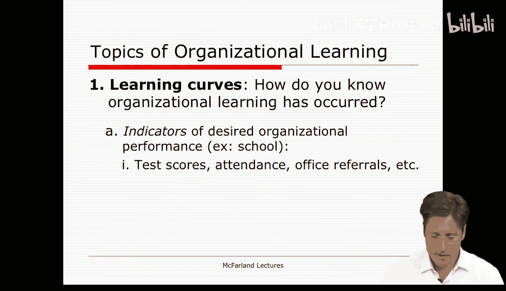

---

上一节我们介绍了组织学习的基本概念，本节中我们来看看组织学习研究文献中提出的几个具体话题。

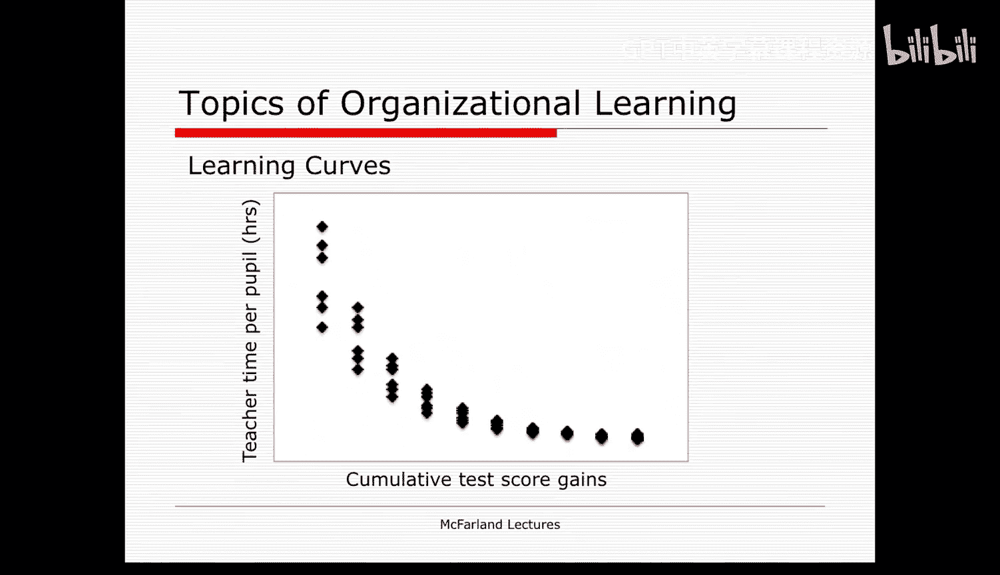

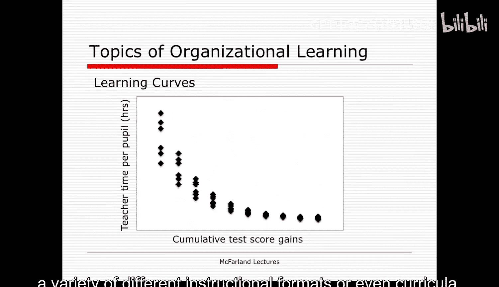

第一个话题是关于**学习曲线**的。组织学习领域的专家会问：我们如何知道组织学习发生了？

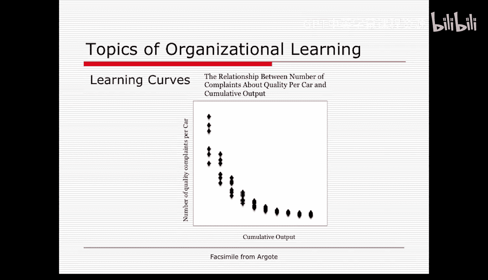

我们以学校为例，因为大家对此都比较熟悉。学校会使用哪些指标来表明其得到了改进并积累了有用的知识？

以下是一些可能的指标示例：
*   学生考试成绩的提升。
*   学生出勤率。
*   因行为不当被送往校长办公室的**转介次数**。
*   教师教学效率的提高，例如教师花费在每位学生身上的时间与学生累计收获的比值。

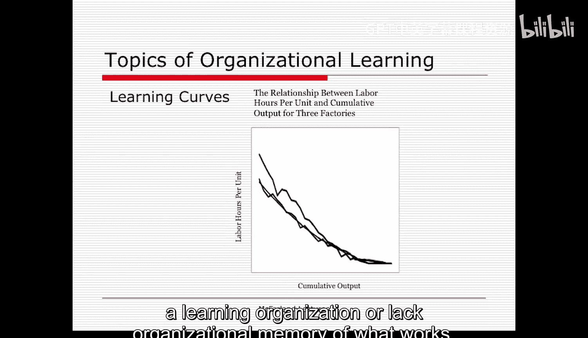

现在，如果我们把这些数据绘制成图，可能会看到类似下图的情况。

这大致就是我们希望看到的趋势。值得注意的是，教师最初可能效率不高，花费大量时间但学生成绩提升有限。但随着时间的推移，他们可以在这方面不断改进。

我们看到一条学习曲线：教师花费在每位学生身上的时间减少，但学生的考试成绩提升更大。我们可以想象，对于各种不同的教学形式甚至课程体系，都可能存在这种类型的学习曲线。

不过，在制造业中可能更容易想象这种情况，比如生产汽车或飞机，目标是减少投诉或召回次数。琳达·阿盖特在她的书中使用了类似的一组图表。但同样可以应用于学校，例如以Y轴表示逮捕次数或办公室转介次数。

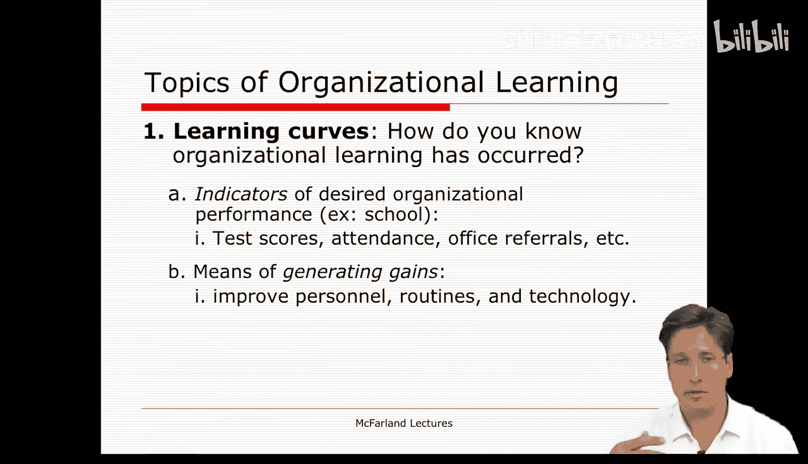

然后，我们可以为多个公司或学校设想这种曲线，辨别哪条曲线的斜率更陡峭。更陡峭的曲线表明该组织正在反思其表现，并开发改进或培养专业技能的方法。因此，一些曲线更陡峭，意味着学习速度更快，或者至少具备了可能促进学习的程序。而那些增益平缓的曲线，则可能意味着该组织学习能力较弱，或者缺乏关于有效方法的组织记忆。

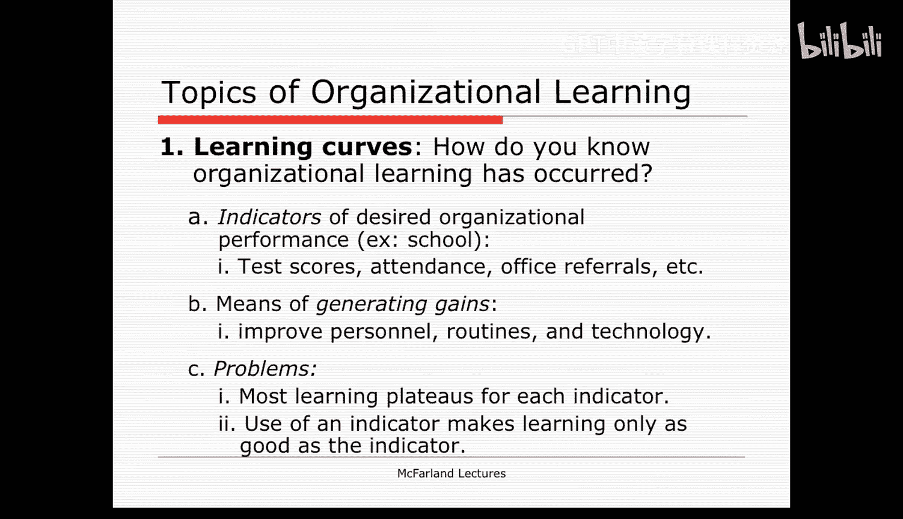

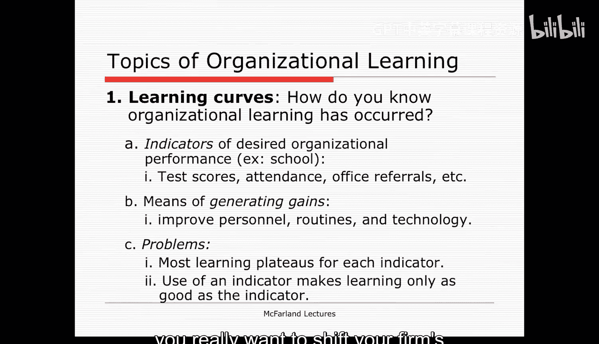

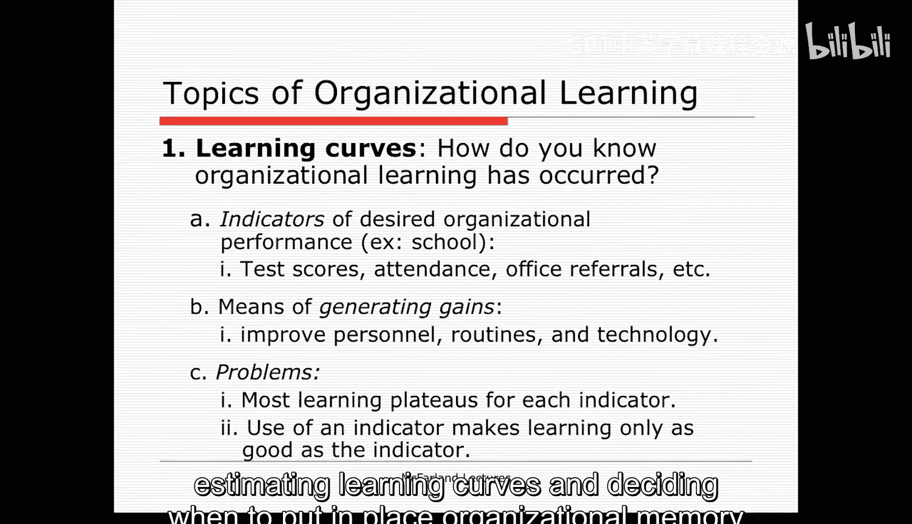

那么，如何在这些学习曲线上产生增益呢？有哪些技巧可以产生更有效、更高效的方法来教授一堂课，或者用更少的时间和金钱产出更多成果？我提出这个问题，是因为组织学习的管理者需要考虑参与者学习和改进的途径，以及反映这一点的指标。

既然我们对学习指标有了一些概念，问题就变成了：如何在那些学习曲线上产生增益？有哪些技巧可以产生更有效、更高效的方法来提升学生的成绩？我提出这个问题，是因为作为组织学习的管理者，你需要考虑参与者学习和持续改进其实践的途径。

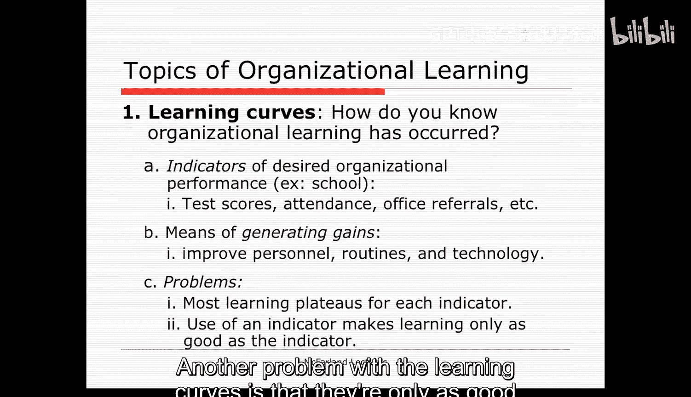

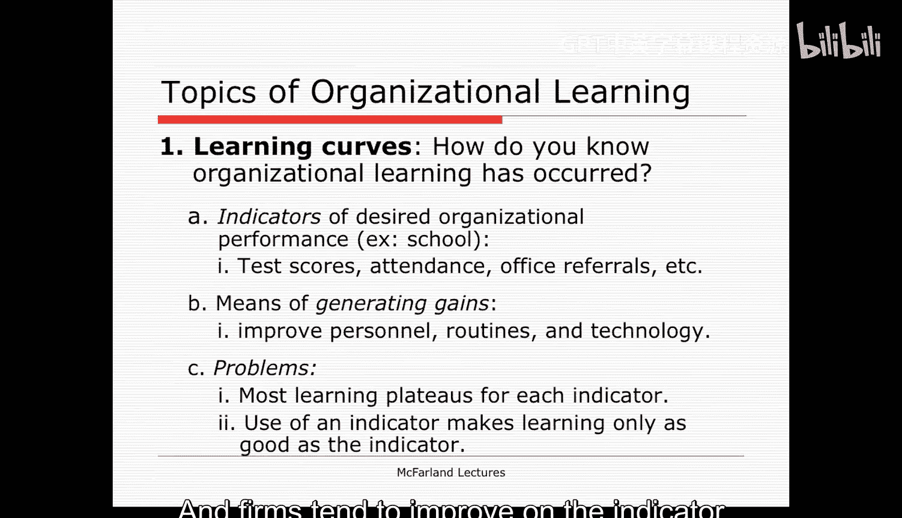

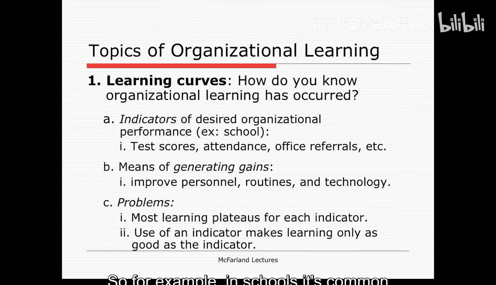

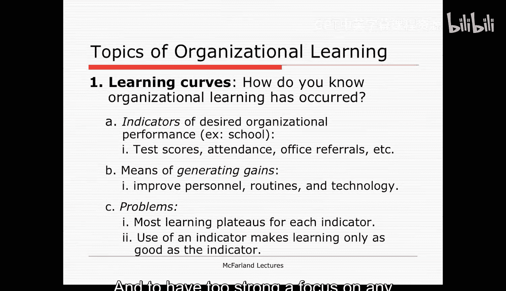

以下是管理者可以考虑的一些方法：
*   **改进人员**：例如引进新人才，通过专家与新手的指导计划来防止初始的启动培训成本，或者改进招聘以吸引更优秀的人才。
*   **改进工作流程**：例如设计更好的任务，移除陈旧低效的任务，并让新任务变得熟悉和可重复执行，从而提高效率。
*   **提供讨论机会**：提供机会讨论工作流程，并考虑如何改进；如果达成共识，就将其记录下来。
*   **改进技术本身**：例如获得设计更好的教科书，改善物理布局等。

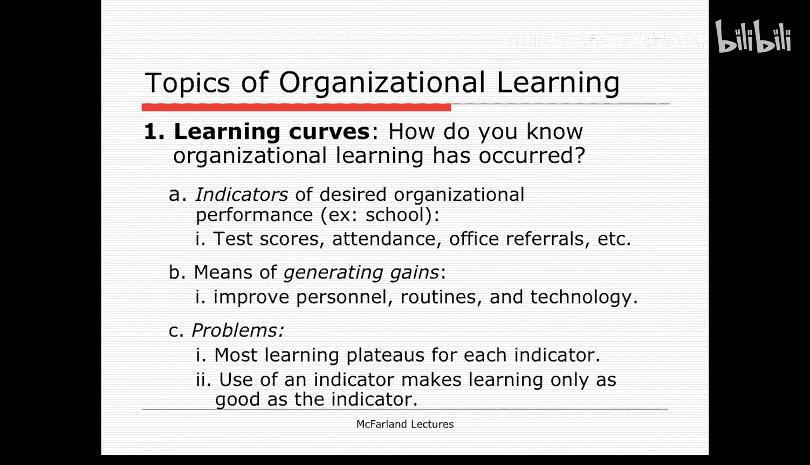

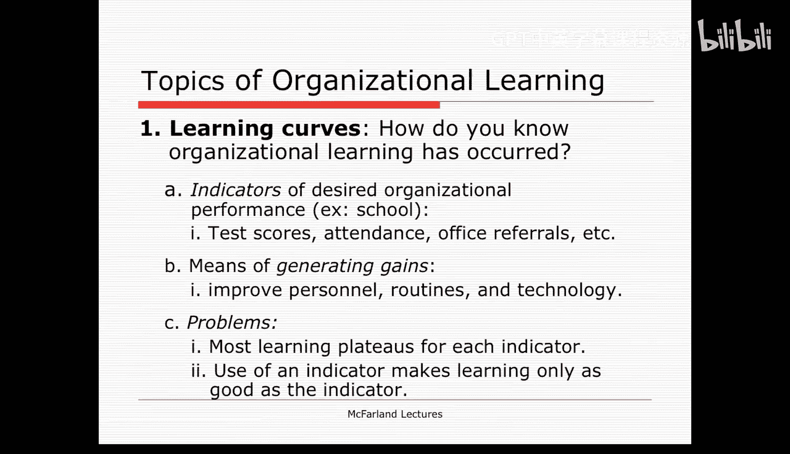

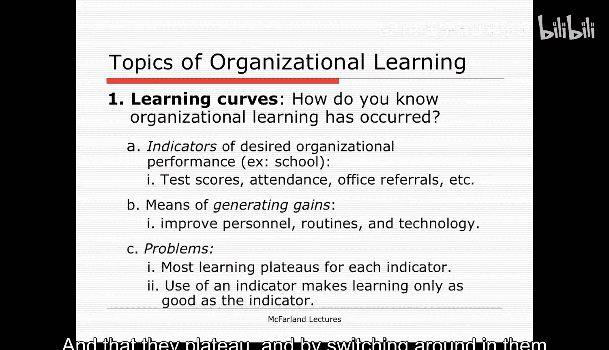

因此，确实存在改进组织学习和学习曲线增益的方法。但即使你产生了增益，重要的是要记住，学习曲线经常会达到**平台期**。我们通常先解决最简单的问题，以最小的努力获得最大的收益，然后改进就会逐渐减少，我们会陷入收益较小的复杂问题中。

因此，作为组织学习的管理者，你确实希望在组织学习开始进入平台期后，转移公司的关注点。例如，学校改革者可能希望从一项改革转向下一项，评估学习曲线，并决定何时建立组织记忆和稳定的程序，以确保这些增益得以保留和记住，然后他们希望转向其他关注点。

学习曲线的另一个问题是，它们的好坏完全取决于所使用的指标，而公司倾向于改进现有指标，却忽略了其他问题。例如，在学校里，众所周知，在高风险测试的压力下，教师会“为考试而教”。但并非总是清楚这些测试是否衡量了我们希望衡量的内容。有些测试只衡量智力发展的一个狭窄范围，过分关注任何单一考试，可能导致在其他智力活动（如体育、音乐或物理）上花费的时间减少，而这些可能不被这些考试覆盖。因此，你必须记住，学习曲线并非万能药，它们存在平台期等问题。通过在不同指标间切换，我们通常可以在多个维度上优化学习，只要我们建立了程序来记住我们所学到的东西。

---

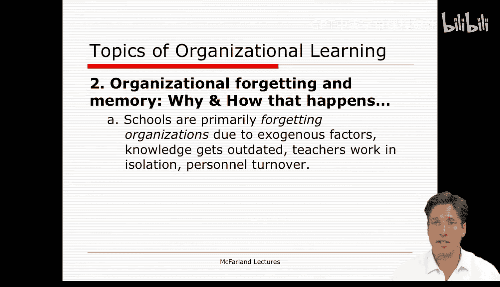

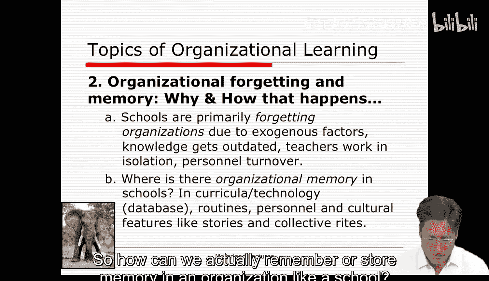

这引出了组织学习的另一个话题：**组织遗忘与记忆**。组织中的遗忘和记忆为何以及如何发生？知识贬值和知识存储的条件是什么？

基本上，让我们再次以学校为例，因为很明显它们主要是遗忘型组织。我们必须问：为什么它们是遗忘型组织？它们是如何遗忘的？原因有很多。通常是因为外部因素造成干扰，阻碍从业者记录有效的方法。例如，现在芝加哥有教师罢工，可能还有诉讼、奇怪的日程安排、特殊的学校日或其他事件，这些都可能阻碍他们专注于记录这些实践并与他人分享。

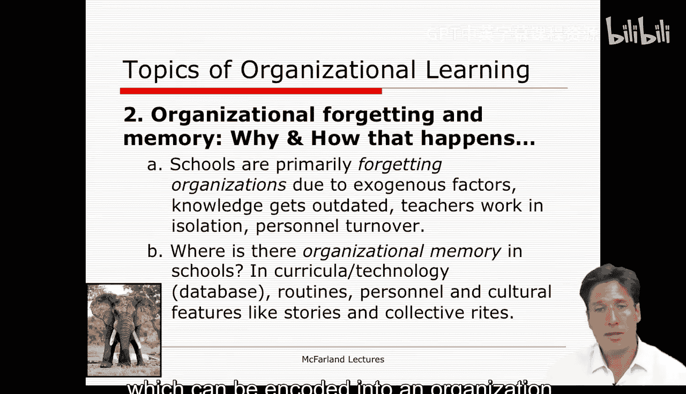

另一个原因是，旧知识面对新受众时常常变得过时，旧方法不再适用。教师的知识会过时。我不能再用我那些蹩脚的90年代笑话来让学生兴奋和投入。我需要学习最新的方法以保持与时俱进。在我的研究中，我必须不断重新培训自己，以免落伍。学校遗忘的另一个重要原因是其人员相对孤立地工作。通常每个教师都有自己的教室，他们几乎没有时间与同事分享哪些方法有效或无效。可能我做得非常好，但隔壁教室或走廊尽头的同事从未听说过。最后，人员流动是另一个问题。它可能导致编码在参与者身上的专业知识流失。不幸的是，这在美国贫困学校中相当普遍，那里的教师流动率很高。我们有像“为美国而教”这样的项目，引入临时教师任教一两年，但他们最终也会离开。他们可能在某种程度上是成功的，但那些真正成功的实践并没有被保留下来，因为这些人又离开了。

那么，我们如何才能在像学校这样的组织中记住或存储记忆呢？

我们可以在多种地方做到这一点。以下是几种存储组织记忆的方式：
*   **技术或课程材料**：非常适合存储关于成功实践的知识，但并不总是容易获取，而且往往保持相对静态。维基和技术报告可见性稍高，但往往不会被采纳，甚至在组织内也不广泛传播。
*   **成功的任务和流程**：可以编码到组织中，但它们不如课程稳定。例如，团队教学可能是一种在某些情况下能带来巨大回报的新流程，但其实施方式可能差异很大，同样的积极回报可能不会出现在学校的其他地方。
*   **人员**：是存储记忆和传递知识的绝佳载体。但如果他们离开组织，就会把知识带走。因此，组织记忆不仅仅是思想的数据库，更是**拥有经验的知情者的数据库**。你需要思想和培育它们的人，那些知情者。因此，留住培训他人的关键人员是构建组织记忆非常重要的手段，尤其是当所需知识是**隐性**的、难以编纂和理解时。
*   **文化特征**：如故事和社区仪式，可以是保存组织记忆的好方法。但它们可能容易遗忘，就像口述文化一样，并且可能过分关注特定的个人，如组织中的模范人物或弃儿，而不是实践情境。你可能需要一个关于实践者工作实践以及进展顺利或不顺利的情境的数据库。

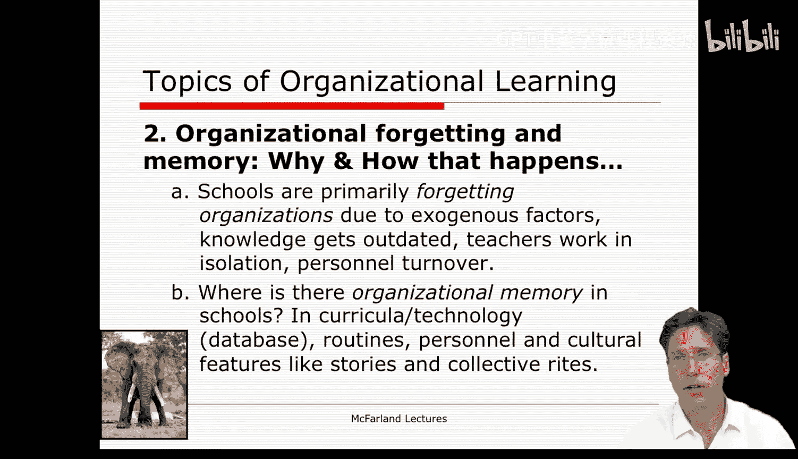

正如我在本讲座前面提到的，我们现在确实拥有计算手段和互联网手段来存储各种实践者知识。例如，对于教育机构，`curki.org` 可能是一种存储成功课程的选项。但还有其他方式，你可以想象各种邮件列表，人们在那里发布问题，并根据是否有用进行评级和解决，这些可以被不同组织的实践者搜索到。

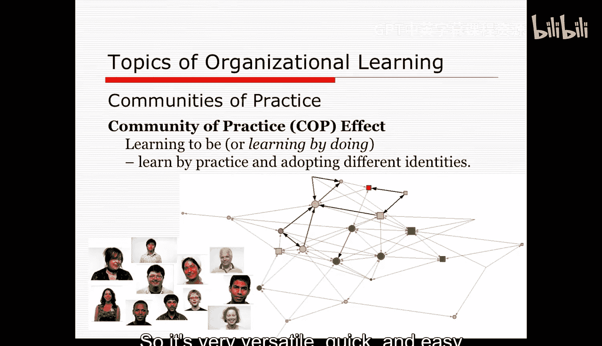

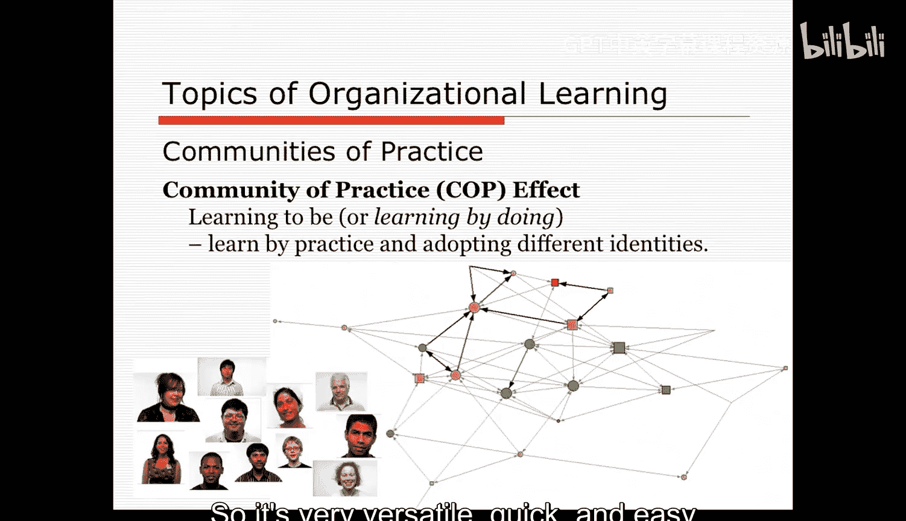

---

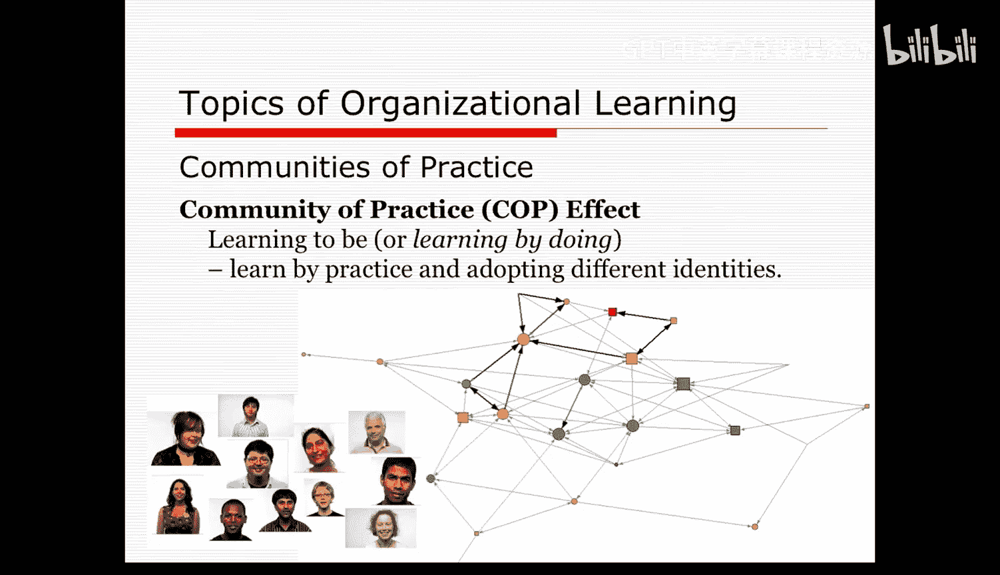

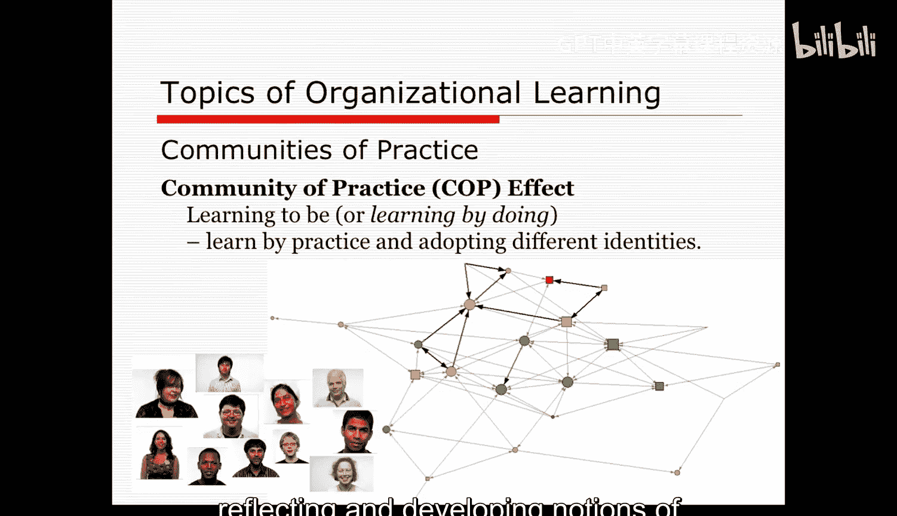

在**实践社群**中，学习是一种需求驱动、身份形成的社会行为。因此，它形成了从事相同任务的凝聚力群体。在这里，知识传播迅速，易于吸收，但也可以被协调、协商，然后以各种方式传播和应用。因此，在这些情境中沟通非常灵活、快速和容易。通过进入社群，参与者建立了强大的强化纽带，产生了一致性和某种共享身份。这意味着成员认同该组织，并以此为基础在该组织内进行解释、判断、反思和发展理解概念。

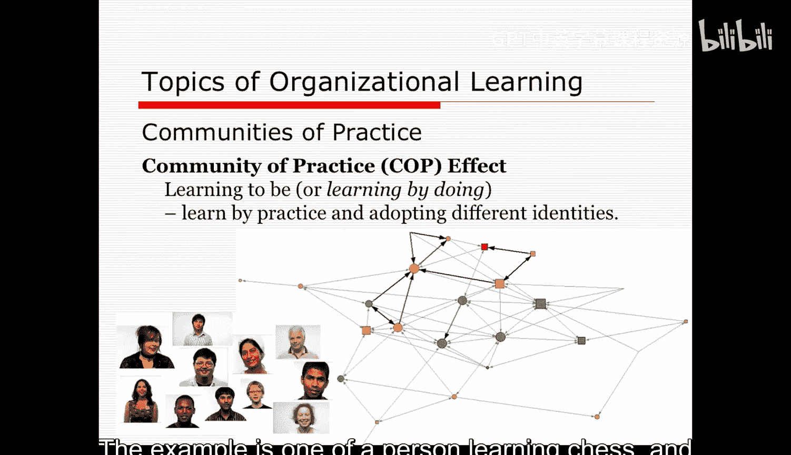

现在让我给你一个进入强化关系社群的例子。这个例子是关于一个人学习国际象棋，并逐渐参与到一个象棋联赛中。我们大多数人不能仅仅拿起一本象棋手册就从书中学到东西。我们发现观看棋手下棋然后自己和他们一起下要快得多、容易得多，通过自己承担棋手的角色。假设随着时间的推移，我们进入并反复下这些棋，变得更好，然后我们开始参加联赛，增加与其他棋手和专家的互动，进一步发展我们自己的专业知识。随着时间的推移，我们甚至可能成为核心成员，并接受棋手的身份，这成为我们自我的核心部分。它甚至可能成为我们拥抱的职业。

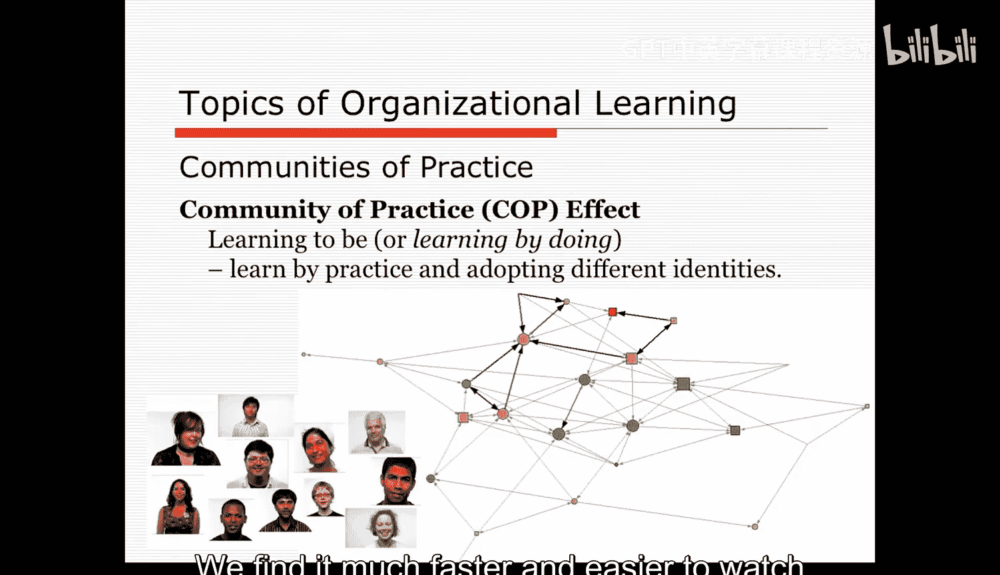

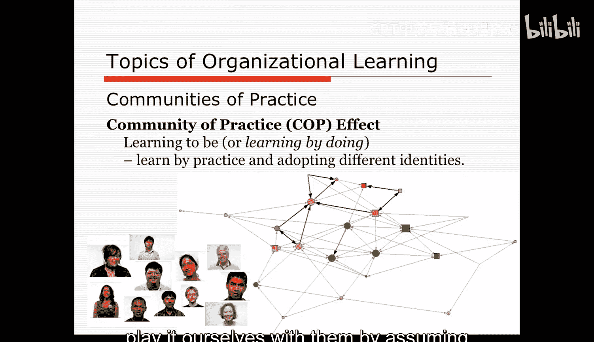

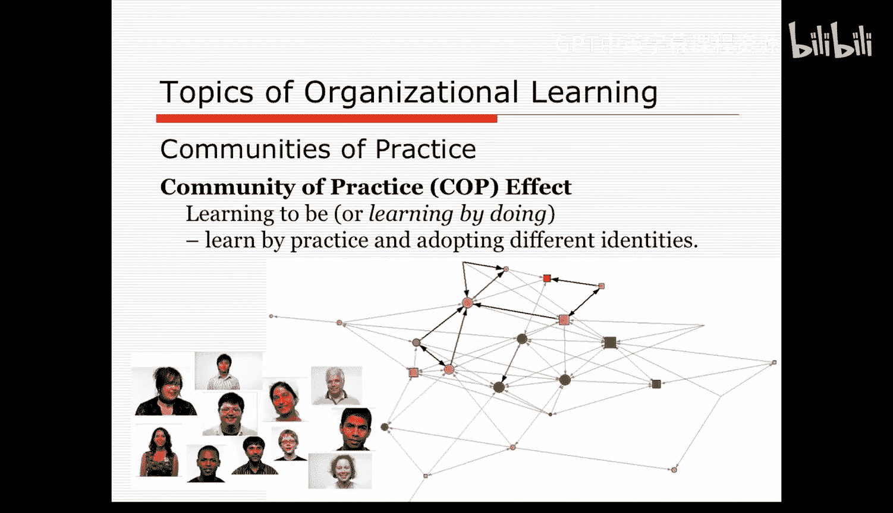

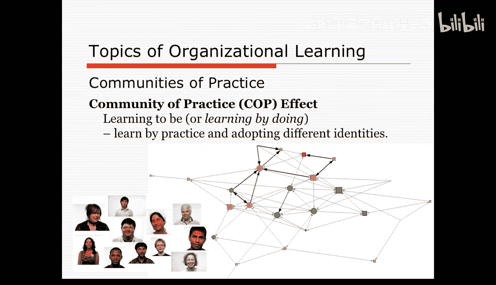

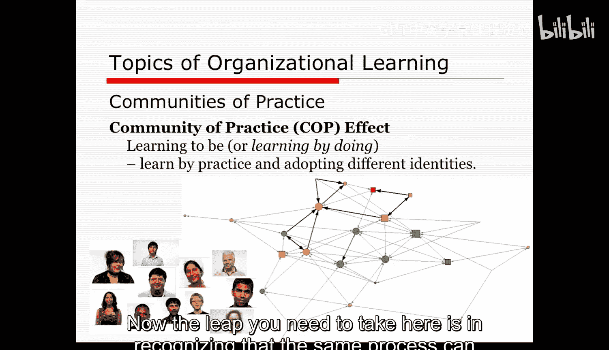

现在你需要在这里认识到，同样的过程也可能发生在顾问、律师、教职员工等人身上。实践社群是身份和实践的世界，具有凝聚力和强化作用，人们进入那个身份并自行承担它。

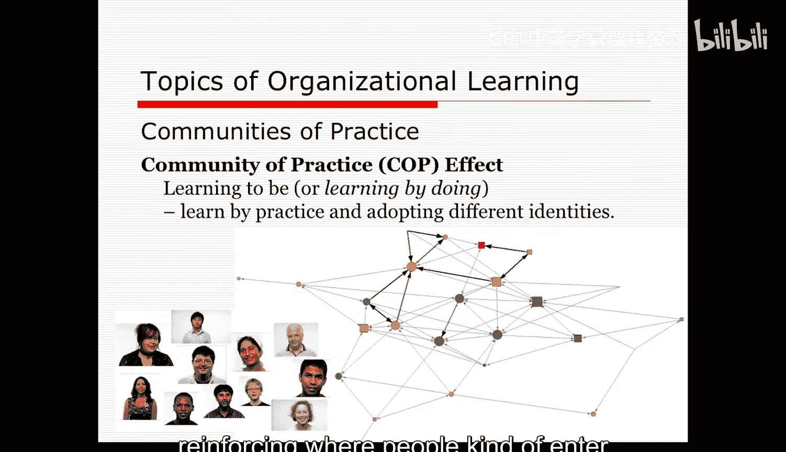

我们如何可能生成一个实践社群？让我们再次以学校为例。假设我们的目标非常明确：我们想创建一个鼓励学习和记住有效方法的社会结构。

为此，我们可能需要做几件事。以下是建立实践社群的一些步骤：
*   **营造安全协作环境**：灌输协作精神，创造一个允许人们承担风险、即兴发挥的安全环境。
*   **提供全员培训**：为全体教职员工提供培训，而不仅仅是部分人。我们希望他们去发展协作以及讨论他们在学习和实践上实际改进的专业知识。
*   **鼓励意义建构会议**：鼓励那些旨在进行意义建构而非决策的会议。这里你可能会想起“垃圾桶理论”。我们在某种程度上接纳了那个模型，即人们将举行会议并进行持续的互动，试图理解事物，并理解他们的身份是如何在此基础上发展的。
*   **鼓励频繁沟通**：在这里可以学习标准和程序。例如，我们可能希望指定骨干教师，并让他们作为专家与新教师学徒接触。我们可能希望创建指导和课堂观察的机会。
*   **鼓励分享故事和经验**：鼓励讲述个人经验和组织自我评估的故事和案例，例如进行汇报展示。
*   **建立记忆实践的方式**：最后，我们需要思考如何记住个人和组织的实践，例如建立一个数据库，创建人们需要知道什么以及如何做好工作的知识库，以及如何有效地分发和解释这些知识。

实际上，我们需要大量关于实践的会议，存储这些实践的方法，需要频繁的互动和培训，使我们达成共识、形成相同的身份和理解，然后形成这种协作规范。这些特征通常是人们在像学校这样的组织中生成实践社群时试图灌输的。

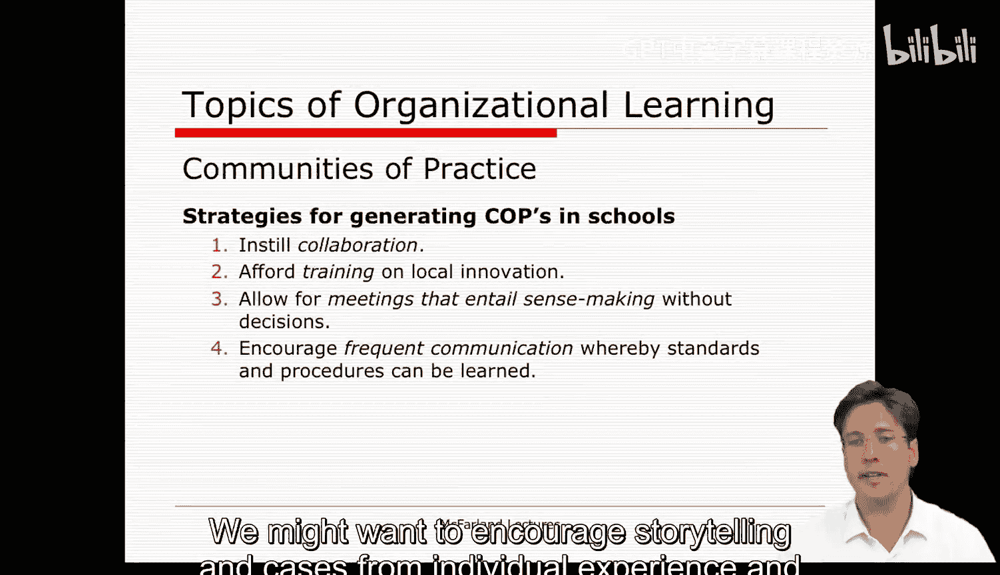

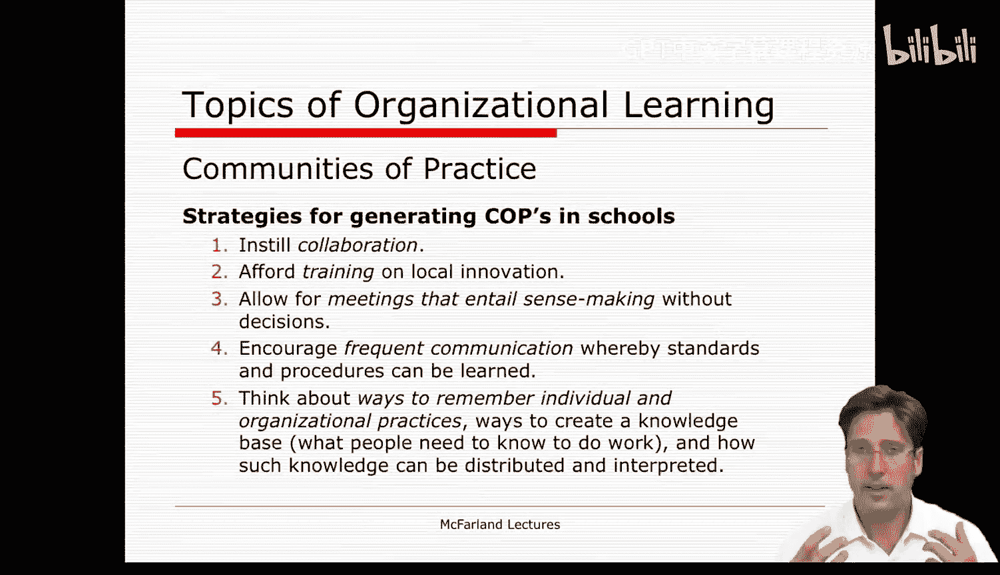
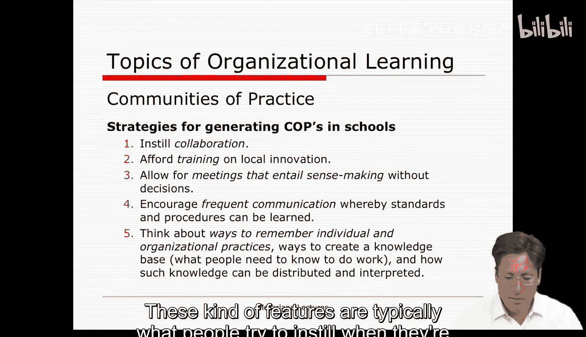
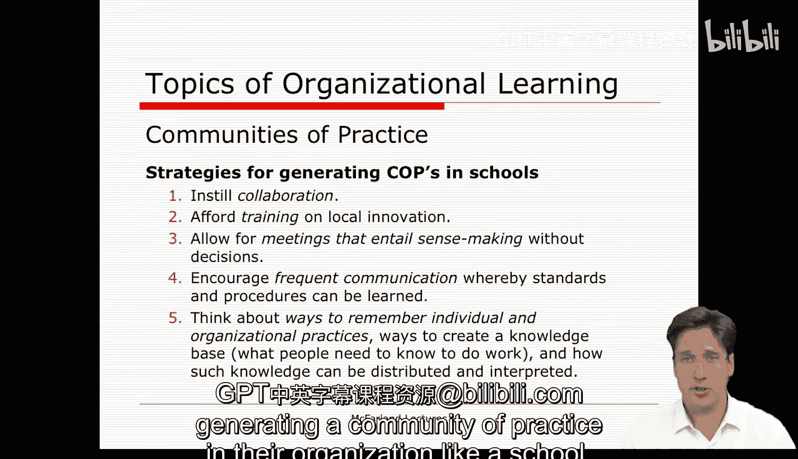

---

在本节课中，我们一起学习了组织学习的几个核心方面。我们探讨了如何使用**学习曲线**作为衡量组织学习进展和效率的工具，并认识到其存在平台期和指标局限性的问题。接着，我们分析了组织为何会**遗忘**以及如何通过技术、流程、人员和**文化**来构建**组织记忆**。最后，我们深入了解了**实践社群**的概念，认识到学习是一种社会化和身份构建的过程，并探讨了在组织中培育这种社群以促进持续学习和知识共享的具体方法。