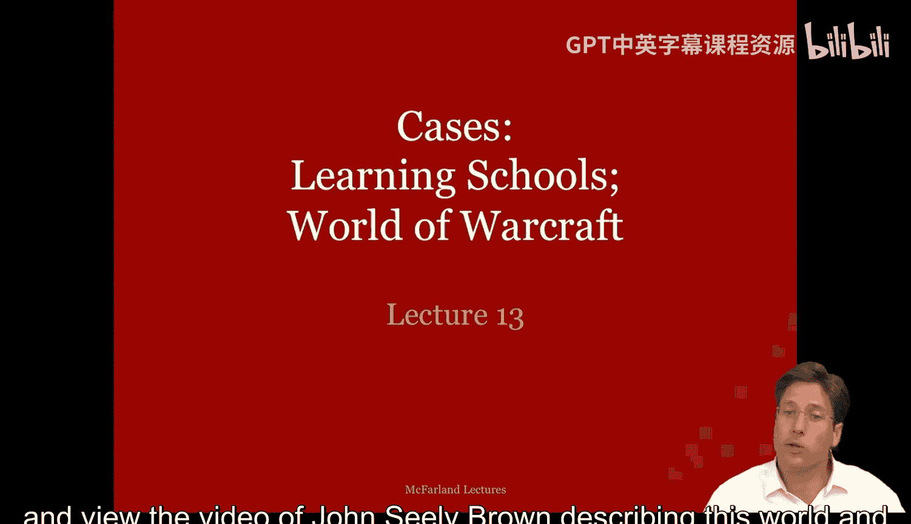
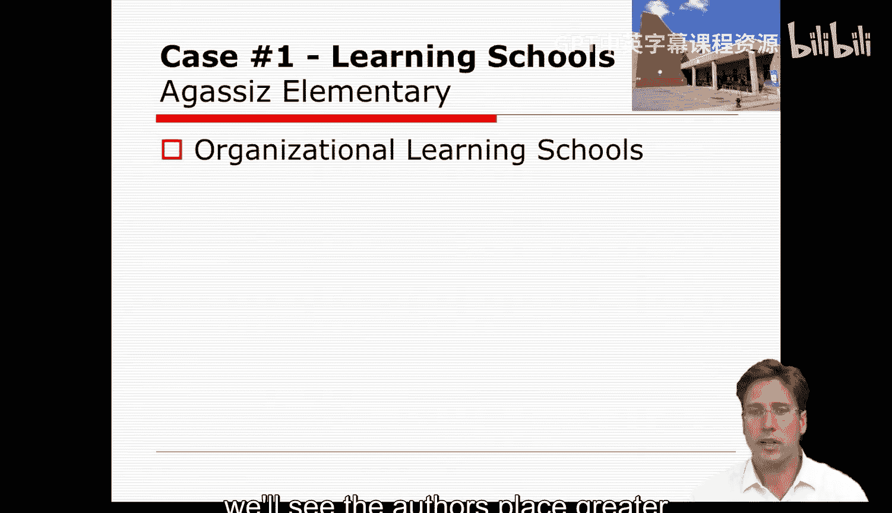

#  045：案例研究 - 第一部分

在本节课中，我们将简要回顾组织学习理论，并引入一个案例供你思考。这个案例涉及学校中组织学习的实施，你可以在本周的Lewis和Cru阅读材料中找到它。另一个案例则关于《魔兽世界》以及公会在其中的运作方式。你可以在教学大纲中查看《魔兽世界》的相关材料列表，并观看John Sealey Brown描述这个世界及其知识发展方式的视频。

## 🧠 组织学习视角的基本特征

首先，我们来回顾组织学习视角的基本特征。组织学习何时适用？当一个组织的参与者持续关注改进他们的实践时，组织学习就发生了。他们专注于组织的核心技术，即组织如何将输入转化为输出。因此，组织会持续监控、反思、调整并记住那些行之有效的实践。在某些情况下，学习可能是次优的，甚至是错误的。这一点对于组织学习的研究也具有重要意义。

组织学习的一般视角，是将组织视为由构成其核心惯例的实践所组成，并聚焦于组织改变和改进这些惯例的智能或能力。这丰富了参与者的身份角色，并增强了他们对组织的承诺。

从这一视角出发，组织要素如下：

以下是组织学习视角下的核心要素：

1.  **技术**：组织学习发生的方式。它是通过**内部适应**实现的，即行动者调整惯例以适应现实。这被Brown和Duguid称为**知识**。
2.  **参与者**：组织内执行惯例和进行实践的成员。他们的目标是解决应用问题，改进实践以更好地实现既定目标和身份认同。
3.  **社会结构**：主要包括非正式的横向关系、频繁的沟通、协商和对话。身份和角色是关键，并与实践紧密**耦合**。参与者既属于一个**实践社区**（包含本地紧密联系和同伴压力），也属于跨越到其他社区并促进知识转移的**实践网络**。
4.  **环境**：它是组织间知识、技巧和知识转移的来源。
5.  **主导推理模式或行动诱导机制**：对于组织学习而言，行动是本地行动者**搜索、即兴发挥、协作、翻译和分享知识**的结果。

通过组织学习方法，变革和改进之所以发生，是因为组织内部的个体和群体能够获取、分析、理解并围绕其实践和更广泛环境中出现的信息或知识进行规划。他们持续地适应和学习。

最后，该理论提供了一些管理启示，以打造一个学习型组织。管理者应考虑鼓励对话、持续改进核心实践并允许即兴发挥的方式。他们应找到方法，在公司内部创造更多的沟通，以便想法得以传递和分享，并与外部知识独特的群体建立桥梁。他们还应该找到方法，为行之有效的做法创建组织记忆，以便将其保留下来。

## 📚 理论应用：学校案例

既然我们已经回顾了组织学习视角的基本特征，现在可以开始讨论该理论在现实案例中的一些应用了。第一个应用主要由我们完成，第二个则留给你自行思考并在论坛中讨论。

我想讨论的第一个应用是Lewis和Cru对实施组织学习的学校的描述。在这篇阅读材料中，他们描述了两所表现超出预期的模范学校。他们说这两所学校都是学习型学校，教职员工反思和研究他们的实践，以努力持续学习和改进。

根据这些作者的观点，学习型学校共享一份关于学校、其课程、教学结构方法论和学生的**先验知识清单**。学习型学校了解自身，并花时间发展一个共同的愿景和词汇表，用以讨论教学问题。

Lewis和Cru讨论的第一所学校是Agassiz小学。在Agassiz小学，教职员工相互学习，并就他们的教学实践以及如何改进进行对话。作为管理者，校长试图激发和鼓励这种对话。她更像一个知识的促进者，而非指挥者。教师们也寻求相互学习，他们通过频繁的实践对话形成了一个紧密的网络，在某种程度上，这是一种实践社区。

我们看到这方面的证据是，教师们每周在年级会议上频繁互动，每月举行K-3年级和4-6年级的会议进行更广泛的思考，并且每月有30分钟的教师观察时间。因此，教师们就实践建立了频繁、紧密的关系，这产生了相当大的改进教学实践的同伴压力，以及一种重视持续改进的文化。这种文化如此浓厚，以至于教师们甚至自费参加在周末和晚上举行的会议和小组活动。

学校甚至举办了一种由教师们为他人组织的专业发展会议，这不仅带来了收入，还促使Agassiz的教师们承担起知识生产者和专家教育者的身份，这一切都进一步激发了围绕实践的对话和文化。

## 🔍 案例分析：组织要素分解

如果我们分析这个案例并将其归纳到我们的组织要素中，会发现作者更强调某些要素而非其他。

以下是Agassiz小学案例中的组织要素分析：

*   **技术**：在这种情况下，技术是指用于实现组织学习的工具。在许多方面，这些是社会结构性的处理方式，它们通过各种会议、权威的分散化以及教师更多的投入等来实现。这里所有参与学习的方式都是关系性和文化性的。
*   **参与者**：在这个案例中，参与者是学校教职工和一些家长。学生并未在案例中被真正提及。
*   **目标**：Agassiz小学的目标是增加学习和改进教学，他们希望通过反思实践来实现这一点。
*   **社会结构**：社会结构相对较小且亲密，关系是协作性的。领导层更多地是促进和指导，而非从外部强加意志。此外，领导者的关注点在于实践，这与教师们的关注点非常契合。
*   **环境**：我们对环境的了解与学校的设置及其历史有关，但案例中很少利用这一点。因此，案例聚焦于实践、社会关系、文化以及促进对其反思和改进的仪式。其中一些关系延伸到了环境中，但仅作为引入或输出教学实践知识的手段。

## 💡 管理启示与总结

现在，如果我们聚焦于管理。我们看到学校已经建立了若干惯例和制度安排，以培育这样一个学习社区。这些反过来又是在其他环境和其他学校中可行的管理策略。

本节课中，我们一起学习了组织学习理论的基本框架，并通过Agassiz小学的案例，具体分析了该理论如何应用于实际场景。我们看到，一个成功的学习型组织依赖于鼓励对话的社会结构、紧密耦合的实践与身份，以及持续反思和改进的文化。管理者在其中扮演着促进者和桥梁建造者的角色，而非单纯的命令者。