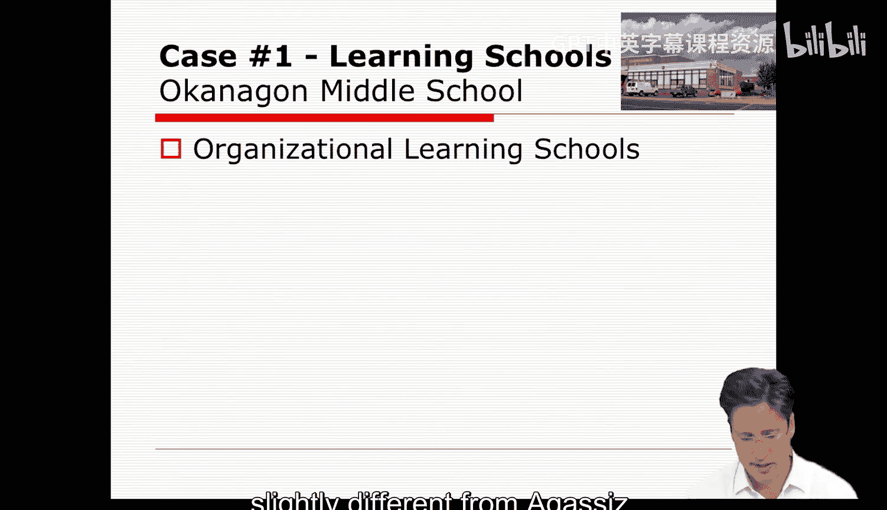
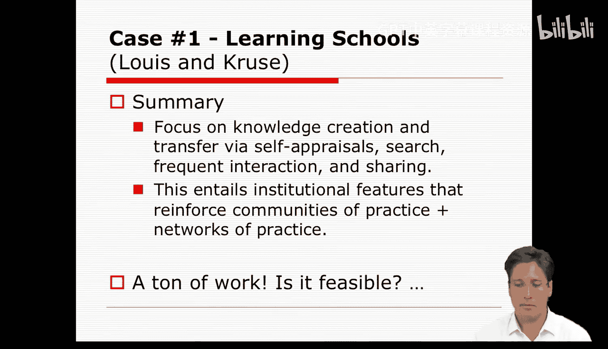
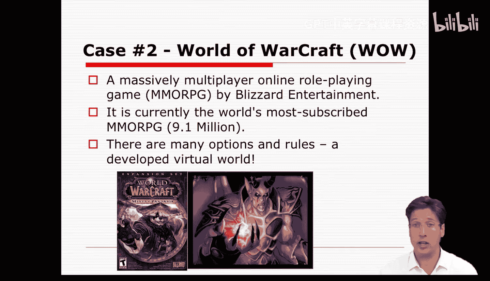
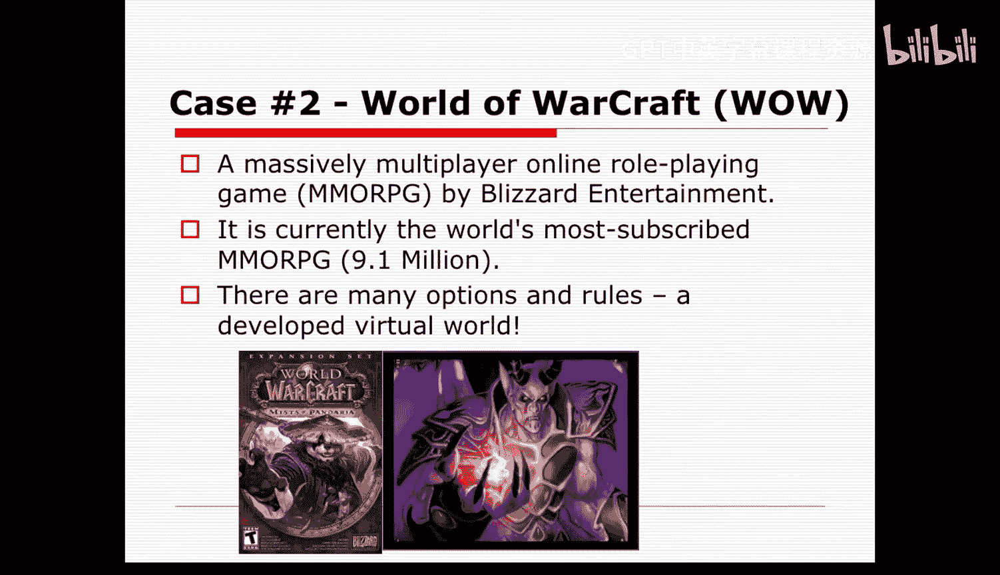
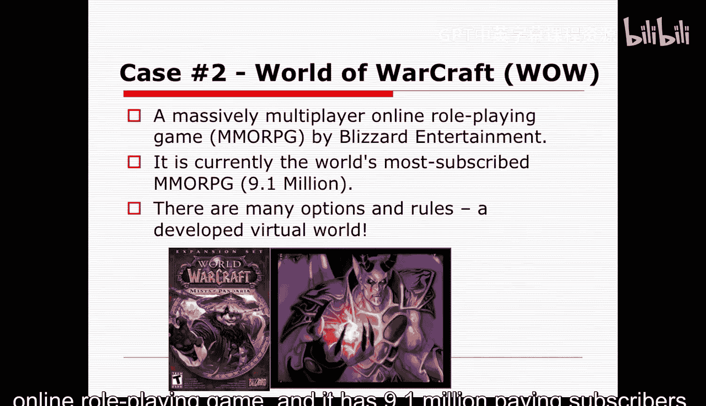
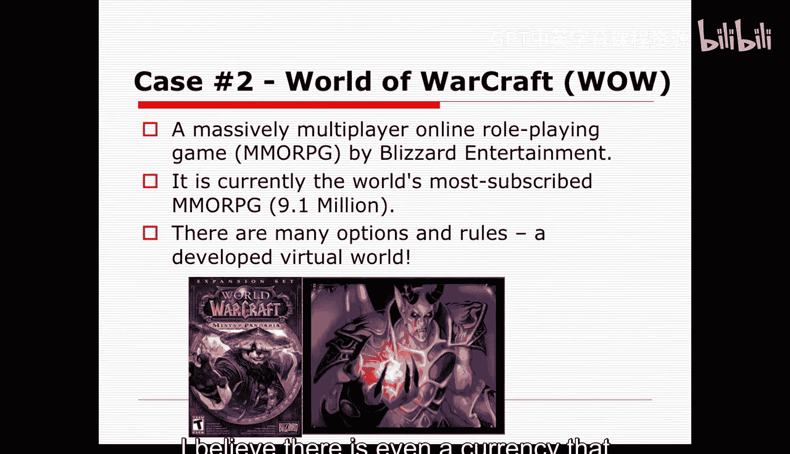
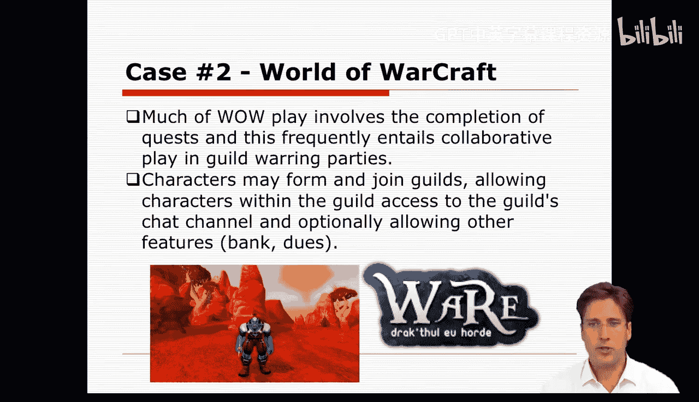

#  046：案例研究 - 第二部分 🏫

在本节课中，我们将继续通过案例研究来探讨组织学习理论。我们将分析第二个案例——奥康纳根中学，并与之前的奥古斯特斯小学进行对比，以识别成功学习型组织的共同特征。最后，我们将把视角转向一个非传统的组织——网络游戏《魔兽世界》，思考组织学习理论在虚拟环境中的应用。

## 奥康纳根中学案例

上一节我们分析了奥古斯特斯小学，本节中我们来看看刘易斯和克鲁兹讨论的第二个案例：奥康纳根中学。

奥康纳根中学的规模比奥古斯特斯小学大得多。学生群体中同样有许多来自弱势家庭的学生。这所学校在结构上被划分为九个“家庭”或小型学校。这些小型学校中的学生和教师共同负责核心科目，并作为一个单元运作。

这些“家庭”在决定其工作重点和改进方向上拥有广泛的自主权。每个“家庭”还有一位领导者，其教师角色被扩展，包含了行政管理和指导其他教师的职责。所有“家庭”领导者会与校长一起组成社区委员会，共同思考学校更宏观的发展方向。

这所学校拥有强大的文化。它自豪地宣称其梦想是为学生创造一个公平的竞争环境。因此，它带有一种行动主义的倾向。这使得课程内容与学生的关联性更强。

学校非常关注全州范围的评估。教师们建立了各种强有力的校级委员会来进行自我评估。这些委员会也向教师和其他领域施压，要求他们在这些考试中表现出色。但学校也有自己的标准，他们称之为“奥康纳根标准”，要求学生参与社区服务并完成研究项目。

在这种背景下，外部联系很重要，参加外部会议也很常见。但参加这些会议的教师是轮换的。因此，这类外出活动并不集中在特定的教师身上，而是分散开来。这样，信息可以从其他地方获取，并在他们外出参加会议后回来向其他教师汇报。

然而，学校在跨“家庭”协调方面存在一些问题，并且在组织学习应关注何处以及应关注哪些标准方面存在一些争论。他们举行了一次务虚会，“家庭”之间确实在一些议题上达成了共识，并且推动了更大范围的校级协调。但这同时也造成了一些紧张关系。因此，这次会议似乎有助于缓解这些学校及其不同标准之间的紧张关系。

## 组织要素分析

如果我们再次审视这所学校的组织要素，就能开始看出奥康纳根中学与奥古斯特斯小学的异同。

**技术**：与之前一样，技术指的是用于实现组织学习的工具，这里同样都是社会结构改革。学校被划分为更小的“家庭”单元，他们形成了各种不同的委员会和理事会，鼓励就实践和成就进行频繁的互动和评估。奥康纳根中学所有参与和学习的方式都是关系性和文化性的，这与奥古斯特斯小学相同。

**参与者**：在这个案例中，参与者是学校教职工，学生和家长并未被特别提及。

**目标**：奥康纳根中学的目标略有不同，它比奥古斯特斯小学更关注平等和社会正义。

**社会结构**：这里的社会结构也略有不同。学校规模更大，并被划分为更小的单元。关系是协作性的，教师或“家庭”拥有很大的影响力，而在奥古斯特斯小学，校长有更多发言权。

**环境**：我们所知的环境信息同样与背景设定相关，但案例本身很少利用它。与奥古斯特斯案例一样，奥康纳根案例聚焦于实践、社会关系、文化以及促进反思和实践改进的仪式。其中一些关系延伸到了环境中，但仅作为引入或输出教学实践知识的手段。

**管理**：我们看到学校制定了几种常规和制度性安排来培育学习社区。这些安排鼓励持续改进，并兼具实践社区和实践网络的特征。因此，在某种程度上，这两所学校在关注焦点、案例叙述方式及其与我们的关联方面，有很大的相似性。我们知道，它们主要侧重于社会结构重新设计，旨在重新定位实践、反思实践，并围绕此形成更深层次的文化。

## 成功学习型学校的共同特征

那么，在这些公认的学习型学校中，我们看到哪些一致的特征呢？以下几点尤为突出。

以下是这些学校共有的关键实践：

1.  **寻求内外部知识**：学校经常在本地同行中寻找内部知识基础，同时也到外部环境中寻找外部知识基础和专家。
2.  **知识转移过程**：它们建立了帮助转移个人知识和专长的流程。一个很好的例子是奥古斯特斯小学的专业发展展示会，他们将知识传播给其他社区和专业人士。
3.  **通过自我评估创造知识**：两所学校都通过自我评价和自我评估的过程来创造知识。这在奥康纳根中学对州级测试的关注和创建自身标准中可以看到。
4.  **持续学习和改进的努力**：两所学校都主要致力于这种持续学习和改进的努力。教师们阅读、参加会议、汇报所学、在校内外举办研讨会。
5.  **通过结构促进系统性学习**：通过促进持续互动的结构，发生了系统性的学习。例如，奥古斯特斯小学的年级会议、教师研究委员会、重组总结会，或奥康纳根中学的课程委员会、评估委员会和档案委员会等。所有这些都提高了关于实践的互动水平。

最终，这些学校真实地展示了实践社区和实践网络的特征如何能够形成，从而增强了教师作为实践者的身份认同，不断改进他们的表现，并增强他们对组织的承诺。

然而，这个模式有趣的一点是，它听起来工作量巨大。教师们不仅周末要出现，而且为了改进实践，他们会工作到晚上7点。刘易斯和克鲁兹认为，他们并没有因为这种高度的投入而感到倦怠。但我有点好奇，这可持续吗？他们最终会倦怠吗？或者这是一个能维持承诺和充实身份认同的模式？是否仅仅因为它有意义，所以我们才愿意工作到深夜？就像我今晚回家后，是否会因为这不是一份工作，而是一件乐事，就坐在书桌前工作到深夜？从组织学习的角度来看，对教师而言，这可能是一种类似的模式或情境。

## 延伸思考：虚拟世界中的组织学习

现在我们对组织学习理论在像学校这样的真实组织中的应用有了一些了解，让我们看看它如何应用到一个不那么传统的组织案例中，也许是在线的组织，比如《魔兽世界》。

你们中的一些人可能完全不知道我在说什么，所以让我解释一下。《魔兽世界》是一款大型多人在线角色扮演游戏，由暴雪娱乐公司创建。它目前是世界上订阅量最大的大型多人在线角色扮演游戏，拥有910万付费订阅用户。

游戏本身相当复杂，有许多选项和规则。玩家可以为他们的虚拟角色选择种族、职业。游戏里甚至有玩家用真实货币购买的货币。这个游戏的主要目标是互动、完成任务以获取财富、力量和经验等等。许多人玩这个游戏，而且玩得很频繁。事实上，很多人花在这个游戏上的时间比他们白天实际工作的时间还要多。

在《魔兽世界》中的一个主要目标是完成任务，其中许多任务很难完成。怪物太强大，小团队无法战胜；或者问题太复杂，没有大规模的协作努力难以解决。

因此，角色们经常组成公会或团体，规模从100人（小型公会）到200人（大型公会）不等，它们就像社区一样。在这些社区中，玩家通过聊天协调任务等等。他们也发展出作为玩家和团队的认同感。

约翰·西利·布朗在讨论《魔兽世界》方面做得很好。作为我们论坛讨论的一部分，听听你是否将《魔兽世界》视为组织学习的一种成功形式，以及你是否在其中看到了实践社区或实践网络的要素，将会很有趣。不过，首先我希望你看一下相关视频，花些时间观看并思考有关它的问题。

我期待在论坛上听到你们的见解。

---

**本节课总结**：本节课我们一起分析了奥康纳根中学的案例，并与奥古斯特斯小学进行了对比，总结出成功学习型组织在寻求知识、促进互动、持续自我评估和构建共享文化等方面的共同特征。最后，我们将组织学习理论的视角延伸至《魔兽世界》这一虚拟社区，探讨了学习机制在非传统组织中的体现。