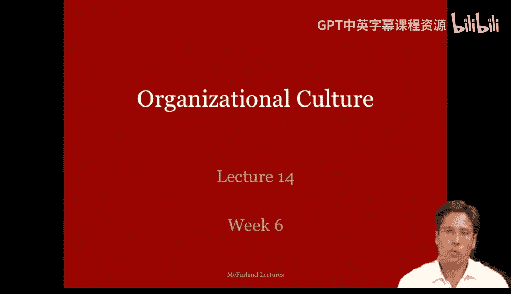
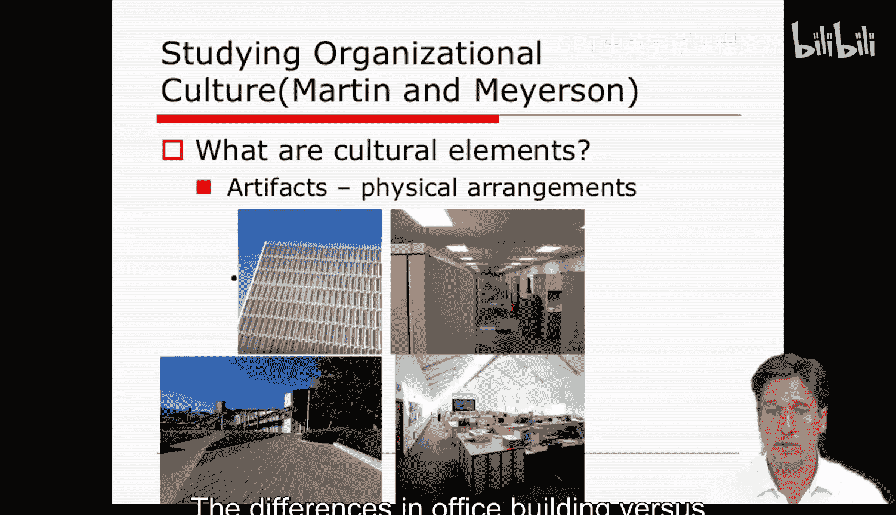

#  054：组织文化 - 第一部分

在本节课中，我们将要学习组织文化的核心概念。我们将探讨组织文化的定义、其重要性，以及如何通过观察具体的实践、符号和仪式来研究它。理解组织文化对于分析组织如何运作以及管理者如何影响成员行为至关重要。

上一周，我请班上的学生完成一项练习。他们分成小组，共同设计一所“学习型学校”。每个小组都提出了不同但有趣的设计方案，但所有方案中存在一些共同点。

大多数设计都侧重于创造机会来讨论教学实践。许多方案提到了小型学校、年级会议和部门会议。他们还讨论了通过演讲系列、培训课程、教师轮岗和导师计划等方式来创造知识转移的机会。学生们甚至提出了如何建立组织记忆的想法，例如通过数据存储、数据分析和由资深教师指导新教师。

所有这些设计都提出了建立互动场景和常规流程的方法，使教职员工能够讨论和研究他们的实践。他们构建了一个系统，可以持续自我评估绩效，并确保其核心技术运作良好。

然而，一个显而易见的问题随之出现。他们的设计假设教师愿意加班，有足够的资源来资助所有这些培训，并且在资源不足时，所有利益相关者会团结起来弥补缺口。这清楚地表明，组织学习模型的一个关键假设是每个人都拥有相同的价值观，愿意加班，并且在改革方面意见一致。实际上，它假设他们共享一种组织文化。

但什么是组织文化？又该如何研究它？这就是我们今天要讨论的内容。

大多数人看到组织文化时都能识别出来，以谷歌为例。谷歌位于硅谷，雇佣了数万名员工。其中一些人每年都会来上我的课。该公司有一个清晰的标志，印在每一件宣传品上，如笔、衬衫、汽车，甚至熔岩灯。是的，我有一个印着谷歌标志的熔岩灯。我们当地人都听说过谷歌提供由优秀厨师烹制的绝佳免费食物，办公楼里遍布工作区的游乐区，如乒乓球和保龄球。它在山景城有一个公园般环境的大型园区，甚至还有谷歌自行车散落在各处，供员工在楼宇间移动时使用和共享。我们还知道员工工作时间长，福利优厚，氛围随意，许多人对公司表现出看似无尽的忠诚并工作到很晚。简而言之，它拥有这种显而易见的文化，我们可以看见它。

在组织文化中，行动者根据身份和规范来理解他们的存在，这些通常是由他们所在的组织提供的建构。想想苹果、谷歌或KIP学校等公司的文化，甚至像Uica与斯坦福这样的博士项目。它们都有特定的身份和围绕该身份表现的规范，因此在组织文化中，动机是表达和实现那个真实的身份。所以，它是一种强大的内在绩效激励因素。

组织文化也包含组织社会结构的规范性和认知性方面。这些是指导我们互动的深层结构层面，其论点是，如果我们能够控制和设计这一点，我们就能拥有这些热忱的员工，他们会全身心投入，甚至愿意免费工作。因此，在本周的课程中，我要求学生阅读吉迪恩·库纳的著作。库纳不仅仅是对组织文化进行了简单描述，他将组织文化作为工程设计的焦点，将其视为一种需要控制、压制、捕获灵魂的手段。这是一种管理上的努力，这就是我们今天要讨论的内容。

那么，究竟什么是组织文化？设计它意味着什么？对于管理者来说，文化是对公司成员资格的广泛定义的一种概括，包括行为规则、思想和情感规则，它们共同构成了一个定义明确且共享的关于成为成员意味着什么的观念，即成员角色，成为谷歌员工意味着什么。

文化被视为有意识地试图影响他人行为和经验的工具，可以通过做演示、发送信息、举办训练营、撰写论文、发表演讲等方式来设计。文化是一种控制机制，你无法强迫他们在组织中做任何事，他们必须自愿去做，这就是文化的理念。因此，设计文化就是激发、引导和指挥员工的创造性能量和活动的能力，是为员工创造一种他们将其视为自我的成员身份的能力。

让我们来定义组织文化。组织文化，用最简单的术语来说，通常被视为**管理我们在组织中成员身份的认知和情感方面的共享规则，以及塑造和表达这些认知和情感方面的手段**。

组织文化的痕迹是**支配工作行为的共享意义、假设、规范和价值观**，它们是**规范和价值观得以编码的象征性、文本性和叙事性结构**。

它存在于文化形式的结构性原因和后果及其与组织有效性的关系中。

组织文化方法提供了一种不同于本课程其他方法的管理理念。从管理者的角度来看，组织文化可以成为**规范性控制**的一种手段，它可以试图通过控制成员的内在体验、思想和感受来激发和引导他们所需的努力，从而指导他们的行动。因此，通过规范性控制，成员受到内在承诺、对公司目标的强烈认同以及工作带来的内在满足感的驱动。简而言之，就是员工的自我被用于公司利益。

让我们花更多时间讨论组织文化的可观察特征。我认为这很重要，因为关于文化的讨论常常很快变得抽象和模糊。我希望确保你们将其视为某种具体、有根据的理论，并且在一个组织中，你们可以指出并加以利用和设计的真实特征。

具体来说，为此我将借鉴马丁和米尔森关于组织文化的研究，因为我觉得他们提供了有用的具体性层次。你们可以在教学大纲中找到这篇阅读材料。

那么，如何研究组织文化？文化的要素是什么？当我们考虑文化实践时，我们可以关注实践。这些可以是正式脚本或行为规则。当我们想到社会文化时，我们可能会想到某些东西。例如，我们想到行为准则、礼仪或程序性脚本，就像我旁边这个用于跳舞的脚本。它就像一对舞伴为了完成舞蹈而遵循的舞步程序。我们也可以出现非正式的、未经计划的习俗，如风格习俗。

这里有一张图表显示了裙子时尚的变化，它表明裙摆已经上升，从而显示了这种新兴习俗或风格的变化。

这些是我们在艺术和时尚中可能看到的正式脚本和非正式习俗。但是，组织内部的平行实践是什么？在组织内部，这些实践可以是正式的政策或规则，以及规则和程序，如职位描述、薪酬分配、绩效评估等。

正式政策的例子也可以在组织结构图中找到，这里的规则是关于职位及其相互关系的。

但正式政策也可以是标准操作程序，如晋升规则，或这里处理囚犯的规则。

我们甚至可以在操作软件的手册或组织的行为准则中看到这一点，所有这些都是我们的正式政策。

组织内的实践也可以是非正式的习俗，如沟通规范、风格和行为习俗。它甚至可以涉及如何管理冲突以及互动习惯。

其中一些习惯可能会规避或偏离正式规则，例如何时交谈、如何说话或争论风格。在某些公司里，是否表现得过于男性化。

现在，有些涉及着装规范甚至风格。在硅谷，曾有一种趋势，高管们穿着彩色袜子或看起来像大猩猩脚的鞋子。这些行为和风格规范是自然出现的，并非计划好的，但它们成为了公司文化的一部分。

其他文化元素是**人工制品**，它们以多种形式表现出来。例如，文化通常使用某些符号和工具，如过去文化中的面具、弓或绳索等。

在组织中的平行物可能是它们的标志和工具，如计算机或这台磁共振成像机。每一个都象征着组织及其所从事的领域，如技术或医学。

文化还包含**仪式**，如舞蹈、游戏、活动。它们包含人们讲述的故事，甚至语言或行话，如方言。这可以作为区分亚群体或人群的一种手段。

文化还包含仪式，如舞蹈、游戏、活动。它们也可以包含人们讲述的故事，甚至他们使用的行话或语言，如不同的方言或俚语。现在，所有这些都充当了一种代码，用于区分不同的亚群体或群体。

组织也有仪式，但它们往往是公司内部不同的活动和场合。例如，组织通常涉及会议和工作汇报。这些可以有各种形式和风格，反映了特定形式的同事关系，无论是严格、等级分明、遵循罗伯特议事规则的会议，还是松散、友好、轮流发言的对话。这些都是非常不同类型的仪式环境。

此外，公司有故事。我们都知道关于Facebook及其创立的故事，比如电影《社交网络》所讲述的。我们也知道其他创始人的故事，如伯克希尔·哈撒韦的沃伦·巴菲特。但这也在公司内部延伸，例如关于优秀教师和差劲教师的故事。因此，我们有各种各样关于个人的故事，以及关于整个组织更大文化的故事。

公司甚至有不同的行话。例如，在谷歌，他们在园区内使用一系列术语来指代各类员工。在许多公司中使用特殊缩写也很常见，以至于当你听到人们谈论斯坦福的各种委员会时，这些缩写对外部大多数人来说变得难以理解。

马丁和米尔森还认为，文化可以通过物理安排来限定，例如建筑和物品的布置。当我们比较大教堂和贵格会聚会所时，可以很容易理解这一点。两者都是基督教宗教场所，但建筑风格迥异，暗示了不同的互动模式。

即使我们看内部，也会看到座位安排截然不同，一种是等级式排列，另一种则更倾向于对话和集体体验。

在组织内部，我们可以看到许多相同之处。办公楼布局与园区布局的差异是一种区别。封闭的个人隔间与开放式办公桌之间的差异是另一种。两者都构成了不同的环境或具有不同意义和互动的文化体验。因此，物理安排再次可以反映文化和意义的区别。

在本节课中，我们一起学习了组织文化的基础知识。我们探讨了组织文化的定义，即**共享的规则和意义系统**，它塑造了成员的行为、思想和感受。我们了解到，管理者可以将文化视为一种**规范性控制**的工具，通过影响成员的内心体验来引导其行动。为了具体地研究文化，我们介绍了可观察的特征，包括**正式与非正式的实践**（如政策、规则、习俗）、**人工制品**（如标志、工具）、**仪式**（如会议、汇报）、**故事**和**行话**，以及**物理安排**（如建筑和办公布局）。理解这些元素有助于我们更具体地分析和设计组织文化。