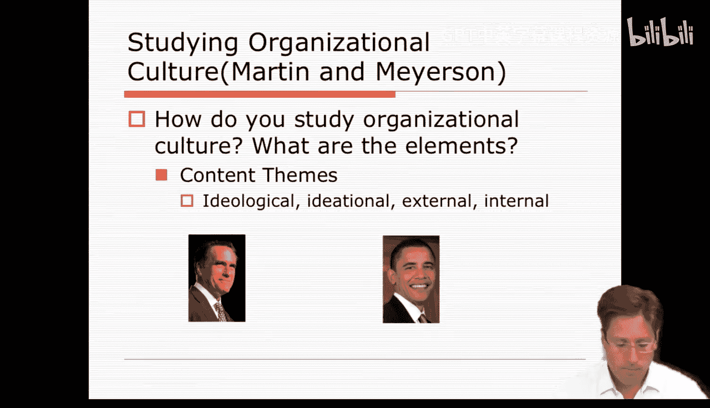
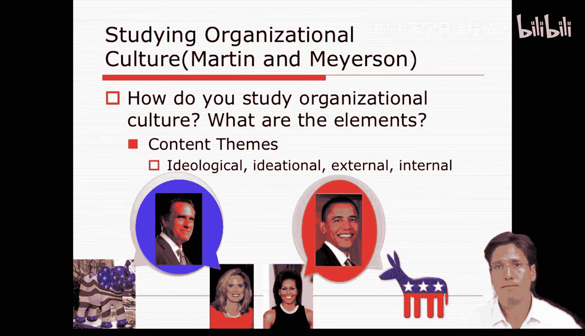
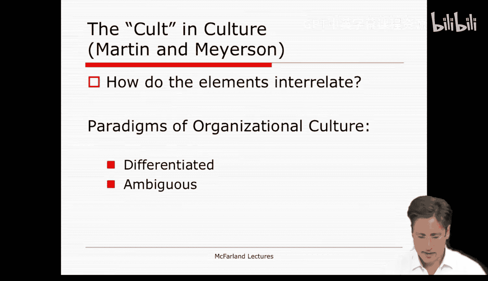
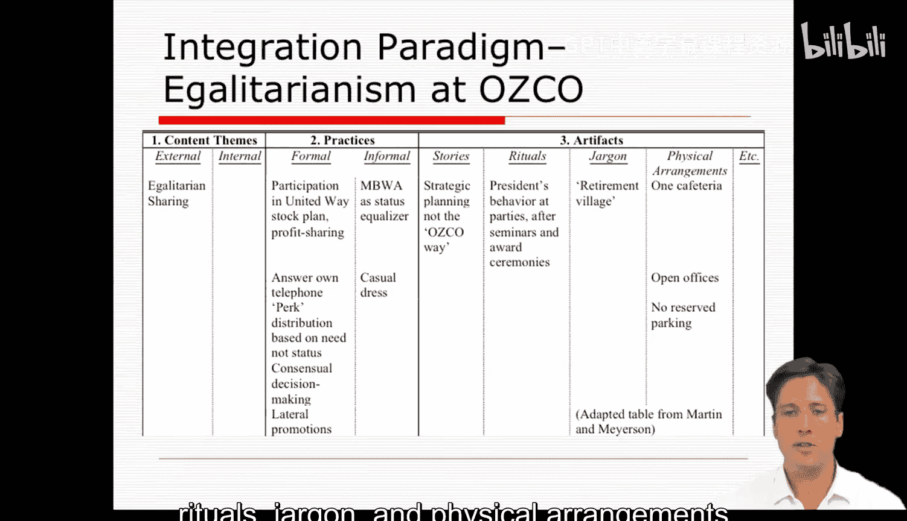
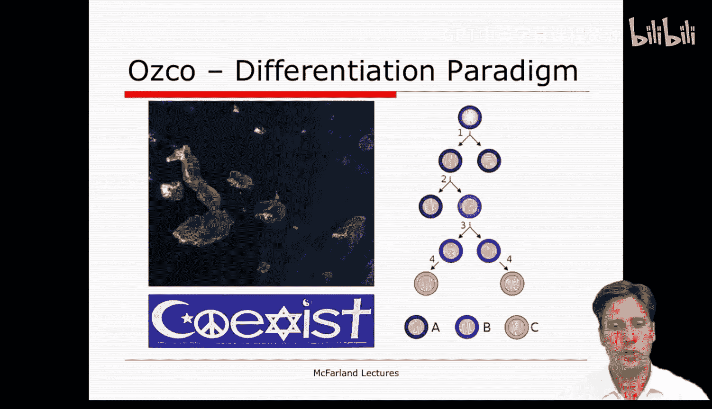
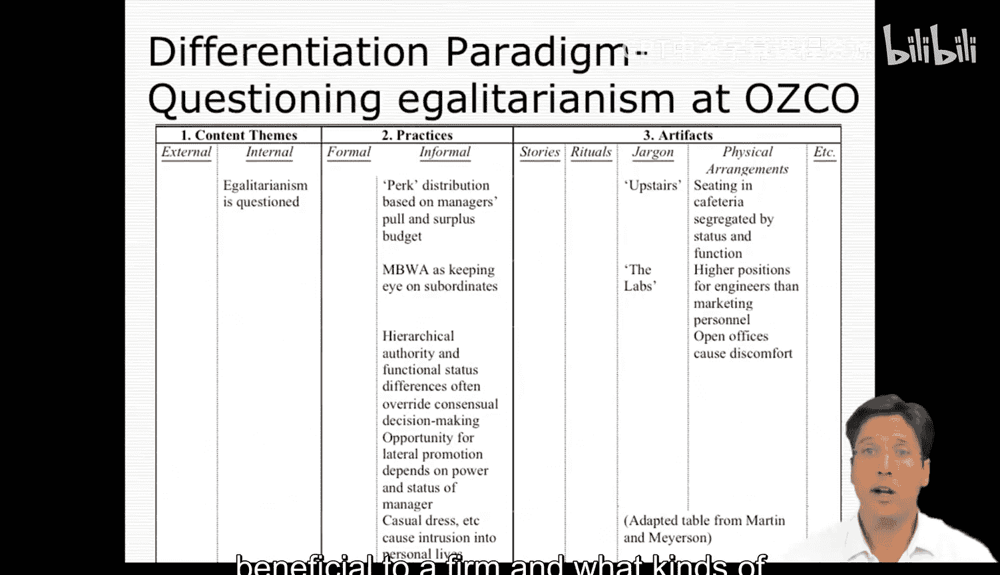
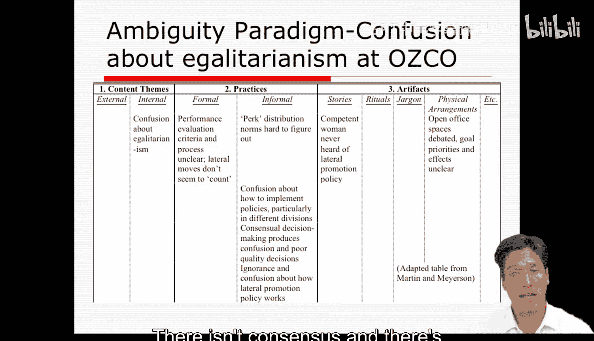
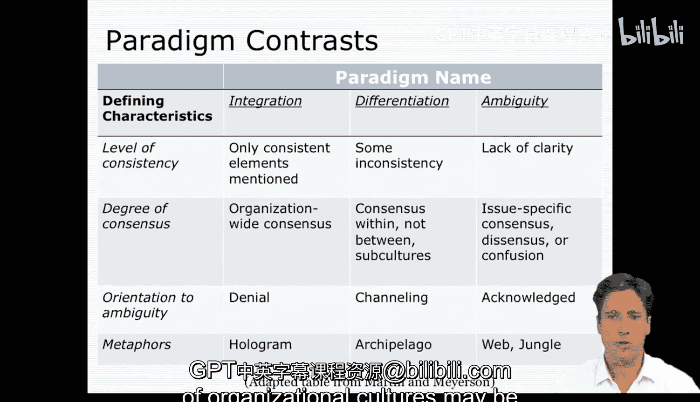

#  055：组织文化（第二部分）📚

在本节课中，我们将深入探讨组织文化的不同表现形式。我们将学习马丁和迈尔森提出的三种文化范式：整合型、分化型和模糊型，并理解它们各自的特点、表现形式以及在组织中的实际意义。

上一节我们介绍了组织文化的基本元素，本节中我们来看看这些元素如何组合成不同的文化范式。

---

马丁和迈尔森认为，不同文化所强调的**内容主题**存在差异。所谓内容主题，是指用于组织对组织实践及其产物进行解释的抽象概念。一个很好的例子是当前的美国总统选举。两位候选人表达了凸显其不同价值观和信念的意识形态主题。一方面，他们提出诸如“为生命投票”和“放松管制”的规范性论点；另一方面，也有人努力表达“为选择投票”和“为中产阶级投票”的意识形态主题。他们还表达了涉及事件意义解释的观念主题。例如，一种论点是“当前的就业不足是前任总统经济政策的结果”，另一种则可能是“这是现任总统经济政策的结果”。也可能有人认为经济报告是改善的迹象，或者认为经济报告是持续问题的迹象。

最近，在各自的党代会上，我们看到了这些内容主题是如何对外呈现的。这反映了成员向公众所宣扬的理念。这是一种公开的表象或门面。有趣的是，我们可以看到双方都试图将这些内容主题描绘成也是内部所持有的。例如，安·罗姆尼辩称她了解真正的米特·罗姆尼，他很有趣；或者米歇尔·奥巴马声称她了解真正的巴拉克，他和四年前是同一个人。尽管公众面前呈现着相反的形象，他们仍然这样做。因此，这种内部形象有时可能与外部形象脱节。从内部视角看内容主题，通常是一种内部观点，比如谷歌或斯坦福的真实情况，以及在那里工作和生活的真实感受。这可以被视为私下的、幕后的内容，可能强化也可能在某种程度上削弱外部形象。

这些文化元素，无论是实践、角色、程序、仪式、故事、行话、符号、工具、物理安排还是内容主题，它们共同开始形成某种组织文化的马赛克图案。文化成为这些意义的系统，并为我们提供了关于该组织文化更宏观、整体的感知。

现在，马丁和迈尔森将组织文化描述为聚集在某些类型的范式或风格中，他们称之为**整合型**、**分化型**和**模糊型**。

---

## 整合型文化 🧩

最常见的假设是组织文化是整合型的，即可识别且统一的。这需要强化元素，使意识形态、实践和主题都保持一致。因此，你会看到被提及的一致元素，以及存在于整个组织范围内的共识。这类组织的成员否认存在任何模糊性。管理层和公共关系部门通常宣扬这种统一的观点，但它很少能长期存在。整合型文化隐藏了冲突和紧张关系，它们被压抑地存在着。也就是说，可能存在某些类型的创业公司，员工致力于共同的愿景、目标或意识形态，它们实际上可能拥有整合型的组织文化。

在你们阅读的马丁和迈尔森的文章中，他们探讨了一家名为Osco的公司是否在努力发展一种平等主义文化。要形成一种整合型的平等主义文化，他们需要识别出一系列强化和支持这一主张的文化元素。因此，他们发现该公司公开宣称自己是平等主义的，有正式和非正式的实践来鼓励它，有各种故事、仪式、行话和物理安排，所有这些似乎都强化和支持了平等主义的存在。

---

## 分化型文化 🏝️

看待组织文化的第二种视角是分化型。在这里，人们可以将组织文化视为一个群岛，或者拥有不同群体或阵营，各自有其视角和文化。与其说是一种统一的文化，不如说是一种由多个亚文化组成的分化型文化。

如果我们再次转向马丁和迈尔森，我们看到他们试图寻找一种分化型的组织文化。当他们这样做时，他们会寻找平等主义未被统一看待、并存在质疑的实例。例如，作为一种平权行动意识形态的平等主义，与正在使用的福利和招聘实践并不完全契合。在许多方面，分化型系统是冲突的，存在相互对抗的努力，或者至少存在将组织文化拉向不同方向、偏向某一亚文化而非另一亚文化的努力。

学校实际上是解耦系统或分化型文化的一个很好的例子。学校管理层倾向于向外部环境展示学校的考试成绩和课外活动，但并不真正谈论教学实践，也不怎么与教师讨论教育过程。但另一方面，内部情况与外部不同，可能会出现不同的亚文化。教师可能会谈论教学并关心它，但他们不将其作为公开门面的一部分。因此，外部和内部是分化的。

但这里的问题是，分化型组织文化是否更准确地描绘了组织文化的面貌？它们是否和谐共存或存在冲突？另一个值得思考的问题是，分化型组织文化是否对公司有益，以及在何种背景和条件下可能如此。

---

## 模糊型文化 🌫️

看待组织文化的第三种方式是，它们可能是模糊的，即具有不清晰和令人困惑的意义概念。在我看来，当组织文化发出混合信号时，我认为它是模糊的。例如，这个路标。道路是封闭了，还是对超宽负载开放？不是很清楚。另一种令人困惑的方式是，它可以被以多种方式看待，就像格式塔心理学图像。它是一只鸭子还是一只兔子？它是一个朝我凸出的立方体还是一个向后退的盒子？另一种情况是，一个令人困惑的组织文化是人们说着多种语言，很难理解事物，巴别塔的寓言在这里或许有些滑稽，但它可能帮助你理解文化中模糊性的概念。

在模糊型组织文化中，元素通常是不清晰和混乱的。因此，如果我们回到马丁和迈尔森以及他们关于Osco的例子，我们看到平等主义的意识形态有时会让一些人感到困惑，存在不明确的程序，以及关于如何实施事物的清晰度不足。没有共识。对于事物的意义以及如何完成它们存在困惑。

---

## 文化范式比较与总结 🔄

通过比较这些文化范式，我们可以了解它们之间的差异。每种范式都有某些定义性特征。例如，一个由整合型实践的组织文化只提及一致的元素，在整个组织中表现出共识，并否认模糊性。相比之下，文化分化包含一些不一致性，在公司内部的亚文化或子文化中表现出共识，但在它们之间则没有。最后，它引导模糊性，使其为自己的亚文化否认模糊性，但将其归因于其他亚文化。

最后，我们有一种模糊型文化，它总体上缺乏清晰度，存在特定问题上的共识，并且经常使其成员感到困惑。这里的模糊性被完全承认。现在，如果我们纵观所有三种类型，可以开始想象我们可以用什么样的隐喻或类比来描述这些文化的样子：整合型文化像全息图，分化型文化像群岛，模糊型文化像丛林。

此时，很容易认为整合型文化是最理想的，但我认为它并不适用于所有情况。毕竟，许多邪教和群体思维的实例结局并不好。在某种程度上，我得到的印象是，上周讨论的组织学习，其前提是存在一个整合型组织文化才能运作，它似乎常常需要某种类似邪教的氛围。但另一方面，在其他情况下，组织学习似乎又宣扬即兴发挥的必要性，这可能要求组织文化缺乏清晰度并具有模糊性。也许在论坛上，你们可以讨论是否同意这一点，或者组织学习的产生是否可能基于另一种文化范式。

相比之下，有理由相信模糊型或分化型文化可能更有用。模糊型和分化型文化一方面可能造成不一致和混乱，但另一方面也能提供多样性，并成为创新的温床。因此，一个处于急剧变化环境中的组织，可能更适合采用分化型或模糊型文化，以便更能适应并在那种环境中生存。

我还得到的印象是，模糊型组织文化是有组织无政府状态理论中所描述的类型。我想知道你们是否也看到了这一点。在许多方面，有组织无政府状态理论建议管理者应拥抱模糊性，因为正是在那里创造力才得以产生。同样，请在论坛中告诉我你们对此的想法。我这里的观点是，不同的组织文化范式可能或多或少对特定情境下的公司有用。我不认为整合型在每种情境下都是最理想的。

此外，我认为你们中的许多人可以看到，我们在本课程早期讨论的组织理论，可能对某一种组织文化形式有某种偏好。因此，这也可能让你们有些困惑，并让你们思考组织文化与组织学习有何不同。回想一下，组织学习似乎致力于发展一套特定的互动和实践，以形成一个有自我意识的学习型组织。它采用某些表层结构，并试图实施它们，以改变根深蒂固的信念和理解（深层结构），从而使得组织参与者能够持续改进他们的实践。

相比之下，组织文化方法对于何种文化最佳持不可知论，这可能取决于具体情境。此外，它始于深层结构，即内容主题、仪式、符号等，并观察它们如何影响表层互动、工作关系以及公司绩效。因此，在某些方面，组织文化更丰富地阐述了实践是什么，并识别了它们如何形成更大的整体或意义系统来指导行为。这些文化系统有多种形式，其中只有一些可能是学习型文化，其他可能是平等主义文化或自我实现文化等等。在某些情况下，模糊型和分化型的组织文化形式可能是可取的。

---

本节课中我们一起学习了组织文化的三种主要范式：整合型、分化型和模糊型。我们探讨了每种范式的特点、表现形式以及它们在不同组织环境中的潜在优势和适用性。理解这些差异有助于我们更全面地分析一个组织的文化本质，并认识到没有一种“最佳”文化适用于所有情境。