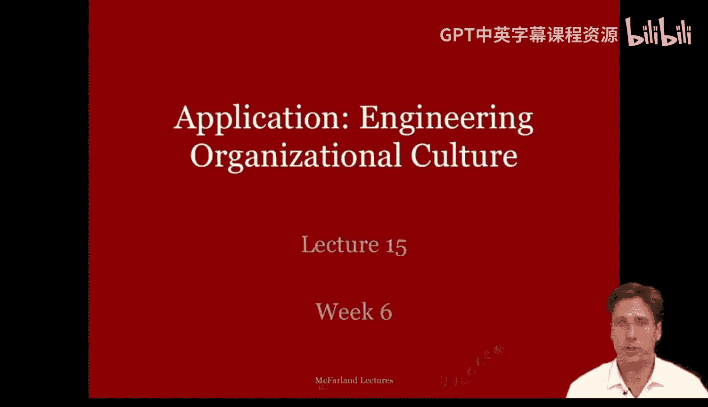
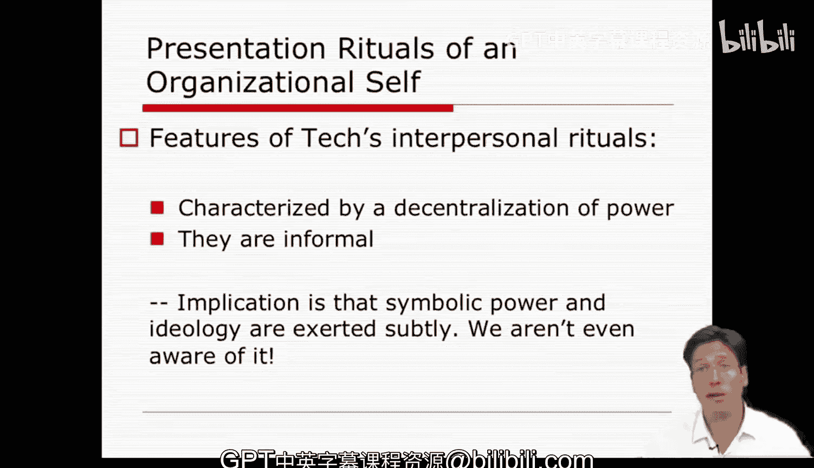

#  056：组织文化构建 - 第一部分 🏢

在本节课中，我们将要学习吉迪恩·昆达关于“工程化文化”的研究。我们将探讨组织文化如何作为一种意识形态被构建、呈现和强化，以及它如何通过日常仪式来影响和控制成员的思想与行为。

上一节我们介绍了组织文化的基本概念，本节中我们来看看昆达如何通过民族志观察，分析一家高科技公司的文化构建过程。

---

## 文化作为意识形态与规范控制

昆达将组织文化视为一种**意识形态**，是管理层用于实施**规范控制**的工具。这意味着其目的在于影响员工的“思想与心灵”，而不仅仅是他们的行为。管理层通过定义组织的身份和视角，向成员提供一套系统的、全面的、与公司利益相关的世界观。

这种对组织文化的描绘与人类学中的意识形态概念一致，例如克利福德·格尔茨的观点：意识形态是权威者提供的、关于社会秩序的图式化形象，它作为问题社会现实的地图和集体良知的创造矩阵。

那么，在组织文化中，权威传递的是何种社会秩序形象？组织身份的构建源于三种不同的权威来源。

以下是三种构建组织文化视角的权威来源：

1.  **管理权威**：源于高级管理者的文件化观点，如公司哲学、CEO的演讲录音、公司使命宣言。这些通常以道德和理想为框架。
2.  **专家权威**：源于内部专家撰写的技术论文、报告和备忘录。他们提供看似独立、务实且具有科学可信度的观点。
3.  **客观权威**：源于外部观察者（如新闻剪报、电视广告）对公司的选择性描述材料。公司选择呈现哪些材料，这些外部观点共同强化了内部视角。

这三种权威来源的影响是叠加和复合的，它们共同整合并描绘了该公司的组织文化。

---

## 管理层的视角：构建集体道德意义

首先，我们来看高级管理层对公司文化的看法。管理层主要关注公司**集体层面**的属性，并通过各种叙述赋予成员一种**道德意义感**。

他们通过演讲、访谈、社论等方式，提供一种个性化、生动的公司意识形态观点，并以更常识化、证言式的方式加以充实。通过这些“见证”，他们通过提及过去、使命和共享的价值观与身份来构建一种“我们”感。在这种观念下，成为社区成员被认为定义了你的社会存在和个人经验——你不仅仅是扮演一个角色，而是将其内化并成为它的一部分。这里的形象是个人与公司之间没有冲突，存在一种**整合范式**。组织声称为员工提供一个可以成长和发展、并能够参与其中的道德秩序，而这个道德秩序因参与公司而变得对个人有意义。

一个可以观察到这些元素的好地方是公司的目标和使命文件。在那里，你会看到各种口号和抽象的理想——类似于“母亲和苹果派”那种人畜无害的内容。它们包含无人会真正反对、并且人人都想效仿的东西。例如，他们会将其成员描述为富有创造力、勤奋工作、为共同利益着想的好人。

例如，这里有利维·斯特劳斯公司的使命宣言（课程前面提到过）。正如你所见，它以道德和规范的方式阐述，提到了与客户的牢固关系、信任、产品质量和普适性。那么，有什么理由不喜欢呢？

---

## 内部专家的视角：关注角色与务实呈现

其次，我们有内部专家，他们更关注成员**角色的要求和属性**。与管理层关注整体不同，专家作为内部人士关注成员角色。

这些专家给人一种独立、务实和科学可信的光环。他们并非完全“喝了公司的迷魂汤”。这种专家观点和身份描绘的一个好例子可以在研究该组织文化的“本土人类学家”身上看到（案例中名为艾伦·科恩）。她的言辞通常是开放、务实且带有批判性的。她在自我描绘中似乎很平衡，道德语调不明显，并且在展示中某种程度上承认了意识形态的外表。这种观点与管理层的视角一致，但显得不那么理想化，更贴近现实。专家甚至承认缺点，她的建议是务实的，她的角色表现更多地基于个人成功和自我提升。

尽管如此，专家仍被视为带有党派色彩。她提供的并非抵抗或反对公司的批判性描述，实际上是从一个略有不同的角度进行**强化**，与管理层的观点形成互补，并在管理权威之上形成一层加固，强化了对公司文化的整合视角。

---

## 外部权威的视角：选择性强化整合文化

第三种观点来自公司外部，来自学者、顾问和记者。这是一种公司引入以强化整合文化的**客观权威**。

组织通常会决定关联和分享哪些外部视角，而这些大多是正面的。这些描述往往是经过编辑的、来自外部的对公司**选择性评论**，进一步强化了文化。通俗读物往往更接近管理者的理想，但是从一个外部基础出发。学术文章似乎提供了一种客观观点，即公司成员是面向公司及其文化的。新闻报导被最广泛地使用，人们张贴的剪报通常聚焦于CEO，赋予公司一种英雄主义的形象。

因此，这里涉及许多类似的主题，但你会发现负面、批判性的文章并没有被大量展示。所以，这三种观点共同复合形成了关于该公司及其成员的一个整合视角。成为该公司的一员意味着高度的投入、与公司的紧密联结以及极大的热情，这导致了自我与组织之间边界的**消融**——它变成了一种“崇拜”。这种成就被视为能带来经济上的成功。

它是通过设计一个基于个人自主性、非正式性、最小化地位差异以及看似无组织（实则导致高度承诺）的环境来实现的。这个过程将工作视为自我实现、身份形成和表现的手段。因此，该公司成功地实施了这种整合文化。昆达研究的其余部分开始关注：这对你的自我意识有何影响？你如何在一个拥有强大组织文化的组织中应对？

---

## 文化呈现仪式：日常生活中的权力展演

那么，这家公司拥有相当强大的组织文化。问题随之而来：他们是如何构建它的？公司文化和意识形态实际上是通过**组织自我的呈现仪式**在其成员中**展演和灌输**的。

这些呈现仪式发生在公司成员日常生活的方方面面。执行这些仪式实际上是一种**框架设置手段**。我的意思是，成员们充当公司利益的代理人，他们试图建立一个**共享的情境定义**，在其中，源自组织身份的现实主张被体验为有效的。这些仪式被用作行使**象征性权力**的工具，而这种权力定义了现实。

我知道这对你们中的一些人来说可能像很多行话，但请仔细思考一下。我的意思是，每当该公司的员工或经理进行演示或在会议中互动时，他们是作为员工在行动，而不是作为父亲或母亲。他们作为公司的代理人在行动。甚至听众中扮演互补角色的人，也期待专业的行为和互动风格，这使得在该公司生活的日常现实看起来与其他地方不同，并且对他们来说，作为表达身份的一种手段，这似乎是有效和自然的。

如果我们观察这家公司，随处可见呈现仪式。如果你还记得马丁和迈尔森关注的是文化元素，那么采用那个视角，我们会在昆达的案例中看到许多相同的元素。

例如，自我的仪式化呈现最常在许多组织中的个人**行为展示**中观察到。这些是**有时间限制的互动**，针对特定的观众和场合。在这些互动中，我们看到人们展示并试图建立关于自我的正面定义。他们周旋和操纵，以便做好工作，以某种方式表现自己。我们最常在演示、问答环节和会议中看到这些展示。值得注意的是，所有这些都是在课程前面提到的“决策舞台”。

许多这类情境也是平凡的，可以是私下的日常场所，比如午餐时在后台办公室或饮水机旁的闲聊。它们不一定非得是正式会议。

呈现仪式也发生在**人工制品展示**中，比如当我们走过工作区或观察某人的着装时。这些是**常设的自我展览**，供路人和旁观者观看。在该公司，这些展览出现在他们的办公桌上，他们展示个人纪念品、公司相关物品和关于公司的幽默笑话。

人们甚至在斯坦福大学也能看到特定的人工制品展示。如果我走过法学院或计算机科学系的走廊，我会看到展示品所体现的截然不同的组织文化。在法学院，他们的办公室类似于律师办公室，有樱桃木、L形桌、整洁的书架等等。此外，所有教职员工的穿着相对于校园其他部分都比较正式。

相比之下，如果我走过计算机科学系的走廊，教职员工的办公室很随意，玩具和设备散落各处，教授们穿着T恤、运动鞋或人字拖。校园这两个部分存在着非常不同的组织自我概念，人们仅仅通过走过并观察这些常设展览就能轻易推断出来。

作为分析者，我们可以通过多种方式捕捉和记录关于人工制品展示的行为。通过访谈，我们获得个人的自我描述；通过观察和记录，我们获得谈话、人际行为和展览的记录；通过积极的笔记记录和参与，我们甚至可以像参与者一样理解这些遭遇。所有这些方法都帮助我们收集证据，了解仪式化互动如何塑造工作的组织自我并形成这种组织文化。

---

## 互动模式：权力分散与微妙控制

在观察了许多此类人际仪式并与该公司员工交谈后，昆达观察到他们互动中存在一种**持续的模式或风格**。

该公司日常互动中的仪式至少有两个特征。首先，它们以**权力分散**为特征。日常仪式有不同的发言者、声誉、项目、团队等构成的动态环境，这似乎涉及许多不同的发言者、变化的项目和波动的声誉。因此，在日常事务中，权力并不非常集中。

其次，该公司的意识形态是开放性、非正式性、个人主动性和真实感受。因此，施加在员工身上的象征性权力非常**微妙**。它显露在短暂的社会戏剧片段中，比如在问答环节和谈话中，某些个体似乎建立了权威（如果你还记得，这可以表现为管理型、专家型或外部型权威）。

在观察了许多这样的人际仪式并与该公司员工交谈后，昆达观察到该公司存在一种**持续的互动模式或风格**。该公司的仪式在不同情境下至少有两个共同特征。

首先，仪式以**权力分散**为特征。权力不在于角色或职位的权威，而实际上存在于日常仪式中，人们在会议、项目和团队中互动。这些人际仪式似乎会轮换谁发言、谁负责、谁拥有更高或更好（或更差）的声誉。因此，在这些日常事务中，权力并不非常集中。

其次，该公司的意识形态被呈现为开放性、非正式性、个人主动性和真实感受。因此，该公司的象征性权力是以相当**微妙**的方式施加的。它显露在这些问答环节和谈话的小型社会戏剧中，其中一些人似乎比其他人表现得更好。正是在这些微小的控制中，我们看到了建立公司规范和意识形态的这种努力。这些仪式和戏剧有一种特定的结构：存在一个**挑战**，随之而来的是**紧张升级**，然后代表公司利益的行动者使用各种技巧来压制和重新定义异议、使越轨行为沉默并获得支持。

因此，如果有人不遵循关于期望或理想的自我呈现规范，我们就会在这些微型的仪式和会议、谈话和演示中出现这些小分歧和失误，人们开始施加行为规范并引导自我呈现，以反映和强化这种公司文化及其关于权力分散和非正式性的观念。正是通过这种方式，每个人开始施加这种自我意识和组织文化感。它是**分布式**的，并通过无数微小的戏剧非正式地呈现和实践。

---

## 总结

本节课中，我们一起学习了吉迪恩·昆达关于组织文化构建的研究。我们了解到，组织文化可以被视为一种由管理层、内部专家和外部权威共同塑造的意识形态，其核心目的是实现规范控制。这种文化通过日常工作中的**呈现仪式**（如行为展示、人工制品展览）和**人际互动**得以展演和强化。该案例特别展示了权力如何以**分散**和**微妙**的方式运作，通过无数微小的社会戏剧来引导成员内化组织身份，最终模糊个人与组织之间的边界，形成高度的承诺。理解这些机制有助于我们分析任何组织中文化的构建过程及其对成员的影响。