#  057：组织文化构建（第二部分）🎭

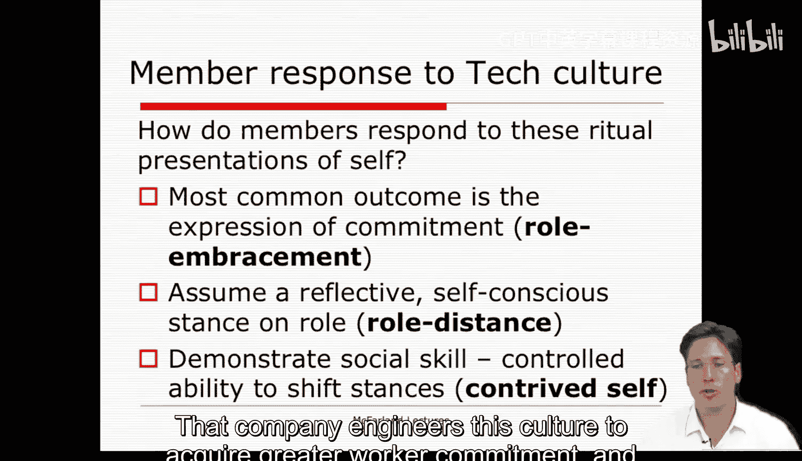

在本节课中，我们将探讨员工如何对组织文化及其所要求的“组织自我”做出反应。我们将分析从“角色拥抱”到“角色疏离”的不同应对策略，并讨论员工如何在强大的组织文化中保持个人自主性。

---

## 员工对组织文化的反应

上一节我们介绍了技术文化作为一种规范性文化，如何被公司设计并强加给员工作为一种控制手段。本节中，我们来看看员工对这种文化及其要求的“组织自我”有何反应。

员工会感到被同化吗？他们会珍视自己所扮演的组织角色，还是感觉自己像个工具或只是在演戏？他们会抵抗这种“自我”吗？库纳指出，员工的反应方式有多种，个体之间存在差异。

以下是几种主要的反应方式：

### 1. 角色拥抱

这是最常见的反应。在高层管理人员的谈话中，拥抱是全心全意的；在培训研讨会上则更为保留和试探性；在工作小组会议中则是务实和渐进的。那些拥抱角色的参与者（如管理者）有时会体验到**情感失调**，他们很难将工作中的积极角色与真实的自我体验区分开来。这导致他们难以拥有工作之外的生活和身份。

### 2. 角色疏离

在这种反应中，员工在行为展示过程中暂停了角色拥抱。例如，教师在课间或课后会放下教师角色，以更社交化的方式与学生相处。在技术公司，这更多表现为**角色疏离**而非角色反转。

当员工采取一种反思和公开自觉的立场，评论自己的状况和仪式性表演本身时，就发生了角色疏离。他们暂时脱离自己的成员角色表演，并与他人分享他们对整个过程的戏剧性本质的认识。他们会用一些生动的标签来描述行为场景，比如“不想参与口水战”、“背后捅刀”、“隐藏议程”等。

通过角色疏离，员工展示了自己是与角色分离的独立个体（“我只是个扮演自己角色的人”）。这种行为实际上比许多人意识到的更重要，因为它能在那些自觉且有才华的“演员”之间建立联系和共鸣。

### 3. 精算自我

一些技术员工对此有高度的自觉，并展现出高超的社交技巧和优雅。他们拥有**在拥抱与疏离之间切换立场和框架的受控能力**。这种切换能力是关键，因为成员们会根据彼此表达拥抱和疏离的能力，以及知道何时停止或避免走向极端来评价对方。

库纳称之为**精算自我**，因为参与者是在明确意识到构建现实的戏剧性机制、并公开承认文化类别和符号（包括那些对仪式表演本身至关重要的符号）的人造性质的情况下，来执行仪式的。这种可以被视为致命缺陷的自觉性，现在被仪式化了。

这就在角色疏离与拥抱之间创造了一种潜在的稳定平衡，不断质疑与成员角色相关的体验的真实性。

---

## 仪式的中介作用与规范压力

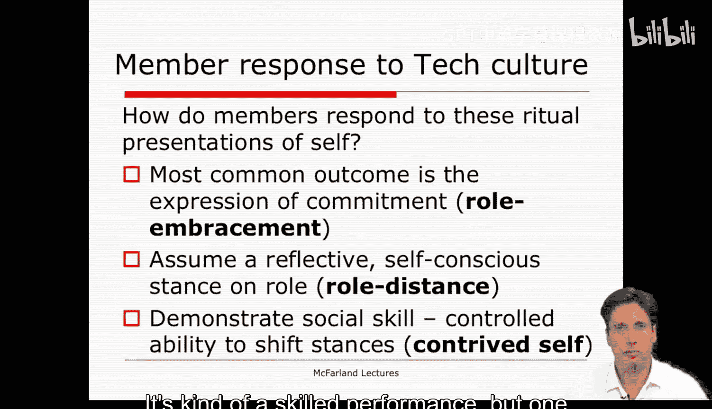

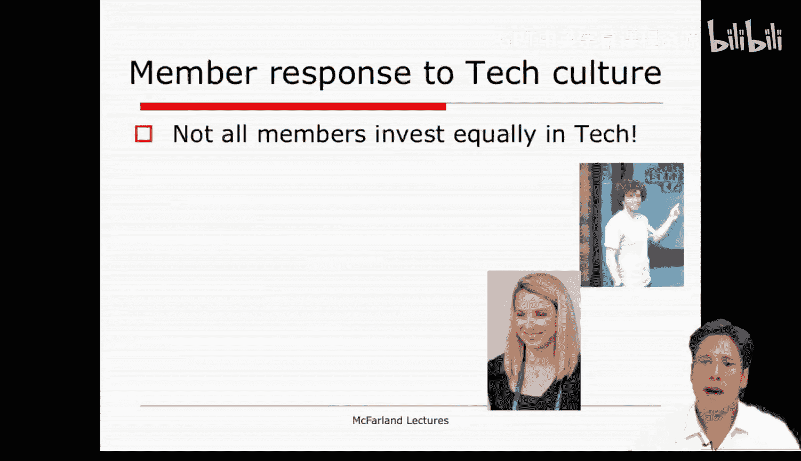

展示仪式是执行、强制和强化成员角色规范展示的载体，因此是调节规范性要求和反应的一种机制。

然而，仪式的中介作用并不简单。它们可以并置多种主题和立场，例如：
*   意识形态与常识
*   义务与选择
*   严肃与幽默
*   肯定与否定
*   内部与外部观点
*   参与与退出

在拥抱与疏离之间切换，就形成了一张这些规范性压力的网。最终，人们不得不怀疑，强大的组织文化是否为个人自由和表达留下了足够的空间。什么是真实的，什么是被规定的？即使是精算自我——那种通过社交技巧和在拥抱与疏离之间切换而实现的自我——也是组织所规定和奖励的。通过这样做，你在公司里获得了更高的地位。

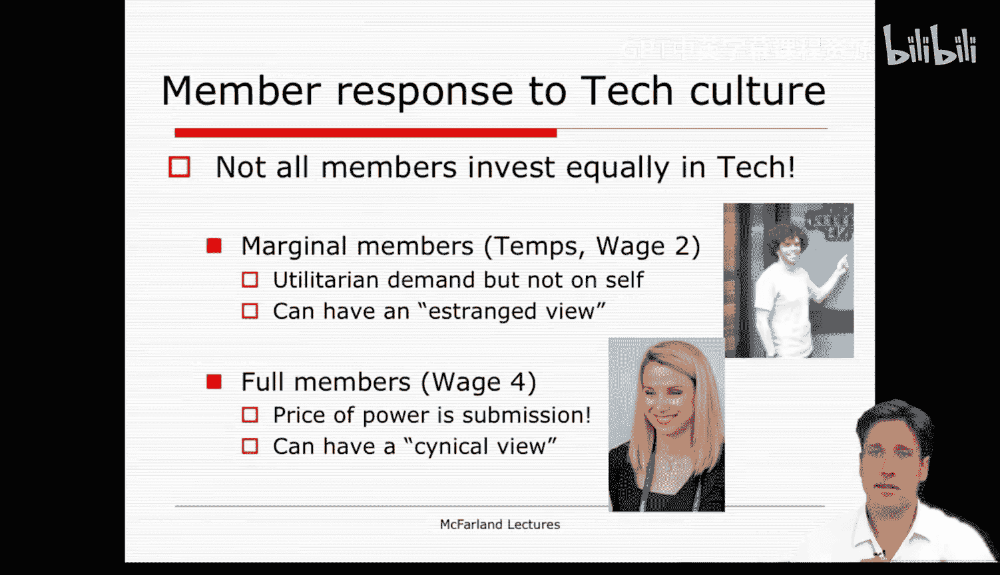

---

## 不同成员的不同体验

并非所有成员都平等地投入技术文化。例如，临时工和二级工资工人等边缘成员，并不受同样的角色要求和组织意识形态约束，因此他们在一定程度上被豁免了。

然而，这可能会让其中一些人感到被排斥，从而对组织身份和文化形成一种疏离的看法。

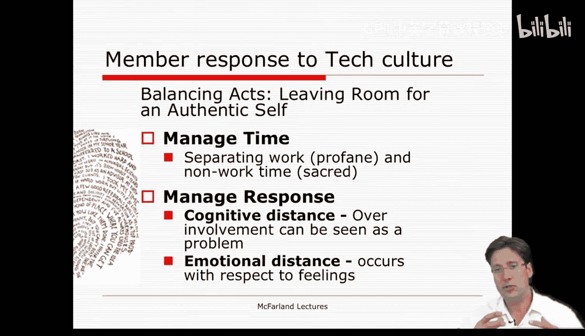

另一方面，**正式成员**（技术公司的四级及以上工资员工）则面临着巨大的成员角色要求和根本困境。为了获得接纳和更高地位，这些“演员”将自己更多地暴露在组织身份的要求之下。**权力的代价是服从**——不仅是对行为的服从，更是对关于思想和感受的规定的服从。这可能导致一种愤世嫉俗的观点，因为成员们形成了精算自我，并在表演中同时进行拥抱和疏离。

---

## 如何在组织文化中保持自我

你可能会想：如果我加入了一个拥有成熟组织文化的公司并想爬到顶层，我是不是会被“洗脑”？幸运的是，并非全无希望。即使你扮演了精算自我并对公司感到愤世嫉俗，你仍然可以做些事情，为你的真实自我留出空间。

每个人，包括我，都有多重身份。我在家是一种身份，在工作中是另一种身份。在两种情况下，我都可以通过角色疏离（例如，和孩子们开玩笑说我作为父亲的样子，或和学生们开玩笑说我作为讲师的样子）来展示我的性格，这揭示了我作为独立于这些角色身份的个人特质。

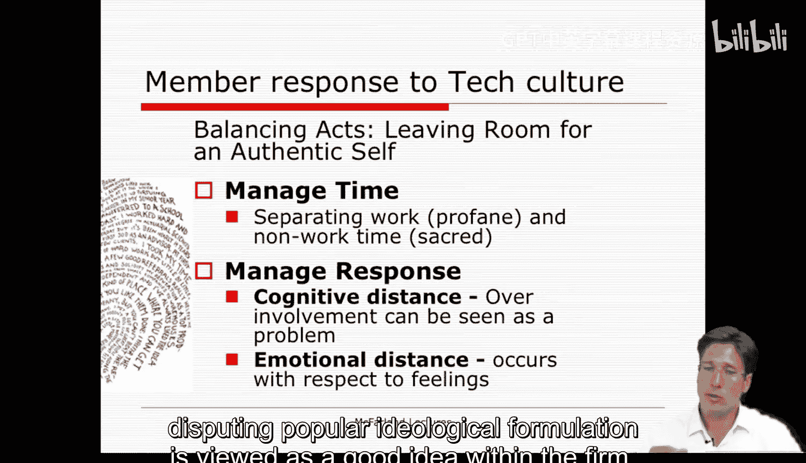

对于技术公司的管理者来说，组织自我源于对组织意识形态及其规定的成员角色的**接受与拒绝之间的平衡**。正是这种平衡的动态感，与成为组织的正式成员相关联。你通过平衡狂热信徒和激烈批评者这两种极端，来理解成为该组织成员的意义。

以下是成员们为应对技术文化并保留独立于它的自我空间而采取的一些具体做法：

### 1. 管理时间

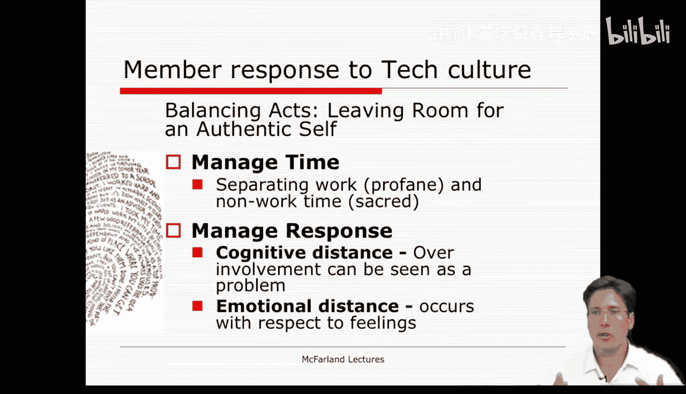

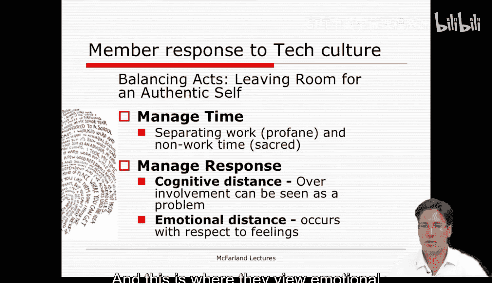

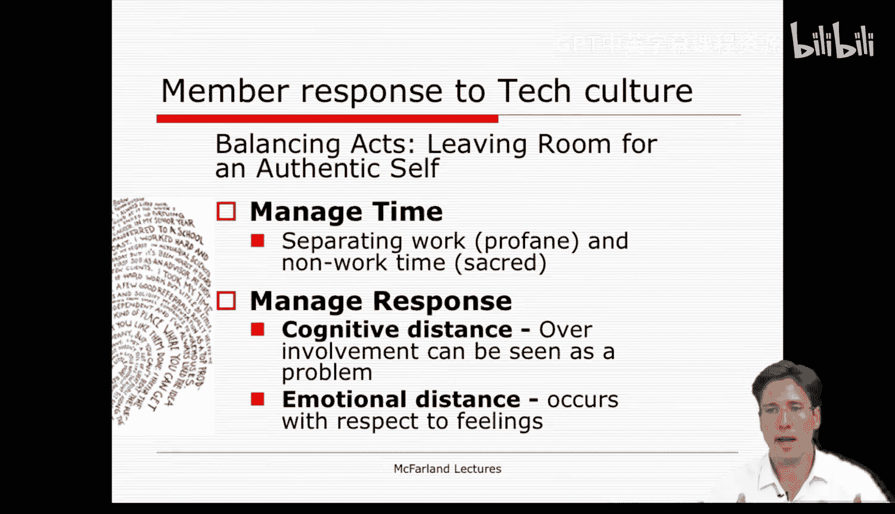

技术工作需要大量时间和精力，模糊了工作与非工作的界限。作为回应，人们会在工作时间和工作中发展的人际关系周围**设定边界**。非工作时间被视为神圣并受到保护，与工作分开。员工也可以通过定义工作之外的自我（例如，作为一个冲浪者或自然主义者）来定义自己的真实自我。

### 2. 管理对组织自我的反应

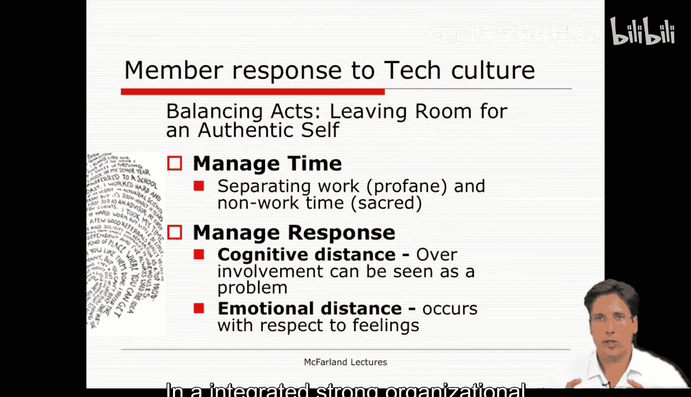

许多员工认为过度投入是个问题。他们认为与公司保持公平交换是可取的，其他任何做法都是有失尊严的。事实上，在公司内部，角色疏离和对流行意识形态表述的质疑被视为一种好品质。你需要足够自主以了解公司情况，并有足够的尊严来表达这种认知，否则你就会被视为狂热分子或工具。

员工通过以下方式做到这一点：
*   **愤世嫉俗和抱怨**
*   **进行超然的理论观察**（更积极的方式）：使用历史学家或科学家的视角来看待公司。
*   **采取常识视角**：试图从一个合理或实用的参照框架来看待组织。

### 3. 情感疏离

员工也可以在情感上（而不仅仅是认知上）保持距离。他们可以通过以下方式做到这一点：
*   **否认情感**：声称加入组织的动机纯粹是工具性的（“我做这个是为了钱”），否认情感依恋。
*   **通过去人格化表达情感距离**：与工作中经历的情感保持距离，说“我脸皮厚”或抽象地谈论情绪（如“我的痛苦”、“温暖的感觉”），不把事情个人化。
*   **将情感视为戏剧化**：将情感表达视为战略驱动的（“我用它来实现目标”），因此怀疑其真实性（“我用戏剧来得到我想要的东西”）。

---

## 总结

本节课中，我们一起学习了库纳关于组织文化与员工反应的核心论点。

根据库纳的观点：
1.  **组织文化是实现规范性控制的手段**，是一种意识形态。
2.  这种意识形态通过**自我的展示仪式**来灌输和执行，这些仪式发生在各种会议、非正式交谈和意见分歧中，用以建立规范和标准。
3.  **二级工资工人**主要受功利主义控制（追求报酬），而**四级及以上工资的工人**（如管理者）则同时受文化和功利主义控制，他们“出卖”了更多的自我。
4.  大多数组织的真正成员都会进行某种程度的**角色疏离**，从而释放出独立于公司的自我特征。
5.  然而，一个人在地位等级中爬得越高，**角色拥抱**就越多，而疏离则成为**精算自我**表演的一部分。最终，组织自我与个人自我高度捆绑。

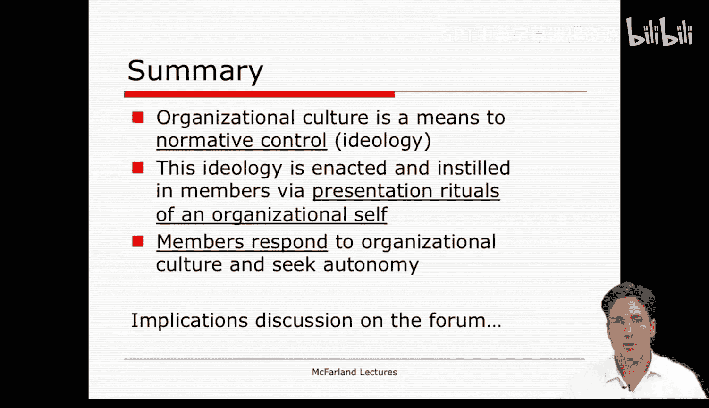

对于管理者而言，这可能是一个深刻的困境：我们想要创建强大的组织文化（甚至“ cult ”）来获得成功，但当我们参与其中时，又与自我保持着一种不稳定的关系。关键在于找到接受与拒绝、拥抱与疏离之间的平衡点，在扮演组织角色的同时，守护内心那个独立而真实的自我。