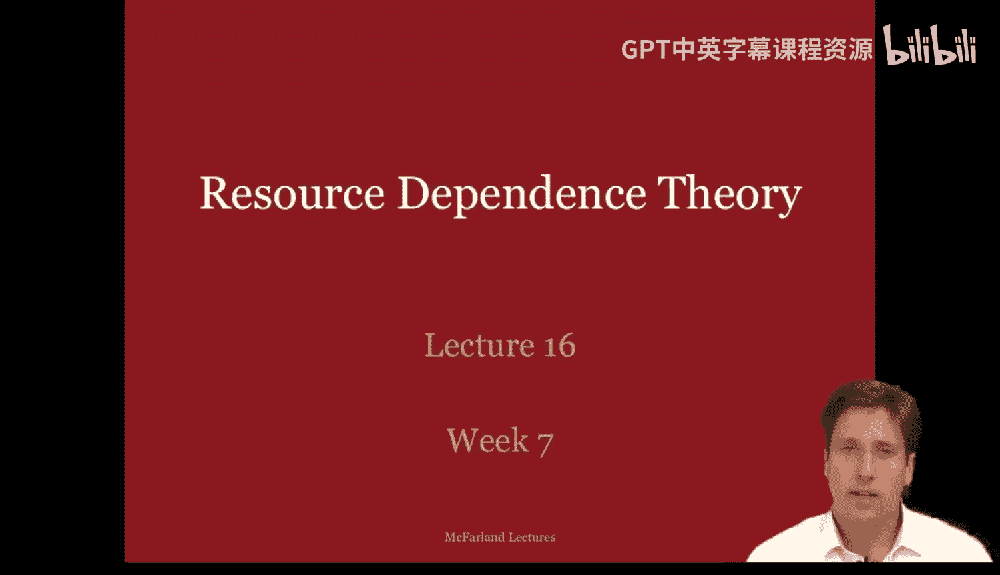
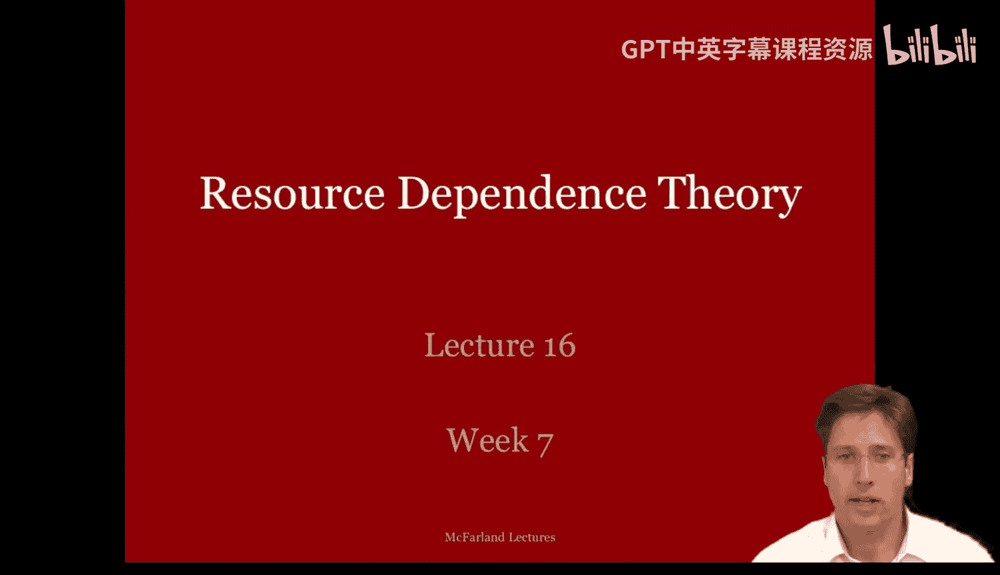
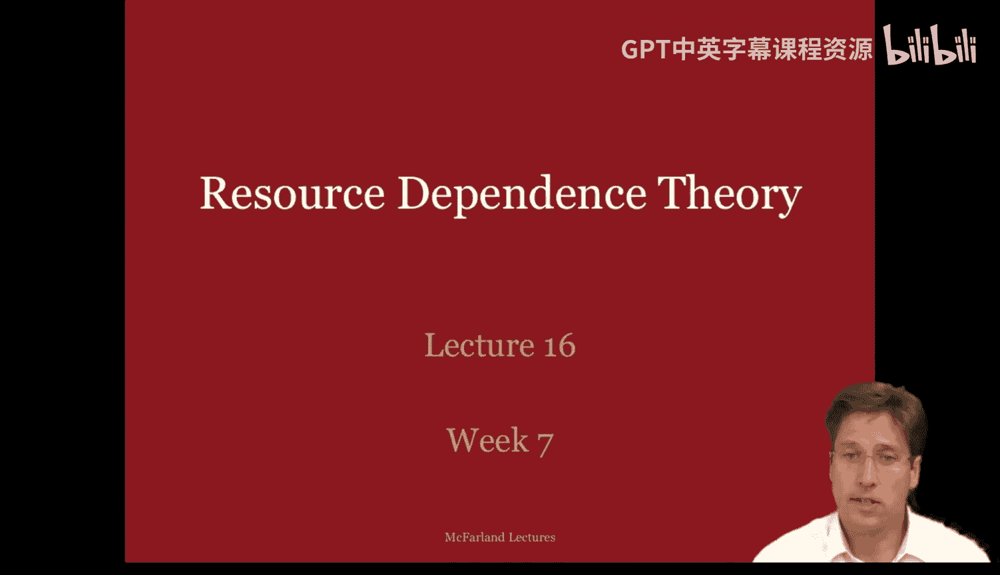
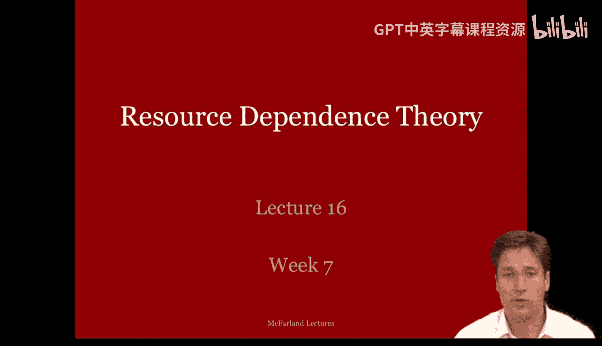
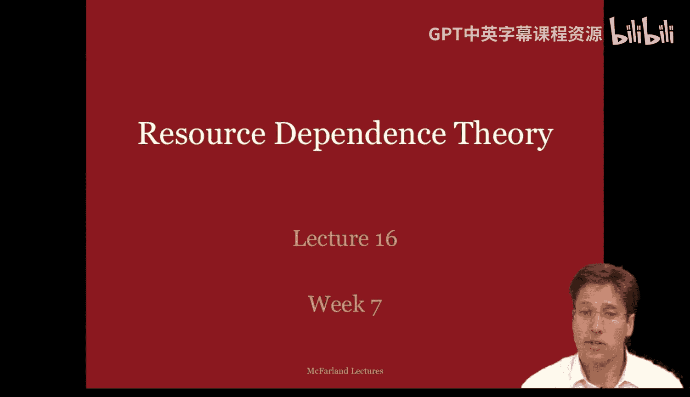
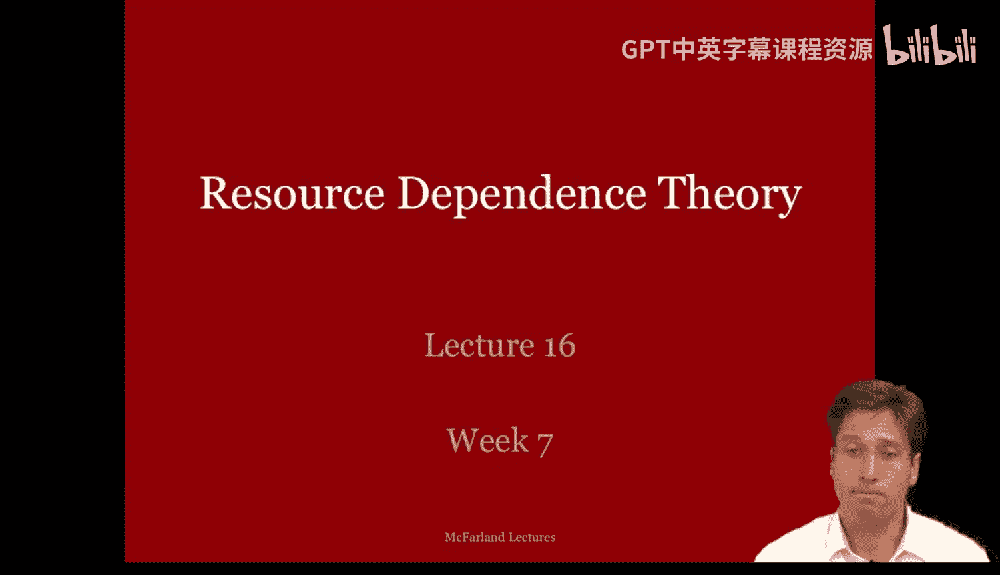
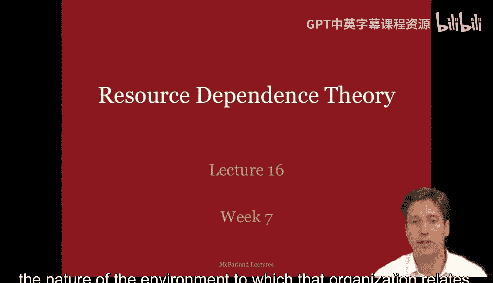
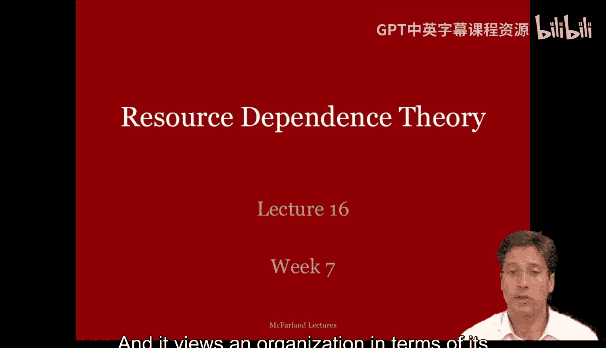
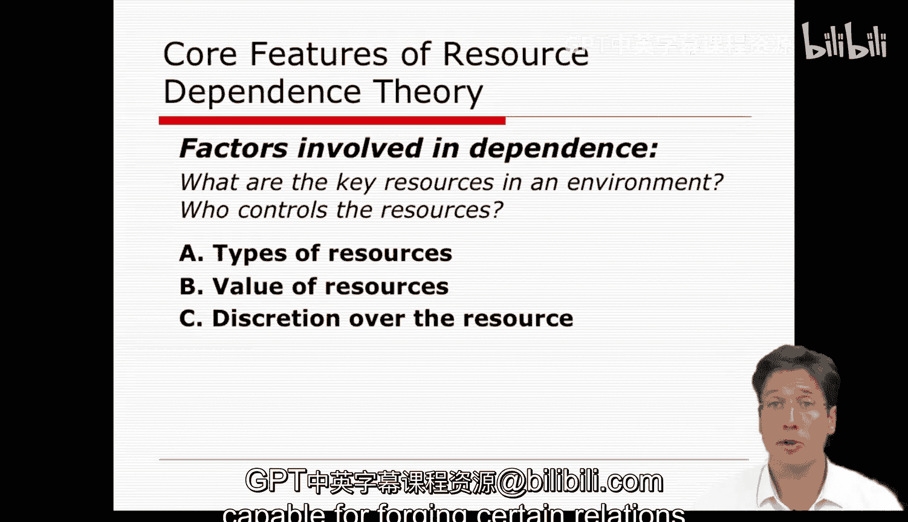

#  065：资源依赖理论（第一部分）🎯

在本节课中，我们将开始关注那些主要研究环境如何影响组织效能与生存的理论。这些理论被称为资源依赖理论、网络组织理论和新制度主义理论。它们都是组织研究领域相对较新的贡献，大多在20世纪80年代及之后的文献中出现，并且都提供了关于组织的开放系统视角。

## 理论概览与对比 🔄

上一节我们介绍了本课程将关注的几种理论。本节中，我们将资源依赖理论与之前学过的理论进行对比，以明确其独特视角。

以下是几种已学理论与资源依赖理论的简要对比：

*   **联盟形成理论**：该理论关注组织内部多个行动者因不一致的身份和偏好而形成联盟的过程。联盟通过成对的交换与谈判（如政治交易和滚木立法）达成短期协议。资源依赖理论同样关注交换与达成协议，但有两个重要区别：1）分析单位从个人联盟转向了组织间的依赖关系；2）它关注的是组织为克服环境中持续存在的依赖而采取的长期交换关系与策略（如并购）。

*   **组织学习理论**：该理论聚焦于组织成员如何在工作中通过实践来调整内部惯例，并将最佳实践编码到组织记忆中。资源依赖理论同样关注组织的技术核心，但它描述的是组织如何通过建立与外部公司的标准操作程序，来缓冲环境对技术核心的影响，从而获取自主权和控制力。焦点从“向内”适应转向“向外”管理。

*   **组织文化理论**：该理论的目标是创造一种成员能认同的意识形态或文化。它关注的是组织内部的意义建构和仪式性实践。相比之下，资源依赖理论不关心意义建构，而是关注选择那些能管理组织在环境中资源依赖关系的标准操作程序，其逻辑更偏向“后果逻辑”。

总的来说，之前的理论可被视为**自然系统**视角，更多关注组织内部的不确定性（如偏好不一致、规则模糊）。而资源依赖理论是一种**开放系统**视角，它将不确定性视为源于组织外部相互依赖的关系。在联盟理论中，依赖和不确定性是促成联盟的资产；而在资源依赖理论中，组织则试图通过摆脱对其他公司的依赖来获得自主和确定性。

## 理论渊源与核心特征 📜

上一节我们对比了不同理论，本节我们来深入了解资源依赖理论的历史与核心思想。资源依赖理论在很大程度上源于**权变理论**。权变理论（20世纪50-70年代）认为，企业的最佳行动方案或结构取决于其所处的内外部情境。汤普森对此有完整阐述，他认为管理者需要通过各种策略（如隔离技术核心、库存平滑、合作、签约）来缓冲内外部干扰。

资源依赖理论由**杰弗里·菲佛**和**杰拉尔德·萨兰基克**创立，它在权变理论基础上，极大地扩展了组织用于管理外部环境干扰的策略。该理论认为，组织通过调整其边界来管理外部环境中的干扰。其核心目标是组织在特定环境下的**效能与生存**。

资源依赖理论对组织状况有以下几个基本预设：
1.  **环境决定论**：组织行为可以通过其外部环境的约束与控制来解释。
2.  **目标权变性**：组织的具体目标取决于维持其生存的资源依赖关系。
3.  **核心追求**：组织在资源依赖的环境中，普遍追求**更大的确定性**（持久、清晰、有利的关系）和**自主性**（独立或可控）。
4.  **应对方式**：组织对资源依赖的响应至少有两种：**顺从适应**，或**规避管理**。

## 资源依赖的关键要素 🔑

上一节我们了解了理论的基础，本节我们深入探讨构成依赖关系的核心要素——资源。要识别资源依赖，需要思考几个关键问题：环境中的关键资源是什么？谁控制着这些资源？

资源形式多样，其价值取决于重要性和可获得性，并且由不同的主体控制。以下是资源的主要类型和影响其价值的因素：

*   **资源类型**：
    *   **物质资源**：如产品原材料。
    *   **技术资源**：如信息或知识。
    *   **社会资源**：如声望和声誉。

*   **价值影响因素**：
    *   **重要性**：资源是否必需、关键、有需求？例如，斯坦福大学生存绝对需要什么？学生？资金？教师？
    *   **可获得性（稀缺性）**：资源是否稀缺？是否被少数组织控制？是否存在替代资源？例如，斯坦福大学能提供哪些独一无二的资源？
    *   **裁量权（控制权）**：
        1.  **谁控制资源**：交换伙伴能否 dictate 资源使用方式？资源是否受政府监管？（例如，学区调整会影响生源。）
        2.  **什么控制依赖关系**：存在哪些法律、版权、合同或许可证？（例如，本课程只能使用知识共享许可的图片，这限制了信息分享。）

显然，**重要且稀缺的资源价值更高**。同时，对那些价值高、稀缺资源拥有最大裁量权且自身依赖度最低的行动者和机构，将最具自主性，也最有能力在环境中构建有利的关系。

---

本节课中，我们一起学习了资源依赖理论的基本框架。我们首先将其与联盟形成、组织学习和组织文化理论进行了对比，明确了其关注组织间长期依赖关系的开放系统视角。接着，我们追溯了其权变理论渊源，并阐述了该理论的核心预设：组织追求在环境中的确定性与自主性。最后，我们详细剖析了构成依赖关系的核心——资源，分析了其类型以及重要性、稀缺性和控制权如何决定依赖关系的性质。在接下来的部分，我们将继续探讨组织管理这些资源依赖的具体策略。