#  066：资源依赖理论（第二部分）🚀

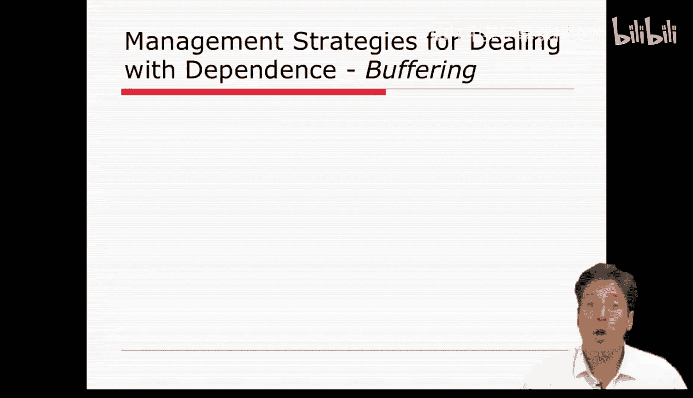

在本节课中，我们将学习资源依赖理论的核心管理策略。理解了资源的价值以及资源依赖的博弈——即追求自主性并与环境建立有利的资源关系，尤其是控制重要资源——之后，一系列管理策略便应运而生。我们将探讨这些策略，从缓冲策略到桥接策略，并分析其优缺点。

## 缓冲策略：保护技术核心🛡️

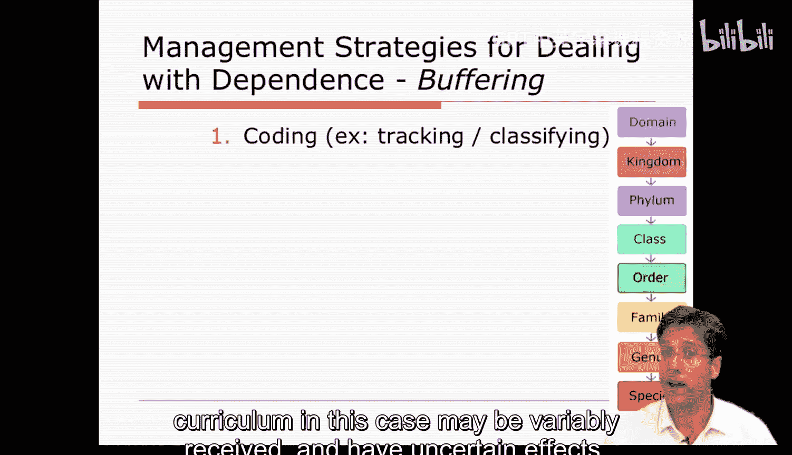

上一节我们介绍了资源依赖的基本概念，本节中我们来看看组织如何通过管理策略来应对依赖。首先，一些管理策略与权变理论相呼应，即通过**缓冲策略**来保护技术核心免受环境干扰。这些策略不改变公司的核心任务和技术，更侧重于建立标准操作程序来管理组织边界。

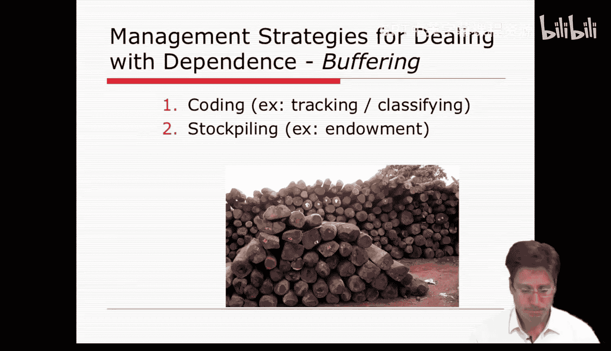

以下是几种主要的缓冲策略：

*   **编码**：组织在将输入投入技术核心之前对其进行分类。这种预处理有助于正确引导，必要时进行排除。例如，学校经常对学生进行分轨和分流，将学生按能力分类成同质小组，有助于缓冲教学的不确定性。
*   **囤积**：组织收集原材料或产品，从而控制投入技术核心或向环境释放产出的速率。例如，大学预算很大一部分依赖科研经费，而资助机构可能改变资金额度。因此，大学越来越重视获取捐赠和赠款，以便在困难时期动用这些资金维持项目规模。
*   **平准化**：组织试图减少输入或输出的波动。与被动囤积不同，平准化更主动地接触环境，以激励输入供应或刺激对其产出的需求。例如，大学通过宣传其优势来保持高入学率和周边房产价值，从而在经济衰退期维持输入。
*   **预测**：如果环境波动无法通过囤积或平准化处理，组织可能必须预测变化并尝试适应。例如，大学预见到未来资金可能短缺，便会寻找替代资金来源，如私人企业或基金会。
*   **调整规模**：公司根据预测信息或其他原因改变其技术核心的规模。例如，公司裁员或学区取消表演艺术和外语课程，但保留数学、科学等核心科目。这通常不改变技术核心的性质，只改变其规模。

## 桥接策略：塑造依赖关系🌉

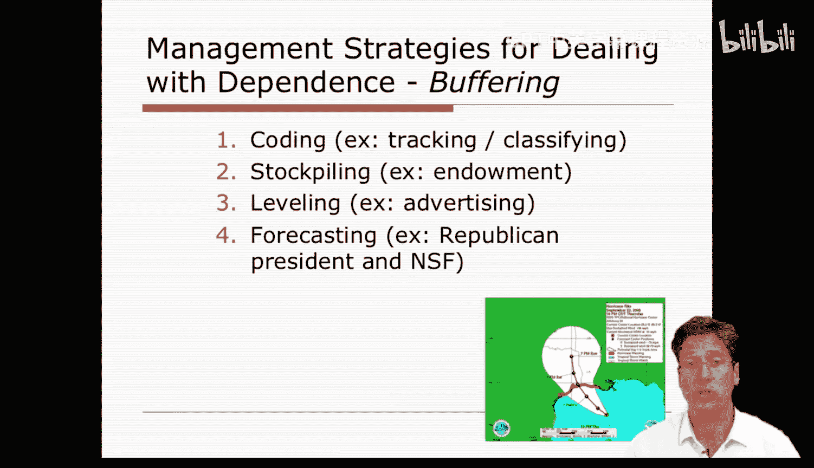

除了缓冲技术核心，组织还可以通过**桥接策略**来保护自己。桥接策略的目标是塑造环境中的依赖关系，可以通过与其他公司谈判、有选择地交换资源、汇集资源、部分或完全吸收其他公司来实现。这些是程度逐渐加深的桥接努力。

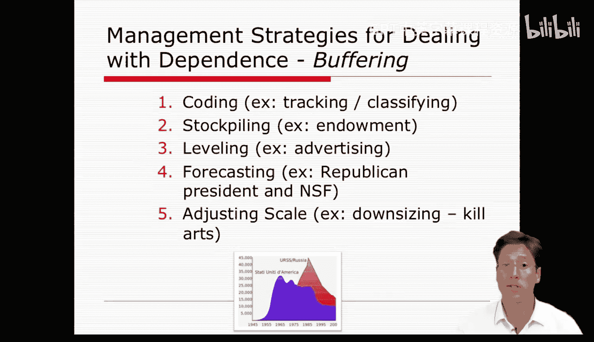

接下来，我们将逐一仔细描述这些策略。

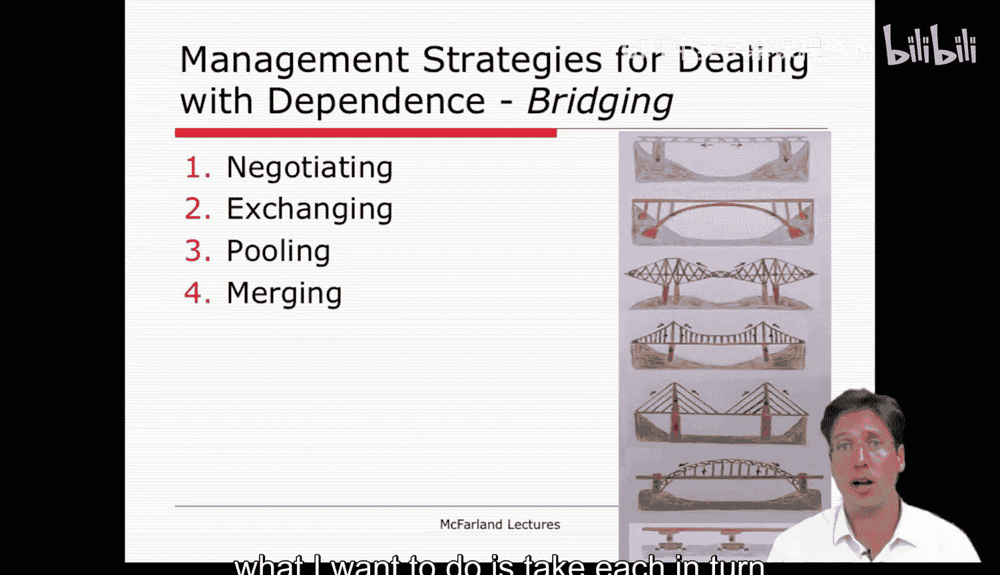

### 谈判与规范协调

最轻微的桥接（或前桥接）努力出现在谈判中。成本最低的方式是与其他公司谈判，唤起**规范协调**。在这里，行为由共同的、非正式的期望来调节，以减少不确定性。例如，教师工会向学区董事会提出要求，前五项关乎教育质量，最后一项关乎薪资。董事会可能批准前五项而拒绝第六项，因为他们认为最后一项是披着社会合法外衣的私人要求。这里唤起的规范是关于信任和诚实的非正式期望。然而，规范协调相当薄弱，并非总是有效。

### 讨价还价

第二种前桥接策略是讨价还价。管理者使用一系列策略来抵御即将形成的依赖关系，通过谈判和交换，试图防止资源关系变得更加不平衡。我们在关于联盟的章节中见过这种类型的讨价还价。

### 资源交换

更严肃的桥接形式涉及**交换**，即通过资源交换相互放弃自主权。公司可以通过多种方式实现，最简单的是通过**合同**。合同试图通过以有限、特定的方式协调未来行为来减少不确定性，定义了组织间接触和交换的规则。另一种交换形式是通过创建**连锁董事会**或各种形式的**吸纳**。在这里，竞争组织的成员被赋予一个监督所有组织的中央机构的职位。通过让外部成员进入董事会，组织部分地将外部组织的利益吸纳为自己的利益，但也放弃了一些控制权。

### 资源汇集

更广泛的桥接方式涉及与其他公司**汇集资源**。实现方式之一是**合资**，即两个或更多组织创建一个新组织以追求共同目标。公司也可以结成**战略联盟**，通过协调活动或共享资源来追求共同目标。此外，公司可以加入**协会**和**卡特尔**。协会（如美国教育研究协会）标准化信息并成为信息交换所。卡特尔（如欧佩克）则涉及更多的资源汇集和自主权丧失，它们超越非正式规范，拥有实际手段制裁不遵守规定的成员。在美国，卡特尔通常是违法的。

### 完全吸收（合并）

公司也可以完全汇集其资源，资源依赖理论称之为**完全吸收**，即**合并**。这有几种形式：**纵向合并**，公司扩展对其运营至关重要的交换环节的控制；**横向合并**，公司接管其竞争对手，以减少不确定性并增加其在交换关系中的组织权力；**多元化**，通过收购完全不同类型的业务来减少依赖。

## 通用管理策略与依赖类型预测🎯

我们介绍了从简单谈判到交换、汇集、部分吸收再到完全合并的众多管理策略。现在，退一步思考，从资源依赖方法中可以总结出哪些通用管理策略？基本上有两种。

第一种通用策略是**避免**对其他公司的资源依赖。这可以通过多种手段实现，例如使用囤积等缓冲策略、签订长期合同缓冲产出、尝试改变法律规则和设定法规以管理周边竞争市场，以及进行多元化并寻找可替代的交换或备份。

第二种策略是**打破**公司对其他公司的依赖，并可能使它们依赖你。这里可以使用一些更棘手的手段，如信息保密、限制信息、甚至发起反垄断诉讼、吸纳控制性公司、通过纵向合并等方式获得对输入或控制组织的控制权，或者设定监管规则。

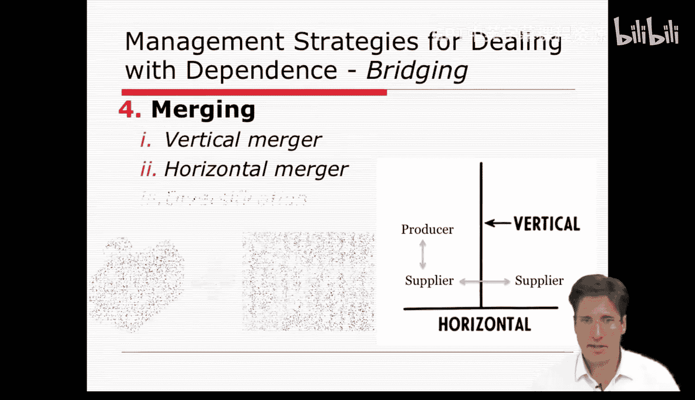

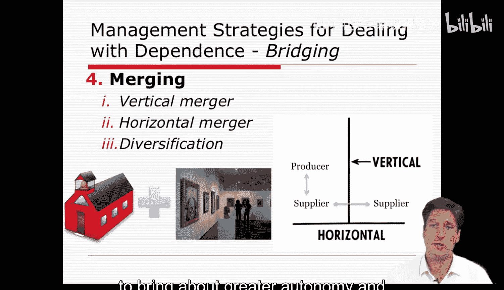

学者如理查德·斯科特认为，我们可以预测某些管理策略会导致特定的资源依赖关系。例如，一些公司倾向于形成**共生互依**关系，即两种或多种组织交换不同的资源。如果交换的资源重要性不等，则会产生权力差异。这种依赖通常对应于规范协调、合同及其条款（如层级合同）、合资和纵向合并。

另一种依赖形式是**共栖性或竞争性**依赖，即两个或更多组织竞争第三方资源。这通常通过差异化解决，即一方专业化成为供应商，形成劳动分工和相互依赖。根据斯科特的观点，竞争性依赖出现在规范协调或吸纳、形成连锁董事会、行业协会、合资和横向合并的情况下。

## 资源依赖理论的局限性与思考🤔

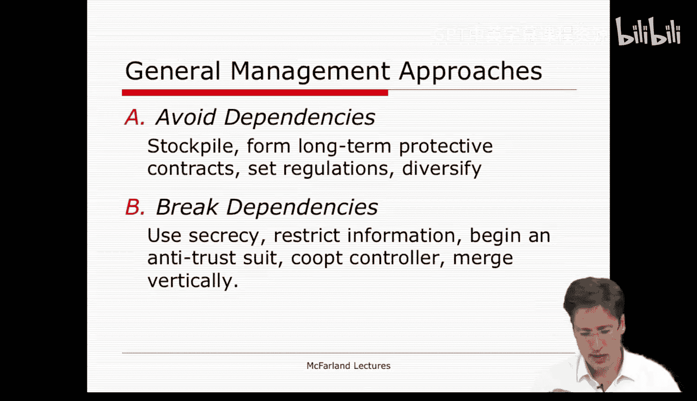

就像我们目前课程中回顾的所有理论一样，资源依赖理论并非完美无缺，存在某些缺点。

首先，资源依赖理论内置了一个假设，即所有组织或多或少相似，它们以相同方式对待环境，在不确定的世界中获取资源，这些公司由有限理性的管理者运营，他们寻求优化自己和组织的利益。但我们需要问，这是否准确？有些组织是否更关注身份认同和匹配，而非资源依赖问题？

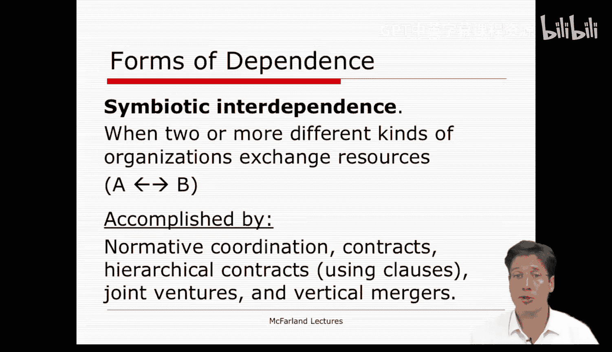

其次，需要考虑资源依赖理论中确定性和不确定性的概念是否相对清晰。对社会资源和知识的依赖是否清晰，而对金钱和物质的依赖是更清晰还是更不清晰？该理论纯粹基于资源交换，并假设价值和重要性是清晰的，但资源的价值往往在事后才变得清晰。因此，意义建构和感知过程被资源依赖理论忽略了。

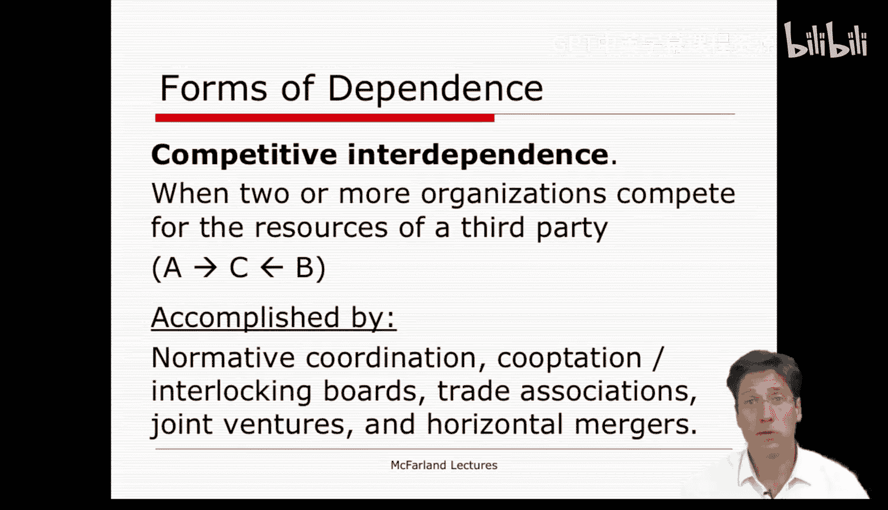

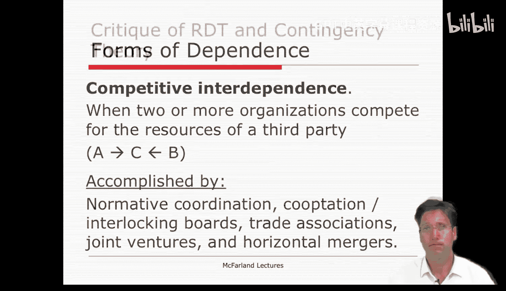

此外，我们想知道，在资源理论中，文化和使命发生了什么？它提到了规范协调，但没有彻底描述它。我们在组织文化等理论中找到了对该过程更强有力的描述。

最后，所有的依赖关系都是以成对方式描述的。我们不得不思考，更大的网络呢？更大的网络模式能否定义机会和约束？网络能否比依赖关系更好地定义规范和压力？

我们必须等到下周才能看到，但对我们许多人来说，也许这种更大的安排——网络，作为网络的环境——可能极大地影响着资源依赖的类型，以及该环境中公司之间发生的意义建构和感知过程。

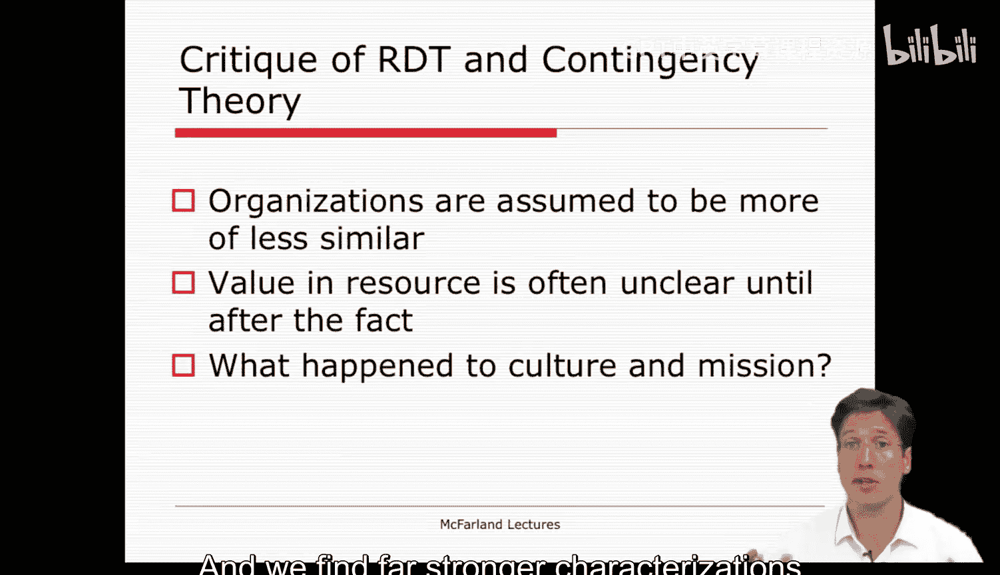

## 总结📝

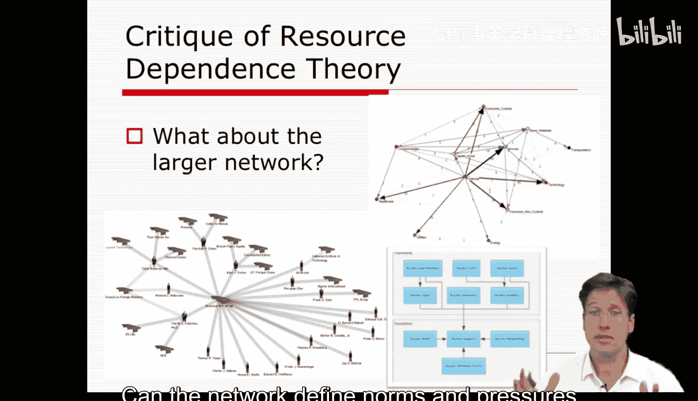

本节课中，我们一起学习了资源依赖理论提出的核心管理策略。我们探讨了旨在保护技术核心的**缓冲策略**（如编码、囤积、平准化、预测、调整规模），以及旨在塑造环境依赖关系的**桥接策略**（从谈判、交换到资源汇集和合并）。我们还总结了两种通用策略：避免依赖和打破依赖，并了解了特定策略可能预测的依赖关系类型（共生性与竞争性）。最后，我们审视了该理论的局限性，包括其对组织同质性的假设、对意义建构过程的忽视，以及对更大网络影响的考虑不足。这些内容为我们理解组织如何管理与环境的资源互动提供了重要的分析框架。