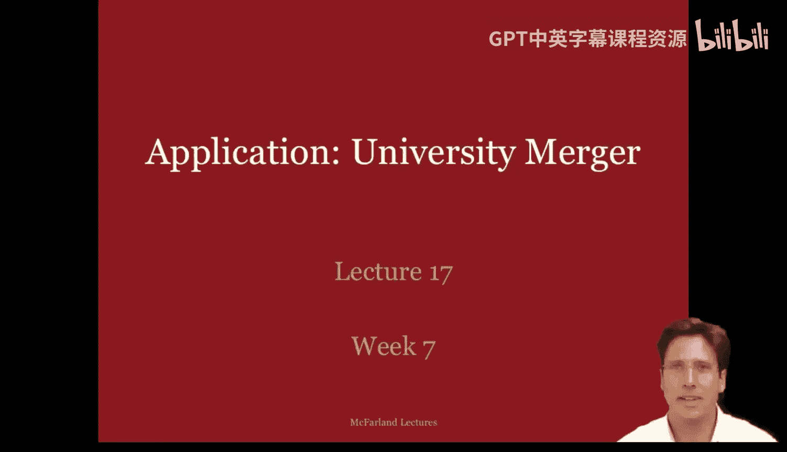
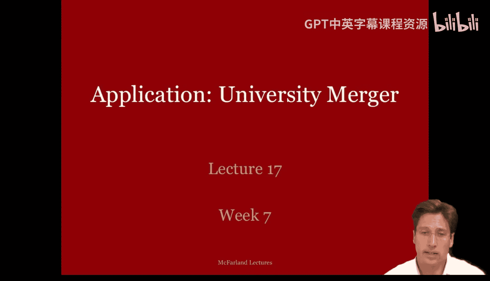
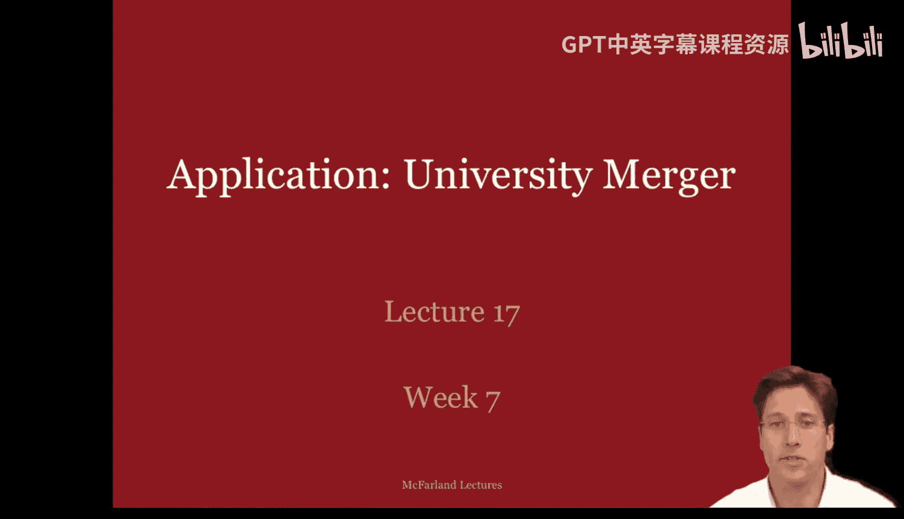
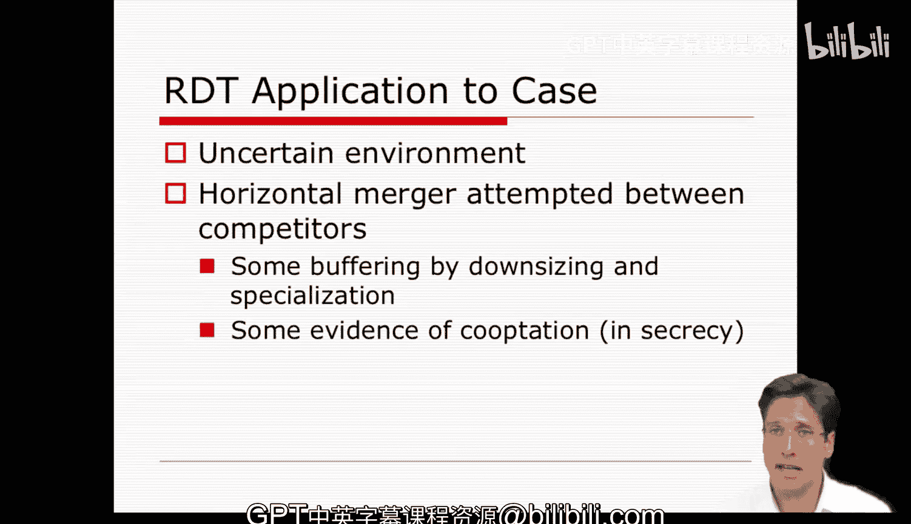

**组织分析：第十七讲：案例应用 - 第一部分** 🏛️

在本节课中，我们将通过一个具体案例来回顾和应用资源依赖理论。我们将分析芝加哥大学与西北大学在1933年尝试合并但最终失败的历史事件，并探讨该理论如何解释这一过程。

---

### **案例背景**

本周描述的案例由历史学家莎拉·巴恩斯撰写。她详细记录了1933年芝加哥大学与西北大学之间一次失败的合并尝试，这次合并本可能创造出世界上第一所“超级大学”。

合并的努力始于大萧条时期，当时两所大学都深陷财务危机。在许多方面，这两所大学在芝加哥市是竞争对手，争夺学生、声誉和资金等资源。

*   **西北大学**位于芝加哥北郊，毗邻密歇根湖，环境优美。它是一所大型本科院校，主要招收本地学生，并高度重视新闻、医学等应用型专业。
*   **芝加哥大学**则位于芝加哥南部的城区。它是一所拥有精英声誉的大型研究生院校，全国知名，并强调追求真理和理论研究。

两所机构的对比非常鲜明：西北大学享有免税地位，芝加哥大学则没有；西北大学位于安全社区，芝加哥大学地处城区；芝加哥大学拥有声望和创新声誉，西北大学则更具地方性；芝加哥大学专注于理论，西北大学专注于应用研究。因此，理论上，双方可以优势互补。

此外，合并还能带来财务收益，例如每年节省170万美元的维护费用，并实现更好的规模经济。两所机构似乎都认识到了这一点，谈判起初进展顺利。

---

### **合并为何失败？**

然而，当西北大学扩大其审查委员会的代表范围，开始与更广泛的群体（如校友和校内团体）商讨合并事宜时，问题开始出现。

以下是合并最终破裂的几个关键原因：

1.  **核心利益冲突**：当两所学校深入讨论具体细节时，合并开始瓦解。芝加哥大学希望保留其本科学院，而这将与西北大学的本科项目直接竞争。双方都不愿放弃自己的医学院或教育学院。
2.  **关键支持者离世**：西北大学董事会中一位关键的合并支持者去世，削弱了推动力。
3.  **负面信息泄露**：随着西北大学审查范围的扩大，损害性的新闻和谣言泄露给了媒体，激怒了校友。例如，有传言称合并早已内定，实为一场“接管”；或是芝加哥大学校长哈钦斯为挽救其失败校长任期的最后一搏；以及西北大学将失去其身份认同。
4.  **立场分化**：讨论逐渐变得更具党派性，人们不再关注合并可能带来的共同利益，而是更多地捍卫各自立场。

---

### **应用资源依赖理论**

那么，资源依赖理论能告诉我们关于这个案例的什么信息呢？让我们先简要回顾一下该理论。

**资源依赖理论的核心观点**是，组织为了生存，需要管理其对外部关键资源的依赖。组织会采取行动来**减少竞争、增加自主权、提升权力，甚至可能提高效率**。

其主要行动模式是**扫描环境**，寻找资源机会与威胁，并试图达成有利的**交易或协议**，以最小化依赖、最大化自主权和确定性。

这似乎在一定程度上捕捉到了西北大学和芝加哥大学案例的动机。

---

#### **理论视角下的组织要素**

资源依赖理论也从特定角度刻画了组织要素：

*   **技术（或核心活动）**：关注**外部适应**，以增加自主权、减少依赖。
*   **参与者**：焦点组织及其与之有资源相互依赖的其他组织。
*   **目标**：通过**外部适应**实现生存。
*   **社会结构**：聚焦于**组织间关系**，努力管理标准操作程序，并在这些外部关系中进行谈判和政治运作。
*   **环境**：环境是核心。焦点在于**交换伙伴和外部关系**，而非内部动态。环境的特点包括竞争或威胁，以及组织对获得更大确定性的渴望。

所有这些组织要素的特征似乎都适用于我们的芝加哥-西北大学合并案例。

---

#### **管理者的策略**

在资源依赖理论指导下，管理者会采取两类策略：

1.  **缓冲策略**：如囤积资源、通过广告展示优势创造需求、预测未来需求并调整核心业务的规模。
2.  **桥接策略**：与其他组织建立联系，为自身在竞争环境中带来安全。这包括谈判长期合同、通过合资与联盟部分吸收和共享资源，甚至通过公司合并进行完全吸收。

在芝加哥-西北大学的案例中，我们看到了合并（桥接）和规模调整（缓冲）方面的尝试。

---

### **理论在案例中的具体应用**

芝加哥-西北大学合并案，显然是一个环境对两所大学都不确定且充满问题的案例。它们都处于财务困境中。这也是一个两所大学探索**横向合并**（或在秘密状态下，像芝加哥大学所做的那样，试图“吸纳”对方）的案例，是竞争者之间的合并。

理论上，这次合并本应包含一些**缓冲**：每所大学缩减其核心业务（淘汰最差的专业，保留最好的），然后以互补的形式结合，从而实现改进的规模经济。合并本可能形成一个无与伦比的超级大学。

那么，它为什么没有发生呢？资源依赖理论能给我们解释吗？

接下来，让我们更具体地将组织要素的概念应用到案例中的每一所学校内部，看看我们能学到什么。

---

### **总结**

本节课中，我们一起学习了资源依赖理论在一个历史案例中的应用。我们回顾了芝加哥大学与西北大学1933年合并失败的过程，并利用该理论分析了其背后的动机（应对外部不确定性、寻求互补与规模经济）以及失败的原因（核心利益冲突、内部政治、信息泄露导致的支持分化）。这个案例表明，即使从资源依赖的理性角度看合并有利，组织内部的社会结构、权力动态和身份认同等因素也会对结果产生决定性影响。