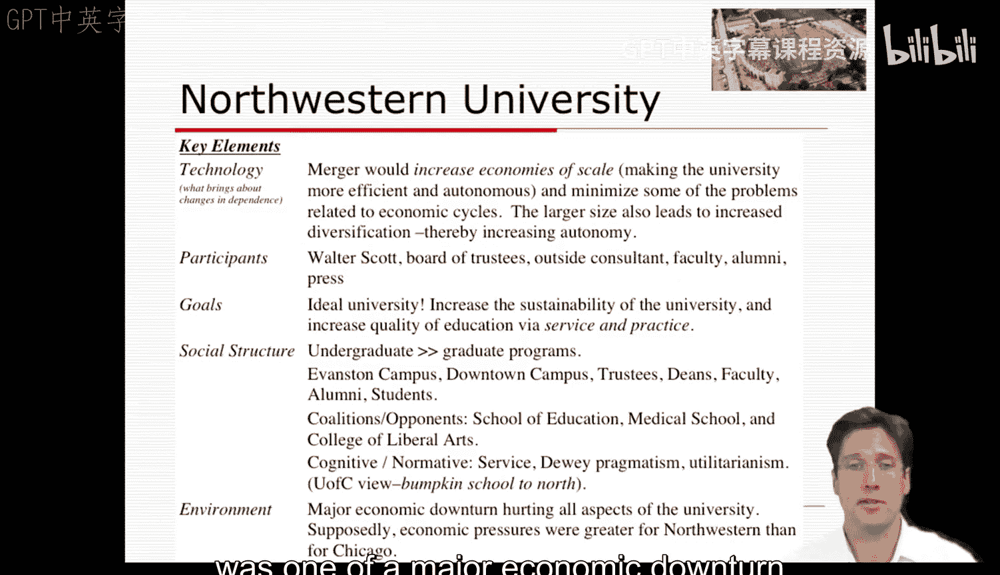
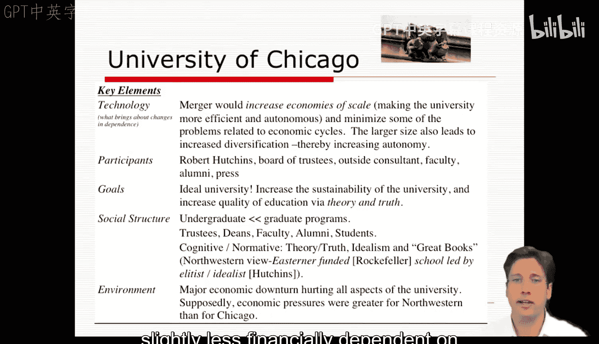
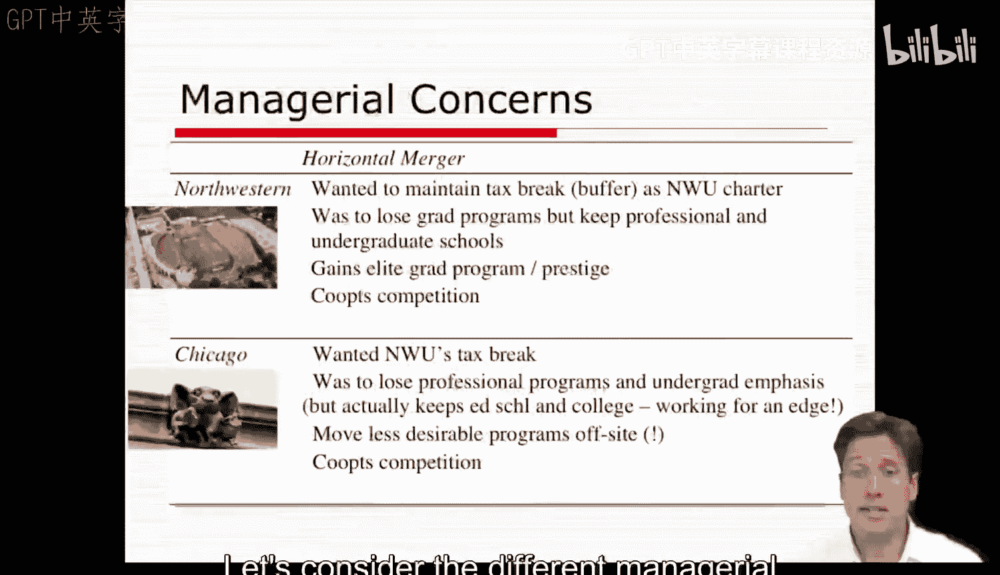
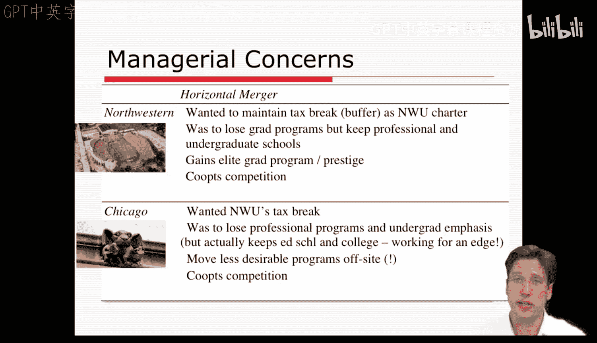
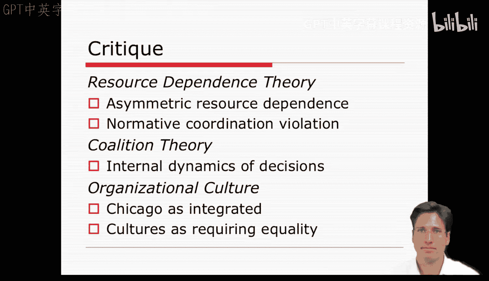

**组织分析：第十七讲：案例应用 - 第二部分** 🏛️

在本节课中，我们将继续分析西北大学与芝加哥大学合并的案例。我们将深入探讨两所大学各自的组织要素、管理考量，并运用资源依赖理论和联盟理论来解读合并失败的原因。

---

### **西北大学的组织要素分析** 📊

上一节我们介绍了案例背景，本节中我们来看看西北大学的具体情况。对于西北大学而言，其提议的组织变革技术是合并，旨在通过规模经济提升效率与环境自主性，并减轻大萧条带来的问题。合并后大学规模的扩大也可能带来多元化发展，从而进一步增强其自主性。

以下是案例中提到的西北大学相关参与者：
*   沃尔特·斯科特校长
*   董事会（特别是部分董事成员）
*   外部顾问
*   教职员工
*   校友
*   新闻媒体

西北大学的目标是成为一所理想的大学，通过提升其应用型项目、专业与社区服务及实践，来增强其定位和教育质量。其社会结构表现为本科项目比研究生项目更受重视。支持者网络主要集中在新闻媒体、斯科特校长及关键董事会成员周围。然而，反对声音在教育学院、医学院和文理学院中出现，他们都希望从合并中获得公平的待遇。由于新闻泄露等原因，其他利益相关者如校友后来也参与进来，他们大多持反对态度。西北大学深层的信念结构旨在推广服务、社会实用主义和功利主义，这与我们接下来要看到的芝加哥大学形成鲜明对比。西北大学所处的环境是严重的经济衰退，这损害了大学的各个方面。

---

### **芝加哥大学的组织要素分析** 🎓

接下来，我们看看芝加哥大学。与西北大学类似，芝加哥大学也将合并视为增加规模经济、减轻大萧条相关问题的一种手段。它将更大的规模视为大学多元化的一种方式，使其能更好地应对环境变化。

此处的参与者类型与我们在西北大学看到的许多相同：
*   芝加哥大学校长罗伯特·梅纳德·哈钦斯
*   其董事会
*   外部顾问
*   教职员工
*   校友
*   新闻媒体

芝加哥大学的目标与西北大学相似，也是要发展成一所理想的大学，但其目标是通过追求理论与真理来提高教育质量，从而增强大学的可持续性。此外，芝加哥大学侧重于精英教育而非应用教育。其使命由富有魅力的哈钦斯校长更清晰地阐述和频繁传达。

芝加哥大学的社会结构和价值观也与西北大学大不相同。哈钦斯是一位非常强势的领导者，因此其决策结构更为集中。此外，芝加哥大学对研究生培养的重视远高于本科培养。最后，其宣称的信念在于追求理论与真理，以及对“伟大著作”的理想化。西北大学某种程度上将芝加哥大学视为一所由东部人领导、洛克菲勒资助、并由精英理想主义者哈钦斯领导的学校。芝加哥大学目标明确且与其社会结构一致，这使其某种程度上形成了一种整合的组织文化。芝加哥大学所处的环境与西北大学非常相似，也经历着糟糕的经济困境，但据称其承受的经济压力小于西北大学。

总而言之，仅仅识别案例中的组织要素及其特征，就能揭示两所组织的差异：它们的社会结构和目标截然不同，并且芝加哥大学对环境的财务依赖略低于西北大学。

---

### **两所大学的管理考量** ⚖️

了解了各自的组织特点后，我们来考虑这两所学校不同的管理关切。对西北大学而言，这次横向合并有很多可获益之处，但也会有所损失。它希望保留某些资源，特别是其享有的税收减免，这属于缓冲策略。根据其章程，如果能够保留其应用型专业学院和本科项目，它愿意放弃其研究生项目。作为交换，它将获得精英研究生项目和国际声望。此外，通过与芝加哥大学联合，它还能与其在生源、教职员工和资金方面的地区竞争对手进行合作。

另一方面，芝加哥大学希望获得西北大学的税收减免好处，但不太愿意放弃其专业项目和本科学院。因此，它希望保留其教育学院、医学院和本科学院。芝加哥大学某种程度上在争取这笔交易中的优势。在某些方面，芝加哥大学将合并视为将其不太理想的项目（如应用型培训领域）迁离主校区的机会。最后，它也将此视为与其竞争对手合作、组建世界领先超级大学的机会。

---

### **理论视角下的案例分析** 🔍

资源依赖理论会以关注不同的依赖程度来切入此案例，并将这些依赖程度差异视为芝加哥大学采取更激进态度以及合并失败的一个原因。该理论会指出，芝加哥大学试图将合并规则改为更不对称的合同，而西北大学将此视为对规范性协调形式的违背。

其他理论似乎有助于解释本案中的细节。每所学校决策机构内部的运作似乎更适合用联盟理论来描述；在那里，我们可以看到合同的构建和合并需要进行大量的政治博弈。此外，西北大学一位关键人物的去世似乎是故事的核心，至少是巴恩斯所呈现故事的核心。然而，联盟理论可以帮助我们理解两所学校内部支持和反对合并的各个阵营，从而解释内部动员努力是如何瓦解的。相比之下，资源依赖理论有助于解释为何两所大学以不同且不兼容的方式对待合并。

这里存在某种矛盾，因为合并通常带有一定的不对称性。因此，问题在于不对称性如何阻碍了进程。我的感觉是，无论是资源依赖理论还是联盟理论，都没有很好地调和两所大学之间更深层次的文化差异，而这些差异很可能扮演了重要角色。每所大学独特且备受重视的文化使得合并必须以平等形式或长期合同进行，即使芝加哥大学可能拥有更大的资源优势。此外，芝加哥大学当时拥有更鲜明和整合的学术文化，这可能使哈钦斯和芝加哥阵营高估了他们对大学的理念，并使他们更倾向于将合并视为接管而非共同努力。因此，双方可能从未就合并形式达成一致。本周，听听你们对此案例的看法以及认为哪些理论最适用，将会非常有趣。莎拉·巴恩斯出色地提供了一段详尽的历史，我们可以在此案例中看到多种理论或其要素的体现。

---

**总结**

本节课中，我们一起深入分析了西北大学与芝加哥大学合并案例的细节。我们比较了两所大学在组织要素、管理目标和策略上的根本差异，并运用资源依赖理论和联盟理论解释了合并谈判中的权力动态与内部政治如何导致了合作的失败。这个案例生动地展示了组织文化、资源依赖和内部联盟在重大战略决策中的关键作用。