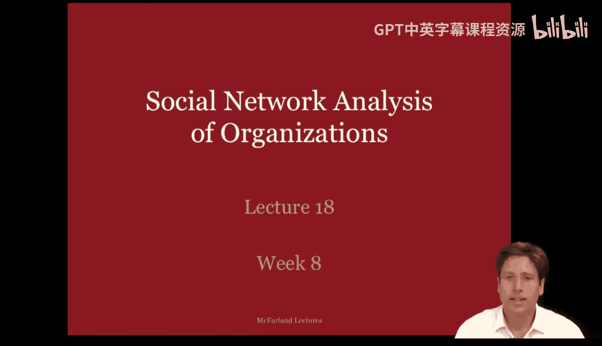
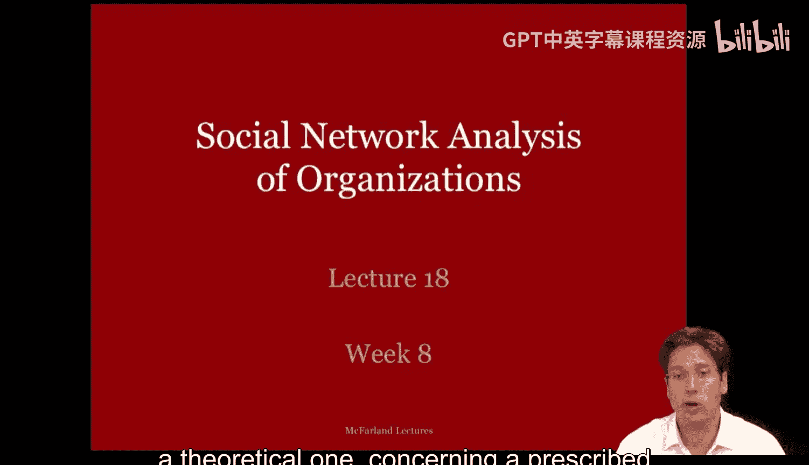
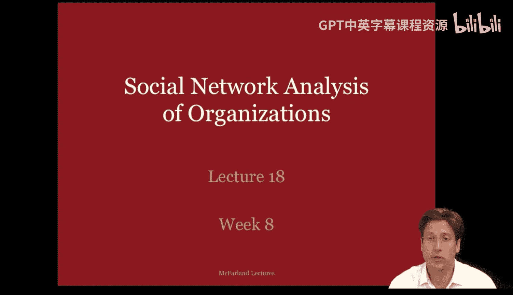
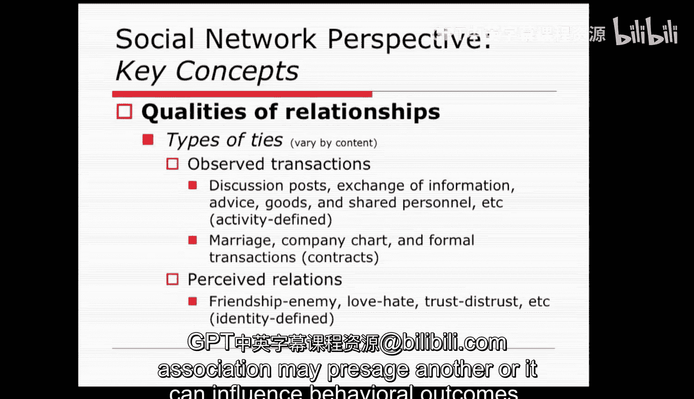

#  076：组织网络分析 - 第一部分 🕸️

在本节课中，我们将学习组织研究者如何分析组织内部的社会网络。此外，我们还将探讨一种理论观点，即存在一种区别于层级组织和市场的“网络型组织”形式。我们将从两个视角展开：一是纯粹的分析视角，用于描述组织内部的网络；二是理论视角，探讨能够带来更好组织产出的组织间关联形式。

## 社会网络视角

上一节我们介绍了本讲的两个核心视角。本节中，我们来看看第一个视角——社会网络视角。该视角秉持“社会嵌入性”这一概念，由马克·格兰诺维特于1985年提出。

格兰诺维特认为，一方面，经济学和市场对行为的解释是“社会化不足”的。在这些解释中，行动者的行为仿佛不受社会背景的约束。另一方面，社会学家和制度主义对行为的解释则是“过度社会化”的，他们将社会行动描述为社会决定性的，缺乏个人选择。

因此，格兰诺维特提出了“嵌入性”作为中间立场。在这里，社会行动被嵌入在交易网络中。这种嵌入性甚至适用于市场中的经济交易。其核心思想是，我们在结构中以有意识的方式做出决定并采取行动。

现在，请看旁边的图示，它描绘了全球贸易网络以及交易中相关或至少邻近的产品。值得注意的是，这种关联并非随机。某些产品与其他产品的关联度远高于其他，这表明交易是嵌入在一种社会化的模式结构中的。

这种结构通常是社会网络分析师的关注焦点。分析师试图理解组织行动者所嵌入的关联背景，并从中了解这种背景如何约束和促成行动者的决策。

社会网络分析师通过关注公司内部的社会结构，和/或跨越多家公司的环境关系网络来研究嵌入性。这些关联背景的模式各不相同，代表了不同的行动背景。组织行动者所处的位置也不同，这为管理者及其公司提供了不同的行动机会和约束。

请看旁边的网络图。最远处的图形看起来像一棵生成树，覆盖范围很广。你还会注意到，行动者之间的互连并不多，并且网络中存在着关键瓶颈或割点。如果移除这些关键角色，网络就会崩溃，无法运转。在第二个更靠近我的网络中，我们看到了一些由互连行动者组成的密集枢纽。在那里，我们可以移除其中几个角色而不必担心网络的存续，因为存在某种程度上的冗余联系和个体。我们还看到处于外围的行动者，他们似乎远离了网络的核心交易。

这些位置中的每一个都代表了不同的行动和信息背景。但关键不仅在于整体形式，还在于你的公司或你作为管理者所处的位置，这至关重要。

位于此处的组织行动者或公司，其机会和约束如何变化？例如，位于这个瓶颈处、位于外围、位于网络中间的这个集群内，或是位于集群之间的另一个瓶颈处？社会网络方法正是要面对这些关于网络整体形式或模式，以及在这些网络中的网络定位问题。

关联网络不仅影响社会行动，也影响决策结果。因此，社会结构和网络环境实际上是动态演化的。我的意思是，它们会发生变化。社会网络学者才刚刚开始开发工具，帮助我们理解如何在公司内部和公司之间设计和构建不同的社会结构。

请看旁边的图示，它展示了一组联系如何变得更加互连，并最终形成图中所示的准独立群体。在第一阶段，它们处于一种分散的、类似二元组的状态，可能有一两个三元组。在第二阶段，它们开始形成一些集群。在第三阶段，你有了两个不同的群体，它们之间由桥梁连接。

在本讲中，我将向您介绍社会网络学者在研究组织时使用的一些基本概念。通过这样做，我希望您能将其视为一种独特的实证方法，并可以应用到您所参与的组织中。

## 网络分析的核心问题

上一节我们了解了社会网络视角的基本思想。本节中，我们来看看网络分析师在研究公司时通常会提出并回答的一系列问题。

以下是网络分析师在研究公司时提出的关键问题：

1.  **分析单元与网络边界**
    分析师试图定义网络是什么，以及它的起点和终点在哪里。许多分析师会关注公司内部的个体及其关联方式。然而，研究公司中的每个人并不总是可行的。例如，在研究学校时，分析师可能只研究教室或更大校园内的教师和学生。因此，他们承认核心工作环境的自然边界，但会忽略研究支持人员，如管理员或食堂工作人员，以及辅导员甚至作为关键利益相关者的家长。研究公司时也是如此。他们可能只关注大楼内或特定部门的管理者和员工，而忽略客户支持人员等。在这些排除的情况下，分析师是在定义组织的名义边界。重要的是，他们需要考虑，鉴于他们想要研究的现象，这个边界是否合理。例如，如果关注点是管理者如何交流教学法和教学信息，那么只关注教师而排除学生可能是一个可接受的边界定义。但如果你认为管理者的大部分教学法知识来自学生讲述其他老师的做法，那么这对你的研究和得出的结论可能是个问题。

2.  **更大的分析单元**
    分析师也关注更大的分析单元，例如公司集合及其相互关系。他们研究一个组织场域以及参与者共同认为对其公司运作最相关的交易。例如，伍迪·鲍威尔2005年发表在《美国社会学杂志》上的论文描述了技术领域。当他研究生物技术领域时，他的样本包括大学、生物技术公司、银行、风险投资公司和政府资助机构，这些机构都共同参与了专利合作、共享商业关系、跨边界转移专家等。因此，他的工作试图捕捉由该领域参与者所看到的整个组织场域的边界。这很巧妙，但通常很难做到。因此，许多分析师会专注于一类公司及其核心交易，而忽略其他。例如，已有大量关于风险投资公司及其在发明上共同合作网络的研究。

3.  **时间单元与网络起止**
    下一个问题，网络分析师通常会隐含地问：什么是时间单元？网络何时开始，何时结束？这里的问题是所讨论社会结构的时间边界。大多数分析师通过考虑哪些关系对组织最重要来面对时间边界问题。它们是在像我们这样的讨论论坛上的交易吗？是每个季度进行的交换吗？是具有相对持久性的年度合同吗？请注意，那里的时间单元在交易发生的时间上差异很大，从秒到季度再到年。然后他们必须问，他们将研究公司的哪个时间段？从哪个时间点开始观察，到哪个时间点停止？他们是否只关注新技术推出第一周内的交换？一个项目（如整个课程）的跨度？还是多年？这些都是分析师在确定网络何时存在时必须决定的问题。时间单元问题很重要，因为它关系到交易如何聚合成不同的模式。以教室的简单案例为例。如果我们按分钟查看互动，会看到一系列二元或成对的交换序列。这可以从我旁边的图中看到。如果我们查看五分钟内聚合的互动，会看到网络结构从一种活动（例如讲座）转变为另一种活动（例如小组作业）。然后，如果我们聚合35分钟内的所有交易，就会开始看到教室的一般互动模式，即关联的集中趋势。因此，你的时间单元预设了从瞬时互动的结构，到作为网络配置的活动和实践，再到群体中更大的社会规范和集中趋势等不同的社会结构概念。作为分析师，你需要问自己，你是试图理解微观惯例的结构、更大的任务结构，还是群体规范，并据此决定采用的时间单元。

## 关系的质量与分析

一旦社会网络分析师对重要关系在何时何地发生、网络在何时何地开始和结束有了概念，他们就可以开始研究关系的质量并分析更大的网络。

现在，公司内部和公司之间发生着多种类型的交易，其中一些影响重大，一些则微不足道。因此，一个好的分析师会抓住问题的核心。他们会倾听客户的关切，并找出最相关的交易类型。这些关系通常是观察到的行为，或者是主体感知到的行为。

观察到的关系可以通过公司记录、观察甚至报告来识别。你甚至可以通过录像、录音或在在线论坛中收集它们。感知到的关系通常由主体报告，这需要调查或访谈。

显然，关注感知关系意味着员工对其关系的感知对组织行为更重要。而关注观察行为则假设一种观察到的关联可能预示着另一种关联，或者可以影响行为结果。

本节课中，我们一起学习了组织网络分析的第一部分。我们探讨了社会网络视角及其核心概念“嵌入性”，了解了网络分析师在研究组织时需要定义的关键问题，包括分析单元、网络边界、时间单元以及关系的质量。这些基础概念为我们理解组织内部和之间的复杂互动模式提供了框架。在接下来的部分，我们将深入探讨网络的具体测量和分析方法。