#  077：组织网络分析 - 第二部分

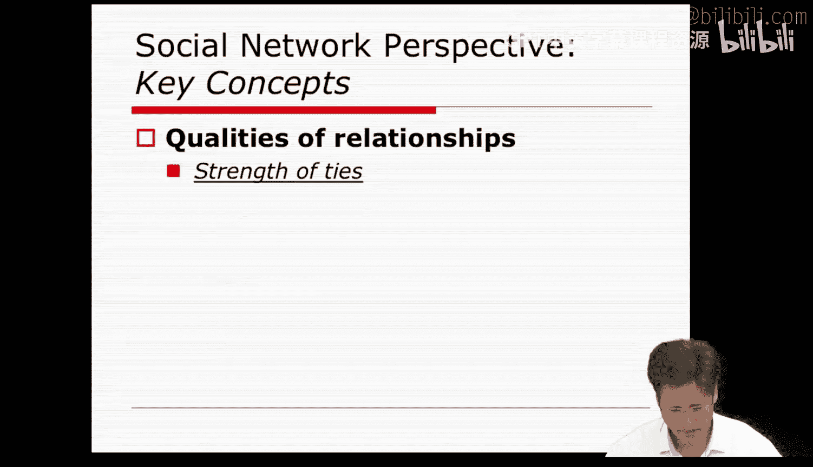

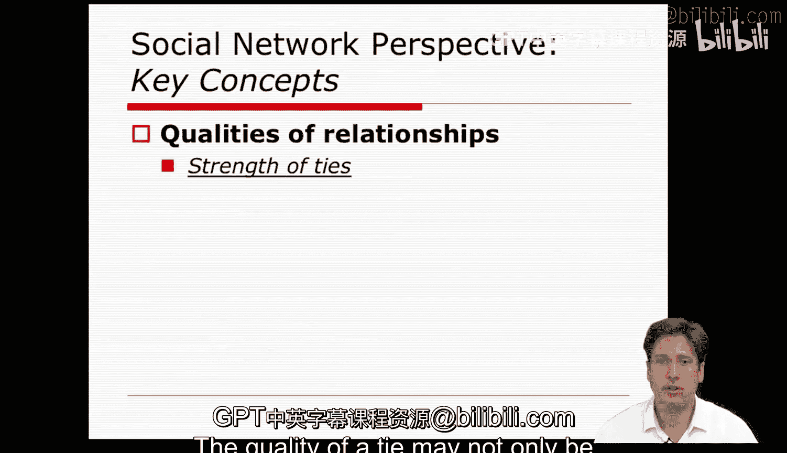

## 概述
在本节课中，我们将继续学习组织网络分析。我们将探讨关系的强度、关系形成的机制、个体在网络中的位置，以及组织成员如何嵌入多重网络。这些概念将帮助我们更深入地理解组织内部的社会结构及其对行为的影响。

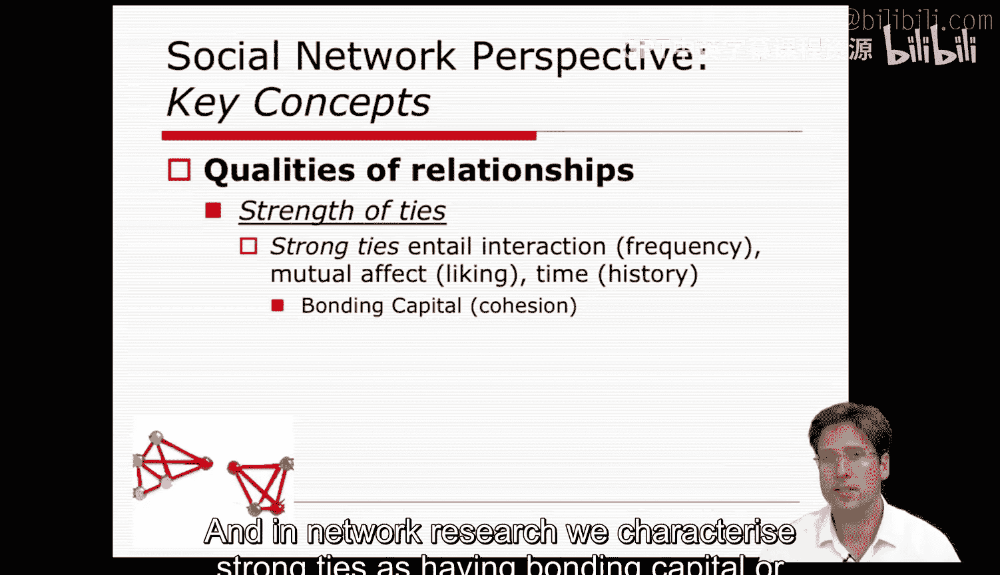

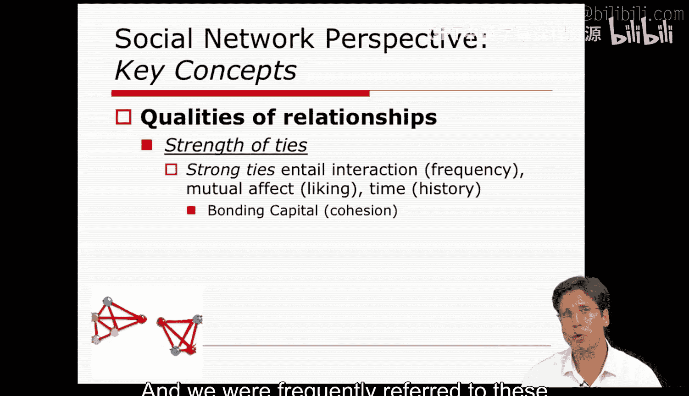

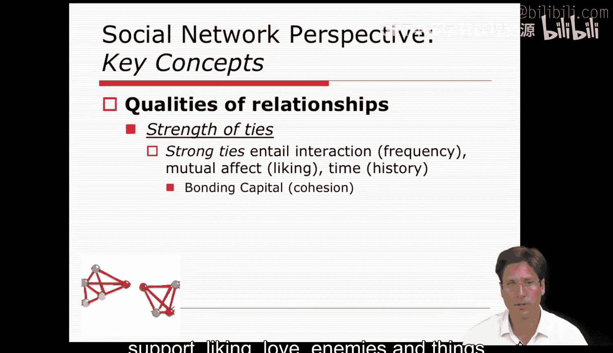

---

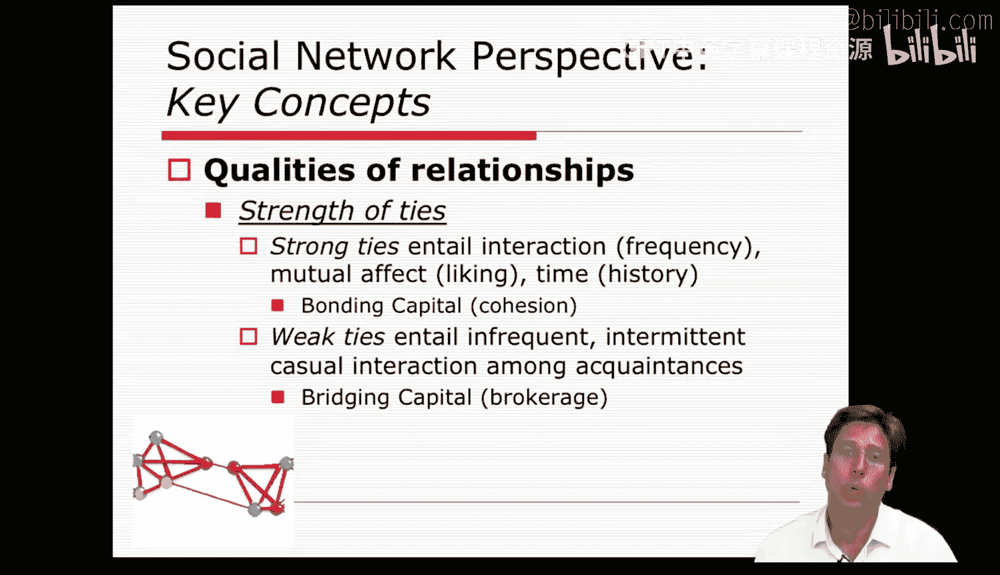

关系的质量不仅可以通过互动内容或关联类型来定义，也可以通过其形式或强度来定义。

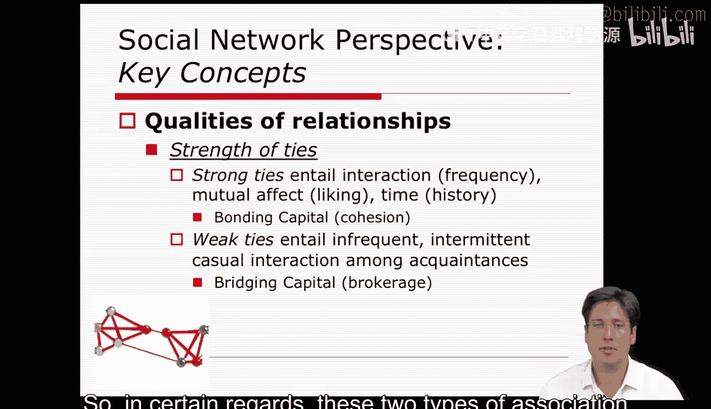

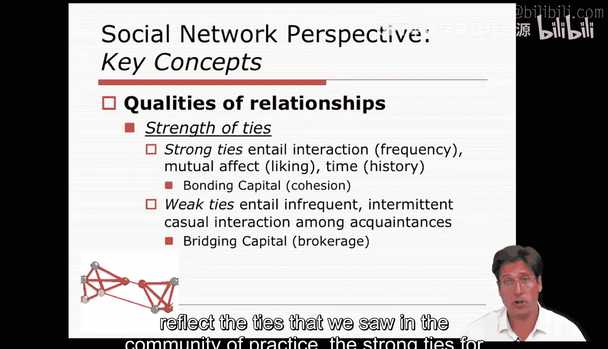

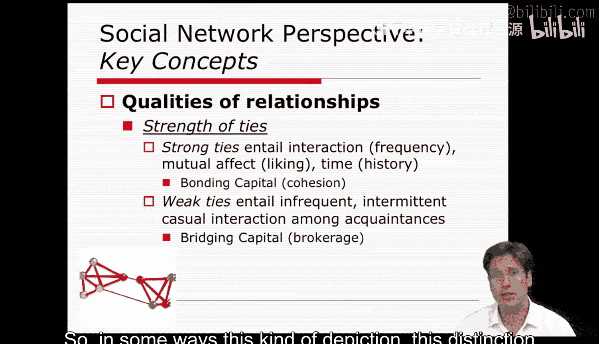

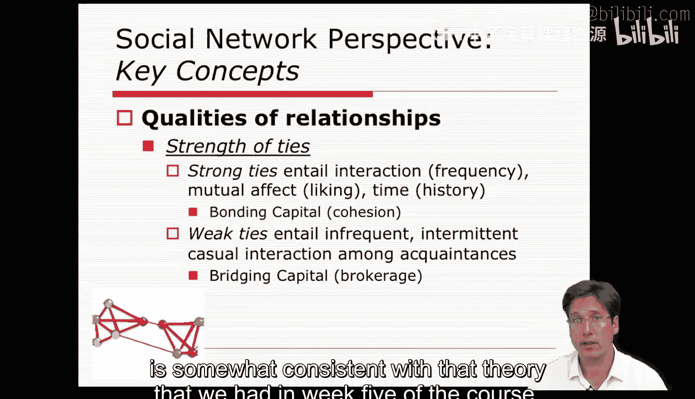

强关系通常被认为是有影响力的关系。例如，当密友向你施压时，其影响力远大于陌生人或熟人。强关系意味着频繁的互动、积极的喜爱或情感，通常是相互的，并且有历史渊源。在网络研究中，我们将强关系描述为具有**结合资本**或对人们行为产生凝聚性拉力的关系。我们经常将这些关系称为友谊、相互支持、喜爱等。

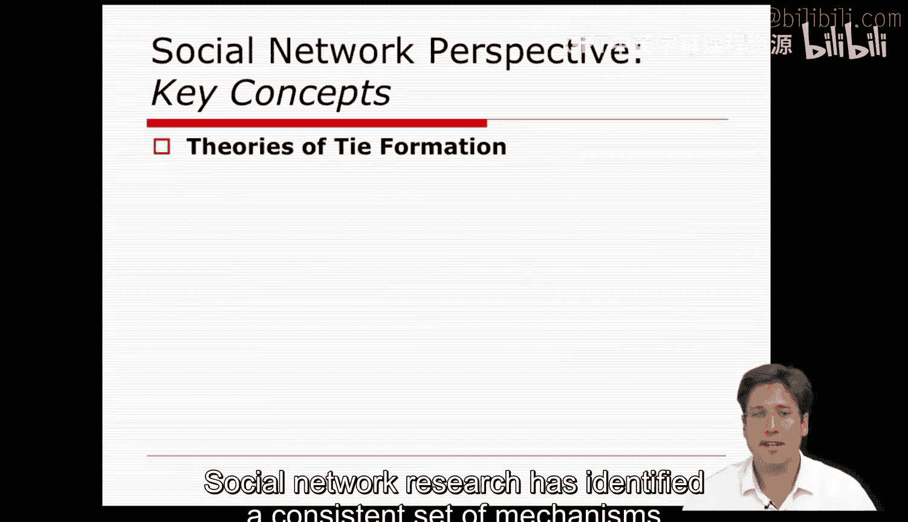

相反，弱关系是熟人之间更不频繁、更随意的互动。强关系具有结合资本，使本地人联系更紧密；而弱关系具有**桥接资本**，通常将不同群体中的远距离个体联系起来。

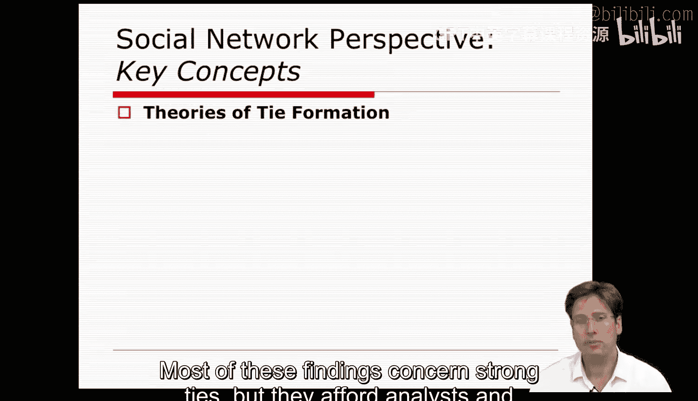

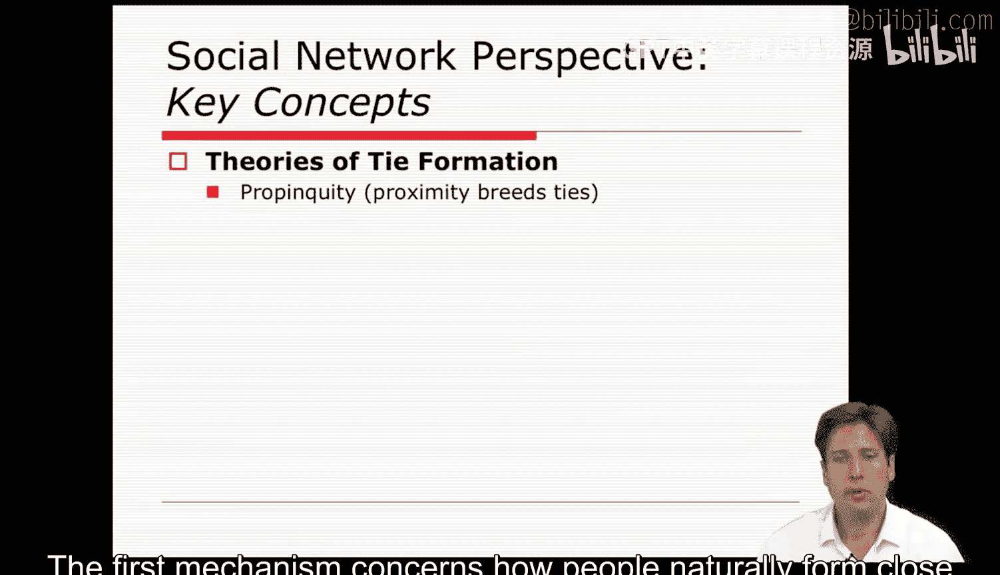

在某些方面，这两种关联类型反映了我们在实践社区中看到的关系：强关系存在于社区内部，而弱关系则像实践网络一样，是跨越群体的桥梁。这与我们在课程第五周学到的组织学习理论在某种程度上是一致的。

---

社会网络研究已经识别出一套在公司和其它环境中形成人际关系的稳定机制。这些发现大多与强关系有关，但它们为分析者和管理者提供了关于如何促进关系形成的思路。因此，我们将花些时间介绍这些理论或机制。

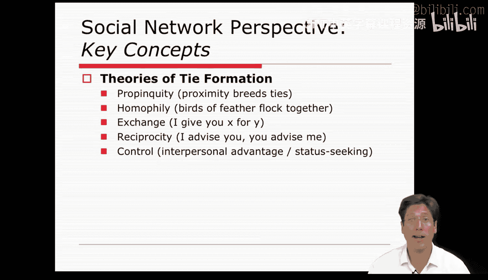

以下是关系形成的主要机制：

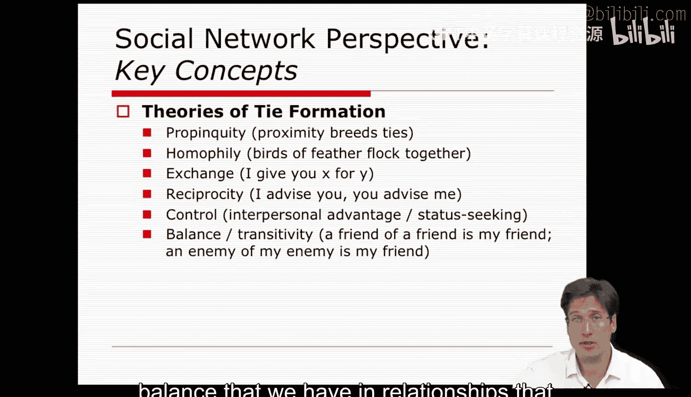

1.  **邻近性**：当人们彼此距离相近时，自然会形成紧密关系。邻近性催生关系，许多关系源于便利和接触机会，接触机会是发展友谊的关键。
2.  **同质性**：相似的人会聚集在一起，即“物以类聚，人以群分”。我们寻找与自己相似的人，这增加了彼此间的确定性和了解。
3.  **交换**：关系源于交换或理性选择。我们在对方身上寻找所需，对方也在我们身上寻找所需，通过交换形成关系。
4.  **互惠规范**：人类学家很早就发现，赠礼会在个体间引发一种有义务回报的感觉，这在不同社会中普遍存在。这可以解释为什么在初次见面时，你应该主动请第一轮酒。
5.  **控制**：关于地位获取、控制或支配的理论认为，人们会寻求人际优势和控制权。这种倾向在各种灵长类动物中都能看到，它们会形成等级有序的阶层。
6.  **平衡**：人们普遍寻求关系的一致性。例如，当我们的朋友与我们的敌人成为朋友时，大多数人会感到不安。我们必须要么与朋友断绝关系，要么让朋友也与我们的敌人为敌，这样才能维持友谊。这种**传递性**或平衡性存在于超越二元关系的三元关系中。
7.  **实践与身份**：一个被低估的关系形成机制涉及实践和身份。在大多数组织情境中，我们遵循惯例，这要求我们承担不同的互动角色，如倾听者、询问者、发言者、合著者等。身份也是如此，我们经常唤起关于某种既定关系的概念及其内涵。例如，当我做出友好姿态时，我预期会得到回报、频繁接触、支持性互动等。当我唤起教授身份时，这暗示了其他预期的角色关系及其互动。所有这些微观机制都与关系形成有关，并为我们如何在组织内创建网络提供了途径。

---

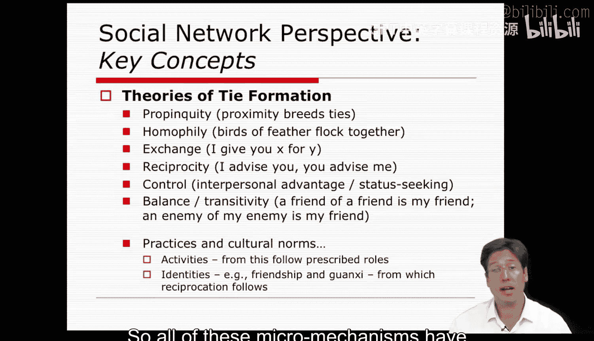

我们已经了解了多种网络类型和生成这些网络的机制。那么，个体在网络中的位置又如何呢？社会网络学者热衷于研究行动者在网络中的定位，因为不仅网络的整体形式决定了行动潜力，个体在网络中的位置也至关重要。这两者以有趣的方式结合：毕竟，在集中式网络中成为中心行动者，与在分裂式网络中成为中心行动者，情况截然不同。然而，在任何类型的网络中，成为中心行动者都应具有某些优势。

当网络分析师谈论“位置”时，他们实际上指的是**中心性**的概念。中心性既可以指**突出性**的位置，也可以指**中介或经纪**的位置。当然，社会网络分析中还有其他关于中心位置的概念，但为了本课程的目的，我们将仅限于这两类。

在图中所示的网络中，你可以很容易地识别出突出人物和边缘人物。拥有最多关系的是突出人物，拥有最少关系的是边缘人物。但还有一些个体位于他人的路径上，如果将他们从网络中移除，网络就会瓦解。这些人是组织结构不同部分之间的关键**中介者**。识别这些核心参与者对于确认信息流和公司资源转移中的瓶颈非常有用。

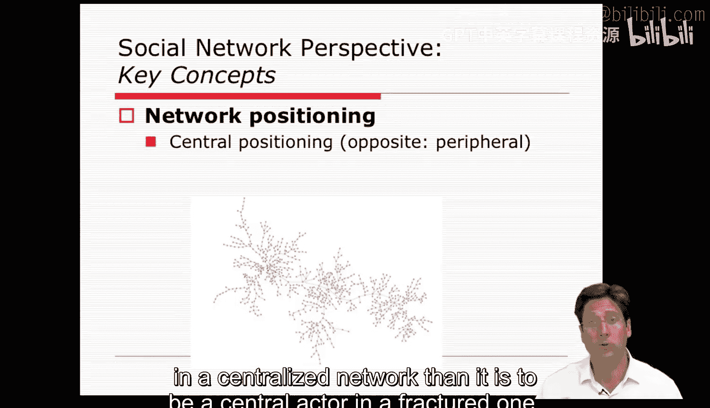

---

另一种网络位置或定位更多是基于群体的，它关注的是**互联性枢纽**的位置。在观察网络时，分析师经常试图识别这些行动者集合和关系集群，因为它们反映了网络中可能产生从众行为和社会影响的区域。

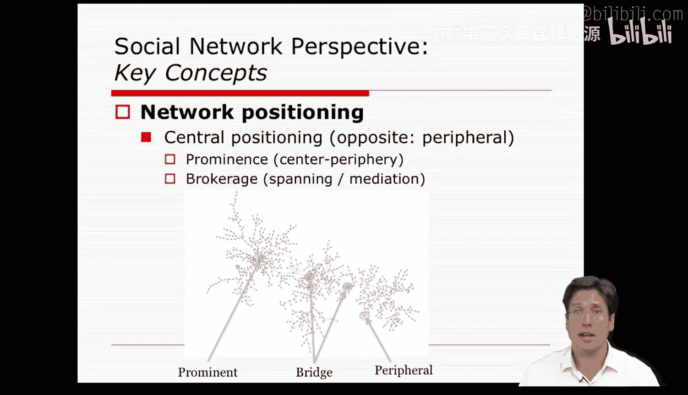

此外，还存在**冗余信息空间**。相互关联的行动者集群对于研究公司社会结构非常重要，因为它们常常影响公司的产出和行为。在下一讲中，我将展示更多相关内容，讨论相互关联的行动者群体或派系如何极大地塑造他们在工作环境中的行为。

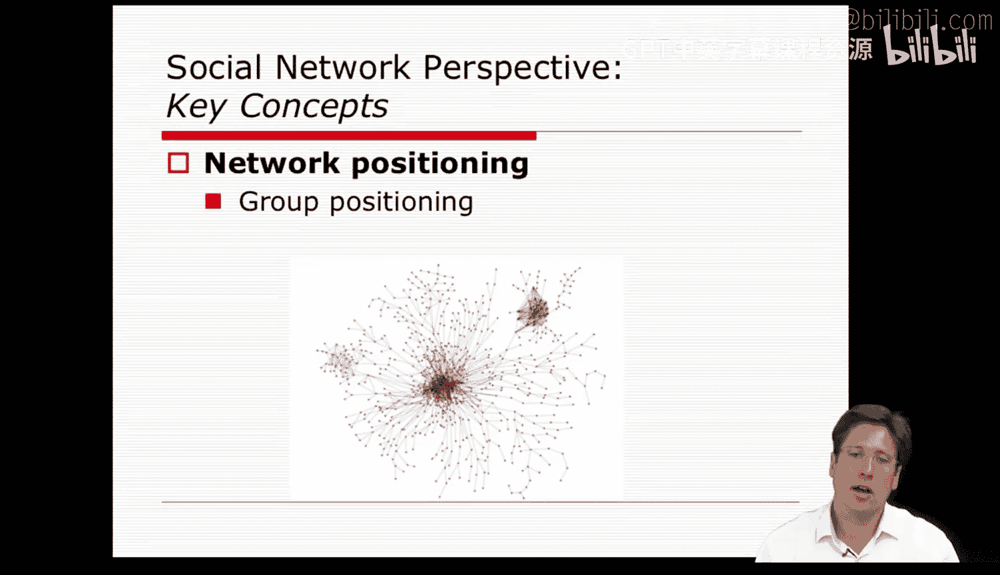

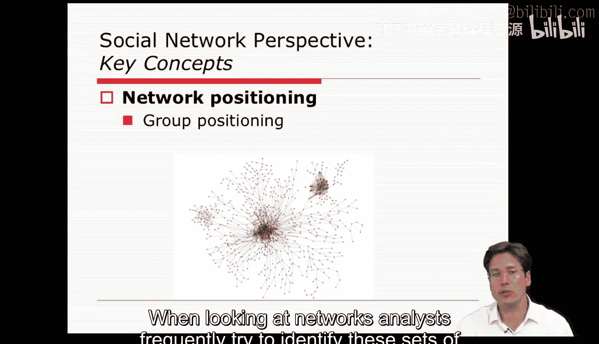

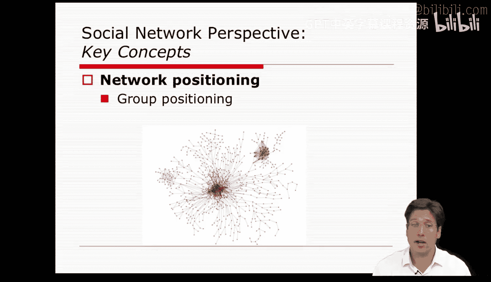

---

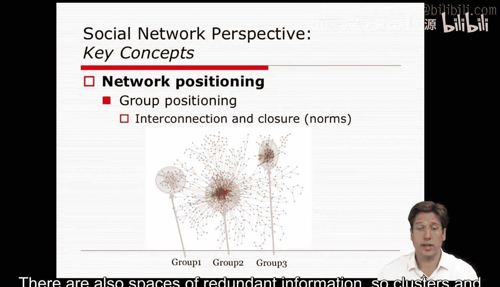

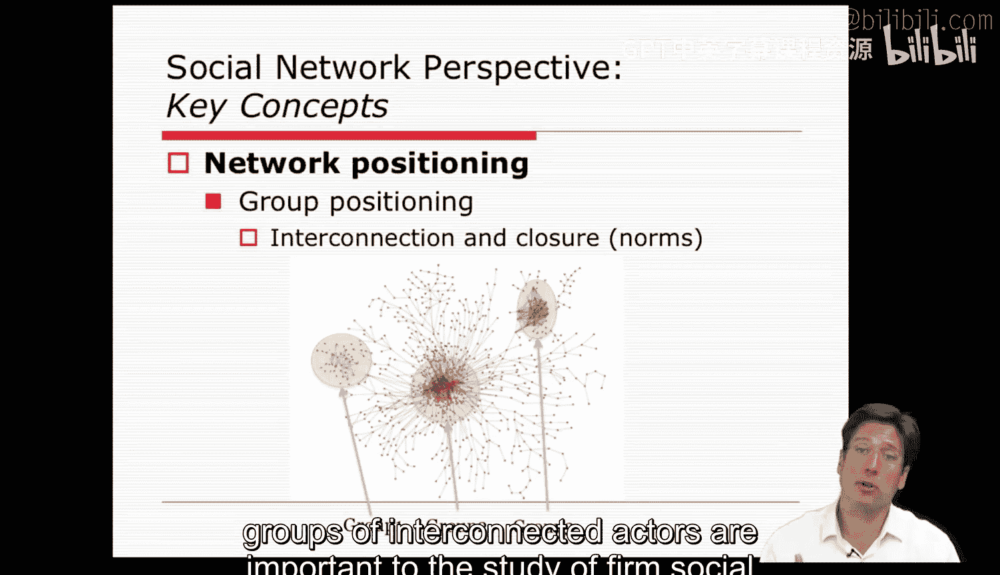

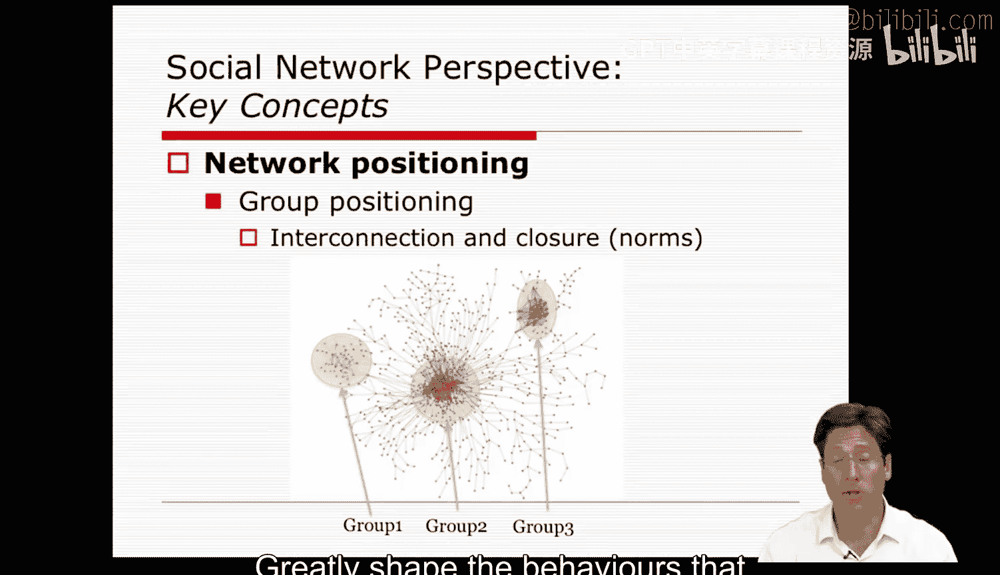

到目前为止，我们将组织描述为交易网络，并将行动者描述为占据这些网络中不同位置或群体的个体。如果我们考虑到社会现实是组织行动者实际上嵌入在**多重网络**中，情况就会变得更加复杂。这正是事情变得更有趣也更复杂的地方。

让我们以一些你可能熟悉的例子来说明，比如行业协会。在大多数商业领域，行业协会在信息交换网络中处于中心位置，但在交换财务资源的网络中却处于边缘位置。因此，它们可以利用信息作为资源来说服其领域内的其他组织，但无法真正强制其他公司遵从它们的要求，因为它们缺乏硬性的财务资源。在公司内部，情况类似，可能存在多种类型的关系，行动者可以在这些关系中占据不同的位置。

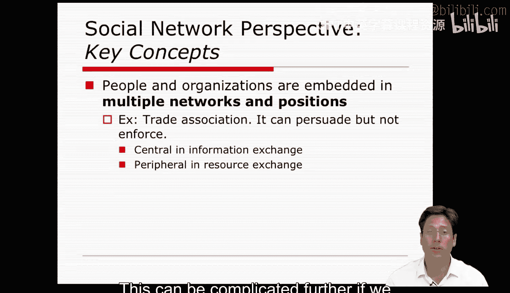

---

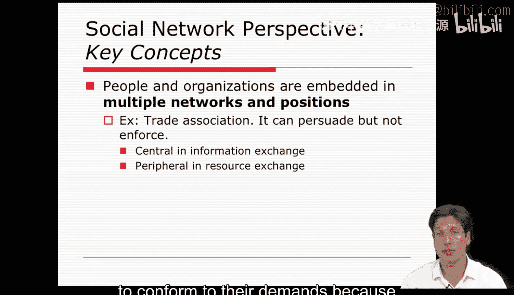

让我们来看一个例子：一所西海岸研究型大学在1993年至2000年间的教职员工网络。该校约有1500名教职员工，身份各异，从从事医院和病人护理的临床教职员工，到尚未获得终身教职的助理教授，再到已获终身教职的教授。此外，这些教职员工来自大学的不同院系：人文学院、社会科学院（橙色）、法学院和教育学院（白色）、自然科学学院（深绿色）、地球科学学院（浅绿色），以及物理科学、工程和医学院。

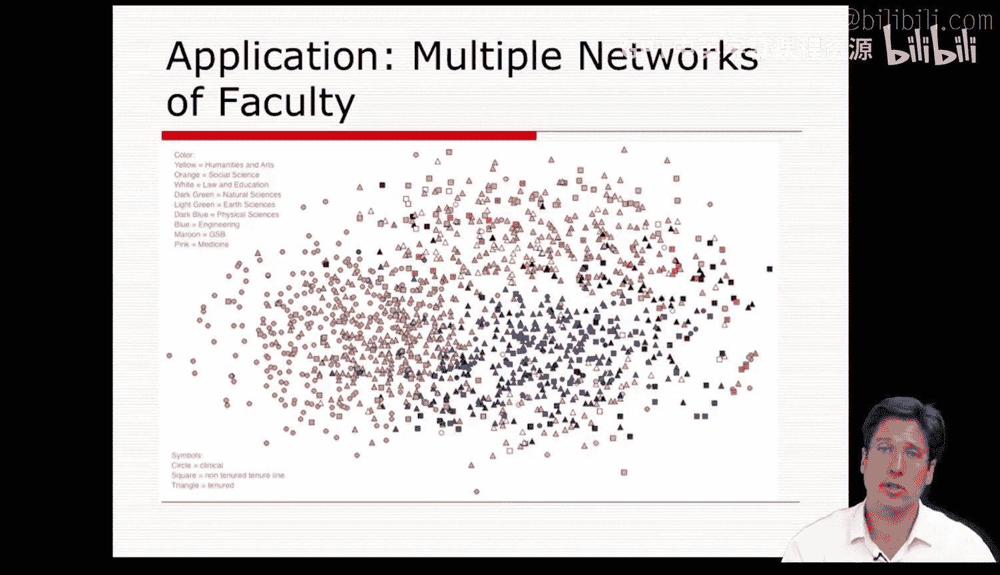

在大学里，可以产生多种类型的关联，无论是通过指导学生和博士生，还是通过合作申请资助，或是通过合作发表论文等。不同的院系在这些网络中占据不同的位置。

让我们看看这些行动者在特定网络中的情况。首先看**合作发表论文**的网络。合作发表主要发生在医学、硬科学和工程领域。值得注意的是，这两个领域内部以及它们之间的合作都很多，但内部集群现象仍然明显。相比之下，社会科学家和人文学者大多独立发表论文（至少在1993-2000年期间如此）。

接下来看**合作申请资助**的网络。注意网络如何变化，工程领域内部出现了第二个密集合作的枢纽。同样，医学和工程领域内部有明显的集群，工程和医学之间有一些跨领域合作。然而，硬科学或物理科学此时主要与工程领域合作。

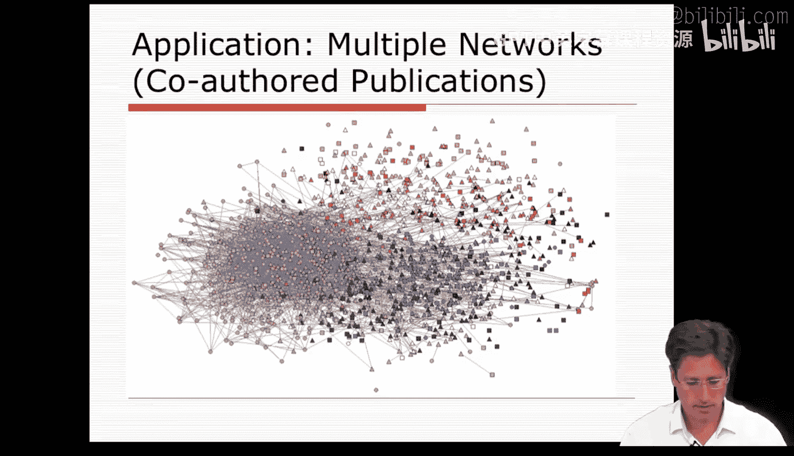

最后看**学生培养**网络，即教职员工共同指导博士生时形成的联系。注意网络在医学领域几乎消失，而在社会科学和人文领域形成。同时注意，合作的医学教职员工大多是终身教授（粉色三角形），而非临床系列（圆圈）。

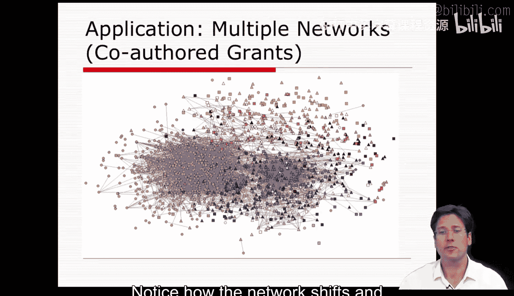

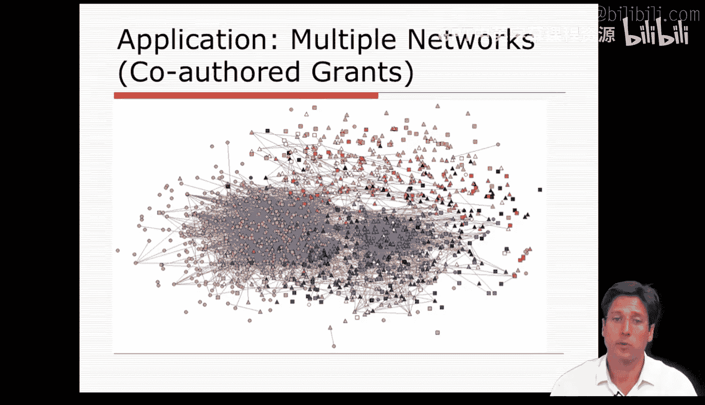

---

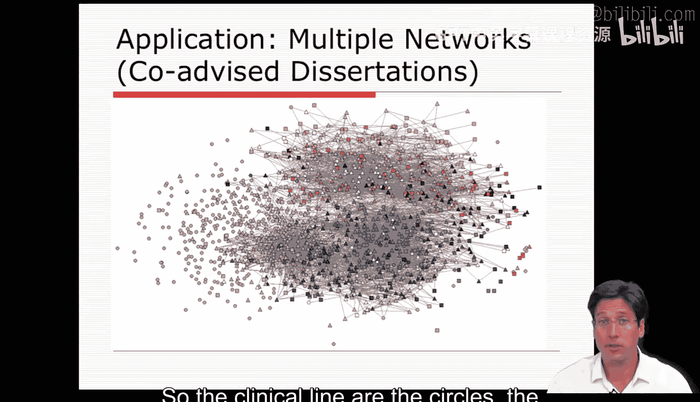

我们从这一切中学到了什么？我们了解到，每个领域都嵌入在多种类型的活动和合作网络中，但它们在其中的位置不同。这可能导致每个领域获得更大的累积优势。

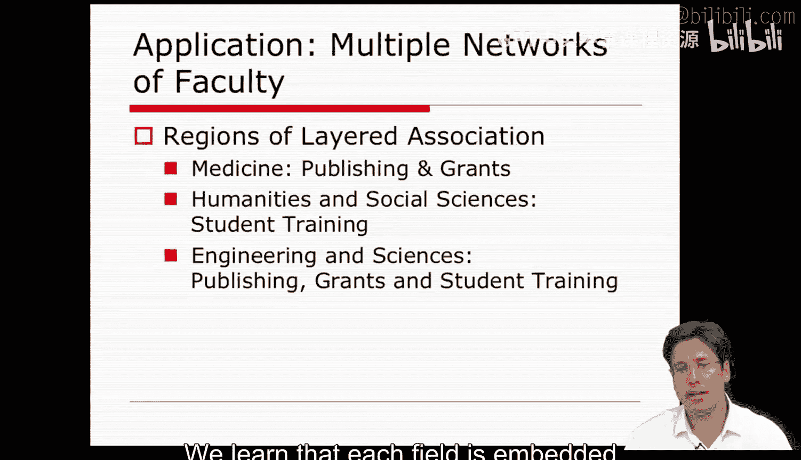

一方面，医学教职员工主要在论文发表和资助申请上进行合作，但未必在博士生培养上合作（他们更多地通过医学学生进行培养，这些学生未在图中体现）。社会科学和人文学科教职员工在博士生培养上进行合作，他们也发表论文并偶尔申请资助，但这通常不是合作点，他们大多是独立作者。最后，工程师和科学家在他们所做的每件事上都进行合作，并且经常与医学领域互动。

由此，我们看到大学中存在差异化的合作结构。这意味着社会科学和人文领域主要通过共同努力培养学生来转移知识。相比之下，医学领域主要通过进行研究或团队科学来转移知识，并且可能与博士后而非博士生有更多接触。而其他领域，如工程和硬科学，则通过在所有活动中的合作，成为知识转移的高速通道，是这所大学中连接高影响力研究、培训和出版领域的关键枢纽。

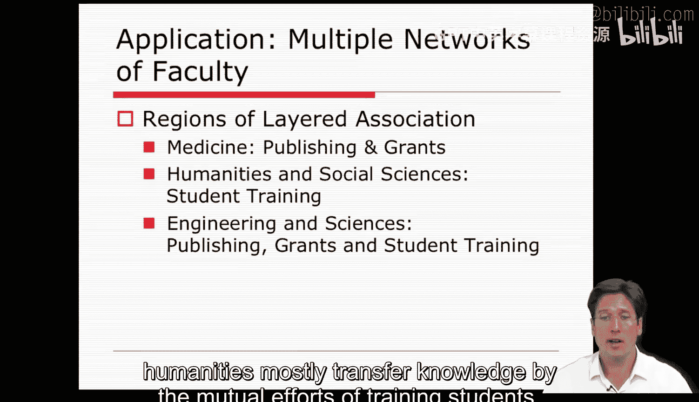

---

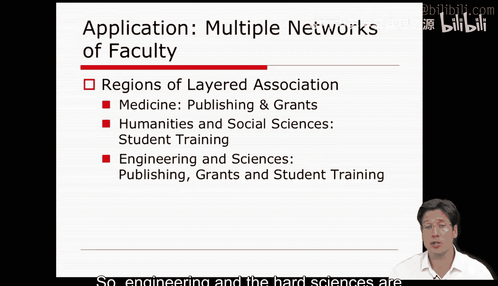

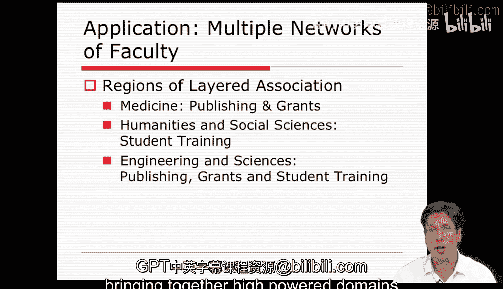

## 总结
本节课中，我们一起学习了组织网络分析的关键进阶概念。我们探讨了强关系和弱关系的区别及其资本属性（结合资本 vs. 桥接资本），回顾了关系形成的多种微观机制（如邻近性、同质性、交换等）。我们理解了中心性（突出性与中介性）和集群位置如何定义个体在网络中的影响力。最后，我们通过大学案例看到，组织成员往往嵌入多重网络，并在不同网络中占据不同位置，这种多重嵌入性塑造了知识转移和协作的模式，进而影响整个组织的运作和不同群体的优势积累。这些工具帮助我们更精细地描绘和理解组织内部复杂的社会结构图景。