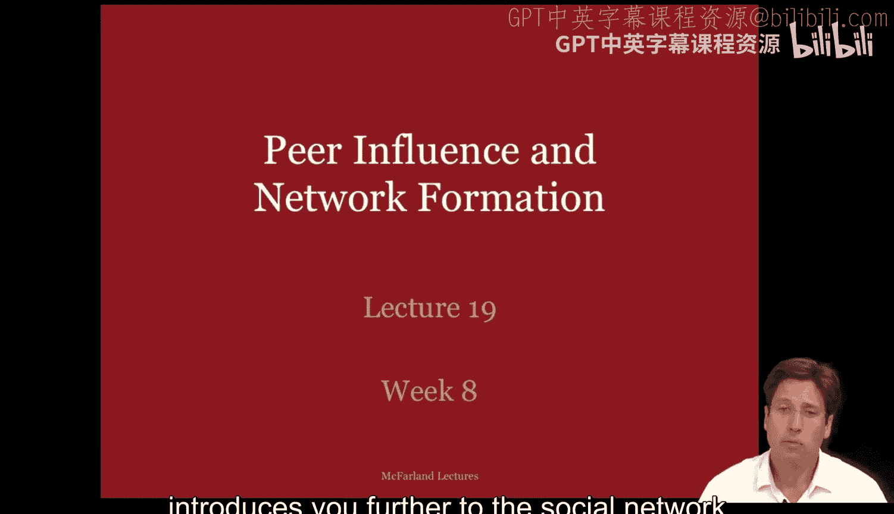
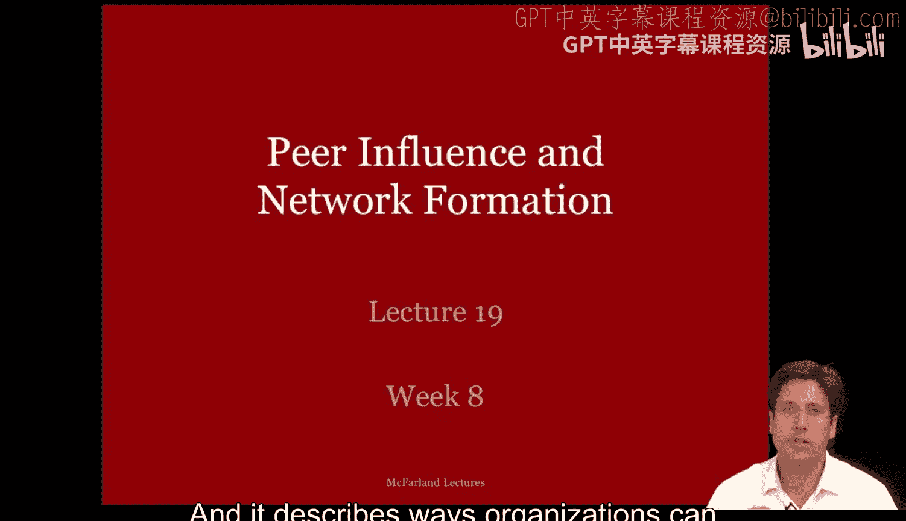
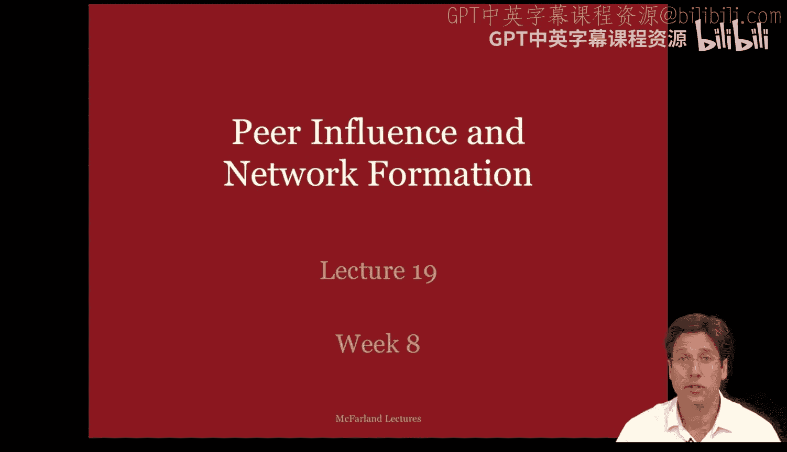
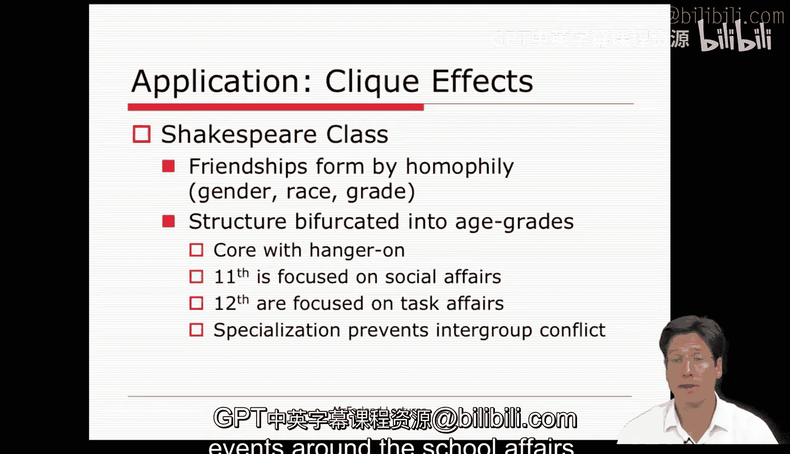

#  078：同伴影响与网络形成 - 第一部分 👥

在本节课中，我们将进一步学习组织的社会网络视角。我们将探讨网络如何影响组织行为与结果，并描述组织如何创造不同的网络模式与定位。

上一讲我们介绍了社会网络的基本概念，本节中我们来看看网络如何作为自变量影响组织行为。我们考虑人们是否通过友谊相互影响并传播其动机，或者处于网络关键位置是否为员工和公司带来特定的回报或优势。

当我们研究网络形成时，我们将网络视为结果或因变量。这里我们想知道导致人们建立关系的因素，以及导致网络呈现特定形态、甚至可能是管理者或分析师希望促成的特定模式的因素。

接下来，我们通过幻灯片中的例子来具体看看这些内容。

## 关系如何影响行为：纯粹影响

首先，让我们考虑关系如何影响行为，即我们所说的纯粹影响。同伴影响的基本论点是，我们交往的人会改变我们、影响我们，并导致我们采取独自一人时通常不会采取的行动。

在组织研究中，这些研究通常关注社会扩散过程和组织创新的采纳。一些研究探讨与高生产力的同事合作是否会提高你的生产力，以此检验特定的导师计划是否有坚实的回报。但在大多数这类研究中，研究人员发现强联系是传播态度和行为的绝佳途径。

在组织间层面，学者们发现组织创新的采纳，通常通过诸如连锁董事会或联盟网络等关联进行传播。例如，一系列论文发现，在公司收购中使用的“毒丸计划”是一种通过连锁董事会传播的组织创新。“毒丸计划”是许多公司在20世纪80年代和90年代用来防止被收购的策略，它使公司在面临收购时看起来像一场昂贵且低利润的赌博，从而使收购者望而却步。

在一所大学的具体情境中，克雷格·罗林斯和我研究了教师生产力如何通过合作网络扩散。我们发现，大学可以通过让成功的项目申请者与新手申请者合作来提高其资助记录。这类合作提高了申请率、成功率和获批金额。当这些合作重复进行不止一次时，专业知识的扩散效果甚至更大，从而确保新手学会如何独立地、并与大学里的其他人一起申请项目。相比之下，不合作的人实际上很难赢得奖项。

我们可以结合上一讲结尾的内容来思考这一点。你可以想象，工程学院的教师与社会科学及人文学科的教师合作，将如何从这类合作中受益，并促使他们更多地寻求资助或资助博士研究项目。

在其他研究中，影响的渠道不是强联系，而是弱联系。马克·格兰诺维特撰写了一些关于社会网络的奠基性著作，他特别有力地论证了弱联系的重要性和实用性。在他关于求职的研究中，他发现大多数人通过弱联系或朋友的朋友等间接联系了解到工作并获得工作，而不是通过他们的密友。他认为这是因为弱联系常常连接不同的群体，使人们接触到更独特的信息。完全依赖强联系和小圈子的人大多只能找到冗余信息。因此，拥有弱联系的人能更多地获得关于职位空缺的新信息，从而成功获得工作。

强联系和弱联系通常被描述为社会资本的“结合”与“桥接”形式，或是带来社会优势的关联类型。强联系和结合型资本产生社会控制、从众以及社会化与扩散，而弱联系和桥接型资本则常常扩展个人获取有用信息池的途径。

因此，强联系和弱联系意味着特定网络结构和网络位置的形成。接下来，我想谈谈位置对结果的影响。

## 网络位置对结果的影响

组织内部的一个常见发现是，人们占据网络中的某些位置，这些位置为他们提供了各种优势，例如获得认可和信息的途径。这种具有优势的定位使占据者在其职业生涯中更加成功。

组织间网络也是如此。占据突出或中介位置的组织往往能够生存、发展，并对其所在的组织领域拥有更大的控制和影响力。大卫·克拉克哈特为我们提供了一个很好的例子，说明了网络定位对公司行为和结果的影响。他描述了一家科技公司成为工会化努力对象的情况。

根据克拉克哈特的说法，工会化努力失败了，因为工会支持者未能争取到非正式网络中的领导者。我认为克拉克哈特的案例简洁而优雅。他首先描述了谁向谁汇报的组织结构图，并确定了工会试图建立的集体谈判单位。然后他继续说明，关键的工会支持者既不在专家建议网络的核心位置，也不在信任关系的友谊网络的核心位置。

以下是组织结构图，你可以看到用虚线圆圈标出的潜在谈判单位。在其中，我突出了工会化努力的三位领导者：霍瓦尔、奥维德和杰克。反工会成员在单位之外，他们是罗宾和梅尔。与工作相关的关键专家或顾问也在外面，他们是埃文和史蒂夫。只有非正式的领导者或受欢迎的朋友克里斯在单位内，但正如你将看到的，他对此并不太感兴趣。

以下是建议网络图。克拉克哈特通过员工调查获得了这类信息，然后将其输入社会网络软件以生成网络图。支持工会的领导者用红色突出显示，他们明显处于这个网络的边缘。反工会成员用蓝色突出显示，他们明显更多地参与建议网络。最后，我用绿色突出了两个关键人物，埃文和史蒂夫。由此我们可以看出，工会化领导者肯定无法阻止这个专业知识网络。

下一张图是友谊网络。同样，三位支持工会的参与者用红色突出显示，他们处于边缘位置。中心位置是非正式的领导者、受欢迎的朋友克里斯。值得注意的是，反工会成员更接近克里斯，并且可能对他的意见有更大的影响力。

总之，该案例研究使用访谈、调查和观察记录，重述了工会化努力如何因为支持工会的参与者处于非正式组织的边缘而失败。他们既没有争取到专家，也没有争取到受欢迎的个人来试图建立谈判单位。如果他们知道检查网络并争取克里斯及其密友，那么他们可能会获得成功地将公司工会化所需的社会支持。

因此，大卫·克拉克哈特的案例聚焦于网络定位的影响。

那么，小圈子或社会群体及其对工人的影响呢？早在1939年，罗特利斯伯格和迪克森研究了一个银行布线室，那里的工人主要制作电路板。罗特利斯伯格和迪克森发现，这些工人的友谊群体改变了他们的工作产出率，并使这些产出率规范化，以保持在一个对这群朋友来说合适的特定产出水平。后来的学者评论了同伴群体或强联系个体集群如何成为组织中的强大力量，并影响其结果。

我在自己关于美国高中及其课堂的研究中也看到了这一点。在大多数课堂上，青少年会形成友谊群体或小圈子，这些圈子引导学生使其行为在群体内趋于一致。以下是我在研究生阶段观察到的这样一个高中英语作文班的例子。该班由11年级和12年级的学生组成，他们都有足够的能力阅读和理解关于威廉·莎士比亚著作的课程材料。老师索菲亚喜欢鼓励对话，并经常点名让学生发言。尽管如此，学生们还是根据性别、种族和年龄形成了关联集群，并且这些群体在各自的年级内存在等级排序。因此，每个年级都有一个受欢迎的核心群体和一个依附群体。

有趣的是，11年级的核心群体和12年级的核心群体并不在同一舞台上竞争。相反，他们专注于不同的对话领域和话题。因此，高年级学生主导了学术讨论的公开舞台，而低年级学生则主导了关于学校事务的聚会和活动的社交讨论的后台。

本节课中，我们一起学习了同伴影响如何通过强联系和弱联系在组织中扩散态度与行为，以及个体或组织在网络中所处的位置如何为其带来显著优势或影响集体行动的结果。理解这些网络动态，对于管理组织内部关系、设计有效的合作结构以及预测组织变革的成败至关重要。