#  079：同伴影响与网络形成（第二部分）

在本节课中，我们将深入探讨社会网络的结构如何影响行为，以及组织环境如何塑造网络的形成。我们将通过一个具体的课堂友谊网络案例，分析小团体（cliques）的形成机制及其影响，并探讨管理者如何有意识地设计和引导网络结构。

## 网络结构与行为引导

上一节我们介绍了网络分析的基本概念，本节中我们来看看网络结构如何具体地引导群体行为。我们以一个课堂的友谊关系矩阵为例进行分析。

在这个矩阵中，可以看到我观察期间一个学期内的友谊关系。我使用了多种网络分析软件包来识别其中的分组及其划分方式。特别地，存在四个小团体或四个集群。你可以通过追踪行与列的关系来解读这些集群内部和之间的连接。例如，从学生16到学生15的值为1，但从15到16是一个点，这表明15认为自己是16的朋友，但16并未回应这种情感。值得注意的是，大多数团体在年级、性别和种族上是同质性的，这印证了“物以类聚，人以群分”的说法。此外，他们中的许多关系是互惠的，至少比随机情况要多。虽然未在矩阵中显示，但许多朋友也坐在一起，因此邻近性也是一个影响因素。

在矩阵中，你可以在较大的核心年级团体下方看到较小的次级同伴群体。通过观察这两个集群之间的非对角线关系，你可以发现它们是“依附者”。这些次级小团体似乎希望与同年级内更大的核心团体成为朋友，但这种情感并不总是得到回应。因此，班级内的小团体聚类存在一种等级排序。

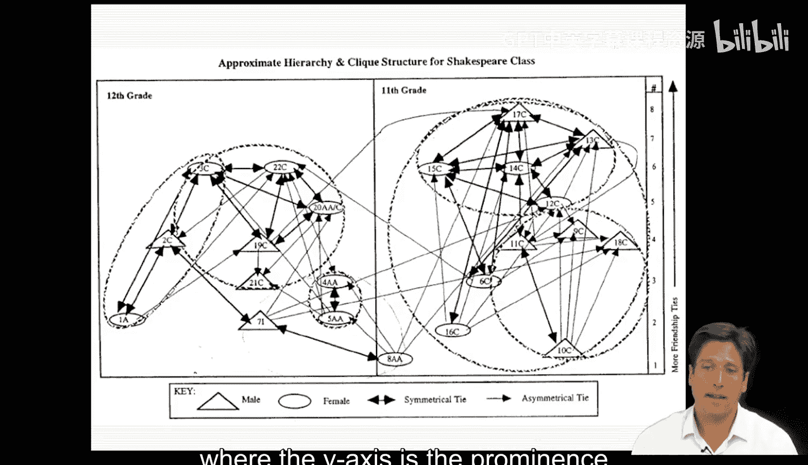

我们可以将这些关系渲染成一张网络图，其中Y轴代表个体的突出性或受欢迎程度，阴影圆圈则反映了每个小团体的大致边界。

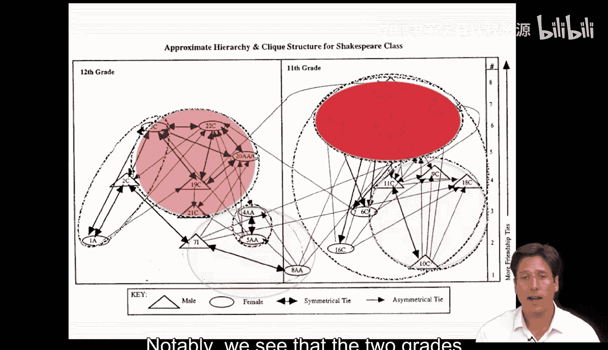

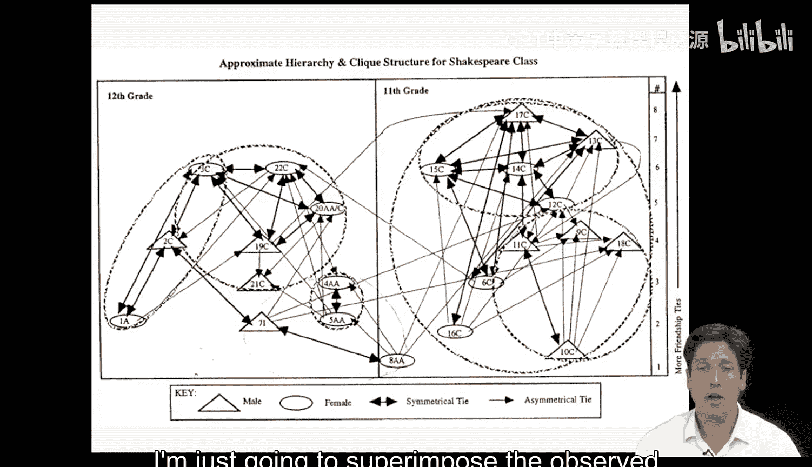

值得注意的是，我们看到两个年级有些脱节，每个年级都有一个核心小团体和一个依附者，正如我之前描述的那样。在其他分析中，我测试了观察到的互动模式是否在座位和同质性效应之外，还符合这些小团体的划分，结果强烈支持这一点。

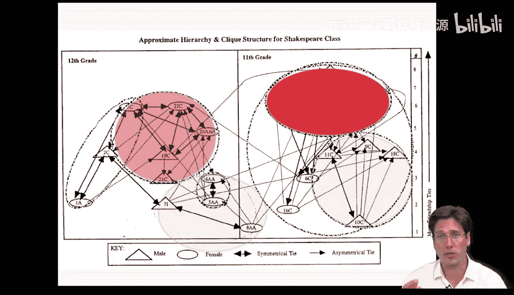

为了便于解释，我将直接把观察到的行为互动叠加到这些分组上。这样做，我们了解到以下几点。

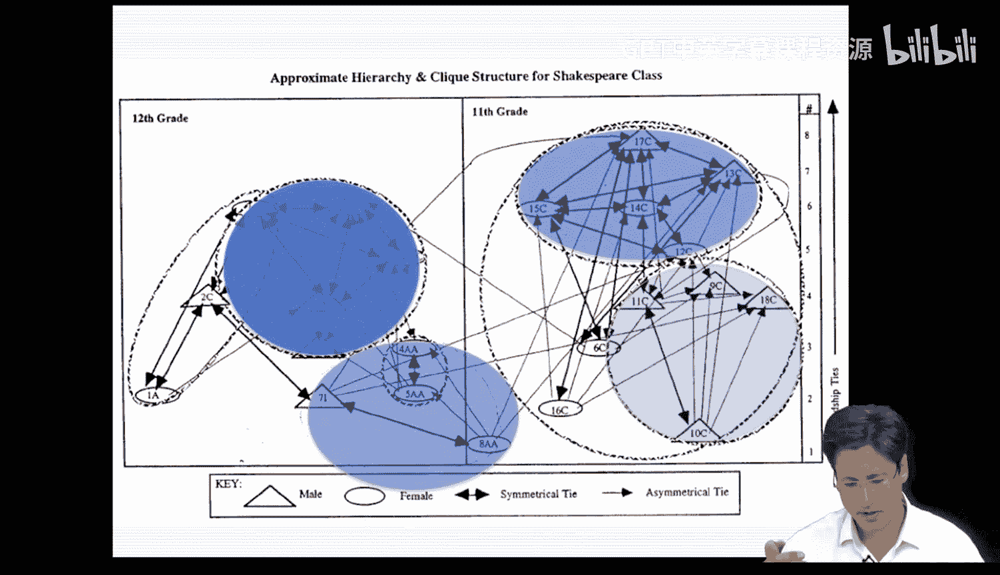

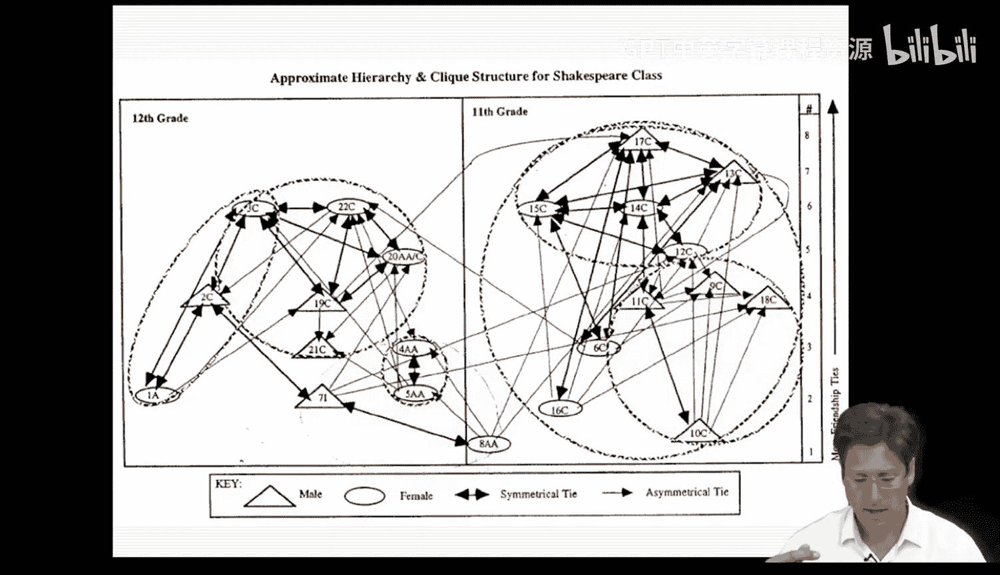

首先，我们了解到大多数互动都发生在小团体内部。其次，我们注意到小团体的行为存在专门化。在这里，我用红色表示以任务或学业为中心的互动发生的地方。我在该类互动频率和密度更高的地方渲染更深的红色。这里清楚地显示，核心的高年级小团体主导了此类互动，并且任一年级的核心小团体都略强一些，这表明地位和团体类型都很重要。

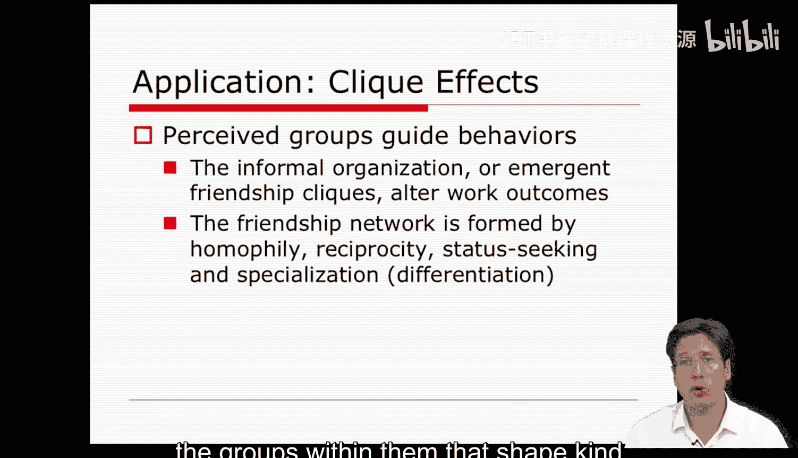

接下来，我用蓝色表示社交或非学业互动（如玩耍、开玩笑等）发生的地方。我在此类互动频率和密度最高的地方渲染更深的蓝色。因此，核心的低年级团体主导了那种互动，并且每个年级内的核心小团体实际上主导了那种互动。你可以看到这里的转变：高年级团体主导任务。

而低年级团体则专注于社交事务。

一系列统计数据可以伴随这些图像，并进一步支持这个论点。然而，本讲座的重点更偏向概念性和示意性。非正式网络的结构及其小团体强烈地引导着行为，这就是关键点。此外，这些小团体源于多种关系形成机制，例如同质性、互惠性、追求地位，甚至是避免团体间竞争的专业化努力。总而言之，影响员工及其公司的不仅仅是单一关系，还包括网络定位以及其中的团体，它们共同塑造了结果和员工行为。

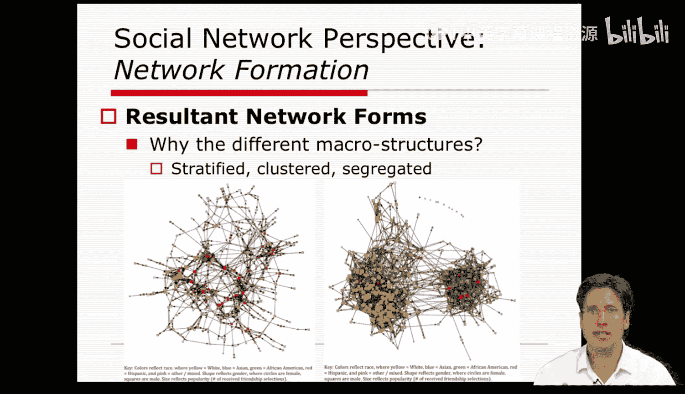

## 网络形成机制

但是网络形成呢？在引言中，我谈到分析者通常将网络视为一种结果，或视为管理者希望实现的某种理想结构。我们如何实现并设计出不同的关联结构？

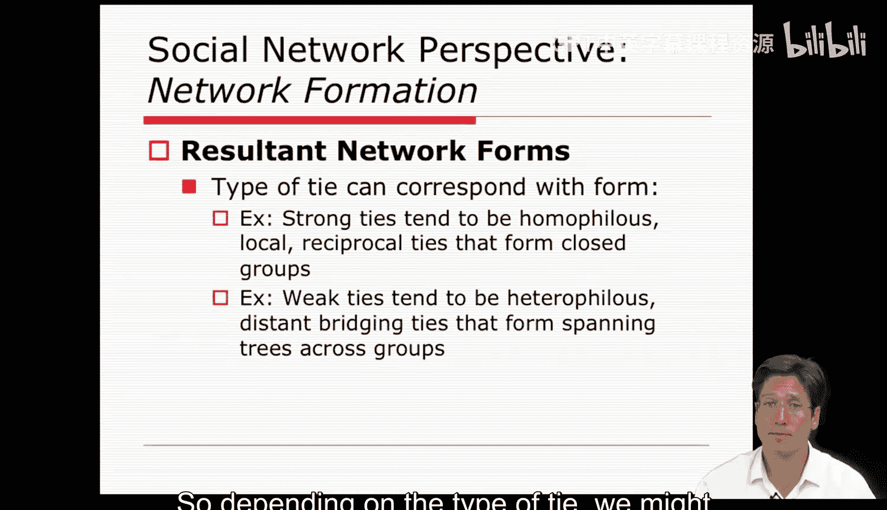

在我自己对高中青少年网络的研究中，我发现它们的宏观结构因学校而异，也因教室而异。其中一些环境形成了等级分明的世界，就像旁边第一张图那样；而另一些则高度隔离和聚类，如第二张图所示。然而，友谊网络都是由相同类型的关系机制塑造的，这些机制我早些时候提到过，包括同质性（物以类聚）、邻近性（便利的朋友）、互惠性（我给你东西，你也给我东西作为回报）以及等级化（支配和控制感）。这就提出了一个难题：如果相同的微观机制适用于每个友谊网络，那么它们的模式为何会不同？我们如何看到这些非常宏观的结构环境？

潜在的答案很有趣。事实证明，特定类型的关系通常对应一种网络形式或模式。在我们学校案例中，关系是友谊，而友谊往往是互惠且局部的，因此它们更倾向于促进聚类，而非等级排序。

友谊关系的这种闭合性和互惠性，恰好是驱动高中友谊网络形成的最强特征。相比之下，如果关系实际上不是友谊而是弱关系，那么结构可能包含更多的生成树、等级排序和更少的团体。熟人关系具有更大的不平衡性和松散性，它们使得不同的网络模式得以出现。因此，根据关系的类型，我们可能会预期不同种类的网络形式。

但这并没有解释友谊网络为何在不同情境下存在差异。在高中研究中我们发现，友谊网络因学校而异，是因为组织环境放大或抑制了某些微观机制的显著性。这意味着参与者的构成和所使用的组织规则调节了自然的关联基础。

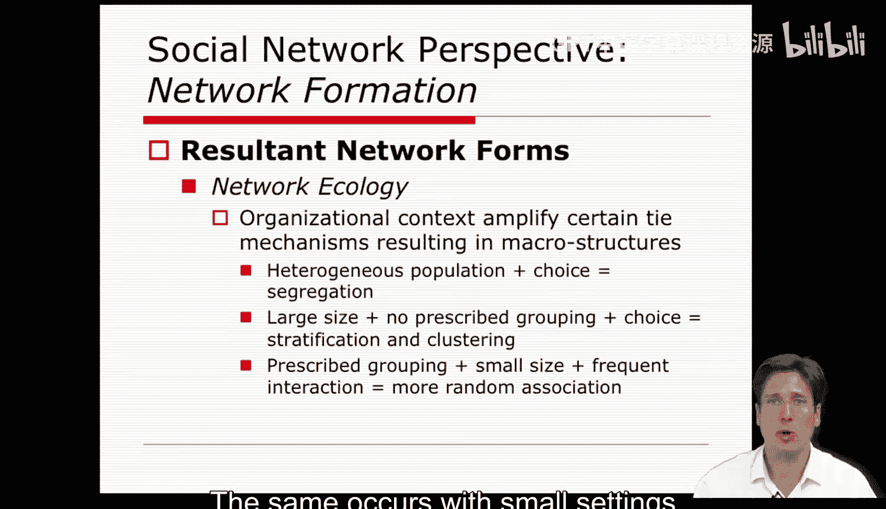

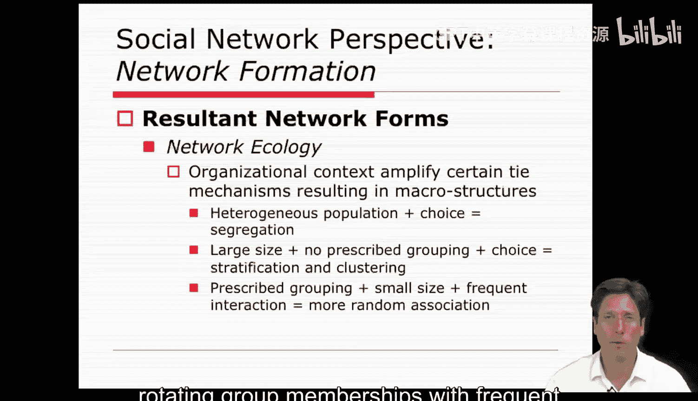

以一个大型异质性人群为例，比如一所学校里存在多个数量相当的种族，且接触是自由选择的（这意味着学校没有按能力对学生进行分组）。在这种情况下，我们发现关联模式因同质性而高度隔离。他们有充足的机会和多样的特质来做到这一点。

在大型、无组织排序且选择众多的学校里，也往往会出现等级化的小团体。因此，在这些大型组织中，他们不仅形成了确定性和信任的集群，还形成了一定程度的等级排序。我们只有在组织拥有同质化人群、将成员置于小型互动环境中并事先对他们进行排序（从而这些学生的差异特征已被大致分类）的情况下，才会看到随机密集的关联。在这些情境中，如果我们只是诱导更多的互动，他们就会产生一种随机混合。同样的情况也发生在小规模环境中，比如教室，如果你引入轮换的团体成员资格并让这些个体频繁互动，结果就是你能够诱导出一种高度密集但不存在这类小团体式等级结构的协作结构。此外，如果你让人们专注于手头的任务或材料（比如组织分析），他们将基于这些内容形成关系。

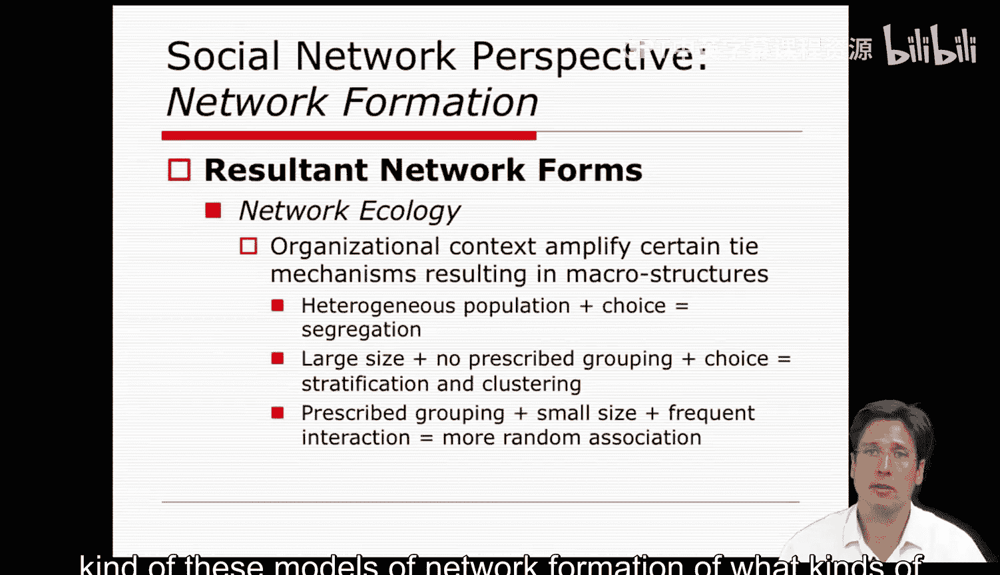

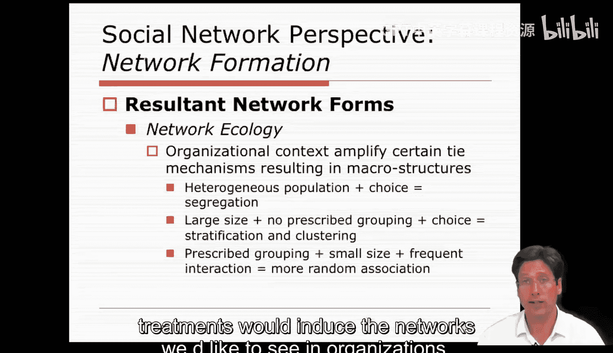

因此，从这些网络形成的动态模型中，我们已经对何种干预措施能在组织中诱导出我们期望看到的网络有了一些认识。一旦分析者对网络有了良好的描述，一旦他们对影响员工结果的关键过程有了一些认识，并且一旦他们知道了驱动关系形成以呈现特定模式的关键机制，分析者就可以开始提出各种干预措施。

## 网络干预与管理实践

当然，具体措施会因情境和问题的不同而有所差异。但我希望你们中的许多人能从本讲座前面的幻灯片中推断出这些干预措施可能是什么。尽管如此，我可以告诉你们许多公司可能会向你们提出什么要求。

以下是公司通常希望达成的网络目标：
*   他们将希望促进高效网络模式的创建。例如，许多公司希望建立互动密集、积极的工作相关协作网络，而不是与工作无关的积极社交协作网络。
*   他们希望这些网络能够跨越不同团体，以便好的想法能在公司内部和团体之间传播。
*   许多公司还希望组建由不同技能人员组成的团队，这些成员将依赖彼此的优势，从而形成一个整体大于部分之和的有机体，这据称能创造产品或解决复杂问题。

因此，除了促进理想网络形式的创建，公司还会希望分析者执行网络修正，或解决现有网络中固有的协调问题。在学校里，我们有许多这样的例子正在发生，学生占据某些位置或形成某些团体，导致行为向负面方向发展。

以下是学校中常见的网络问题及对应干预思路：
*   **问题：表现不佳的团体**。例如，在许多教室里，某些孩子占据主导地位，占用了老师所有的时间和注意力，从而使成绩游戏或进步变得不那么平等。
    *   **干预：位置性治疗**。为了抵消不平等的参与机会，任务被设计成涉及去中心化的形式，如小组工作，以便更多人能够发言。同时，他们要求分配差异化的角色，这样每个人都有事可做，没有人被排除在外。这种类型的干预平衡了团体内的地位，使参与更加积极和均衡，从而使知识获取和掌握程度相似。
*   **问题：小团体的群体规范和同伴影响**。为了抵消这一点，学者建议改变邻近性，例如轮换小组和座位安排。这些都是我们以前都见过的方法，但我们没有足够地进行人工管理来克服那些次优的解决方案。

所以，这些在某种程度上是简单的解决方案，但我希望它们能帮助你思考网络不仅可以如何形成，还可以如何通过各种管理努力被重新引导。

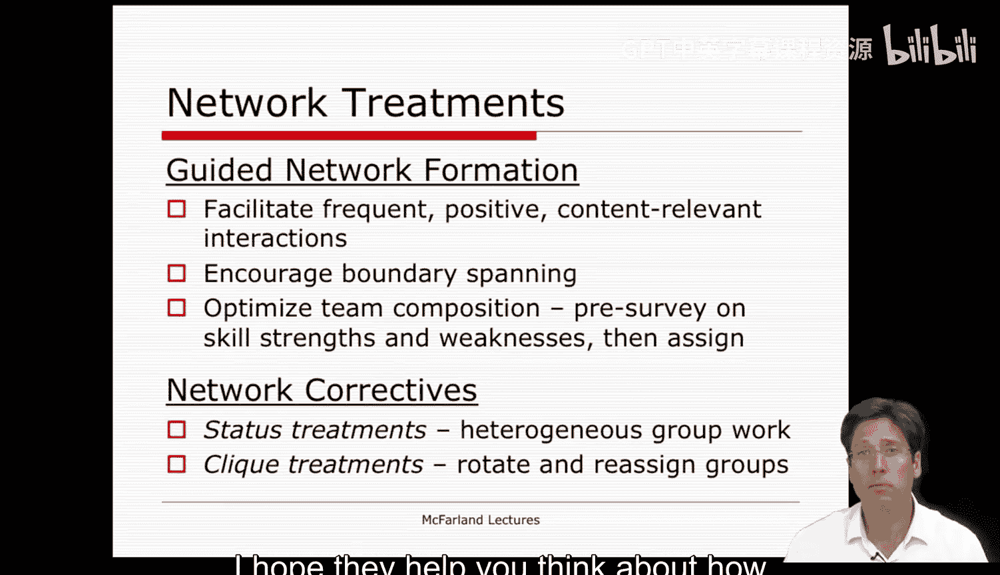

## 总结

本节课中我们一起学习了社会网络结构如何深刻地影响个体与团体行为。通过分析课堂友谊网络，我们看到了小团体的形成机制（如**同质性**、**互惠性**、邻近性）如何导致特定的行为模式（如学业或社交主导）。更重要的是，我们探讨了组织环境（如规模、异质性、规则）如何调节这些微观机制，从而产生截然不同的宏观网络结构（如等级化 vs. 聚类）。最后，我们了解到管理者可以通过有意识的干预（如设计任务结构、调整物理邻近性、分配角色）来塑造和引导网络，以解决协调问题、促进理想协作，并最终提升组织效能。网络不仅是描述现状的工具，更是可以被设计和管理的战略资产。