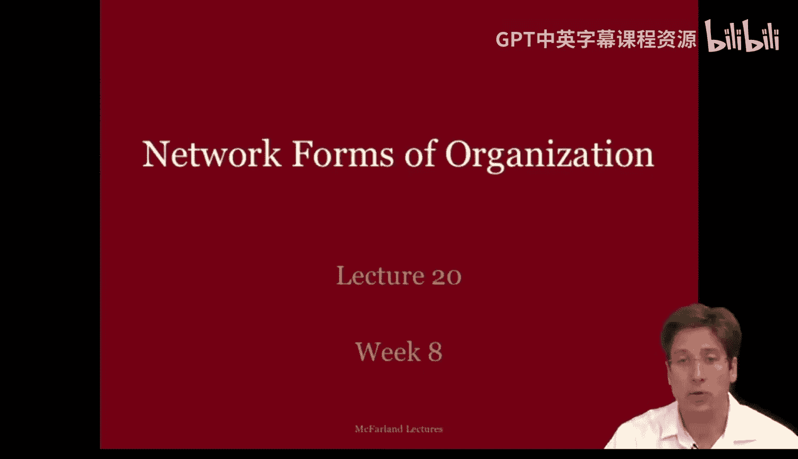
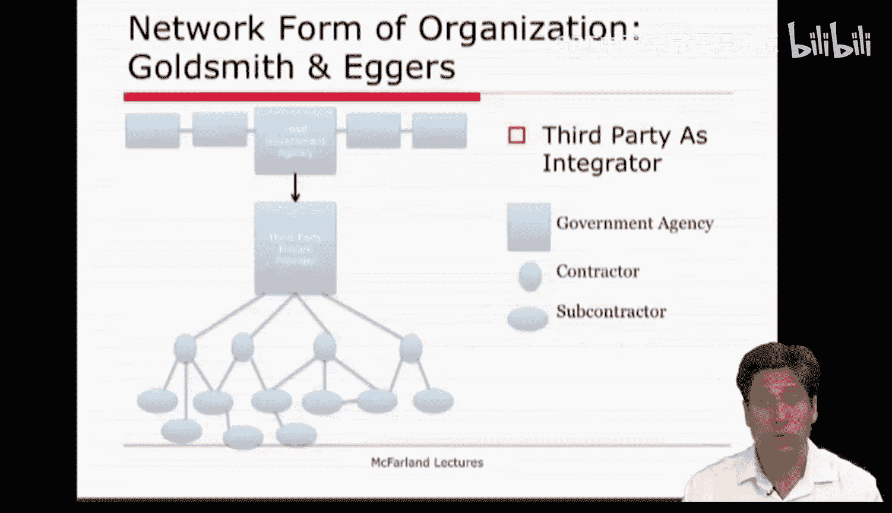

#  080：网络型组织 - 第一部分 🕸️

在本节课中，我们将要学习网络型组织这一概念。我们将探讨其核心思想、与先前理论（如资源依赖理论）的区别，并了解其不同的组织形式和实际应用案例。

上周我们讨论了资源依赖理论，并描述了该理论如何关注企业在环境中的权力依赖关系。

本周的阅读材料描述了多种网络形式。如果我们更仔细地审视它们，会发现它们是由上周在资源依赖理论中讨论过的一些“桥接”努力构建起来的，例如合资企业、协会、连锁董事会、战略联盟和伙伴关系。

## 从资源依赖到网络视角 🔄

上一节我们介绍了资源依赖理论的核心观点，本节中我们来看看网络型组织如何在此基础上发展。

例如，本周的几位作者描述了基于项目的网络或议题网络，其目的是围绕特定项目进行组织，或共同推动单一议题。回想上周的资源依赖理论，我们讨论了这种关系如何通过合资企业在成对企业间产生。

本周的一些作者讨论了专业网络和行业协会，以及连锁董事会，这些方式使企业之间能够进行更广泛的沟通。在资源依赖理论中，这些被视为“笼络”其他企业和共享信息等资源的手段。

本周，Smith 和 Wosteadutter 将组织描述为形成一种团体从属关系，即多组组织形成一个“家族”并自愿合作。在资源依赖理论中，类似的成对努力被称为战略联盟或协议，其目的是确保和/或防止优势，或为团体整合资源。

最后，Goldsmith 和 Eers 讨论了外部伙伴关系，例如政府机构将特定任务外包给私营公司和非营利组织，并相信协调服务提供者将使政府机构能够更有效地服务公民。

需要指出的是，这类伙伴关系并非一个公司被另一个完全吸收的合并，它们都是部分吸收和战略联盟。因此，本周的阅读材料描述了由资源依赖理论讨论过的桥接努力所形成的网络。

然而，焦点从成对关系转移到了整个网络。对于网络型组织而言，核心问题是如何协调和管理处理服务提供不同方面的组织。

## 核心差异：分析单元的转变 🎯

如果必须指出资源依赖理论与网络型组织的一个关键区别，一个重要区别在于它们的分析单元。资源依赖理论考虑的是组织及其直接关系的自我中心视角。相比之下，网络型组织考虑的是包括直接和间接关系的全局社会中心视角。组织的网络形式将网络视为既约束又促进行动的力量，并且更广泛的组织网络是焦点组织稳定与变化的来源。

Davis 和 Powell 的阅读材料最好地描述了资源依赖理论与网络型组织的区别。他们认为，资源依赖理论是从你自己车的视角看待交通堵塞，而网络型组织是从直升机的视角看待交通堵塞。你认为从哪个视角能更好地理解你车辆在那种情况下的移动？

因此，如果我们将其图示化，可以看到资源依赖理论在左侧图像中对企业的看法，其焦点是直接的自我中心网络。相比之下，网络型组织关注的是超出焦点企业的更广泛的间接联系阵列。并且，根据观察该网络的广度，情况可能会发生变化，例如从一个团体的边缘成员转变为连接不同团体的经纪人。

## 与其他理论的联系与区别 ⛓️

我们也可以考虑网络型组织与联盟理论之间的相似性。回想一下，联盟类似于利益网络或临时联盟。相比之下，网络型组织形式反映的是一种持久的结构属性或随时间维持的特定协调模式。简而言之，组织的网络形式既不是联盟，也不是资源依赖集合。

网络型组织甚至与组织学习理论中对实践社区和实践网络的描述有相似之处。许多人会记得这张图。对于组织学习，焦点在于实践以及运用这些实践的参与者之间的个体关系。每个集群类似于一个讨论实践的社区。如果我们止步于此，每个团体都会得出自己的最优解或局部最优解。社区之间的联系反映了实践网络，这使得解决方案能够在不同团体间转移，从而促进它们达到全局最优。因此，组织学习关注的是个体行动者及其在组织内部和组织之间的关系。

相比之下，网络型组织将组织作为分析单元，讨论企业间或组织间网络的互联模式。因此，如果我们将左侧图像聚合起来，就需要理解网络型组织如何看待同一情况。但同样重要的是，它考虑的是企业间的多种关系类型，而不仅仅是关于实践的关系。所以，网络型组织与先前的理论有相似之处，但也有所不同。让我们更仔细地看看组织理论家是如何阐述这一理论的细节的。

## 网络型组织的起源与特征 📜

在补充阅读材料列表中，有一篇由 Burggati 和 Fo 撰写的文章，简述了网络型组织的历史。他们认为，在20世纪之交，网络型组织是对半自治组织之间重复交换的一种流行描述，这些组织依靠信任和嵌入的社会关系来保护交易并降低成本。

当时，网络型组织的支持者认为，随着商业变得更加全球化、高度竞争、动荡和技术动态化，市场和层级结构已变得低效。取而代之的是一种网络型组织形式，它平衡了市场的灵活性与层级结构的可预测性和稳定性，为采用该模式的组织带来了智慧、灵活性和快速响应能力。网络型组织比市场拥有更持久、更分散的联系，比层级结构拥有更互惠、更平等的安排。因此，它有点像介于市场和层级组织形式之间的中间地带。

组织的网络形式意味着相互依赖的企业能够成功地与大型公司竞争。网络型组织之所以成为可能，是因为许多组织变得越来越专业化，而电话、传真、电子邮件、电话会议、计算等信息技术的出现，使得它们能够协调跨多个公司的服务交付。

## 网络作为一种独特的组织形式 ⚖️

Walter Powell 是最早将网络型组织描述为层级与市场之间中间形式的人之一，并详细阐述了其独特的交换逻辑。你可以在本周的补充阅读材料中找到他的论文。Powell 认为，网络型组织既非市场也非层级。它们比市场拥有更持久、更分散的联系，但比层级结构拥有更互惠、更平等的安排。

那么，让我们看看 Powell 1990 年文章中的一个改编表格，其中比较了这些组织形式。

为了便于展示，我重新排序并略微编辑了表格，但 Powell 遍历了各种组织特征、流程和约束，然后对每种类型进行了对比。所以你会看到市场、网络型组织和层级组织形式。

大多数人都记得层级组织形式是什么：它是一个集中化的组织结构图，报告层级像金字塔一样从顶部向下收窄。在这些系统中，联系的规范基础是雇佣和报告关系，沟通手段是已建立的常规程序。冲突通过行政监督解决，程序灵活性很低。在这些情境下，员工对公司的承诺度为中到高，氛围基调是正式和官僚的，行动者的偏好依赖于公司及其集中化的行动者。

在另一极，我们有市场组织形式，其联系由正式合同和交易引导，沟通手段包括定价和价格，冲突通过讨价还价解决。在这里，灵活性非常高，但承诺度很低，毕竟每个人都在不受约束地为自己谋利。这里的基调基于精确性和对竞争的怀疑，行动者的偏好彼此独立，正如你在自由市场中预期的那样。许多经济学学者以这种方式看待组织领域，并建立了遵循这些逻辑的模型。

介于这两极之间的是网络型组织，它具有区别于市场和层级组织形式的特征。通过网络型组织，企业在形成合作时寻求互补优势，它们通过关系网络进行沟通，并通过互惠规范解决冲突。在网络型组织中，灵活性是适中的，因为行动者受到其既有联系的约束，但又不像层级组织中那样被完全决定。因此，网络型组织的参与者体验到中到高水平的承诺，他们发现其氛围是寻求互利共赢的，并且大多数公司的偏好是相互依赖的，甚至是互补的。所以，在网络型组织中发生的这种相互依赖创造了一种整合感。

## 不同的网络形式与适用问题 🧩

不同的网络型组织形式是可行的，每种形式可以解决不同类型的问题。

Rob Cross 有一篇很好的文章描述了不同形式的网络型组织及其最适合解决的问题类型。Cross 讨论了公司内部和公司之间的网络，但我想你可以想象，即使是小公司，也可以通过形成类似的合作模式来与采用这种内部模式的大公司竞争。

第一种网络形式在最左侧，它是一种核心-边缘结构，内部联系紧密，并向环境延伸以获取新颖信息。这些网络类似于组织学习理论中提出的网络：有一个可以处理和传递信息的中心枢纽，外部联系则延伸到环境中寻找新颖信息。这种网络类型可以说非常适合解决需要创新解决方案的模糊问题，并找到在本地条件下实施的方法。可以想象，一组组织可以以类似的方式安排来解决模糊问题。

第二种网络形式在中间，它具有相互连接的派系，可以对问题提供模块化响应。在这里，一个复杂问题可以被分解为由每个单元或集群处理的组件，并按顺序处理。同样，一组组织可以以这种方式安排它们的关系来做同样的事情。

最后一种网络在屏幕边缘（右侧），是一种简单的链式格式。在那里，网络型组织可以处理具有已知响应的熟悉问题。这是一种你可能会在流程精简的组织过程模型中看到的格式，其中效率确实是目标的核心问题。显然，前两种形式更符合学者们所说的网络型组织，它们有集群，存在跨行动者的相互依赖。然而，考虑到即使在网络型组织的前两种形式之间，也存在形式上的差异，这可能会影响该背景下的协调和交付，这是有帮助的。

## 实际应用：政府机构的网络化 🌐

除了 Powell 对网络型组织的理论阐述，我们还有 Goldsmith 和 Egar 对网络化组织的应用视角。

Goldsmith 和 Eers 讨论了美国政府机构。我知道这是课程中反复出现的案例，聚焦于美国政府机构。然而，我认为你会发现这种网络型组织可能与世界上许多其他政府以及世界各地的小公司都相关，并且它可能作为一种组织形式，在“边缘市场”中尤为突出，例如环境可持续性联盟网络。当我说“边缘市场”时，我的意思是大多数公司将环境问题视为次要于其对利润和生存的主要兴趣。因此，利他目标本身对许多公司来说可能更处于边缘地位，是一个次要兴趣。而其他公司，如政府机构或实验室，则试图培育一个网络，以促进企业内部在此问题上的变革。它们创建一个联盟，该联盟具有关于节能设备的规范和信息交换，否则它们无法获得这些信息，并通过该联盟推动变革。

在美国，采用网络型组织形式的机构往往是那些资源较少并致力于提高效率的机构，或者是那些发现自己无法完成所需任务的机构，又或者是那些希望与需要完成的工作保持距离的机构。因此，该机构协调服务提供者网络，雇佣一个协调员来为其完成这项工作。

如今，许多美国政府机构采用了网络型组织形式。政府机构将越来越多的任务外包给私营公司（营利和非营利），并相信提供者之间的竞争将提高效率。今天，公共机构发现自己工作在一个伙伴关系和网络的世界中。它们形成的联盟包括各种机构、大小组织等，而这种网络型组织形式被视为大规模公司和大规模层级公共官僚机构的可行替代方案。

Goldsmith 和 Agerers 描述了政府机构如何雇佣承包商，以及承包商如何雇佣分包商以提供服务。在这些情况下，机构整合并协调服务提供者网络。但在其他情况下，政府机构要么希望与服务保持更多距离，要么找到能够比它们更好地协调的第三方提供者。在这里，我们看到一个略有不同的结构，政府被隔开了一步。

因此，政府组织发现自己工作在一个伙伴关系和联盟的背景下。简而言之，它们参与跨越公共和私营部门的、由大大小小组织组成的网络。这被广泛视为一种替代性的组织形式，特别是与大规模公司和公共官僚机构相比。现在，你们中的许多人可能都能举出在各自行业和世界部分地区观察到的各种网络型组织形式的例子。我很乐意在论坛上听到它们，所以我可能会发布一个问题，请人们列出他们参与过的一些例子。但在这里，我将给你们几个例子。

Goldsmith 和 Eers 描述了金门国家休闲区如何严重依赖合作伙伴来管理公园服务。只有18%的公园服务依赖于林务局员工，其余部分由承包和分包出去的合作伙伴完成，以此为公园提供高效、廉价的服务，这可以说又是许多政府机构的“边缘市场”。

## 总结 📝

本节课中我们一起学习了网络型组织。我们从资源依赖理论出发，探讨了网络视角如何将分析单元从成对的自我中心关系扩展到全局的社会中心网络。我们了解了网络型组织作为介于市场和层级之间的独特形式，其特征包括互补合作、关系沟通、互惠规范解决冲突以及适中的灵活性与较高的承诺度。我们还看到了不同的网络结构（如核心-边缘、连接派系、简单链式）适用于解决不同类型的问题。最后，通过政府机构的案例，我们了解了网络型组织在现实世界中的应用，特别是在资源有限或任务复杂的“边缘市场”中，它如何成为一种有效的协调和提供服务的方式。网络型组织强调相互依赖和整合，为应对当今复杂、动态的商业环境提供了一种重要的组织思路。