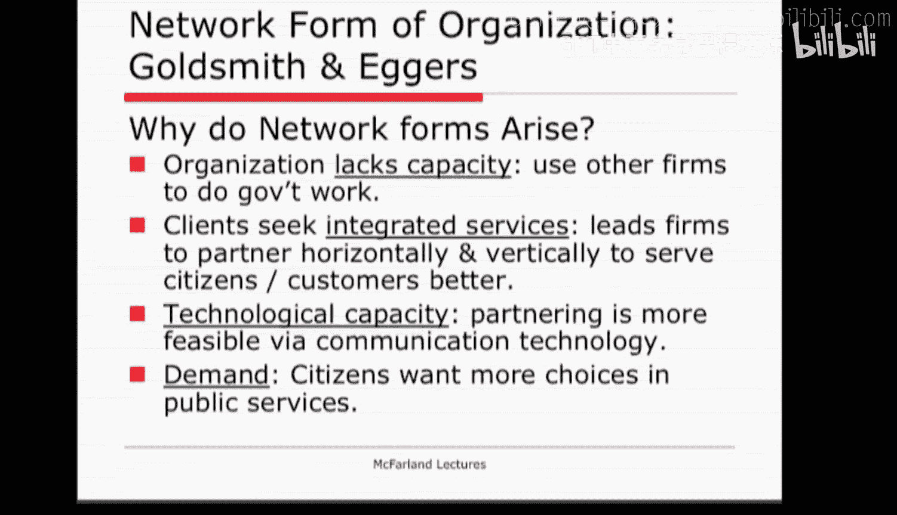
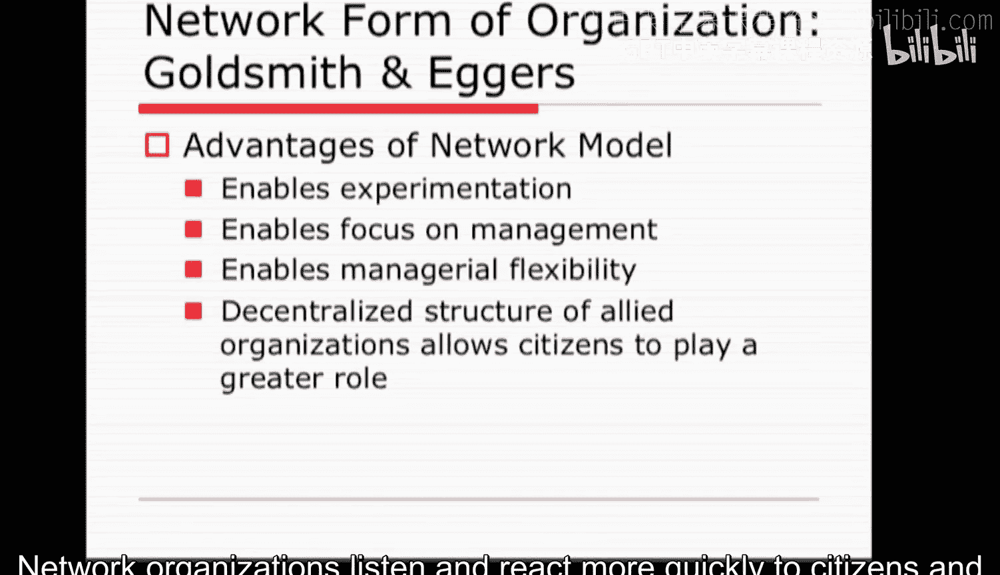
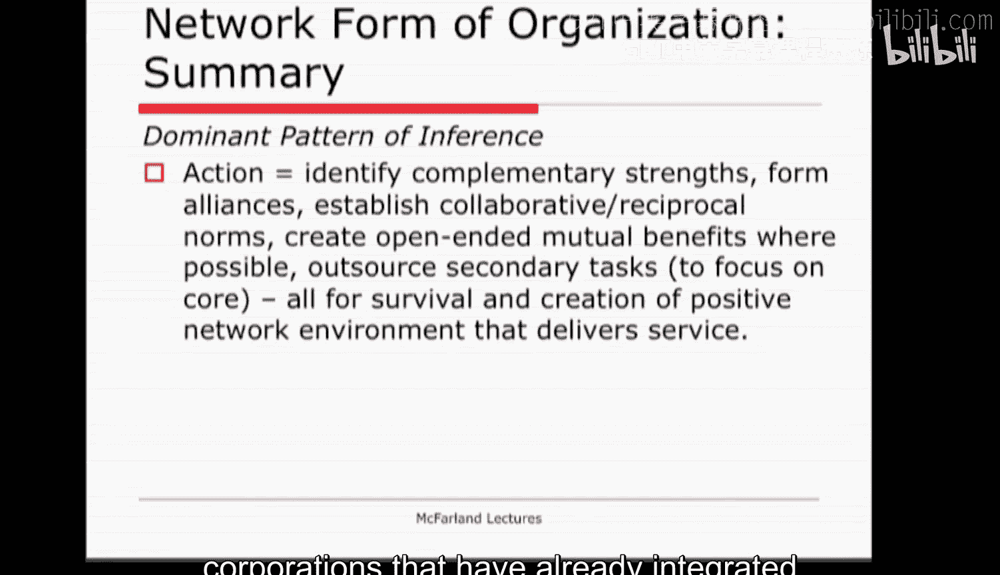
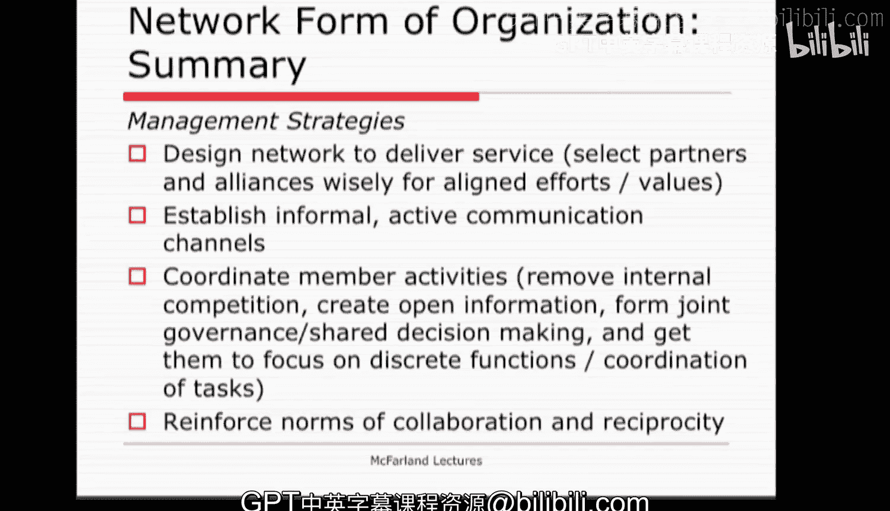

#  081：网络型组织（第二部分）

在本节课中，我们将深入探讨网络型组织的具体案例、其兴起的原因、优势与挑战，以及如何有效地管理这种组织形式。我们将通过实际例子来理解其应用，并学习构建和维护成功网络组织的关键因素。

---

## 网络型组织的案例

上一节我们介绍了网络型组织的基本概念，本节中我们来看看它在现实世界中的具体应用。

### 争议性案例：伊拉克重建

我们可以考虑更具争议性的案例，例如伊拉克战争。像Btel和哈利伯顿这样的公司作为承包商，可能协调了多种服务并参与了重建工作。虽然具体操作细节不详，但从网络组织的角度看，这是一个有趣的案例。可以认为，当时对美国机构的本地信任度很低。这就引出一个问题：这是否是使用承包商公司的原因？即便如此，这种网络组织形式所需的信任度是否足够高，使其真正有效？尽管具体情况未知，但思考网络组织形式在此类情境下的应用和表现是很有意义的。

### 经典案例：曼哈顿计划

网络型组织的最后一个例子是曼哈顿计划。该项目汇集了十几所大学，以及一个由科学家、工程师、军事机构和服务提供商组成的网络，共同制造原子弹。对许多人而言，该项目在技术和科学上取得了巨大成功，以至于他们现在将其视为一种希望在其他知识创造领域复制的网络组织形式。例如，我经常被要求研究跨学科和超学科项目，以及那些汇集了不同背景个体的研究中心。通过互动，他们能创造出如果各自待在学科壁垒内永远无法形成的新思想。那里的组织模式在很大程度上就是一种网络形式，学术界许多人认为，对于参与当今知识经济的组织来说，这是一种潜在强大的形式。

---

## 网络型组织兴起的原因

现在我们已经有了一些例子，可以开始探讨关于网络型组织更实质性的问题。一个非常简单且符合常识的问题是：网络型组织为何会出现？在Goldsmith和Eggers著作的第一章中，他们列举了政府使用网络组织的一些原因，我们可以将其更广泛地延伸到公司。

以下是公司采用网络组织形式的主要原因：

1.  **缺乏能力**：公司自身缺乏提供某项必需服务的能力，因此必须依赖其他公司。对政府而言，这意味着使用营利和非营利性公司作为合同和分包商。
2.  **提供更整合的服务**：仅仅外包是不够的。网络组织要求机构和分包商在横向和纵向上联合或合作，以提供更一体化的服务，类似于“一站式”体验，而非分散的多点服务。
3.  **数字革命与技术能力提升**：技术使得外部合作更加可行。公司可以通过数字手段，通常是即时地，共享生产、需求、运输、交易等各类信息，使得跨小型专业公司的多种合作成为可能。
4.  **需求驱动**：如今的公民希望有更多选择和选项，并且对平庸服务的容忍度降低。在网络组织中，存在许多合同和分包商，其中多数通过竞争来满足需求并赢得消费者选择。通过创建一个由互补部分组成的、能高效提供服务的网络组织，许多消费者能得到他们想要的。

---

## 网络型组织的优势

了解了其兴起的原因后，我们来看看网络型组织能带来哪些好处。Goldsmith和Eggers认为，网络组织形式对政府机构具有某些优势。

以下是网络型组织的主要优势：

1.  **促进实验**：允许机构探索更广泛的服务提供替代方案。
2.  **聚焦管理与交付**：通过将任务外包给最佳提供商和专家，政府可以更专注于管理和交付。对许多组织而言，这意味着它们剥离了非其技术核心的任务。
3.  **增加管理灵活性**：政府机构通常发现，通过利用多个资源提供者，它可以更快地提供服务，并改变服务的性质。
4.  **增强公民参与**：网络组织是一种去中心化的、流动的形式，联盟组织的自主性使公民能在决策中发挥更大作用。与大型层级制公司相比，网络组织能更快地倾听和回应公民及消费者。

---

## 构建与维护伙伴关系

网络型组织的一个核心特征是伙伴关系的创建与维护。你可以在Goldsmith和Eggers著作的第5章找到详细讨论。思考伙伴关系形成与分裂的因素很有帮助，因为这是成功建立或破坏网络组织的核心手段。

以下是影响伙伴关系健康与否的关键因素对比：

*   **形成并维持信任伙伴关系的因素**：
    *   组织处理**离散的职能**（机构或公司为维持生存所需处理的特定职能）。
    *   公司需要在**核心业务之外的事务上合作**，进行劳动分工，彼此需要但不生产相同的劳动。它们视彼此为差异化的合作者，是服务提供中的角色互补。
    *   公司在信息上**开放且信任**，并且**缺乏竞争历史**。
    *   相关公司不将信息和当前合作视为专有，或认为这会使它们日后处于相互不利的地位。

*   **导致竞争、不信任并分裂伙伴关系的因素**：
    *   公司职能重叠，存在**直接竞争**。
    *   存在**竞争意识或缺乏信任**。
    *   信息封闭，合作历史充满竞争。

管理个人很困难，管理单个公司很困难，管理公司集合更困难，而将他们的关系作为网络来管理则难上加难。因此，了解如何让网络组织为你和你的客户更好地工作会很有帮助。

---

## 管理网络型组织的策略

那么，如何有效管理一个网络型组织呢？以下是一些关键策略：

1.  **谨慎选择伙伴**：你需要值得信赖的、能够形成角色互补的合作者。每对伙伴应成为彼此的阴阳两面。你不希望网络由直接竞争的公司组成，否则服务网络将受到破坏。
2.  **设计整合的网络结构**：作为网络管理者，你需要思考更大的网络结构如何整合、如何组织，如何让更大的联盟网络运作，以提供一套鼓励公司加入或跨越、并且客户愿意使用的服务。
3.  **深化目标与文化对齐**：尝试对齐这些公司的目标和文化，使它们重视协作、信任和开放。如果你能塑造这些信念和价值观，那么他们的关系很可能表现为健康、互补的伙伴关系。
4.  **发展群体处理能力**：网络管理者需要倾听其他公司并包容它们，但必须在倾听包容与基于共同利益推动网络前进之间取得平衡。此外，管理者需要让合作伙伴专注于其离散职能，防止它们相互竞争，并协调这些活动，使其以高效方式相互关联。
5.  **共享绩效信息**：由于职能是分化的，行动是分布式的，让网络的其他部分了解其他部分在做什么，以及它们作为网络的协调如何与联合绩效相关，会很有帮助。因此，开放获取和讨论绩效数据通常对网络内的管理者及公司都有益。
6.  **建立信任与联合治理**：上述所有特征都有助于建立信任，但你还可以做更多。一个明显的方法是公开并解决网络中公司之间的任何初始争议。另一个是创建一个跨越合作伙伴的联合治理结构和共享决策机制。这样，每个人在决策中都有利害关系和责任，网络从而得以凝聚并推进。

需要注意的是，网络管理并不容易。管理者常常需要像管理联盟一样，持续管理关系乃至整个网络。然而，如果操作得当，网络会更加稳定，公司会视彼此为互补，整体上形成一个优于各自为政的服务提供系统。这种安排远远超出了单一决策，而趋向于许多决策的重复。

---

## 网络组织理论总结

最后，让我们使用本课程的“理论笔记模板”来总结我们对网络组织理论的了解。

*   **何时适用？** 如果研究的是个体员工之间的特定决策，可能不太适用。但它似乎非常适合研究组织关系的更广泛背景，以及这些关系如何影响组织的行为和生存。
*   **核心论点**：组织在制定战略、决定行为时，关注网络关系、位置和更大的背景。多种类型的网络（如信任网络、交换网络）是可行的，并能引导最终的公司行为。
*   **组织要素关系**：
    *   **参与者**：组织或至少是潜在的组织伙伴及其安排。
    *   **目标**：创建网络组织以提供服务（通过协作和外包）。
    *   **技术**：公司之间链接、协调和对齐的动态，以提供服务（如外包和分包）。
    *   **社会结构**：跨组织的沟通与协调（组织间网络），整个网络及其模式影响组织的产出和绩效。
    *   **规范**：公司间的信任规范，允许相互依赖的组织共同工作。
    *   **环境**：网络组织本质上存在于环境中，那些组织间关系构成了环境。公司高度关注环境内的社会结构。
*   **主导行动模式**：组织为实现网络化，会识别互补优势、形成联盟、建立协作规范、创造开放式互利机会，然后外包次要任务。这一切都是为了生存，并创造一个积极的网络环境，通过互补彼此需求来提供服务，从而可能与已将服务内部整合的大型公司竞争。
*   **如何管理**：
    *   明智选择价值观和努力互补对齐的伙伴来设计网络。
    *   与相关组织建立频繁、非正式、积极的沟通渠道，通过频繁接触和信息共享建立信任。
    *   通过防止合作者内部竞争、创建共享信息访问、形成共享决策结构，并让参与公司专注于其独特职能及跨职能协调（而非陷入相同职能的竞争），来协调成员活动。
    *   在网络内建立协作和互惠的规范。

通过这种方式，你可以创建一个分布于环境中的组织，而不是将所有部门和职能容纳在单个公司内部。它被呈现为存在于环境中的网络形式，而这一成就需要一套独特的管理方法和努力才能实现。

---

本节课中，我们一起学习了网络型组织的实际案例、其产生的原因与优势、构建信任伙伴关系的要点，以及管理这种复杂组织形式的具体策略。网络型组织通过整合外部资源与能力，为应对复杂服务和知识经济挑战提供了一种灵活而强大的解决方案。