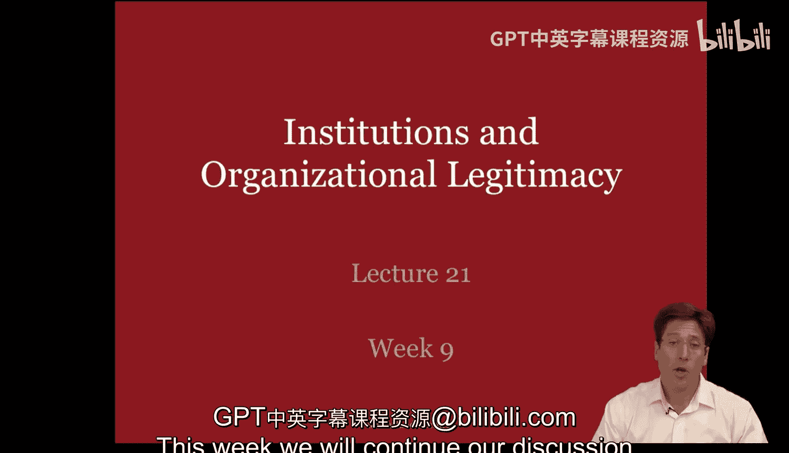
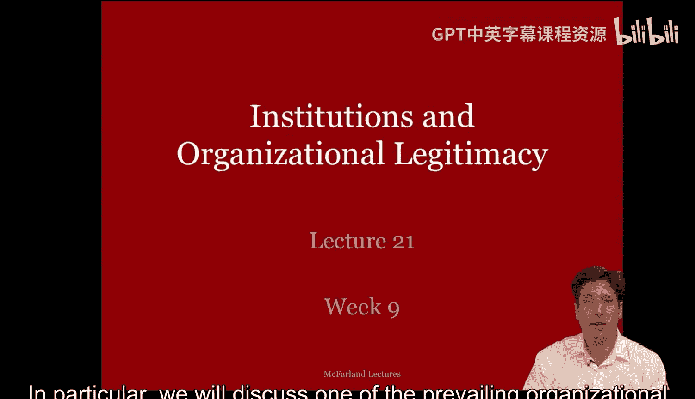
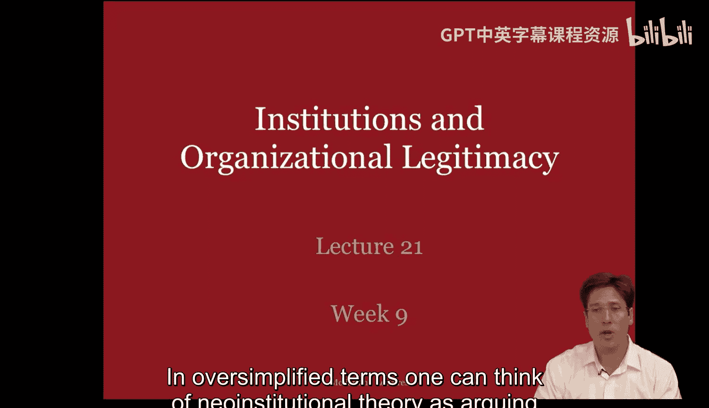
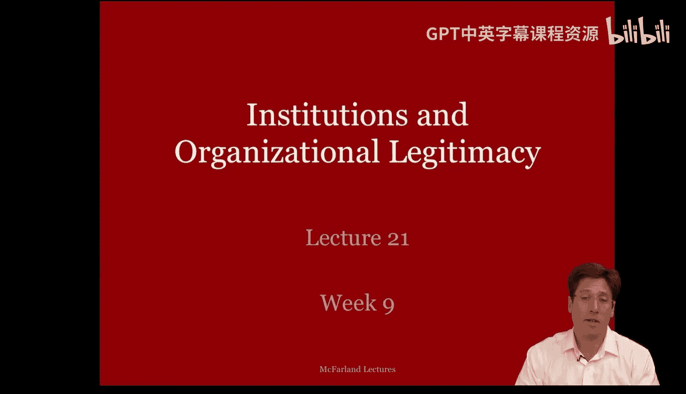
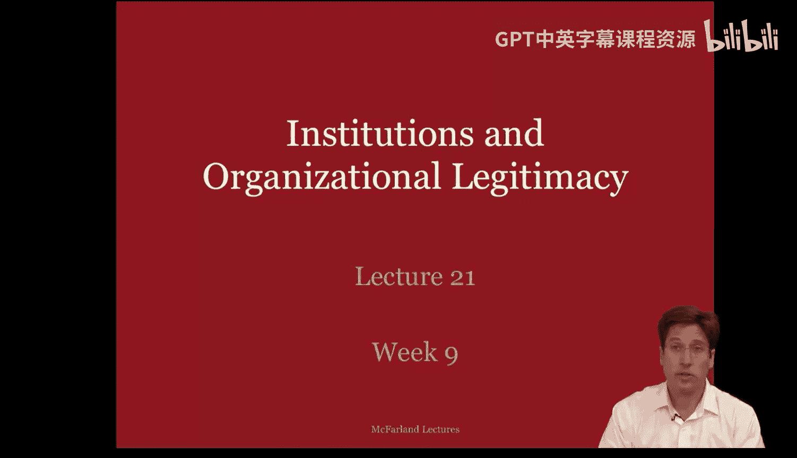
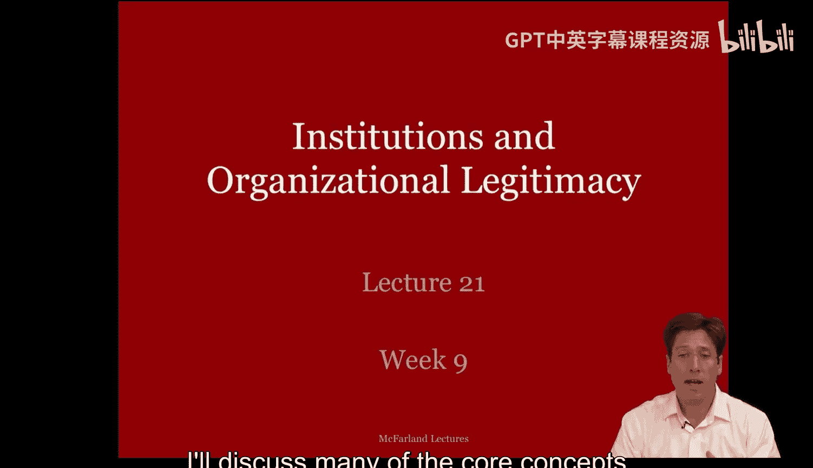
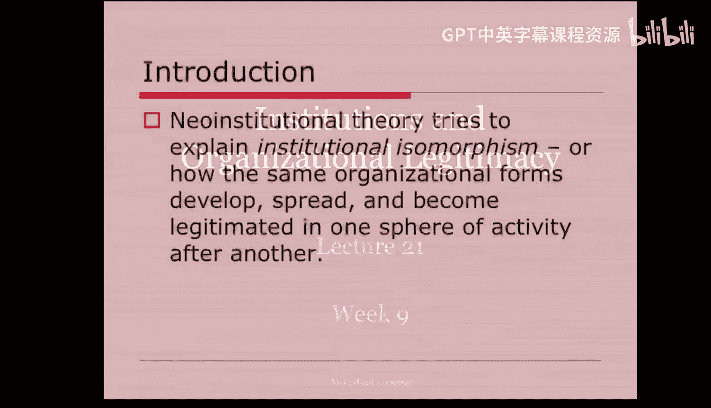
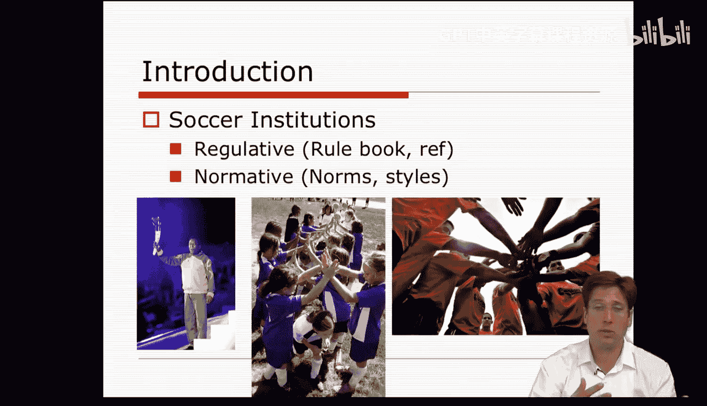
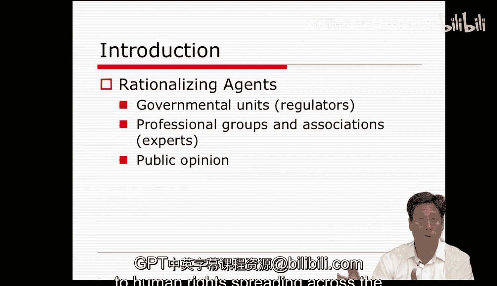

#  089：制度与组织合法性 - 第一部分 🏛️

在本节课中，我们将继续探讨作为开放系统的组织，其生存依赖于与环境的互动关系。我们将重点介绍一个源自社会学的、占主导地位的组织理论——新制度理论。

上一节我们回顾了组织作为开放系统的观点，本节中我们来看看新制度理论如何解释组织与环境的关系。

## 新制度理论的核心观点

新制度理论的核心观点可以概括为：**一个组织的生存取决于其与**文化环境**的契合度**。换言之，企业的成功依赖于它是否采纳了外部环境所认为的**理性**和**合法**的结构。企业需要反映出环境对于“一个合法组织应该是什么样子”的信念。

新制度理论一直是学生较难完全掌握的理论之一。因此，本周的课程安排会略有重复。我将以不同方式多次讨论核心概念，以帮助大家更好地理解该理论的内涵。

新制度理论试图解释**制度同构**现象，即相同的组织形式如何在一个又一个活动领域中发展、传播并获得合法性。该理论试图解释，为什么像生物技术或教育这样的组织领域，其内部的组织看起来越来越相似，而非不同。

让我们以教育组织领域为例。

## 制度同构的实例：教育领域

为什么大多数学校和教室看起来都很相似？我记得与新制度理论的创始人之一约翰·迈耶交谈过，他讲述了自己在世界各地参观学校和教室的经历。他描述了参观过的典型美国学校、撒哈拉以南非洲贫困村庄里在露天土坑中授课的班级、沙特阿拉伯男女分开授课的宗教原教旨主义学校，甚至富裕的西方学校。所有这些学校都有足够的相似性，让人一眼就能认出这是什么类型的组织，以及它在遵循什么样的“脚本”。它们都是“真正的”学校。

在许多方面，所有这些环境都符合关于“学校教育应该是什么”的广泛持有的制度信念。这些信念和观念是环境中的**文化-认知控制**或深层社会结构。

正如理查德·斯科特所言，在社会互动中发展起来的一系列信念，为社会情境中的治理和引导行为提供了**模型、图式和指导方针**。因此，环境中存在着这些制度控制或信念，它们影响着我们并塑造着我们的行为。

## 制度控制的三种形式

制度控制以几种形式存在。

以下是制度控制的三种主要形式：

1.  **规制性控制**
    *   这是一种明确的制度控制形式，通过**法规或规制性机构**来实践。
    *   它通过**规则或法律**以及**激励和惩罚**等行为诱导来约束行为。

2.  **规范性控制**
    *   规范性控制指导我们**应该或不应该做什么**，或者**应该如何以及不应该如何表现**。
    *   在很大程度上，这些是**非正式的规则和指导方针**，但它们对组织行为的影响与法律法规一样大。

3.  **文化-认知性控制**
    *   最后，还有一些根深蒂固的制度，即**认知信念**。
    *   正如理查德·斯科特所说，遵守认知制度发生在许多情况下，因为其他类型的行为是**不可想象的**。
    *   认知信念是**自然化**的、被视为理所当然的做事方式，例如被视为理所当然的**惯例和活动**。

在许多情况下，这些制度像洋葱一样层层叠加，相互强化。但在某些情况下，它们会相互冲突，或者环境中的不同部分会坚持其中一套而非另一套。因此，文化环境可能是多样的。然而，组织通常通过将这种外部复杂性构建到其内部正式结构中来应对。

我总是觉得通过一个运动的例子来区分制度的三个层次或形式最容易。我将以足球这项大家应该都熟悉的运动为例，描述这三种制度控制如何层层叠加，使得足球比赛的进行方式相对统一且可识别。

## 以足球为例解析制度控制

那么，足球的**规制性控制**是什么？那些就是**规则手册**和**足球规则**，以及作为执行这些法规的代理人的**裁判**。违反规则会受到处罚。

那么，足球的**规范性控制**是什么？在这里，足球的规范塑造了我们关于**更好或更差的球员**、**更好或更差的体育精神**等观念。规范引导球员在他们所执行的默会活动和惯例中，以某种风格行事。

那么，当涉及到足球时，什么是**认知性或更深层次的制度控制**？对于足球来说，这包括**比赛活动本身**，无论是开球、传球、盘带等等。很难想象有人会用不同的活动框架、图式，甚至像篮球那样的不同角色来对待足球比赛。你能想象人们准备好打篮球却出现在足球场上吗？我们将足球比赛或活动的进行视为理所当然，人们会毫无疑问地参与其中。当有人不这样做时，每个人都会非常不安。这就像一个“破坏性实验”，当个体像陌生人一样对待自己的家人时，这简直太疯狂了。

当我们去看足球比赛的不同场景时，会发现这种认知层面是存在的。例如，1937年的一场比赛、沙滩上的一场比赛、操场上的一场比赛，它们都与我们视为足球的惯例有着**家族相似性**。我们能够识别它。

## 制度的作用与理论起源

多种制度可以控制行为，并将其塑造成被认为对任何组织都是**合法和理想**的既定形式。组织的行动可能由被视为理所当然的惯例和活动、最佳实践和参与者的规范与期望，以及捕捉违规行为的明确表面法规所驱动。

约翰·迈耶、布莱恩·罗恩、保罗·迪马乔和沃尔特·鲍威尔都是最早的新制度理论家，在本课程中你将有机会阅读他们的著作。他们写的是组织如何因为存在这些**过程**而变得相似。这些过程，包括领先企业的示范作用和同行压力，导致企业采纳许多相同的制度控制。它们试图**反映制度环境并与之契合**。

他们特别强调了**理性化行动者**在生成制度控制和这些**仪式性分类**方面的重要性。这些行动者包括政府单位、专业团体和协会、大学甚至公众舆论。他们提出的分类被认为是理性的，因为它们来自这些**合法的典范**。他们提出的分类就是前面提到的**文化-认知类别、规范性信念以及规制性政策和法律**。

其基本思想是，科学家和专业人士越来越多地在**世界体系层面**工作，召开国际会议，发表声明，为一个又一个活动领域提供改革和理性化的方案与政策，无论是关于健康标准、人权在世界范围内的传播，还是教育组织形式。

本节课中我们一起学习了新制度理论的基本框架，理解了组织如何通过采纳外部环境认可的合法结构来获得生存优势。我们探讨了制度控制的三种形式——规制性、规范性和文化-认知性，并通过足球的例子进行了具体分析。最后，我们了解了该理论的起源及其关于理性化行动者推动制度同构的核心观点。