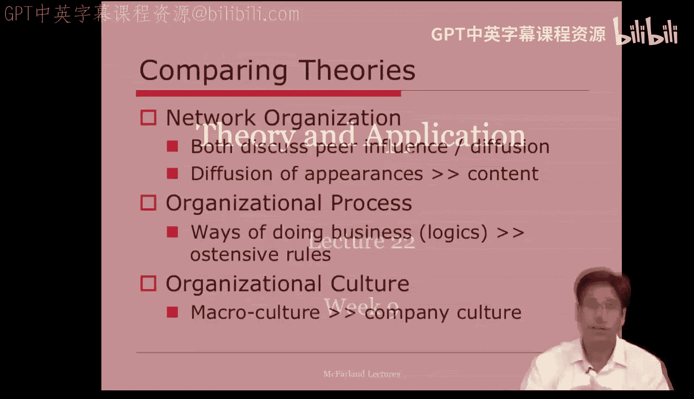
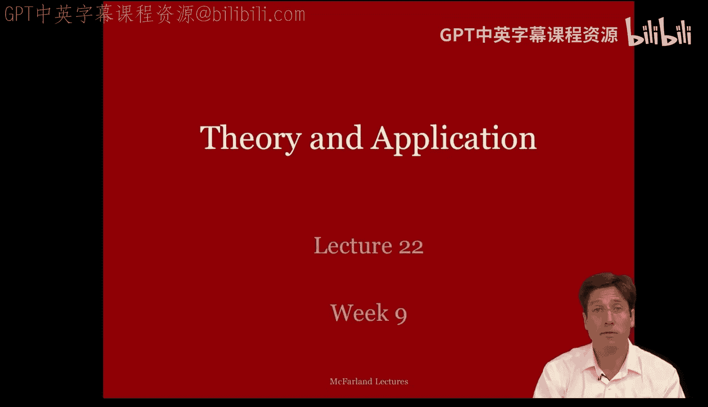
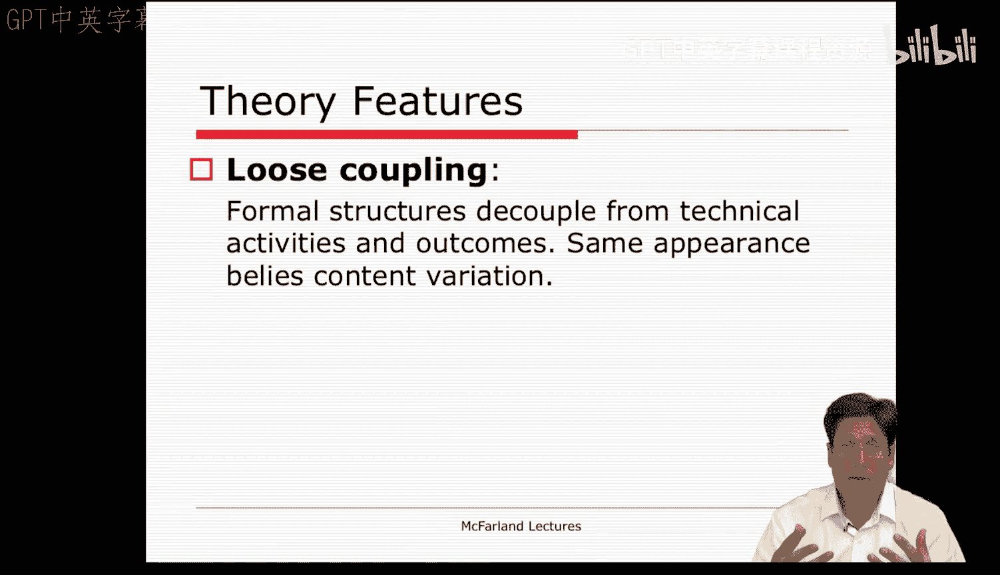

#  091：理论与应用 - 第一部分 🏛️

在本节课中，我们将深入学习新制度主义理论的核心特征。我们将探讨该理论的基本概念，并通过具体例子来理解这些概念如何应用于现实世界中的组织。

---

## 概述

上一讲我们介绍了新制度主义理论的概况，并将其与课程中先前讨论的理论进行了比较。本节中，我们将更深入地探讨新制度主义的核心概念，特别是“理性神话”和“仪式性遵从”等思想。

---

## 核心概念：理性神话与仪式性遵从

新制度主义理论的奠基之作是迈耶和罗文于1977年发表的论文。该论文的核心论点是：**组织为了获得合法性和从环境中获取社会资源，会仪式性地将那些被认为是理性的制度纳入其正式结构**，而并非完全出于对效率的追求。

这些被纳入的制度包括法规、程序、分类、规则和实践。它们被称为**理性神话**或合法化制度。我们采纳它们是基于它们“被认为是理性的”这一假设，但通常不会去深究它们是否真的提高了效率。它们被视为理所当然。

例如，我们认为教育机构要具备合法性，就必须拥有教学楼、带桌椅的教室、讲座、师生角色与互动、数学等学科内容以及文凭等。这些角色、分类和规则就像剧本一样被仪式性地应用，组织通过扮演好自己的角色、呈现出应有的外观来获得合法性。

**公式化表达**：`组织合法性 = 仪式性遵从(外部环境中的理性神话)`

为了在现代社会中生存，组织必须被视为合法的。这种合法性是通过保持**仪式性遵从**来实现的。组织的正式结构被设计成能反映外部环境中存在的理性神话。这种遵从导致组织场域中的各个组织看起来越来越相似。

---

## 理性神话的含义与来源

“理性神话”这个概念需要进一步解释。

*   **它们是“理性化的”**：因为这些制度是以非人格化的、规则化的方式被规定为实现各种目标的恰当手段。
*   **它们是“神话”**：因为我们基于信念或理所当然的态度采纳它们。我们相信它们是理性的建构，但很少深入探究它们是否高效，或者是否有其他更好的建构。

我们作为有限的问题解决者，采纳这些理性神话，实际上是使用了一种编码在环境中的“速记逻辑”。标准操作程序和组织结构的效率与效能，是基于其被广泛采纳或得到斯坦福学者等专业人士的认可而被预设的。

那么，理性神话从何而来？

理性神话产生于**密集复杂的网络环境**中。它们在现代化的背景下出现，是为了在充满模糊性和不确定性的情况下做出理性决策。理性神话及其对“理性化主体”（如专业机构、认证体系）的依赖，是一种决策的捷径。它们通过社会网络扩散，因为人们相信这些实践是理性有效的。此外，组织内部的领导者也希望自己的组织在更广泛的环境中具有合法性。

---

## 应用实例：学校与广告

玛丽·梅茨关于“真正的学校”的论文，为理性神话提供了一个清晰的案例。她描述了教育组织如何通过**象征性编码**其结构，使其与制度环境中关于“真正的学校”的信念相符。这就是为什么美国的高中在表面上看起来都一样，尽管内部可能截然不同。

以下是“真正的学校”所包含的典型特征：
*   拥有教学楼、教室、桌椅。
*   设有按年龄分级的学生角色、未分化的教师角色、系主任、校长等。
*   提供大学和雇主都能识别的、范围与顺序明确的差异化课程科目。
*   使用熟悉的教学技术，如讲课、背诵、课堂作业、教科书、电脑和黑板。
*   将时间编码为上学日、教学周、学期和学年。
*   使用相同的排名和完成符号，如成绩、考试分数和文凭。

所有这些特征都是我们识别并期望一所学校具备的**典型化**要素。我们视其为理所当然，并相信它们是正常且理性的，而很少检查其效能。

同样的逻辑也适用于大学。新的大学会迅速采纳课程、学科、院系、有资质的员工等，呈现出顶尖大学的许多仪式性特征。它们采纳了关于“一所好大学应该是什么样”的理性神话。

理性神话的概念甚至可以延伸到组织产品。以汽车广告为例。广告商在塑造“好车”形象时，会投射出公司及其产品的外观，仿佛它们体现了外部合法的理性神话。例如，捷豹汽车广告可能会宣扬其获得的各种奖项（安全奖、速度奖等），这些奖项本身就是理性化主体。广告也可能更多地诉诸于一种理性神话或共享的公众情感（例如，让名人斯汀坐在后座），而非产品本身的性能细节。

---

## 理性神话如何得以维持？

一个很好的问题是：如果理性神话并非高效或最优，它们如何得以维持？

许多组织的正式结构就像**神圣的仪式**一样被采纳。仪式就像婚礼，人们通过一系列程式化的外观和行动，来扮演丈夫和妻子的角色，并通过这个仪式完成身份的转变。当说一个组织反映了仪式分类时，意味着它通过展示特定的外观，来体现一种在环境中被视为合法的、被认可的组织身份。

为了维持仪式和合法性的可信度，组织预设了一系列的**信任链**，并采取各种**保全面子**的努力来维护这种神话。

以下是几种用于维护这些神话的“保全面子”的努力：
1.  **回避**：当组织单元被分割，单元间的互动被最小化时，回避就达到了最大化。这样，一个单元无法窥视另一个单元的内容或表现并提出质疑。
2.  **自主裁量权**：当检查被最小化，且参与者被包裹在专业的、有资质的权威中时，自主裁量权就达到了最大化。通过信任教师，我们给予他们自主权，并让他们的专业身份充当理性化主体。
3.  **诚信假定**：组织通常假定仪式性表演和外观具有诚信。这种情绪允许它们忽视问题，并将这些问题标记为异常。

在教育领域，存在着一系列从未被彻底检查的信任链：州政府信任学区，学区信任学校，学校信任教师。教师因其学位和项目认证而值得信任，而认证机构并不检查毕业生的教学技能，而是信任大学行政人员和所开设的课程。正是这个更大的、相互依赖的信任系统，维持了许多关于“什么是合法的学校教育形式”的理性神话。

---

## 松散耦合：结构适应

制度理论还认为，这一系列的信任链通过一种被称为**松散耦合**的结构适应而得到极大维持。

组织可能在正式的、仪式性的方面看起来都一样，但这并不意味着它们内部的实际实践和活动是相同的。许多组织实际上将其正式结构和外观，与内部的技术性活动和结果**脱钩**了。

那么，随之而来的问题是：为什么会发生这种情况？

---

## 总结

本节课中，我们一起学习了新制度主义理论的核心思想。我们探讨了组织如何通过采纳“理性神话”和进行“仪式性遵从”来获得合法性，而非仅仅追求技术效率。我们通过学校和广告的实例理解了这些概念的应用，并分析了通过“信任链”和“保全面子”的努力，理性神话如何得以维持。最后，我们引出了“松散耦合”的概念，为下一节讨论组织内部实践与外部表象为何可能脱钩做好了铺垫。