#  092：理论与应用-第二部分

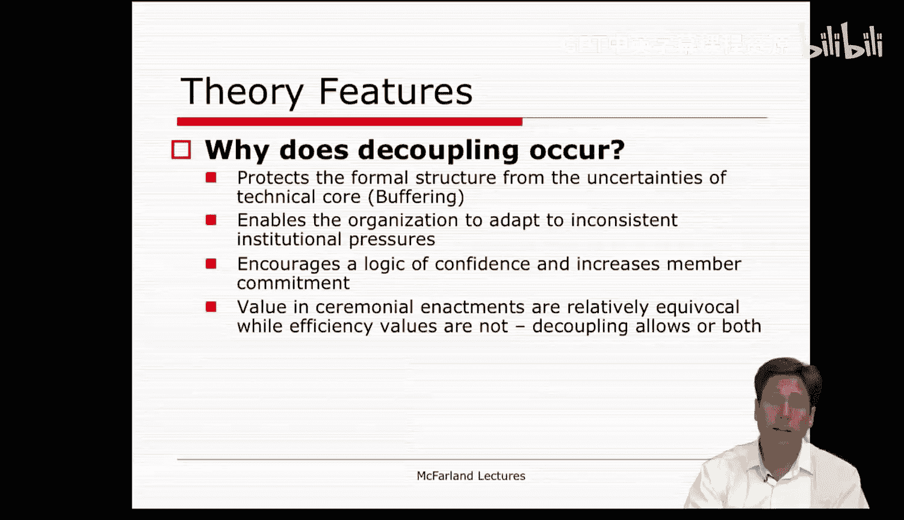

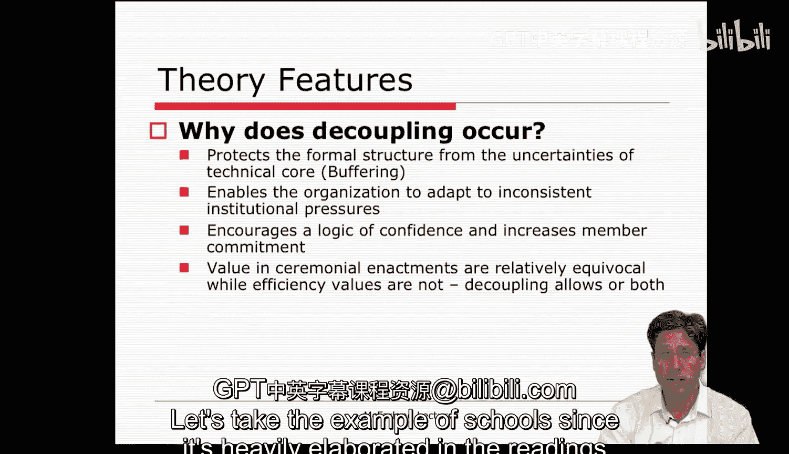

## 📚 课程概述

在本节课中，我们将深入探讨新制度主义理论的核心概念，特别是“脱耦”现象及其在教育组织中的具体表现。我们还将学习迪马乔和鲍威尔关于组织同构性的经典论述，理解组织为何以及如何变得越来越相似。

---

## 🏫 以学校为例的脱耦现象

上一节我们介绍了制度理论的基本框架，本节中我们来看看它在具体组织中的应用。由于在相关文献和理论文本中被广泛阐述，我们以学校作为例子。

脱耦在学校中发生，主要有以下几个原因。

以下是脱耦发生的具体原因：

1.  **保护正式结构**：脱耦保护正式结构免受技术核心不确定性的影响。这是一种缓冲机制。例如，课程如何被传授、接收以及其效果如何衡量都存在很大的不确定性。如果我们过于频繁地检查它，反而会对任何教学形式的合法性产生怀疑，并且我们缺乏明确可行的替代方案。
2.  **适应环境规则**：脱耦使组织能够适应环境中不一致和相互冲突的制度化规则，从而获得灵活性。环境压力的多样性可能对组织提出相互矛盾的要求。通过分化和隔离，组织可以放弃协调，避免兼容性和不一致性问题。例如，将特殊教育分开、使用分轨制、设立不同院系等，这些都是使教育组织显得理性，同时又能分割内容与检查的手段。可以想想认证工作的实质，它们大多只是统计有多少院系和类别这些表面特征。
3.  **避免检查**：脱耦使参与者能够避免检查。这种避免检查的行为本身，就是对信任和信心的展示。因此，脱耦有助于建立“信心逻辑”，并增加内部参与者的承诺。责任被推给了教师和教师的专业精神。
4.  **体现仪式价值**：教育的很大一部分价值与教学活动的效率关系不大。其价值不在于每花费一美元能学到多少东西，而更多地在于学校教育的仪式性活动所体现的价值，这些价值被认为是相对模糊的。例如，建筑物、教师、书籍、主题、认证、教室、课桌等，这些都是模糊的价值。通过将正式结构和类别与核心实践和活动脱钩，关于仪式类别有效性的不确定性就降低了。学校可以在没有检查的情况下继续运作并表现良好。

---

## 🇺🇸 美国教育系统中的脱耦

那么，为什么这种松散耦合现象尤其出现在美国教育体系中？其他哪些体系也可能出现这种情况？

在美国体系中，有人认为这之所以发生，是因为它是分散化的，并且与脱耦现象同时存在。美国的教育体系是分散的，它依赖于地方人口提供的资源，比如地方教育委员会、县、市长。相比之下，其他一些国家可能拥有集中化的结构，配有考试和明确的检查系统，以确保活动的一致性。与美国不同，美国的考试是私有化的，并非全国统一。一个全国性的系统可能会将某些社区的所有孩子几乎都定义为成功者或失败者。对于一个依赖从地方人口中获得合法性和资源的系统来说，这样做将是致命的。因此，地方控制削弱了管理人员的专业性，但增强了教师的专业性。美国学校拥有这样一种体系：管理人员权力较弱，难以控制任何形式的教育改革。

---

## 🔗 总结：新制度主义的核心论点

总而言之，新制度主义理论认为，组织通过在环境中进行符号编码或采纳关于结构的理性神话来取得成功，这些神话依赖于信心逻辑。然后，它们将其正式结构与实际的内部活动及其绩效脱钩。这为它们提供了更大的灵活性，并缓冲了技术核心和教学的内部运作，使其免受外部环境中可能相互冲突的关切的影响。脱耦和信心逻辑使得这些组织的管理者和员工能够在没有检查的情况下工作，并享有一定程度的确定性和安全感，这是他们原本无法获得的。

---

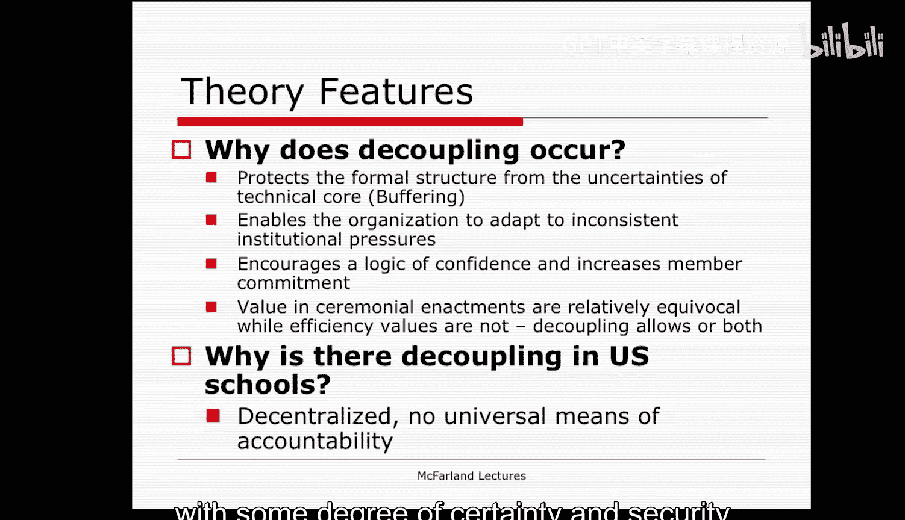

## ❓ 采纳正式规则的意义

既然观察或检查并不那么相关，为什么还要采纳正式的规则和结构呢？遵守理性神话在某种程度上是否有帮助？

新制度主义者会提出这样的论点：**组织需要合法性**。它们需要这种合法性来获取资源和生存。因此，独立于物质需求之外，组织需要看起来像一个真正的组织，并且至少表现得像一个真正的组织。创造并遵守主流的理性神话为它们提供了各种资源。

---

## 🏫 再次以学校为例

让我们再次以学校为例来具体说明这一点。

以下是遵守理性神话为学校带来的具体好处：

1.  **促进交流**：学校拥有的文凭、分类和类别构成了一种语言，促进了组织之间以及与环境的交流。
2.  **便利资源分配**：资金通常以分类方式分配。因此，如果你设立了职业教育、特殊教育、大学预科轨道等，将这些类别落实到位，就使得个人在这些机构之间的标签化、转学以及招聘变得可行。
3.  **提升声望**：仪式分类系统也可以被利用来获得声望。例如，你可以聘请有声望的教职员工，可以在自己的机构中引入创新项目，这可能会提升你自己大学的地位。
4.  **提供内部秩序**：组织可以依靠仪式分类来提供内部秩序和身份认同。这有助于内部组织，并给人们提供工作的框架。

在许多方面，这就像一种管理处方。如果你尝试以上所有做法并顺应制度环境，你将通过将外部定义的教师和学生纳入正式结构而获得回报。学校保持合法性，并获得必要的资金和参与者，从而得以运作。

简而言之，遵守制度规则的回报是**增强了为组织目的调动社会资源的能力**。每当你创建一所新的特许学校或私立学校时，神奇的是它看起来与其他每所学校都如此相似。它并非那么创新和独特。许多初创公司和企业在试图模仿其他被认为拥有合法仪式特征的公司和企业时也是如此，这些特征使得它们能够与其他公司和环境中的其他部分相互关联，并拥有被认为有价值且理性兼容的合法面貌。

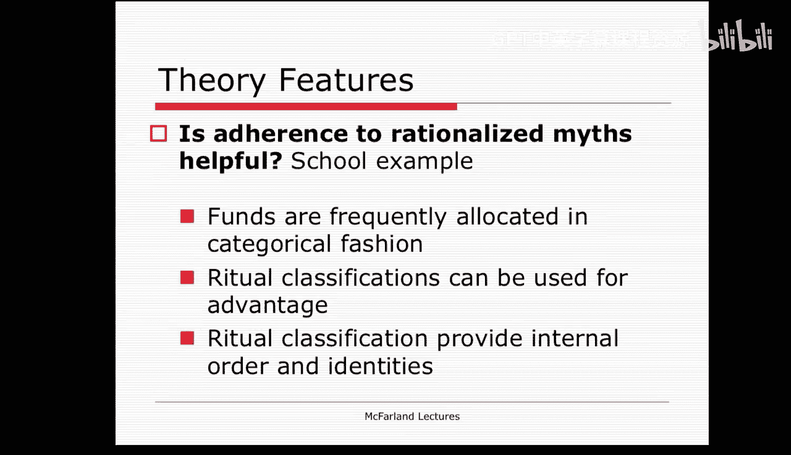

---

## 🔄 迪马乔与鲍威尔的理论

我想讨论的第二篇理论论文是迪马乔和鲍威尔的《铁笼新探：组织领域的制度性同构与集体理性》。

这篇文章的伟大之处在于，它展示了新制度理论如何与资源依赖理论和种群生态学相关联。这将是我们在下周第10周要学习的最后一个理论。

此外，这篇文章描述了导致组织在形式上彼此相似的各种“桥接”策略。

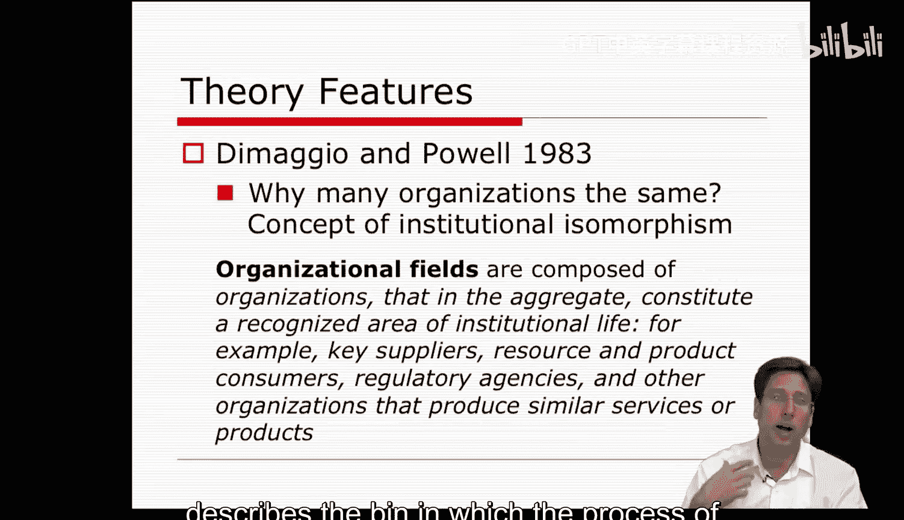

迪马乔和鲍威尔在这篇文章中提出的核心问题是：**为什么这么多组织看起来都一样？** 在一个组织领域内，它们为什么相互模仿？为什么它们看起来相似，而不是不同？为什么会出现从多样化的组织形式向同质化组织形式的演变？

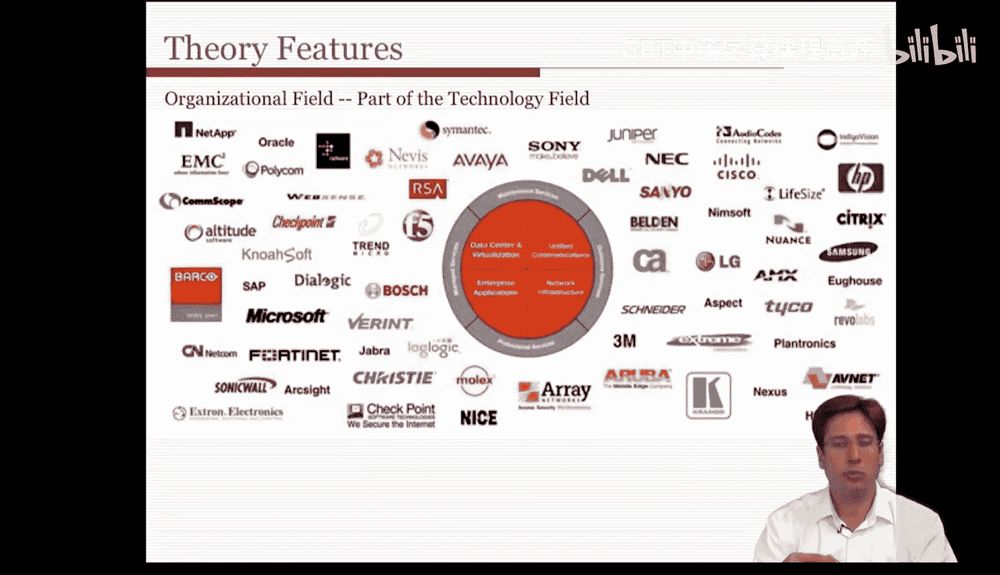

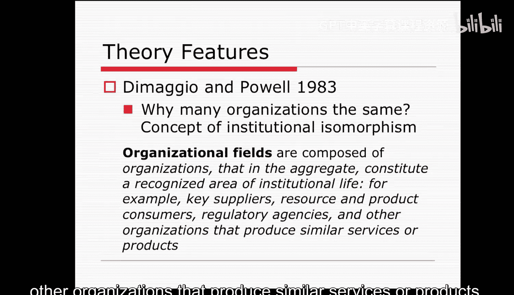

因此，迪马乔和鲍威尔关注组织领域，以及其中的组织如何变得同构。这就像我们之前关于学校、大学如何变得如此相似的例子一样。

---

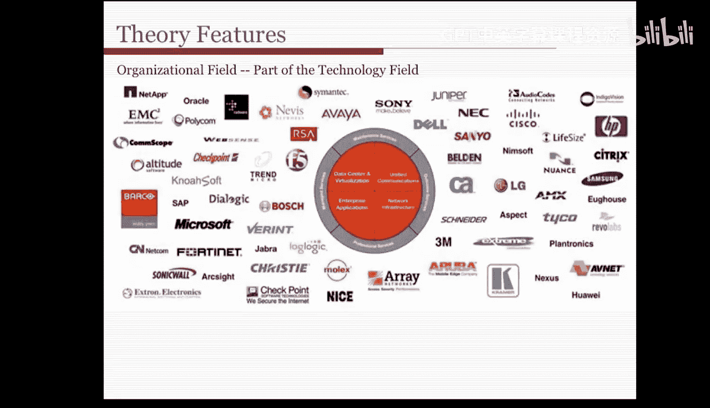

## 🗺️ 组织领域的定义

让我们首先定义“组织领域”这个概念，因为它真正描述了组织同质化过程发生的范围。

**组织领域**由那些总体上构成一个公认的制度生活领域的组织组成。例如，它包括关键供应商、资源和产品消费者、监管机构，以及其他生产类似服务或产品的组织。

现在，这里有一个例子，展示了像技术领域这样的制度领域可能包含哪些组织。当然，它并不完整，但它让你对构成该领域并可能相互认可的各种组织有所了解。

---

## 🧩 组织领域的形成过程

那么，像这样的领域是如何形成的呢？鲍威尔和迪马乔给出了领域形成的四个步骤。

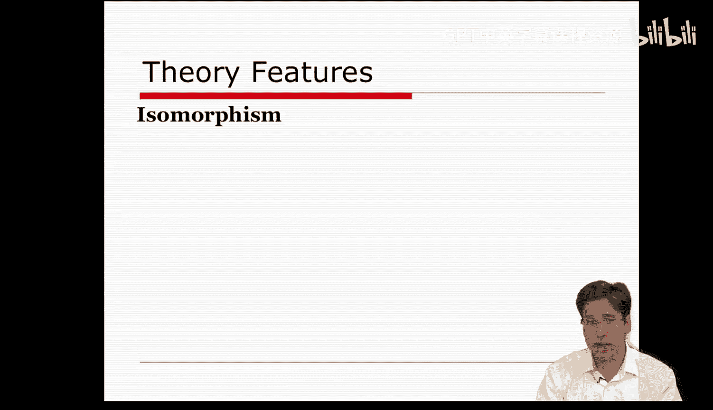

以下是组织领域形成的四个关键步骤：

1.  **互动增加**：首先，这些成员之间的互动增加。
2.  **模式形成**：然后，它们之间形成了更多的组织间等级模式和联盟模式。
3.  **信息负载**：最终，关于该活动的信息负载增加，需要应对。
4.  **相互意识**：最后，在这些成员中发展出相互意识。

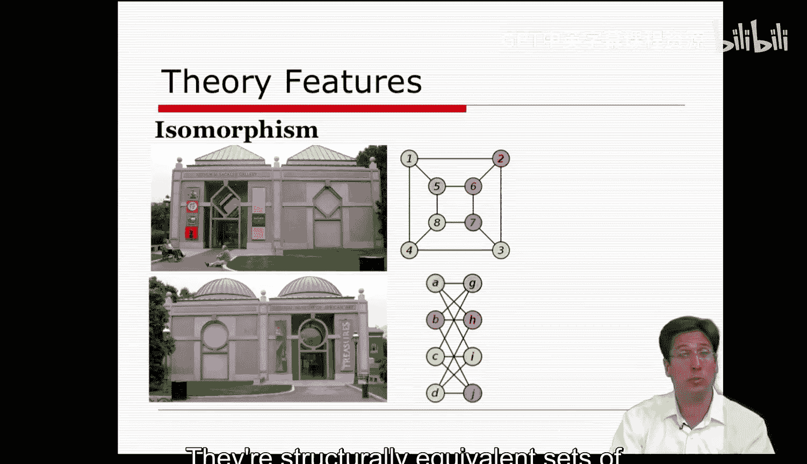

以鲍威尔的研究为例，他的许多研究都涉及生物技术产业的兴起，以及这个领域如何在银行、风险投资家、大学、研发公司和生物技术公司之间形成。这个领域就是所有这些不同的群体或组织，它们之间互动增强，形成了特定形式的组织间网络，出现了关于生物技术的信息负载，然后产生了将自己视为某种产业或领域的相互意识。通过这个过程，许多公司开始变得彼此相似，它们开始采用相似的模式，并对它们的符号结构进行编码。这就是新制度主义者对于一个更广泛的领域或领域所持有的论点。

---

## 🧬 组织同构性

在这样一个领域内，组织同质化是如何产生的？这个过程是种群中的一个单位开始与其他单位相似的过程，新制度理论家称之为“同构”。我已经稍微提到过它，但现在我想进一步阐述。

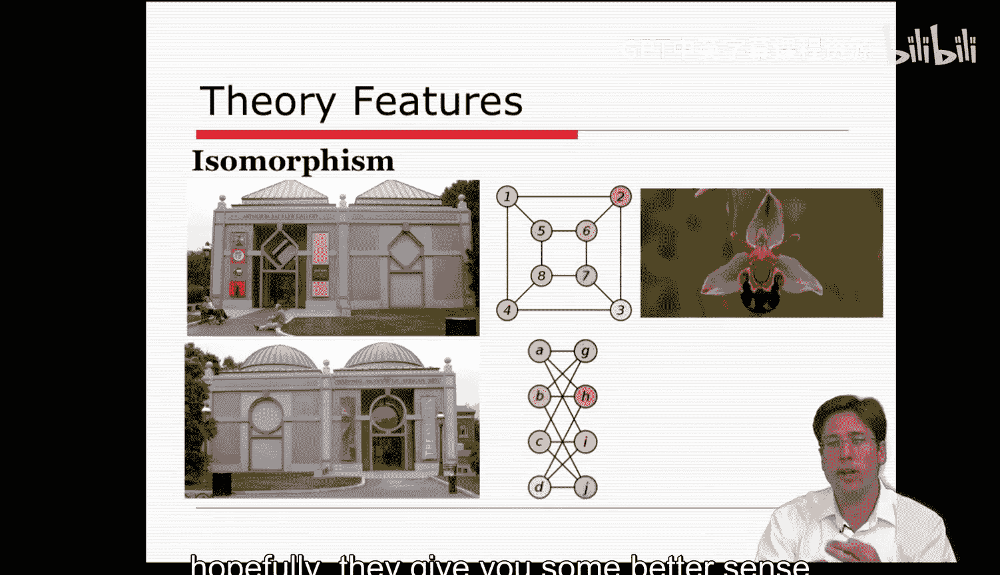

在日常用语中，同构可以有多种表达方式。在视觉上，你可以把它想象成镜像，或者一栋建筑呈现出与另一栋相同的形式或外观，它们采用了相同的立面和外部的图案。

但它也可以有更多的数学甚至几何表达。注意这里，1、2、3、4与5、6、7、8具有相同的关联模式，A到D与G到J也是如此，它们是结构等效的节点集，并且是可替换的。因此，在几何上我们可以讨论同构。

对于制度理论而言，这些表象可以与功能脱钩。也许最后这张图片更有帮助，它是一朵模仿蜜蜂的兰花。通过展示某种外观，它吸引了资源，比如花粉。

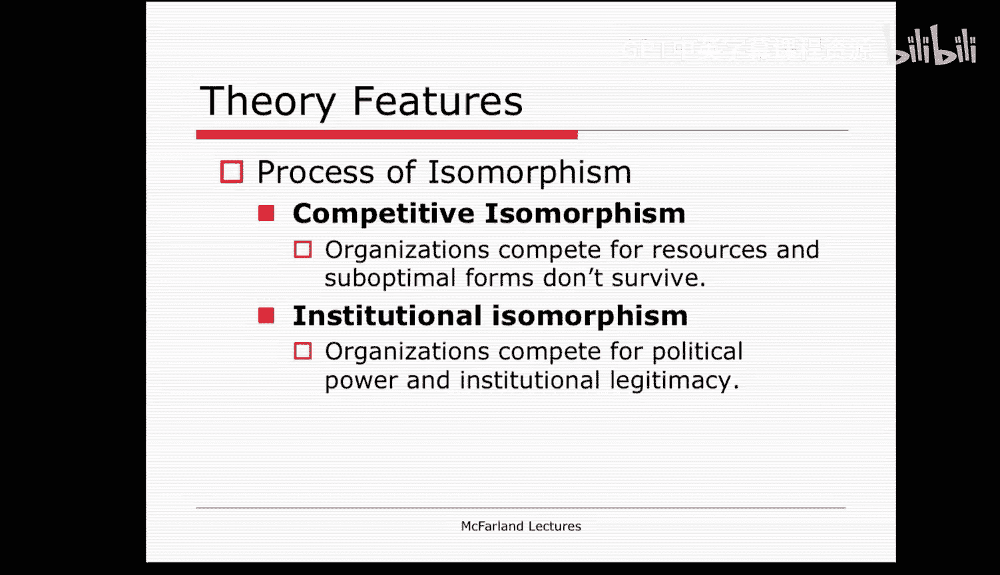

当然，这些都不是完美的比喻，但希望它们能让你更好地理解什么是同构或进行同构。

---

## 📈 同构的过程

迪马乔和鲍威尔描述了同构产生的多种过程。

第一个过程他们称之为**竞争性同构**。在这些情况下，某些组织形式无法生存，因为它们不是最优的，并且因为决策者学会了适当的应对措施，并调整他们的组织以求得生存。迪马乔和鲍威尔认为，这发生在存在公开竞争的领域。这实际上是对种群生态学理论的引用，我们将在下周更多地学习这个理论。因此，我打算暂时搁置这一点，等到下周再讨论。

第二种形式的同构是**制度性同构**。这是新制度理论的核心过程。在这里，组织不仅为资源和客户竞争，还为政治权力和制度合法性竞争。制度性同构的概念有助于理解弥漫在现代组织生活中的政治和仪式。因此，它不仅仅是自然选择、适应和竞争，更是一个涉及社会、政治和文化层面的适应、协调和合法性的社会学过程。

---

## 🧱 制度性同构的三种形式

鲍威尔和迪马乔描述了三种形式的制度性同构，我想在这里更详细地阐述每一种。

以下是三种主要的制度性同构形式：

1.  **强制性同构**：这种形式最类似于资源依赖理论中讨论的依赖关系中所观察到的现象。在这里，一个依赖性的公司受到政治影响。这种强制性影响既来自其他组织对焦点组织施加的非正式和正式压力（焦点组织依赖于这些组织），也来自组织运作所处的社会和文化期望。因此，公司被迫遵从，这导致它们遵循并采纳其所依赖的组织的组织形式。
2.  **模仿性同构**：模仿性制度同构与强制性形式不同。模仿性同构是对不确定性和模糊性的标准反应。因此，每当模糊性出现时，组织就开始以其他示范性组织或它们认为特别合法和成功的组织为模型来塑造自己。因此，这里的模仿过程是由焦点组织及其为获取资源所做的努力驱动的。许多大学效仿斯坦福大学的做法，并非出于对效率的确定性，而是因为在模糊和不确定的背景下，通过看起来更像一个领先的或创新的机构，它们可以提升自己的排名。
3.  **规范性同构**：规范性形式又有所不同，它与强制性和模仿性都不同。这里的同构与专业化相关。专业化被定义为一个职业的成员为定义其工作条件和方法、控制生产者的生产、以及为其职业自主性建立认知基础和合法性而进行的集体斗争。因此，与直接强制或模仿不同，在这种情况下，公司试图融入并反映它们从中获取合法性的专业规范。我认为有两个方面在这里非常关键：对正规教育文凭的强调，以及通过协会发展专业网络。这些创造了相对相同且在这些机构之间可替换的人才库。通过这种方式，专业化和规范性的同构形式使得公司在雇佣谁、使用什么工具等方面变得相对相似。

---

## 📊 新制度主义的理论特征总结

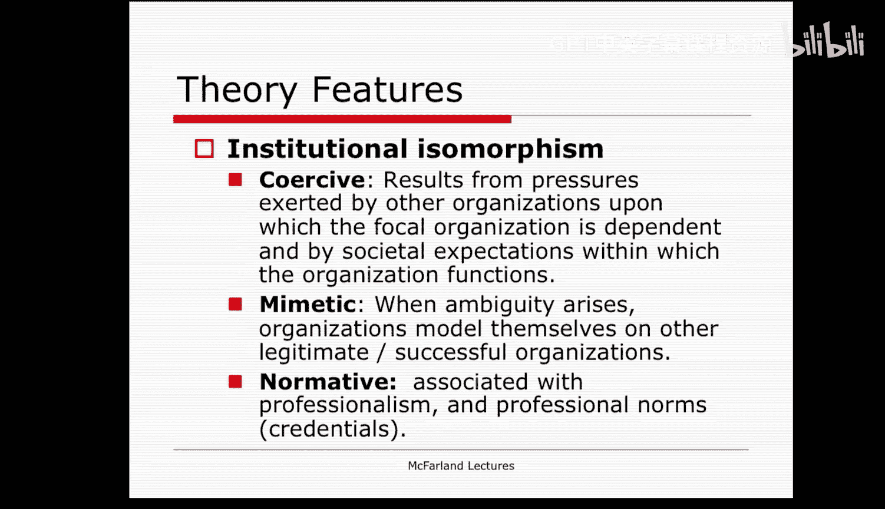

总而言之，新制度主义的理论特征一方面是缓冲策略。该理论认为，公司通过对其正式结构进行符号编码来缓冲自身与环境的关系。因此，一所新大学会采纳许多与老牌大学相同的学科和院系，这样其正式结构就符合了仪式性的分类。这些结构得到了贯穿整个社会的信心逻辑的支持。这些标签被认为是理性的，因为理性化的行动者支持它们。人们对精英大学及其认证本身有信心。

公司核心活动的进一步缓冲是通过松散耦合的过程实现的。在这里，公司的正式结构和编码与实际活动是分离且不相关的。通过将它们分割开来，公司散发出理性的能力和文化的适应性，但不允许它们被检查。这种脱耦使公司能够在信任的基础上运行，而不必面对关于什么最有效以及为什么有效的潜在无解问题。

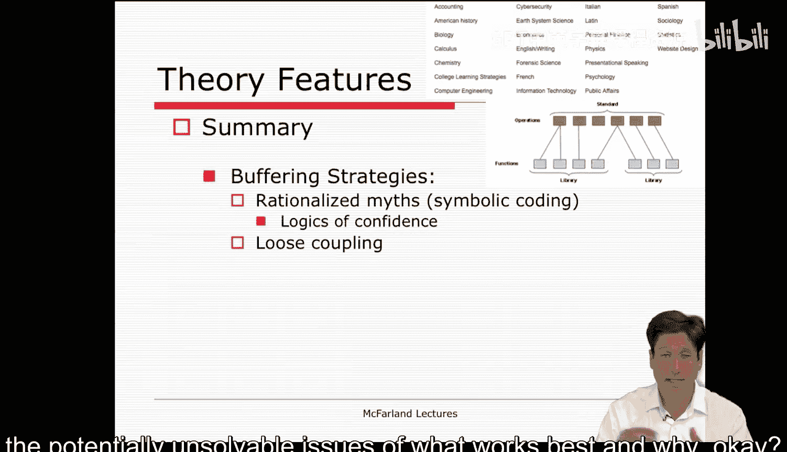

公司也在环境中进行桥接，但这里主要是通过网络进行的。迪马乔和鲍威尔认为，这些关联网络通过多种途径导致同构。第一种涉及政治压力，正如我们在资源依赖理论中学到的。第二种涉及模仿行为，即公司关注典范和同行公司，并模仿它们看起来做得好、合法或时髦的事情。最后，公司应对专业网络的压力，比如关于如何评估和考虑公司绩效的专业规范和标准。所有这些桥接努力都使公司在其所处的文化环境中更加制度化和合法化，这反过来又吸引了社会资源，并使公司得以延续。

---

## 🎯 课程总结

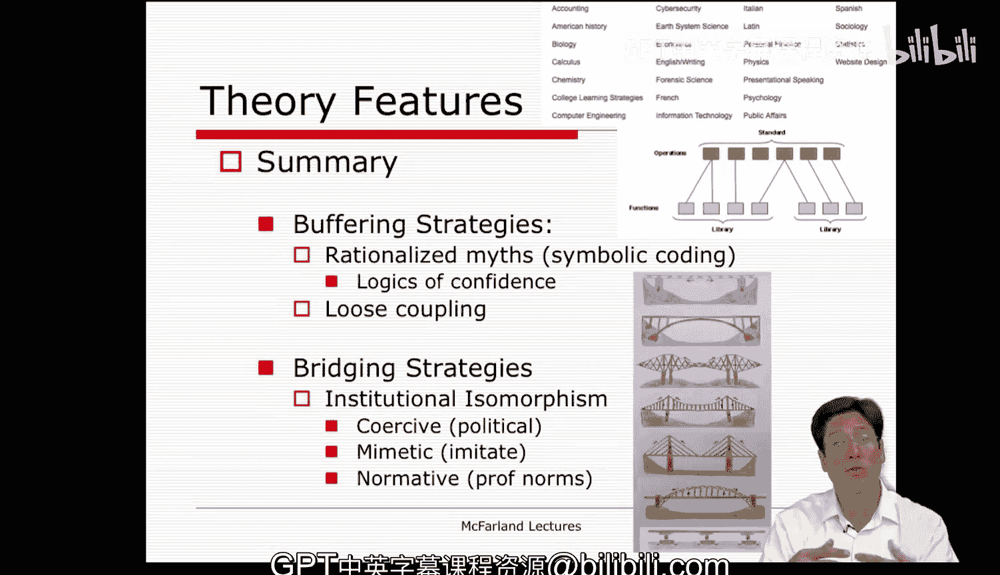

在本节课中，我们一起学习了新制度主义理论的关键应用。我们深入探讨了“脱耦”的概念，并以教育系统为例，理解了组织如何通过将正式结构与实际运作分离来获取合法性和资源。我们还学习了迪马乔和鲍威尔的经典理论，了解了组织同构性的三种主要形式——强制性、模仿性和规范性同构，并明白了组织领域内的压力如何促使组织变得越来越相似。这些理论为我们理解现代组织的结构和行为提供了强大的社会学视角。