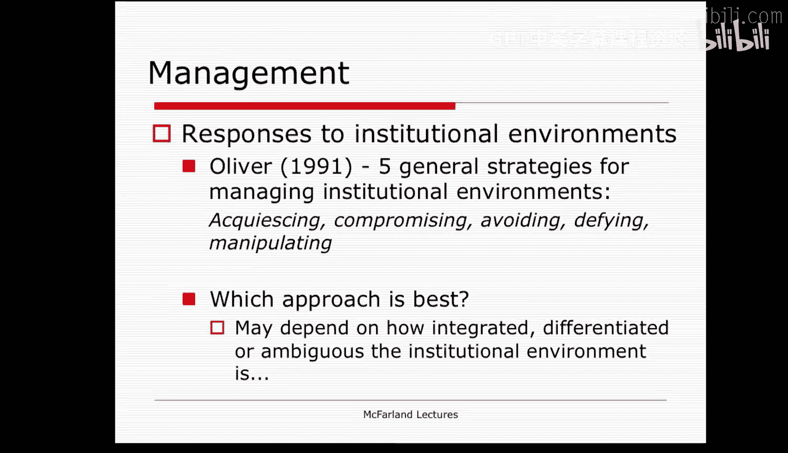
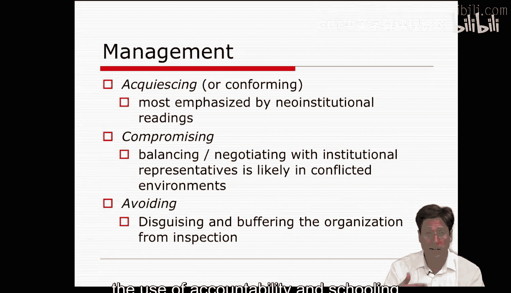
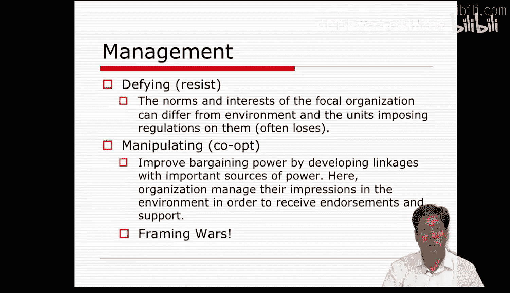
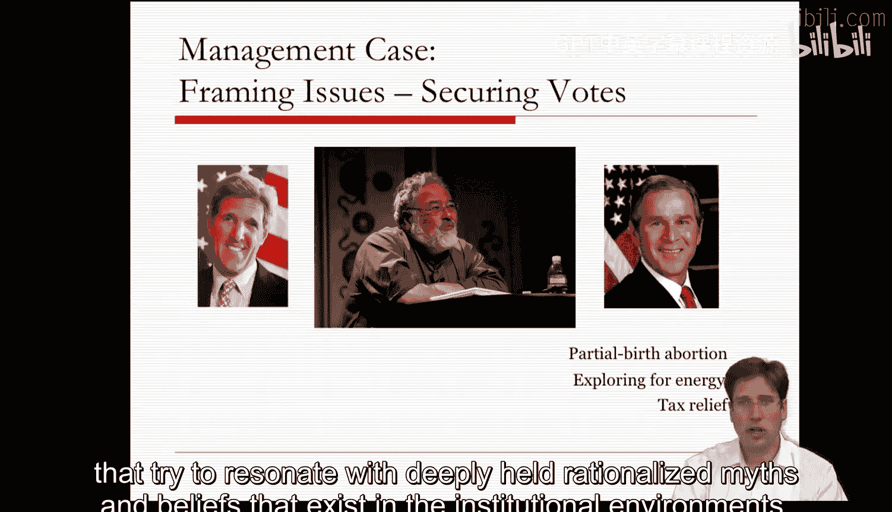
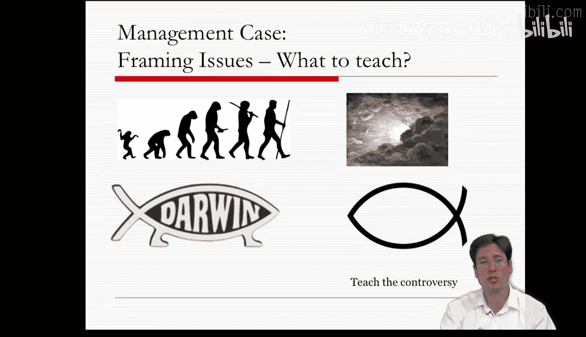
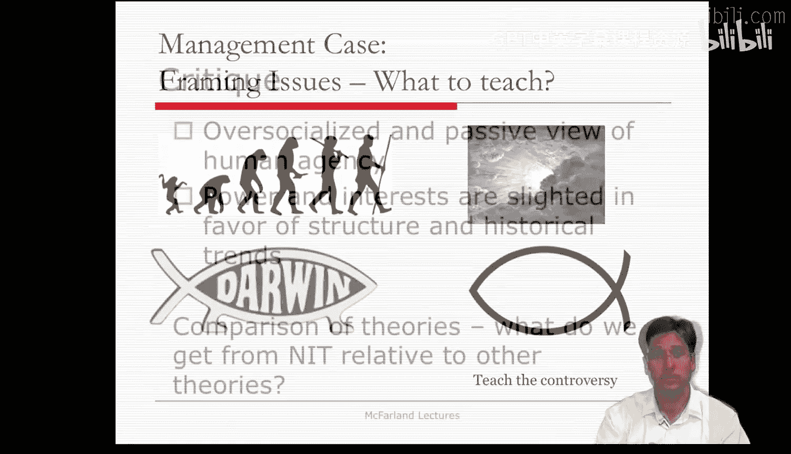
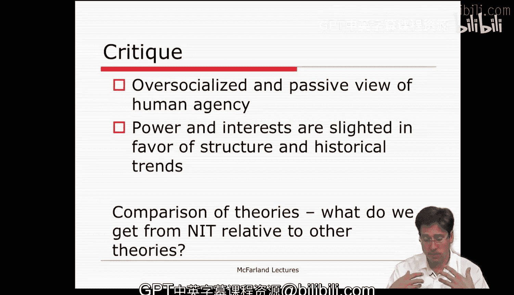

#  093：管理与应用 - 第一部分 🏢

在本节课中，我们将学习如何运用新制度理论来管理企业。我们将探讨组织面对制度环境时可以采取的一系列战略回应，并深入分析“框架”这一概念如何在战略中发挥作用。

---

## 战略回应概述

上一节我们介绍了新制度理论的基本概念。本节中，我们来看看组织如何根据其制度环境采取具体的管理策略。帕姆·奥利弗在其研究中描述了一系列组织可采取的战略回应。

以下是六种主要的战略回应：

1.  **默许**：这是新制度理论文献中最常描述的策略。组织仅仅采纳并与制度环境保持一致，仿佛这是自然而然的事情。这在环境存在共识，或组织迎合特定制度与信念时很有意义。
2.  **妥协**：这种策略涉及平衡不同的需求，并与制度代表进行谈判。这通常发生在制度环境存在冲突和分化的情境中，组织需要在不同观点之间周旋。
3.  **回避**：可以通过缓冲策略实现，例如松散耦合。松散耦合在一定程度上能防止细致审查。这种策略类似于伪装组织，使用障眼法来分散注意力。当制度规则与技术需求冲突，或制度环境内部相互冲突时，脱耦策略尤为有用。脱耦有助于组织，特别是开放系统组织，避免内部与外部不一致性的直接对抗。
4.  **反抗**：组织可以采纳与周围环境及强加于其身的法规不同的规范和利益。在大多数情况下，采取反抗策略的组织会失败。文献一致地描绘了这一点，似乎对反抗性回应持一种决定论态度，且结果通常不利。
5.  **操纵**：组织可以收买并操纵制度环境，以提高自身的议价能力。这通常通过与权力来源建立象征性联系来实现，这正是桥接努力、强制、模仿和规范化的核心。

总而言之，管理者必须找到方法使组织与制度环境保持一致，或帮助组织在相互冲突的制度环境中找到出路。他们通常会调整外在的仪式分类以符合环境，同时通过脱耦来缓冲技术实践，或者通过迎合环境中的神话来操纵局面。

---

## 框架与框架战争

上一节我们讨论了组织应对制度环境的几种策略。本节中，我们来看看“框架”这一概念如何成为更精细的战略工具。

本周的阅读材料引入了“框架”的概念。框架能更好地捕捉文化镜像与契合的战略层面，因为它完全关乎文化对齐的努力。两篇指定的文章分别涉及政治领域的框架战争，以及智能设计论与进化论的辩论。这些文章描述了组织及其领导者如何操纵叙事和意义，以更好地与国家意识甚至环境中的特定部分保持一致。

框架战争文章的妙处在于，它捕捉了这种张力的两个方面：战略与认知。以2004年美国总统选举为例，乔治·W·布什的竞选团队通过框架化其立场，使其与选民根深蒂固的理性神话产生共鸣，从而赢得了选举。

以下是布什团队使用的框架化例子：
*   反对“晚期堕胎”，而非医学上的“完整扩张提取术”。
*   支持“能源探索”，而非可能破坏环境的“石油钻探和水力压裂”。
*   支持“税收减免”，而非被视为不公平的“为富人减税”。

通过以符合深层信念的方式重新框架政策，即使内容可能不准确，也似乎行之有效。民主党后来也采用了类似策略，例如使用“为富人减税”、“华尔街纾困”等表述。

另一个例子是美国学校教学内容之争。宗教右翼成功地将他们的论点框架化为“教授争议”，这听起来符合教育和科学基于辩论探索证据的理性神话，从而对进化论学者和生物学家的努力构成了挑战。

这表明，我们可以使用修辞来操纵舆论并从环境中获取社会资源，只需找到有趣的方式来迎合理性神话。

---

## 对新制度理论的批判与展望

上一节我们探讨了框架作为战略工具的应用。本节中，我们来审视新制度理论本身存在的局限与面临的批判。

新制度理论像任何理论一样并不完美，容易受到批判。大多数读者认为新制度理论描述的是过度社会化且被动的人类行动者，因为它总是关乎匹配或镜像，在这个模型中显得有些决定论。狭隘的权力利益在新制度理论中被轻视，重要的是外部环境和镜像那些理性神话。

许多人认为新制度理论在认知和现代性的共享理解方向上走得太远，从而淡化了权力和政治。框架文献为应对这些批判提供了一条潜在的出路，但目前它在实证研究上尚不充分，多为定性研究。

一些批评者认为新制度理论主要是一种通过指出其他理论的弱点来支持自身的理论，而非直接为其主张提供证据。但在实践中，直接证明认知脚本和概念框架（这些宏大隐喻）的实际扩散，比在理论上要困难得多。该理论对我们有直观的吸引力，我们也能识别出扩散和同构发生的案例，但很难区分规范性和模仿性同构的过程，也很难识别被同质化的具体特征。

因此，新制度理论是组织分析中最有活力的理论之一，但在获得广泛认同之前，它还需要进一步的实证发展。

---

本节课中，我们一起学习了组织运用新制度理论管理企业的多种策略，从默许、妥协到操纵。我们重点分析了“框架”作为关键战略工具，如何通过重塑叙事来与制度环境中的理性神话产生共鸣。最后，我们也审视了新制度理论面临的关于决定论和忽视权力等批判，认识到该理论仍需更多的实证发展。