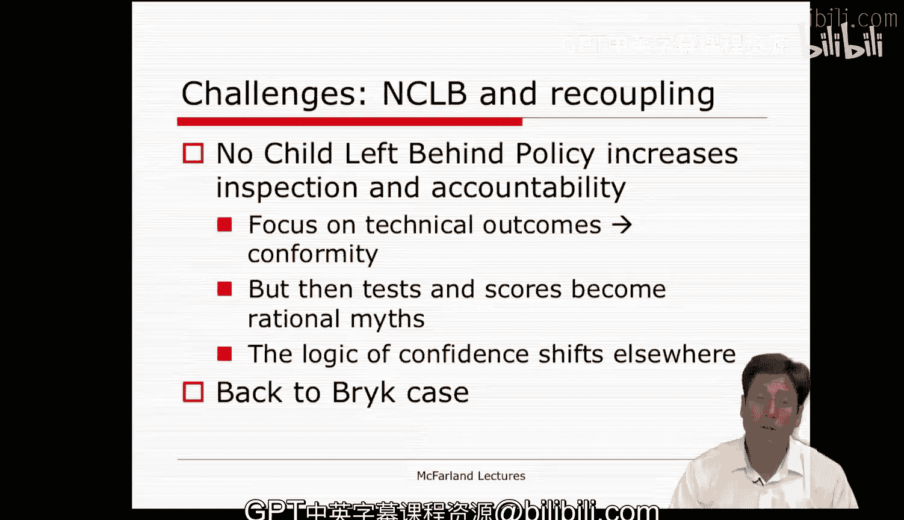
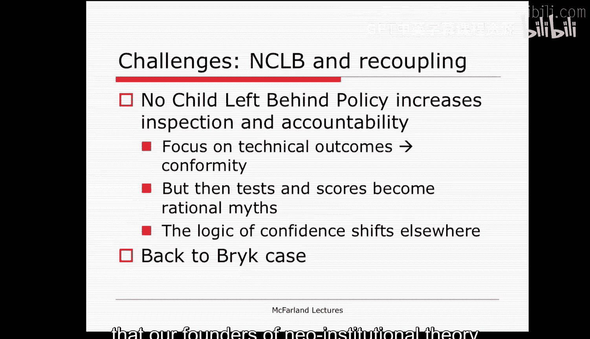
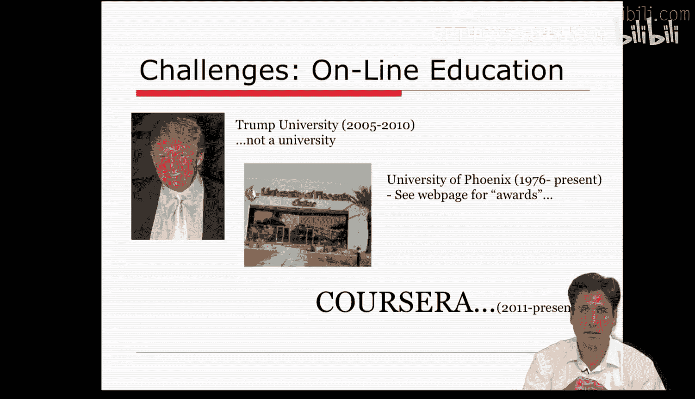

#  094：管理与应用（第二部分）📚

在本节课中，我们将探讨教育领域中两个看似挑战新制度主义理论的现象：“不让一个孩子掉队”政策与大规模开放在线课程（MOOCs）。我们将分析这些趋势如何与组织中的“松散耦合”、“理性化神话”等核心概念相互作用，并思考理论应如何发展以解释这些新现象。

---

上一节我们讨论了制度环境对组织的影响。本节中，我们来看看教育领域的具体案例，它们对新制度主义理论构成了有趣的挑战。

教育机构中存在一些趋势，似乎与新制度主义的论点相悖。我们需要思考这些现象，因为通过反思，我们可以看到新制度主义理论本身应如何演变，或者它如何能帮助解释这些尚未被充分阐述的新现象。

当前教育中一个有趣的悖论涉及“不让一个孩子掉队”这类强烈依赖审查和问责的教育政策。

一方面，这是一种**集权化**的努力和问责**再耦合**。
*   “不让一个孩子掉队”及类似政策极大地增加了审查力度。
*   这似乎挑战了教育领域内**松散耦合**的概念。
*   它迫使教师遵从规定，并将更大的权力和责任赋予管理者。

同时，这项改革也带来了更大的压力，迫使学校遵从关于“真正的学校”及其应具备的适当元素的特定**神话**。
*   尽管强化了一种神话，但它也引发了对这些神话以及其他神话的质疑。
*   仪式性的类别变得更加集中。
*   教学方法的创新被最小化。
*   一致性通过考试制度被强加。

由测试机构和学者等**理性化主体**开发的考试成绩成为了标准承载者。
*   考试成绩表明一所学校是否成功，而忽略了其他可能代表效能或效率的指标。

随之发生的情况是，教师为这些考试而教学。
*   在某些情况下，他们甚至作弊，以维持遵循那个特定**理性化神话**的表象。

但你最终会疑惑，这是否清晰地表明了什么是更有效的方法，以及我们是否真的直面了在这种新形式下学习是否更高效、更可取。
*   我认为存在这种感觉，但它是通过考试的透镜来传达的。

有趣的是，我们在学期初阅读的Bik文章，可以被解读为一种战略管理努力，旨在进行**再耦合**以对抗**松散耦合**。
*   监管环境的变化导致了如Bik所描述的战略响应。
*   我们看到系统适应并遵从了，但尚不清楚它是否变得比之前更高效、更成功。
*   教师感到被去专业化，他们的积极性开始减弱。因此，尚不清楚那是否真的成功了。

所以，尚不清楚**再耦合**和**集权化**是否使组织减少了对**理性化神话**的依赖。
*   它们似乎只是将焦点更多地集中在某些标准承载者上，而非其他。
*   模糊性和不确定性依然存在。
*   目前，制度环境的某一面（并且在某些方面是主导面）正被关联和对齐。

**再耦合**在某种程度上引发了对其他**理性化神话**的质疑。
*   即学校真正服务于多种目的这一神话。
*   我们现在甚至对测试的合法性也存在争论。
*   例如，关于它认定某些社区和学校为失败者是否有效或在某些情况下是否符合伦理。

我们持续进行这场辩论，尚未有定论。
*   但思考教育机构的**再耦合**如何偏离新制度主义理论奠基者应用于教育机构的**松散耦合**论点，是很有趣的。

新制度主义理论的另一个难题是大规模开放在线课程（MOOCs）的创建及其对大学组织的影响。

MOOCs是否会威胁到现代大学所构建的**理性化神话**？
*   Coursera是否挑战了大学的通用脚本？
*   或者挑战了关于教育等组织领域的**新制度主义**概念？

这是一个重大问题。为什么MOOCs可能缺乏**环境合法性**？
*   MOOCs如何挑战学校教育的神话？
*   并质疑高等教育机构的合法性？

MOOCs将对社区大学产生什么影响？对凤凰城大学这样的机构呢？
*   它们对实际的课堂体验本身会有什么影响？
*   如果明星教师能有效地在线传授材料，学生几乎能学得和亲自在这里听我讲课一样好，但成本只是零头，那会怎样？
*   那会产生什么影响？

如果Coursera和其他类似平台开始提供学位，或者能够证明其与实际的、有认证的大学学位或课程同样有效或几乎同样有效，那会怎样？
*   那会产生什么影响？
*   对整个教育组织可能会发生什么？

这是一个重大问题，我认为我们许多人正在努力应对它。
*   我将在本周确保这是一个论坛帖子，我们对此有很多意见或想法。

似乎整个社会机制都将**证书**视为一种标准化语言，通过它可以在机构间进行交换。
*   无论你获得的是MBA学位，还是公司里可替代的员工的学位。
*   对于Coursera，这种在认证方面的成功可能不再是稀缺商品。
*   许多无法进入斯坦福大学的人可能会获得相同的证书或完成相同的课程。
*   这是否意味着斯坦福大学的证书合法性会受到质疑？
*   这引发了对那个神话是否理性的质疑。

市场也将充斥着大量拥有相同技能的人。
*   因为Coursera能容纳的人数远超过斯坦福大学所能容纳的。
*   因此，雇主将几乎没有空间雇用某些人。
*   如果每个人都资历过高且愿意做，谁还会想做保洁工作？
*   如果这么多人都可替代并拥有那种技能水平，谁又能脱颖而出处理复杂任务？

如果证书与大量的变体相关联呢？
*   例如，Coursera证书可能掩盖了人们表现水平存在巨大差异的事实。

MOOCs对**我们最核心的社会机构之一及其所依赖的理性化神话的合法性**提出了许多问题。

例如：
*   如果我的在线课程效果大约是我课堂体验的50%，但它是免费的，这在某种程度上引发了对为何还要进行课堂体验的质疑。
*   也许按每美元计算更高效、更有效，但对我来说不一定明确。

因此，我认为我们有许多问题需要解决。
*   在斯坦福这边，通过免费提供材料，一些学生觉得这贬低了内容的价值。
*   在某种程度上，它不再是一种稀缺资源。
*   所以我们遇到了相反方向的类似合法性问题。

我们正在努力解决这个问题，并思考如何使课堂体验对这里的学生有价值，同时也向世界其他地方提供这种产品，或许以此提升所有人并让他们有机会接触这些东西。
*   这些都是美好的理想，但在这个过程中，它引发了对课堂是否必要的质疑。

如果我能在线进行高级教学练习呢？这或许是可行的。
*   也许明年就可以，但这也意味着越来越多课堂体验中独特的部分可以在大规模范围内完成。

如果我们能随着时间的推移更容易地处理作弊问题呢？这样它就能被识别。
*   我认为我们会的，我们已经做得相当不错了。
*   如果这可行，将使获得证书学位变得越来越负担得起。

我认为所有这些都会发生。
*   此外，如果斯坦福大学在这类课程上非常成功，对所有地方机构和其他需要工作的教师意味着什么？
*   我通过大规模提供这些课程，是否在扼杀他们的工作？

因此，存在所有这些我们不确定其意义或结果的问题。
*   但我认为从组织学的角度来看，这极其有趣。
*   这也是为什么我班上的学生一直在思考它，并试图思考如何理论化或理解它。
*   我鼓励你们在本周的论坛上也这样做，我认为我们将进行一场精彩的讨论。

---

本节课中，我们一起学习了教育领域两个挑战新制度主义理论的案例：“不让一个孩子掉队”政策通过**再耦合**和强化特定**理性化神话**，改变了教育组织的运作逻辑；而**MOOCs**的兴起则直接撼动了传统高等教育机构的**合法性**基础及其所依赖的**理性化神话**。这些现象表明，制度环境与组织形态处于动态演变中，理论需要不断发展和调整以解释新的现实。它们促使我们深入思考效率、合法性、标准化与创新之间的复杂张力。