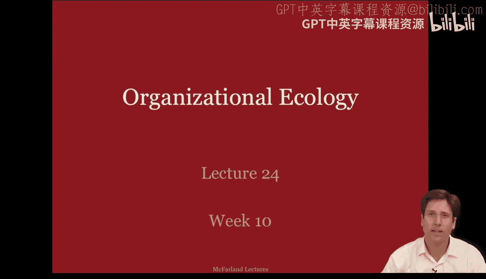
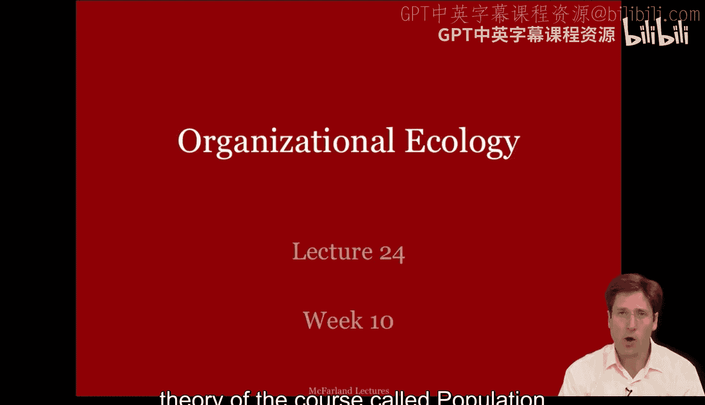
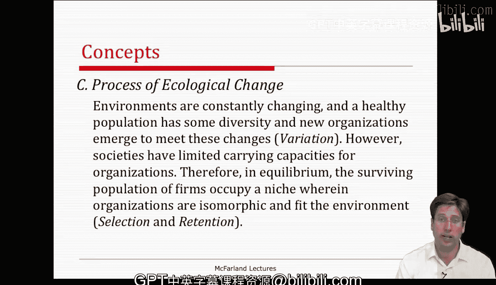

#  100：种群生态学 - 第一部分 🧬

在本节课中，我们将学习组织分析的第十个，也是最后一个理论：**种群生态学**。我们将探讨组织如何像生物种群一样，在环境中通过自然选择过程生存、竞争和演化。

上一讲我们讨论了组织作为开放系统，其生存依赖于对环境的反应。本节中，我们将深入探讨种群生态学理论，它运用生物学中的自然选择隐喻来解释组织的多样性、起源和变化。

---

## 理论背景与核心问题

种群生态学理论有着悠久的历史，其核心是将生物学和自然选择的隐喻应用于组织研究。早期的学者，如米尔顿·弗里曼，将新古典经济学与自然选择论点联系起来。卡尔·韦克和杰弗里·普费弗等组织理论家在60-70年代也论述过**变异、选择和保留**的自然选择过程。

阿特·斯廷奇库姆在60年代提出，企业在创立时就具有高度**惰性和稳定**的组织形式，并且这种形式会在很长时期内保持不变。我们今天讨论的种群生态学，主要借鉴了迈克·汉南和约翰·弗里曼的理论，他们将组织种群的自然选择隐喻发展到了一个更为精细的程度。

种群生态学始于几个核心问题：
1.  **为什么存在如此多种类的组织？** 这与新制度理论的问题相反，后者问的是“为什么所有组织看起来都一样？”
2.  **如何解释组织的多样性？**
3.  **这些不同的组织从何而来？**

种群生态学通过关注**多样性与选择**，将组织变化解释为环境力量作用于组织种群的结果。它采用一种开放系统的视角，认为社会、经济和政治环境条件会影响组织的相对丰度和多样性，并决定了它们随时间的演变。

---

## 核心概念解析

现在我们对种群生态学有了一个总体认识，接下来让我们深入细节，阐述一些核心概念。

### 1. 组织种群

首先需要理解的概念是“种群”。与新制度理论中强调自我意识的“组织场域”不同，种群生态学中的“种群”更强调地理边界和竞争。

**一个组织种群**由一类组织构成，它们**面临相似的环境脆弱性**，并**共享相同的内部形式**（如相同的核心技术）。这种共享的内部形式是一套一致的行动蓝图或活动模式，类似于纳尔逊和温特所说的**标准操作程序或任务**，即组织的“DNA”。

“面临相似的环境脆弱性”指的是组织在其环境中具有的外部关系与依赖集合。最后，一个种群被限定在一个共同的系统内，这通常是一个地理区域，如政治辖区或经济市场边界。

**种群示例**：
*   西雅图的金融机构
*   德克萨斯州休斯顿的汽车经销商
*   在数字时代，整个行业（如啤酒业）及其中的细分市场（如精酿啤酒）也可被视为不同层面的种群概念。

### 2. 生态位

组织生态学认为，环境可以被划分为不同类型的资源空间，组织种群可以在其中存续，这些空间被称为**环境生态位**。组织生态学家描述了两种生态位：

*   **基础生态位**：指在**没有竞争**的情况下，一个组织能够生存和延续的资源空间区域。
    *   **示例**：医疗、教育、娱乐或饮料行业。
*   **实现生态位**：指在**存在特定竞争者**的情况下，一个组织实际能够维持自身的、基础生态位的一个子集。
    *   **示例**：娱乐行业中的音乐、舞蹈和电影；饮料行业中的啤酒、葡萄酒和汽水。

需要注意的是，教育的基础生态位不与医疗竞争，但在其内部，各个实现生态位中的企业子集会相互竞争。实现生态位的宽度决定了一种“企业物种”能在多大程度上与其他物种共存而不被淘汰。

**示例**：在啤酒行业，精酿啤酒公司找到了一个分区的资源空间，使其能够在百威等巨头存在的情况下生存。在教育领域，尽管存在庞大的公立学校系统，但一些私立学校、特许学校、公立重点学校甚至天主教学校，也能找到属于自己的实现生态位并生存下来。

---

## 生态变化的过程

种群生态学的一个关键特征是**生态变化过程**，这很大程度上借鉴了生物学的自然选择论点。

基本思想是：环境不断变化，一个健康的组织种群需要一定的多样性，新组织会不断出现以适应这些变化（即**变异**）。然而，社会对组织的承载能力是有限的。因此，在均衡状态下，存活下来的组织种群将占据一个生态位，其中的组织是**同构的**，并且适应环境（即**选择**和**保留**）。任何在形式上偏离的组织都将因不适应环境而被淘汰。

以下是描述生态变化的三个特征：

1.  **变异**：新组织形式的出现，为环境变化提供了潜在的适应方案。
2.  **选择**：环境筛选出最适合当前条件的组织形式。
3.  **保留**：被选中的成功组织形式得以存续和复制，使其在种群中变得普遍。

---

## 本节课总结

在本节课中，我们一起学习了**种群生态学理论**的第一部分。我们了解到该理论如何运用自然选择的隐喻，将组织视为在特定环境中竞争的种群。我们定义了**组织种群**和**生态位**（包括基础生态位和实现生态位）这两个核心概念，并阐述了生态变化的三个关键过程：**变异、选择和保留**。下一讲，我们将继续探讨种群生态学的具体模型和研究发现。