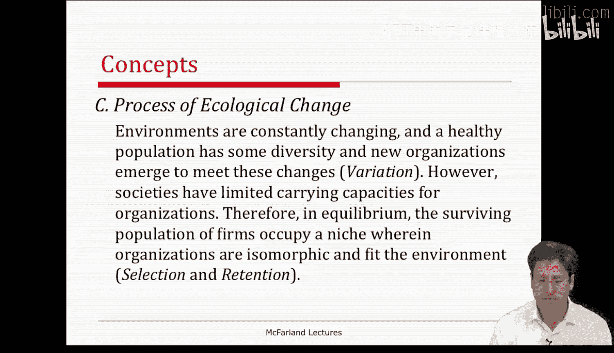
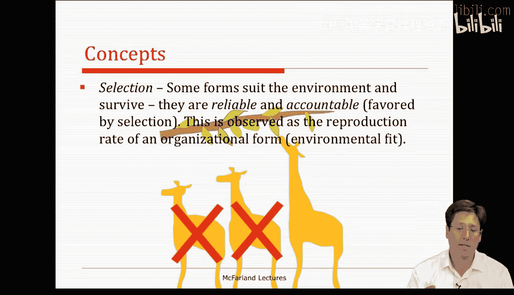
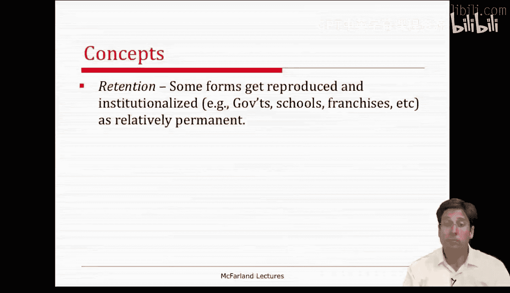
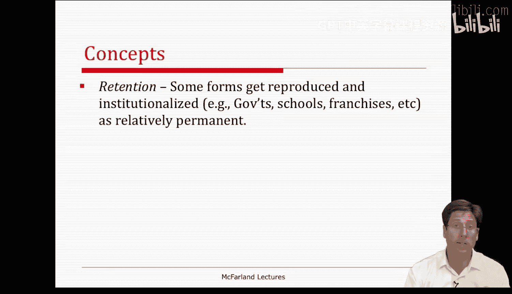
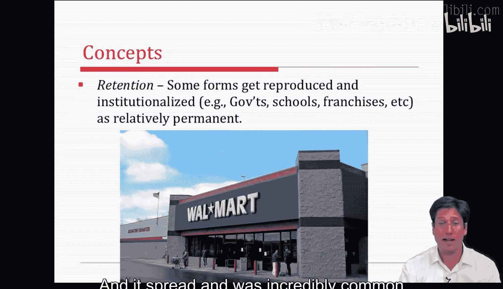
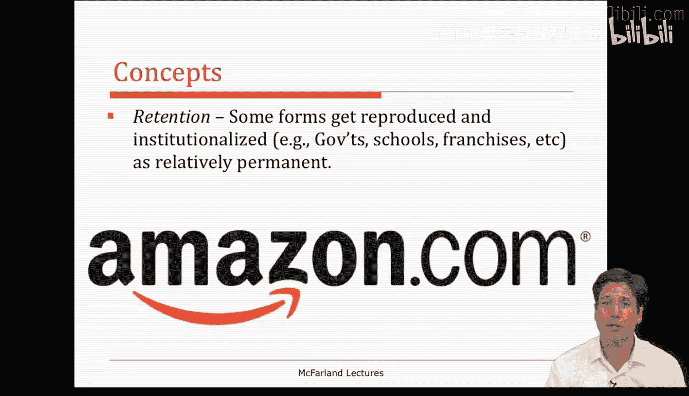
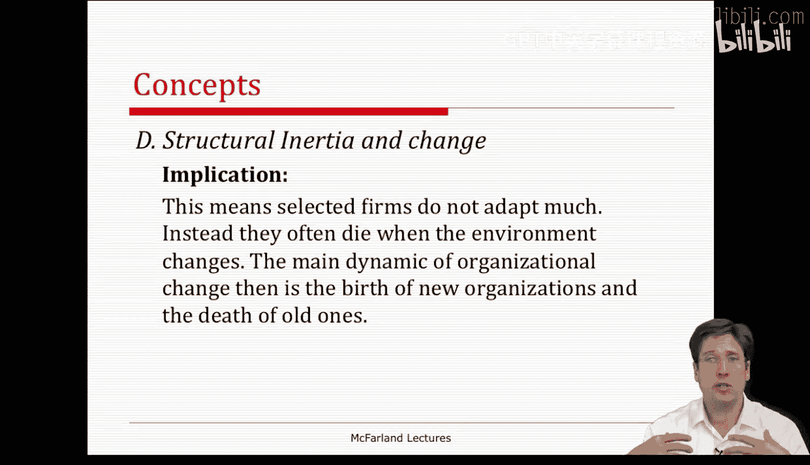
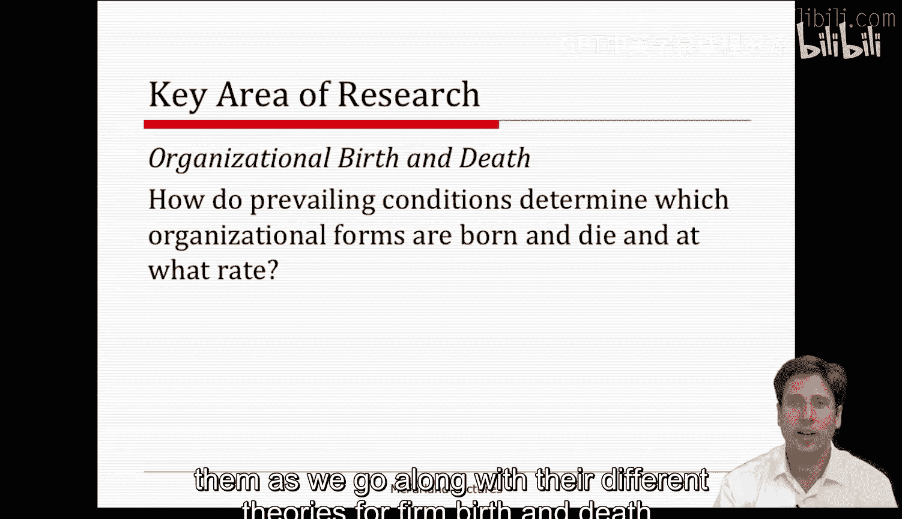
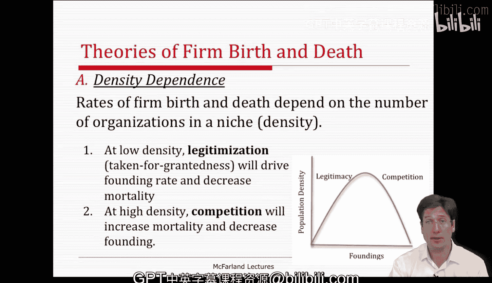

#  101：种群生态学（第二部分）🦋

在本节课中，我们将学习种群生态学理论的核心概念，包括组织形式的**变异**、**选择**与**保留**过程，以及**结构惰性**和**密度依赖**理论。我们将通过生物学隐喻来理解组织如何像物种一样，在环境中诞生、竞争与消亡。

---

## 组织形式的变异 🧬

上一节我们介绍了种群生态学的基本视角，本节中我们来看看组织形式的**变异**是如何发生的。新的组织形式会不断涌现，以应对环境中感知到的需求。

这种组织变异源于多种机制：
*   **突变**：类似于生物学中的随机基因变化。在组织中，这可能是一个全新的想法或创新，例如**在线教育**。
*   **重组**：将旧有的形式混合与匹配，从而产生新形式。
*   **跨界**：将一个领域（例如教育）的想法应用到另一个完全不同的领域（例如饮料行业）。

如果我们观察动物，会发现物种在生态位内也存在变异。同样，在特定的组织生态位或环境中，也存在广泛的变异。

以下是组织变异的例子：
*   西雅图的金融公司：美国银行坐落于此，但同时存在许多像华盛顿互惠银行这样的小型或竞争性银行。
*   萨斯喀彻温省的真菌与蝴蝶的生物多样性，也形象地展示了变异的存在。

---

## 环境选择与保留过程 ⚖️

在产生了大量变异之后，接下来是**选择**过程。某些组织形式比其它形式更适应环境。尽管存在变异，但只有一部分能够生存并繁衍。

生存下来的组织通常被称为可靠且负责任的公司，它们基本上受到选择过程的青睐。我们可以通过某种形式在环境中**繁殖的速率**来观察这种选择。某种形式传播、被选择和保留得越多，就越能说明其**适应性**。

当我们把**选择**和**变异**这两个过程结合起来看时，并不意味着这是一个最优化的过程，甚至不是拉马克式的功能主义（即长颈鹿因需要而伸长脖子）。在种群生态学中，**“只要有效就行”**，没有最优化或拉马克主义的假设，尽管它承认组织确实有意图，并能进行微小的适应。

一些被选中的组织形式会被**复制**和**制度化**。我们都知道政府机构、学校、特许经营店等例子，它们都经历了选择、复制和保留的过程。在生物学中，我们看到那些适应性强、繁殖率高的动物，例如遍布世界的绿头鸭或椋鸟。

组织生态学家通过关注**组织创立率**和**死亡率**来识别**保留**过程。某个事物死亡越少、创立越多，他们就越认为存在这种保留过程。

我们可以通过零售业的演变来观察这种变异、选择和保留的过程：
*   **20世纪40-50年代**：像**伍尔沃斯**这样的商店在美国非常普遍并激增。
*   **20世纪80年代**：像**沃尔玛**这样的大型超市零售形式出现、传播并变得极其普遍。
*   **最近10年**：随着环境变化，新的组织形式**亚马逊**正在占据主导。

在每个时代，基本的生态位保持不变，但新的组织形式会崛起，在竞争中胜过其他形式，被选择、扩散并在该生态位中保留下来。这就是组织生态学试图通过生物学隐喻来阐述的过程。

---

## 结构惰性 🐢

至此，我们讨论了种群、环境生态位和生态变化的过程。组织生态学的另一个关键概念是**结构惰性**。

与我们在本学期早些时候讨论的权变理论家和自然系统视角相反，组织生态学家认为组织是相对**惰性和稳定**的，充其量只能缓慢地适应和改变。事实上，他们阐述了组织变革困难的多种原因，存在各种内部和外部的约束阻碍组织形式的适应。

例如，内部约束包括：
*   设备投资
*   信息限制
*   组织内部已形成的政治格局
*   组织惯例的制度化

许多公司在这些努力以及建立内部技术和社会结构上投入了大量沉没成本，这使得它们难以适应可能要求其改变的新环境。

其他障碍和约束可能来自外部特征，特别是：
*   企业进入和退出的壁垒
*   企业希望留住员工
*   我们上周在新制度理论中讨论的合法性关切

一般来说，惰性与组织的**年龄**有关。随着时间的推移，组织很难改变其使命目标、权威形式、核心技术以及市场战略等特征。这些也许是组织最难改变的方面，而环境在选择最适应当前环境条件的种群时，往往正是基于这些特征。

组织惰性很重要，因为它具有各种影响，导致种群生态学家提出了他们的环境选择理论。组织的惰性越大，其适应能力就越差，环境选择就越重要。因此，当环境变化时，大多数公司不是去适应，而是**死亡**。所以，组织变革的主要动态是**新组织的诞生**和**旧组织的死亡**。如果你想改变一个生态位，你需要一个新的、更好的组织形式，能够在竞争中胜过现有的公司。这就是该理论的启示：**创立新事物比适应旧事物更容易**。

种群生态学研究的核心领域涉及新组织形式的诞生（或多样化）以及旧的、过时形式的死亡。

---

## 密度依赖理论 📊

组织生态学衍生出多种子理论来解释企业的诞生与死亡，其中一个常见理论是**密度依赖理论**。

密度依赖理论认为，存在一个曲线函数：合法化的社会过程促进企业创立，而竞争过程则削减其数量。

以下是该理论的预测：
*   在**低密度**或种群稀疏的生态位中，**合法化过程**将占主导，从而提高组织创立率，并降低死亡率。
*   在**高密度**或种群密集的生态位中，**竞争**将占主导，导致低创立率和高死亡率。

因此，如侧图所示，在创立数量（Y轴）与种群密度（X轴）之间呈现一条**倒U型曲线**。

在此，**合法性**指的是组织形式的“理所当然性”。形式越合法，就越容易获取资源，死亡率也随之降低。**竞争**指的是在生态位中寻求相同有限资源的组织形式。当资源稀缺时，竞争加剧，创立率开始下降（即U型曲线顶点的右侧），随着竞争持续，创立率下降，死亡率上升。因此，竞争与密度成**反比**关系。这就是密度依赖理论的基本内容。

---

## 总结 📝

本节课中，我们一起学习了种群生态学理论的核心部分。我们探讨了组织如何通过**变异**产生多样性，环境如何通过**选择**筛选出适应者，以及成功的组织形式如何被**保留**和制度化。我们了解到组织普遍存在**结构惰性**，这使得环境选择而非组织主动适应，成为种群变化的主要驱动力，表现为新组织的诞生与旧组织的死亡。最后，我们介绍了**密度依赖理论**，它解释了组织密度如何通过影响**合法性**和**竞争**，共同决定一个生态位中组织的创立率与死亡率。